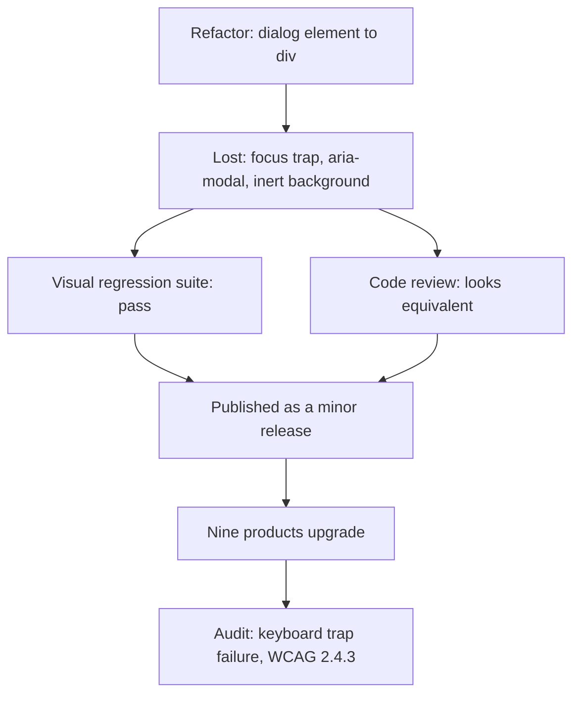
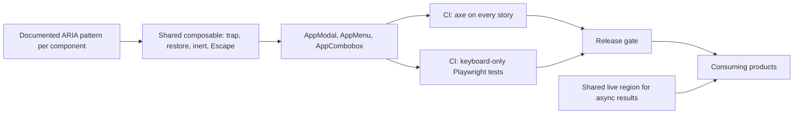

> **Scenario** - A refactor swaps the shared `<AppModal>` internals from a `<dialog>` element to a teleported `<div>` for styling control. Nothing looks different. Two weeks later a procurement audit finds that keyboard users can tab out of every modal in nine products, and screen readers announce the page behind it. One component, 200 screens.

## Why it matters

- A shared component multiplies both fixes and regressions. One bad focus change ships to every product that consumes the library on their next upgrade.
- Keyboard and screen reader failures are invisible in visual regression tests and to mouse-using reviewers, so they survive review and reach production intact.
- Public-sector and enterprise contracts increasingly require a VPAT or EN 301 549 conformance statement. A component-level regression can block a deal already in legal review.
- The affordances that help assistive tech - visible focus, labelled controls, predictable escape - help everyone on a laptop trackpad at 1am too.

## Symptoms

| Signal | What you observe |
| --- | --- |
| Focus escapes | Tab from the last modal control moves to the page behind |
| Lost focus on close | After closing a dialog, focus resets to `<body>` |
| Silent updates | A toast or async result appears with no screen reader announcement |
| Div soup | Interactive elements are `<div @click>` with no role or `tabindex` |
| Invisible focus ring | `outline: none` in a reset with no replacement style |
| Icon-only buttons | Screen reader announces "button" with no name |

## How it breaks

Accessibility lives in details that are easy to delete during refactors: a `role`, an `aria-modal`, an `inert` on the background, a focus restore in `onUnmounted`. Because none of it changes a pixel, a screenshot suite passes and code review sees "same markup, nicer classes". The contract that the component silently promised - trap focus, restore focus, close on Escape, announce itself - is gone with no failing test.



## Root causes

1. Accessibility behaviour is implementation detail rather than a tested part of the component contract.
2. No automated axe pass in CI, so nothing fails when semantics disappear.
3. No keyboard-only test for the interaction patterns the library owns.
4. Custom controls built from `div`s instead of native elements or a headless primitive.
5. Global CSS resets remove focus outlines with no `:focus-visible` replacement.
6. Dynamic content updates without a live region, so async results are announced to nobody.

## How to solve it

### 1. Make the ARIA pattern part of the public contract

Write it down per component: dialog implements the APG modal dialog pattern - `role="dialog"`, `aria-modal="true"`, labelled by its title, focus trapped, Escape closes, focus restored, background `inert`. That list becomes the test plan.

### 2. Implement the pattern once, in a composable

```ts
// composables/useDialogA11y.ts
export function useDialogA11y(panel: Ref<HTMLElement | null>, onClose: () => void) {
  let previouslyFocused: HTMLElement | null = null
  const SELECTOR = 'a[href],button:not([disabled]),input,select,textarea,[tabindex]:not([tabindex="-1"])'

  function onKeydown(e: KeyboardEvent) {
    if (e.key === 'Escape') return onClose()
    if (e.key !== 'Tab' || !panel.value) return
    const items = [...panel.value.querySelectorAll<HTMLElement>(SELECTOR)]
    if (!items.length) return
    const [first, last] = [items[0]!, items.at(-1)!]
    if (e.shiftKey && document.activeElement === first) { e.preventDefault(); last.focus() }
    else if (!e.shiftKey && document.activeElement === last) { e.preventDefault(); first.focus() }
  }

  onMounted(() => {
    previouslyFocused = document.activeElement as HTMLElement | null
    document.getElementById('app')?.setAttribute('inert', '')
    nextTick(() => panel.value?.querySelector<HTMLElement>(SELECTOR)?.focus())
    document.addEventListener('keydown', onKeydown)
  })

  onUnmounted(() => {
    document.removeEventListener('keydown', onKeydown)
    document.getElementById('app')?.removeAttribute('inert')
    previouslyFocused?.focus()      // restoring focus is the step teams forget
  })
}
```

### 3. Keep the markup honest

```vue
<div
  ref="panel"
  role="dialog"
  aria-modal="true"
  :aria-labelledby="`${id}-title`"
  :aria-describedby="`${id}-desc`"
>
  <h2 :id="`${id}-title`">{{ title }}</h2>
  <p :id="`${id}-desc`"><slot name="description" /></p>
  <button type="button" @click="close">
    <IconX aria-hidden="true" />
    <span class="sr-only">Close dialog</span>
  </button>
</div>
```

`aria-hidden` on the icon plus a visually hidden label is the reliable way to name an icon-only button.

### 4. Fail the build on regressions

```ts
// tests/a11y.spec.ts
import AxeBuilder from '@axe-core/playwright'

test('modal has no serious violations', async ({ page }) => {
  await page.goto('/stories/modal')
  await page.getByRole('button', { name: 'Open' }).click()
  const results = await new AxeBuilder({ page })
    .withTags(['wcag2a', 'wcag2aa', 'wcag21aa'])
    .analyze()
  expect(results.violations.filter((v) => v.impact === 'serious' || v.impact === 'critical')).toEqual([])
})
```

Add a keyboard test axe cannot catch: focus the last control, press Tab, assert focus is still inside the panel.

### 5. Announce async results

```vue
<div role="status" aria-live="polite" class="sr-only">{{ announcement }}</div>
```

The live region must exist in the DOM *before* the text changes; injecting a populated node is often not announced.

### 6. Restore focus outlines

```css
:focus-visible {
  outline: 2px solid var(--color-focus);
  outline-offset: 2px;
}
```

Verify a 3:1 contrast ratio between the focus ring and its adjacent background, per WCAG 2.4.11.

### 7. Prefer primitives over bespoke widgets

Combobox, menu, and listbox each carry dozens of keyboard rules. Use a maintained headless primitive and style it, rather than reimplementing the pattern per product.

## Target design



## Tradeoffs

| Option | Pros | Cons | Choose when |
| --- | --- | --- | --- |
| Native elements | Free semantics and keyboard support | Limited styling in some browsers | Buttons, forms, simple dialogs |
| Headless primitives | Correct patterns, full styling freedom | Extra dependency and API to learn | Menus, comboboxes, tabs |
| Bespoke ARIA widgets | Exact design control | Dozens of rules to maintain forever | A pattern no library covers |
| Manual audit only | Catches nuance tools miss | Slow, and regressions land between audits | Complement to CI, never a substitute |

## Verification checklist

- [ ] Open every dialog and tab through it twice; focus never leaves the panel.
- [ ] Close a dialog; focus returns to the control that opened it.
- [ ] Complete a whole flow with the mouse unplugged.
- [ ] axe reports zero serious or critical violations across all component stories.
- [ ] Every icon-only button has an accessible name in the accessibility tree.
- [ ] Focus ring is visible on a dark background and meets 3:1 contrast.
- [ ] An async success message is announced by VoiceOver or NVDA without moving focus.

## Anti-patterns

- `aria-hidden="true"` on a container that still holds focusable children.
- `tabindex` values above 0 to force an order, which breaks the natural sequence.
- Adding `role="button"` to a `div` instead of using a `<button>`.
- Using `alt=""` on informative images to silence a linter.
- Treating an annual audit as the accessibility strategy while CI checks nothing.

## Related

- [Design system versioning without lockstep](/systems/frontend-architecture/design-system-versioning)
- [Form validation architecture](/systems/frontend-architecture/form-validation-architecture)
- [Micro-frontend integration strategies](/systems/frontend-architecture/micro-frontend-integration-strategies)
