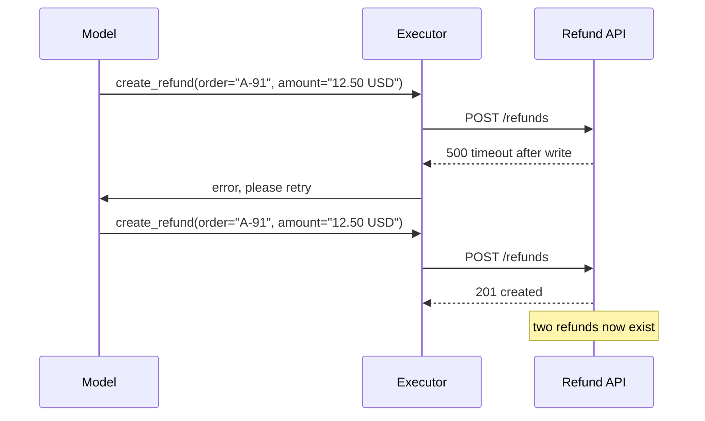
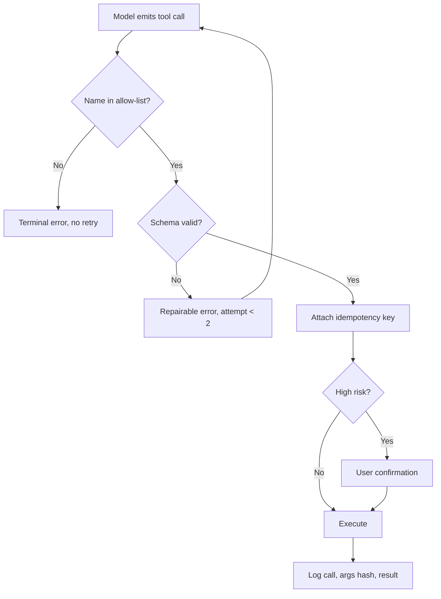

> **Scenario** — একটি ops assistant এগারোটি tool খুলে রেখেছে। এক সপ্তাহে সে একই order-এ `create_refund` দুবার ডাকে, date হিসেবে `"2024-13-45"` পাঠায়, আর `list_all_refunds` নামে একটি tool বানিয়ে ফেলে যা আদৌ নেই। প্রতিটি failure API-তে 500 আর user-এর কাছে বিভ্রান্তি হয়ে দেখা দেয়।

## Why it matters

- Tool call মানে side effect। read-only search-এ hallucinated argument নিছক noise; `create_refund`-এ সেই একই ভুল টাকা সরায়।
- Model tool call structured text হিসেবে বের করে। JSON parse হবে, enum বৈধ হবে, বা tool-টি আদৌ আছে — sampling প্রক্রিয়ায় এর কোনো গ্যারান্টি নেই।
- Idempotency ছাড়া ব্যর্থ tool call retry করলে একটি অনিশ্চিত ফলাফল দুটি বাস্তব ফলাফলে পরিণত হয়।
- প্রতিটি malformed call একটি পূর্ণ round trip খায়: ব্যর্থ call, context-এ ফেরত যাওয়া error message, আর repair চেষ্টা। এক logical operation-এ ৩ গুণ token।
- Tool schema context খায়। এগারোটি বাচাল tool definition প্রতিটি request-এ ৩,০০০+ token দখল করতে পারে, কোনো user content ঢোকার আগেই।

## Symptoms

| Signal | What you observe |
|---|---|
| Parse failure | tool argument-এ `json.decoder.JSONDecodeError`, কয়েক শতাংশ call-এ |
| Unknown tool | কখনো register না হওয়া বিশ্বাসযোগ্য নামের tool call |
| Duplicate | একই conversation turn-এ দুটি অভিন্ন mutation |
| Enum drift | schema-তে শুধু `cancelled` থাকলেও `status="cancelled_by_user"` |
| Context bloat | শুধু tool definition-ই retrieved-context budget ছাড়িয়ে যায় |

## How it breaks

Model এমন token sequence তৈরি করে যা দেখতে বৈধ call-এর মতো। Schema ঢিলা হলে — free-form string, optional field, enum নেই — প্রায় যেকোনো কিছুই syntactic validation পেরিয়ে business layer-এ গিয়ে ব্যর্থ হয়। ব্যর্থ হলে চেনা প্যাটার্ন হলো error ফেরত দিয়ে model-কে আবার চেষ্টা করতে দেওয়া। Attempt counter না থাকলে সেই loop request timeout পর্যন্ত চলতে পারে, আর idempotency key না থাকলে যে attempt *আংশিক* সফল হয়েছিল সে ইতিমধ্যেই state লিখে ফেলেছে।



## Root causes

1. যেখানে closed enum বা typed format model-কে বাঁধতে পারত, Tool schema সেখানে free-form string মানে।
2. Argument boundary-তে নয়, tool implementation-এ validate হয়, ফলে failure অসামঞ্জস্যপূর্ণ।
3. Tool execution idempotent নয়, তাই retry path গঠনগতভাবেই অনিরাপদ।
4. allow-list check নেই, তাই বানানো tool name dispatcher পর্যন্ত পৌঁছায়।
5. Repair loop-এ attempt ceiling নেই, আর retryable ও terminal error-এর মধ্যে পার্থক্যও নেই।

## How to solve it

### 1. Domain যতটা অনুমতি দেয়, schema ততটা সংকীর্ণ করুন

```python
CREATE_REFUND = {
    "name": "create_refund",
    "description": "Refund a delivered order. Amount must not exceed order total.",
    "parameters": {
        "type": "object",
        "properties": {
            "order_id": {"type": "string", "pattern": "^[A-Z]{1,3}-[0-9]{2,8}$"},
            "amount_minor": {"type": "integer", "minimum": 1, "maximum": 5_000_00},
            "currency": {"type": "string", "enum": ["BDT", "USD"]},
            "reason": {"type": "string", "enum": ["damaged", "late", "wrong_item", "other"]},
        },
        "required": ["order_id", "amount_minor", "currency", "reason"],
        "additionalProperties": False,
    },
}
```

Integer minor unit `"12.50 USD"` শ্রেণির bug একেবারে মুছে দেয়। `additionalProperties: false` একটি hallucinated field-কে চুপচাপ উপেক্ষিত না রেখে validation error বানায়।

### 2. Dispatch-এর আগে boundary-তে validate করুন

```python
from jsonschema import Draft202012Validator, ValidationError

VALIDATORS = {t["name"]: Draft202012Validator(t["parameters"]) for t in TOOLS}

def dispatch(call) -> ToolResult:
    if call.name not in VALIDATORS:
        return ToolResult.terminal(f"Unknown tool '{call.name}'. Available: {sorted(VALIDATORS)}")
    try:
        args = json.loads(call.arguments)
        VALIDATORS[call.name].validate(args)
    except (json.JSONDecodeError, ValidationError) as e:
        return ToolResult.repairable(f"Invalid arguments: {e}")
    return HANDLERS[call.name](**args)
```

### 3. প্রতিটি mutating tool-এ idempotency key দিন

Key random UUID থেকে নয়, call-এর semantic content থেকে বানান, যাতে একই intent-এর retry একই record-এ মিলিয়ে যায়।

```python
def idem_key(conversation_id: str, call) -> str:
    payload = f"{conversation_id}:{call.name}:{json.dumps(call.args, sort_keys=True)}"
    return hashlib.sha256(payload.encode()).hexdigest()[:32]

resp = http.post("/refunds", json=args, headers={"Idempotency-Key": idem_key(cid, call)})
```

### 4. Repair loop বাঁধুন এবং error শ্রেণিবদ্ধ করুন

```ts
const MAX_REPAIRS = 2
for (let attempt = 0; attempt <= MAX_REPAIRS; attempt++) {
  const result = await dispatch(call)
  if (result.ok) return result
  if (result.kind === 'terminal') return result       // do not burn tokens
  messages.push({ role: 'tool', content: result.message })
  call = await model.nextToolCall(messages)
}
return { ok: false, message: 'Tool call could not be repaired' }
```

দুটি repair সাধারণত যথেষ্ট: বাস্তবে তৃতীয় চেষ্টাতেও model বৈধ argument না দিতে পারলে সমস্যা sample-এ নয়, schema বা description-এ।

### 5. প্রতি request-এ tool surface ছোট করুন

প্রতিবার এগারোটি tool পাঠাবেন না। Intent দেখে route করে প্রাসঙ্গিক ৩–৪টি দিন। এতে token কমে, আর তার চেয়ে বড় কথা, model-এর কাছাকাছি-ভুল tool বাছার সম্ভাবনা কমে।

### 6. অপরিবর্তনীয় action-এ confirmation বাধ্যতামূলক করুন

Tool-গুলোতে `risk: 'high'` চিহ্ন দিন এবং refund কখন যুক্তিসঙ্গত সে বিচারে model-কে বিশ্বাস না করে সেগুলোকে স্পষ্ট user confirmation ধাপে পাঠান।

## Target design



## Tradeoffs

| Option | Pros | Cons | Choose when |
|---|---|---|---|
| ঢিলা schema | নমনীয়, সংক্ষিপ্ত definition | validation failure business layer-এ পড়ে | read-only exploratory tool |
| কড়া JSON Schema | side effect-এর আগেই error ধরা | লম্বা definition, বেশি context | যে tool লেখে |
| Constrained decoding | output গঠনগতভাবেই বৈধ | provider বা local-model সমর্থন লাগে | inference stack আপনার নিয়ন্ত্রণে |
| সীমাহীন repair loop | মাঝেমধ্যে কঠিন কেস উদ্ধার করে | token ও latency লাগামছাড়া | production-এ কখনোই নয় |
| প্রতিটি tool-এ confirmation | সর্বোচ্চ নিরাপত্তা | agentic UX শেষ করে দেয় | শুধু আর্থিক বা ধ্বংসাত্মক operation |

## Verification checklist

- [ ] একই call দুবার replay করে প্রতিটি mutating tool-এ duplicate suppression পরীক্ষিত।
- [ ] অজানা tool name repair loop-এ না ঢুকে terminal error দেয়।
- [ ] সব tool schema-তে `additionalProperties: false` সেট করা।
- [ ] Repair attempt-এ ceiling আছে এবং test দিয়ে ঢাকা।
- [ ] Tool definition-এর token খরচ মেপে retrieval budget-এর সাথে তুলনা করা হয়েছে।
- [ ] Malformed-argument rate শুধু log নয়, প্রতি tool-এ metric হিসেবে ট্র্যাক করা।

## Anti-patterns

- টাকার পরিমাণ `"12.50 USD"`-এর মতো string হিসেবে নেওয়া।
- Timeout-এ mutating tool call idempotency key ছাড়া retry করা।
- Repair message হিসেবে কাঁচা stack trace model-কে ফেরত দেওয়া।
- Schema generator সহজ করে দিয়েছে বলে প্রতিটি internal API-কে tool হিসেবে register করা।
- Hallucinated tool name-কে retryable অবস্থা ধরে নেওয়া।

## Related

- [Multi-step agent loops and the cost blast radius](/systems/ai-rag-agents/multi-step-agent-loops-and-cost)
- [Prompt injection guardrails in production](/systems/ai-rag-agents/prompt-injection-guardrails)
- [Fallback model routing across providers](/systems/ai-rag-agents/fallback-model-routing)
