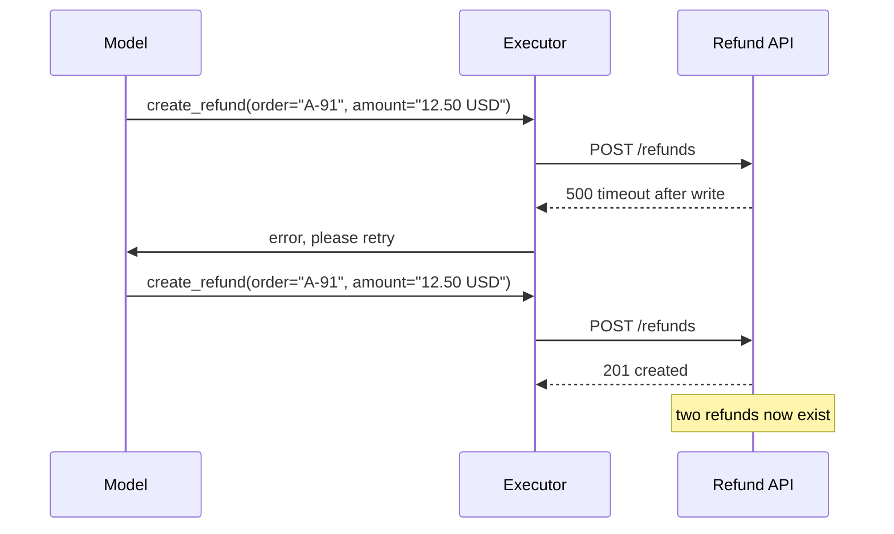
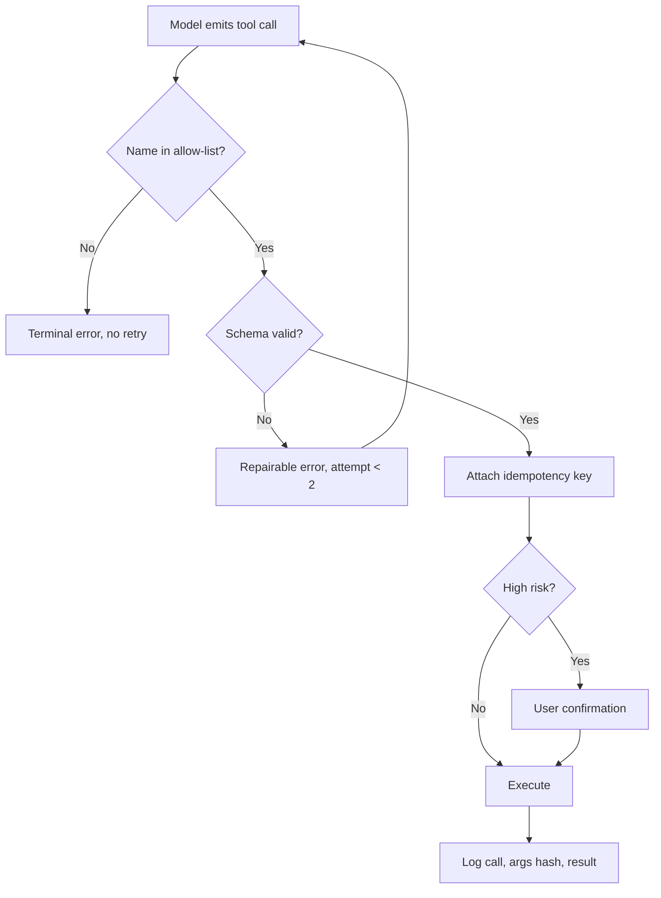

> **Scenario** - An ops assistant exposes eleven tools. In one week it calls `create_refund` twice for the same order, passes `"2024-13-45"` as a date, and invents a tool named `list_all_refunds` that does not exist. Each failure surfaces as a 500 in the API and a confused user.

## Why it matters

- Tool calls are side effects. A hallucinated argument in a read-only search is noise; the same mistake in `create_refund` moves money.
- Models emit tool calls as structured text. Nothing in the sampling process guarantees the JSON parses, the enum is valid, or the tool exists.
- Retrying a failed tool call without idempotency turns one uncertain outcome into two real ones.
- Every malformed call costs a full round trip: the failed call, the error message back into context, and a repair attempt. That is 3x tokens for one logical operation.
- Tool schemas consume context. Eleven verbose tool definitions can occupy 3,000+ tokens on every single request, before any user content.

## Symptoms

| Signal | What you observe |
|---|---|
| Parse failures | `json.decoder.JSONDecodeError` on tool arguments, a few percent of calls |
| Unknown tools | Calls to plausible-sounding tool names that were never registered |
| Duplicates | Two identical mutations within the same conversation turn |
| Enum drift | `status="cancelled_by_user"` when the schema allows only `cancelled` |
| Context bloat | Tool definitions alone exceed the retrieved-context budget |

## How it breaks

The model produces a token sequence that looks like a valid call. If the schema is loose - free-form strings, optional fields, no enums - nearly anything passes syntactic validation and fails at the business layer. When it fails, the usual pattern is to feed the error back and let the model try again. Without an attempt counter that loop can run until the request times out, and without an idempotency key each attempt that *partially* succeeded has already written state.



## Root causes

1. Tool schemas allow free-form strings where a closed enum or a typed format would constrain the model.
2. Arguments are validated by the tool implementation rather than at the boundary, so failures are inconsistent.
3. Tool execution is not idempotent, so the retry path is unsafe by construction.
4. There is no allow-list check, so an invented tool name reaches the dispatcher.
5. Repair loops have no attempt ceiling and no distinction between retryable and terminal errors.

## How to solve it

### 1. Make schemas as narrow as the domain allows

```python
CREATE_REFUND = {
    "name": "create_refund",
    "description": "Refund a delivered order. Amount must not exceed order total.",
    "parameters": {
        "type": "object",
        "properties": {
            "order_id": {"type": "string", "pattern": "^[A-Z]{1,3}-[0-9]{2,8}$"},
            "amount_minor": {"type": "integer", "minimum": 1, "maximum": 5_000_00},
            "currency": {"type": "string", "enum": ["BDT", "USD"]},
            "reason": {"type": "string", "enum": ["damaged", "late", "wrong_item", "other"]},
        },
        "required": ["order_id", "amount_minor", "currency", "reason"],
        "additionalProperties": False,
    },
}
```

Integer minor units remove the `"12.50 USD"` class of bug entirely. `additionalProperties: false` turns a hallucinated field into a validation error rather than a silently ignored one.

### 2. Validate at the boundary, before dispatch

```python
from jsonschema import Draft202012Validator, ValidationError

VALIDATORS = {t["name"]: Draft202012Validator(t["parameters"]) for t in TOOLS}

def dispatch(call) -> ToolResult:
    if call.name not in VALIDATORS:
        return ToolResult.terminal(f"Unknown tool '{call.name}'. Available: {sorted(VALIDATORS)}")
    try:
        args = json.loads(call.arguments)
        VALIDATORS[call.name].validate(args)
    except (json.JSONDecodeError, ValidationError) as e:
        return ToolResult.repairable(f"Invalid arguments: {e}")
    return HANDLERS[call.name](**args)
```

### 3. Give every mutating tool an idempotency key

Derive the key from the semantic content of the call, not from a random UUID, so a retry of the same intent collapses onto the same record.

```python
def idem_key(conversation_id: str, call) -> str:
    payload = f"{conversation_id}:{call.name}:{json.dumps(call.args, sort_keys=True)}"
    return hashlib.sha256(payload.encode()).hexdigest()[:32]

resp = http.post("/refunds", json=args, headers={"Idempotency-Key": idem_key(cid, call)})
```

### 4. Bound the repair loop and classify errors

```ts
const MAX_REPAIRS = 2
for (let attempt = 0; attempt <= MAX_REPAIRS; attempt++) {
  const result = await dispatch(call)
  if (result.ok) return result
  if (result.kind === 'terminal') return result       // do not burn tokens
  messages.push({ role: 'tool', content: result.message })
  call = await model.nextToolCall(messages)
}
return { ok: false, message: 'Tool call could not be repaired' }
```

Two repairs is usually enough: in practice, if the model cannot produce valid arguments on the third try, the schema or the description is the problem, not the sample.

### 5. Trim the tool surface per request

Do not send all eleven tools every time. Route on intent and expose the 3–4 relevant ones. This cuts tokens and, more importantly, reduces the chance the model picks a near-miss tool.

### 6. Require confirmation for irreversible actions

Mark tools with `risk: 'high'` and route those through an explicit user confirmation step rather than trusting the model's judgement about when a refund is warranted.

## Target design



## Tradeoffs

| Option | Pros | Cons | Choose when |
|---|---|---|---|
| Loose schemas | Flexible, short definitions | Validation failures land in the business layer | Read-only exploratory tools |
| Strict JSON Schema | Errors caught before side effects | Longer definitions, more context | Any tool that writes |
| Constrained decoding | Output is valid by construction | Provider or local-model support required | You control the inference stack |
| Unbounded repair loop | Occasionally recovers hard cases | Runaway token spend and latency | Never in production |
| Confirmation on every tool | Maximum safety | Destroys the agentic UX | Financial or destructive operations only |

## Verification checklist

- [ ] Every mutating tool tested for duplicate suppression by replaying the same call twice.
- [ ] Unknown tool names return a terminal error without entering the repair loop.
- [ ] `additionalProperties: false` set on all tool schemas.
- [ ] Repair attempts capped and the cap covered by a test.
- [ ] Tool definition token cost measured and compared against the retrieval budget.
- [ ] Malformed-argument rate tracked as a metric per tool, not just logged.

## Anti-patterns

- Accepting money amounts as strings like `"12.50 USD"`.
- Retrying a mutating tool call on timeout without an idempotency key.
- Feeding raw stack traces back to the model as the repair message.
- Registering every internal API as a tool because the schema generator made it easy.
- Treating a hallucinated tool name as a retryable condition.

## Related

- [Multi-step agent loops and the cost blast radius](/systems/ai-rag-agents/multi-step-agent-loops-and-cost)
- [Prompt injection guardrails in production](/systems/ai-rag-agents/prompt-injection-guardrails)
- [Fallback model routing across providers](/systems/ai-rag-agents/fallback-model-routing)
