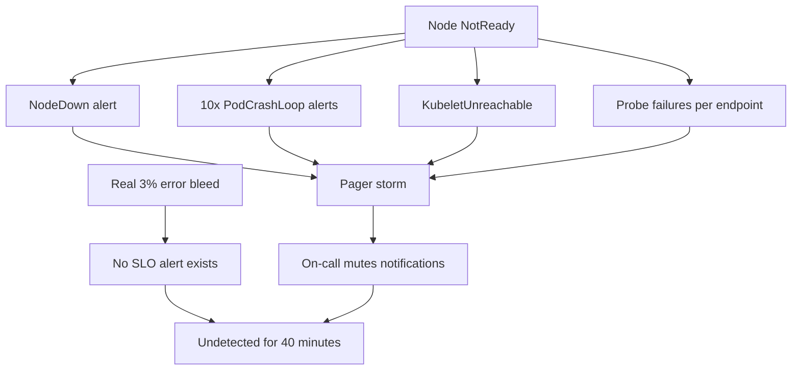
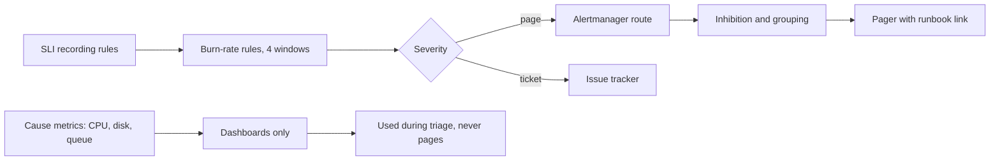

> **Scenario** - On-call handover doc-এ লেখা "DiskWillFillIn4Days ignore করুন, সবসময় fire করে"। গতরাতে pager বেজেছে 38 বার: 31টি একই node restart, 4টি batch box-এ CPU 80%-এর উপরে, 3টি সত্যি। সত্যিগুলো acknowledge হয়েছে 04:12-তে - প্রথম customer complaint-এর উনিশ মিনিট পরে।

## Why it matters

- Alert fatigue আরাম নয়, reliability সমস্যা: mute করা pager প্রতিটি আসল detection পিছিয়ে দেয়।
- প্রতিটি page-এর দাম মানুষের ঘুম ও পরদিনের error rate-এ মাপা হয়; noisy alerting সেই team-কেই দুর্বল করে যারা production ঠিক করে।
- Cause-based alert এমন জিনিসে fire করে যা user টেরও পায় না; symptom-based alert যা গুরুত্বপূর্ণ তার জন্য একবার fire করে।
- Burn-rate গণিত ছাড়া threshold অনুমান: `error_rate > 1%` 40 সেকেন্ডের blip-এ page করে আর মাসজুড়ে ধীর রক্তক্ষরণে চুপ থাকে।
- Runbook ও owner ছাড়া alert স্থায়ী noise হয়ে যায়, যা কেউ নিরাপদে মুছতেও পারে না।

## Symptoms

| Signal | What you observe |
| --- | --- |
| Volume | রাতে ডজন ডজন page; action ছাড়া acknowledge-ই স্বাভাবিক |
| Duplication | একটি node failure 12 rule জুড়ে 30 alert বানায় |
| Flapping | Alert মিনিটের মধ্যে resolve হয়ে আবার fire করে |
| Timing | Pager-এর আগেই customer আসল incident ধরে |
| Content | Alert body বলে "CPU high" - link নেই, owner নেই, next step নেই |
| Coverage | শেষ তিনটি আসল incident-এর জন্য কোনো alert নেই |

## How it breaks

Alert জমতে থাকে। এক incident-এর পর কেউ CPU threshold যোগ করে, আরেকজন memory threshold, তারপর queue-depth threshold - প্রত্যেকটি ভিন্ন window-তে। কোনোটিই "user ক্ষতিগ্রস্ত কি না"-র সাথে যুক্ত নয়, তাই batch job, deploy ও autoscaling event-এ fire করে। Inhibition না থাকায় একটিমাত্র node failure একসাথে node, pod, endpoint ও probe alert জ্বালায়। এদিকে যা নির্ভরযোগ্যভাবে ক্ষতি ট্র্যাক করে - SLI - তাতে কোনো alert নেই, তাই আসল slow-burn degradation customer টের পাওয়া পর্যন্ত অদৃশ্য থাকে।



## Root causes

1. User-facing symptom নয়, cause-based threshold (CPU, memory, disk rate)।
2. Error-budget model নেই, তাই severity ঠিক হয় কারো পছন্দের সংখ্যা দিয়ে।
3. Alert router-এ inhibition ও grouping rule অনুপস্থিত।
4. Single-window alert: ছোট window flap করে, বড় window দেরিতে ধরে।
5. Ownership metadata নেই, তাই কেউ rule retire করতে পারে না।
6. সব service-কে সমানভাবে alert করা, যেগুলোর user impact নেই সেগুলোসহ।

## How to solve it

### 1. SLI-তে multi-window burn rate দিয়ে alert করুন

Error budget হলো `1 - SLO`। 30 দিনে 99.9% availability target-এ budget request-এর 0.1%, অর্থাৎ প্রায় 43 মিনিটের পূর্ণ outage। *Burn rate* বলে টেকসই হারের কত গুণ দ্রুত খরচ করছেন: burn rate 1 ঠিক 30 দিনে budget শেষ করে।

আদর্শ চার-alert ladder বিপর্যয়ে দ্রুত page করে, ধীর রক্তক্ষরণে ticket খোলে:

| Burn rate | Long window | Short window | Budget consumed | Action |
| --- | --- | --- | --- | --- |
| 14.4 | 1 h | 5 m | 2% | Page |
| 6 | 6 h | 30 m | 5% | Page |
| 3 | 1 d | 2 h | 10% | Ticket |
| 1 | 3 d | 6 h | 10% | Ticket |

`14.4 = 0.02 × 30 × 24 / 1` - অর্থাৎ এক ঘণ্টায় 30-দিনের budget-এর 2% খরচ।

```yaml
groups:
  - name: checkout-slo
    rules:
      - alert: CheckoutErrorBudgetBurnFast
        expr: |
          (
            sli:checkout_error_ratio:rate1h > (14.4 * 0.001)
            and
            sli:checkout_error_ratio:rate5m > (14.4 * 0.001)
          )
        for: 2m
        labels:
          severity: page
          slo: checkout-availability
          owner: team-payments
        annotations:
          summary: "Checkout burning error budget 14x"
          impact: "Roughly {{ $value | humanizePercentage }} of checkouts failing"
          runbook: "https://runbooks.internal/checkout-availability"

      - alert: CheckoutErrorBudgetBurnSlow
        expr: |
          (
            sli:checkout_error_ratio:rate6h > (6 * 0.001)
            and
            sli:checkout_error_ratio:rate30m > (6 * 0.001)
          )
        for: 15m
        labels: { severity: page, slo: checkout-availability, owner: team-payments }
        annotations:
          runbook: "https://runbooks.internal/checkout-availability"

      - alert: CheckoutErrorBudgetBurnTicket
        expr: |
          (
            sli:checkout_error_ratio:rate1d > (3 * 0.001)
            and
            sli:checkout_error_ratio:rate2h > (3 * 0.001)
          )
        for: 1h
        labels: { severity: ticket, slo: checkout-availability, owner: team-payments }
```

ছোট window-টাই reset condition: incident শেষ হওয়ার পর alert-কে এক ঘণ্টা fired থাকতে দেয় না।

### 2. প্রতিটি window-এ ratio precompute করুন

```yaml
- record: sli:checkout_error_ratio:rate5m
  expr: sli:checkout_bad:rate5m / sli:checkout_requests:rate5m
- record: sli:checkout_error_ratio:rate1h
  expr: |
    sum(increase(http_server_requests_total{route="/checkout", outcome=~"server_error|exception|aborted"}[1h]))
    / sum(increase(http_server_requests_total{route="/checkout"}[1h]))
```

### 3. Router-এ storm দমন করুন

```yaml
route:
  group_by: [alertname, cluster, slo]
  group_wait: 45s
  group_interval: 5m
  repeat_interval: 4h
  routes:
    - matchers: [severity="page"]
      receiver: pagerduty
    - matchers: [severity="ticket"]
      receiver: jira
inhibit_rules:
  - source_matchers: [alertname="NodeDown"]
    target_matchers: [severity=~"page|warning"]
    equal: [node]
  - source_matchers: [alertname=~".*ErrorBudgetBurnFast"]
    target_matchers: [alertname=~".*ErrorBudgetBurnSlow|.*ErrorBudgetBurnTicket"]
    equal: [slo]
```

শুধু `group_wait: 45s`-ই node-failure storm-কে একটি notification-এ নামায়।

### 4. প্রতিটি page-এ একটি action রাখুন

```yaml
annotations:
  summary: "Checkout availability SLO burning at {{ $labels.slo }}"
  impact: "Customers cannot complete purchases"
  first_action: "Check the deploy annotation on the checkout board; roll back if a release landed in the last 30 minutes"
  runbook: "https://runbooks.internal/checkout-availability"
  dashboard: "https://grafana.internal/d/checkout/triage"
```

### 5. Alert review করুন মত দিয়ে নয়, data দিয়ে

```promql
# Pages per week by alertname - the noise leaderboard
sort_desc(
  sum by (alertname) (
    increase(alertmanager_notifications_total{integration="pagerduty"}[7d])
  )
)

# Alerts that fire and self-resolve in under 10 minutes: candidates for deletion or a longer `for`
count by (alertname) (
  ALERTS{alertstate="firing"} unless ALERTS{alertstate="firing"} offset 10m
)
```

সাপ্তাহিকভাবে চালান। যে rule page করে কিন্তু কোনো incident-এর সাথে যুক্ত নয়, তার `for` বাড়ান, severity নামান, বা মুছুন।

## Target design



## Tradeoffs

| Option | Pros | Cons | Choose when |
| --- | --- | --- | --- |
| Multi-window burn rate | বড় ভাঙনে দ্রুত, blip-এ চুপ | নির্ধারিত SLO ও ভালো SLI দরকার | user-facing service |
| Static threshold | লেখা ও বোঝানো সহজ | flap করে; user ক্ষতির সাথে সম্পর্কহীন | disk full-এর মতো কঠিন সীমা |
| Anomaly detection | unknown-unknown ধরে | seasonality-তে false positive | পরিপক্ব setup-এ secondary signal |
| Cause-based paging | user টের পাওয়ার আগে fire | নিরীহ event-এও page | শুধু যেখানে lead time অপরিহার্য |
| Page-এর বদলে ticket | ঘুম বাঁচায় | ধীর response | slow burn ও capacity trend |

## Verification checklist

- [ ] প্রতিটি paging alert-এর annotation-এ `owner`, `runbook` ও প্রথম action আছে।
- [ ] On-call shift-প্রতি page graph করা; লক্ষ্য রাতে দুইয়ের নিচে।
- [ ] Staging-এ node failure simulate করে দেখুন একটি grouped notification আসে, ত্রিশটি নয়।
- [ ] পাঁচ মিনিট 20% error inject করে দেখুন fast burn alert তিন মিনিটের মধ্যে fire করে।
- [ ] একদিন 0.4% error inject করে দেখুন শুধু ticket alert fire করে।
- [ ] শেষ তিনটি incident-এর প্রত্যেকটির জন্য এমন alert আছে যা fire করত।

## Anti-patterns

- সরাসরি p99 latency-তে page করা, যা প্রতিটি traffic spike ও cold cache-এ fire করে।
- Flapping alert-এ `for: 5m` যোগ করা, বদলে জিজ্ঞেস না করা alert-টির থাকা উচিত কি না।
- সবকিছুর জন্য একটি receiver, তাই ticket ও page একই channel-এ যায় এবং দুটোই ignore হয়।
- Service-প্রতি নয়, pod-প্রতি alert - ফলে autoscaling page তৈরি করে।
- "একবার outage-এ fire করেছিল" বলে alert রেখে দেওয়া, অন্য সময়েও fire করে কি না না দেখে।

## Related

- [SLO error budget burn rates](/systems/observability-sli/slo-error-budget-burn)
- [RED for services, USE for resources](/systems/observability-sli/red-and-use-methods)
- [Dashboards that answer questions](/systems/observability-sli/dashboards-that-answer-questions)
- [Synthetic checks vs real user monitoring](/systems/observability-sli/synthetic-vs-real-user-monitoring)
