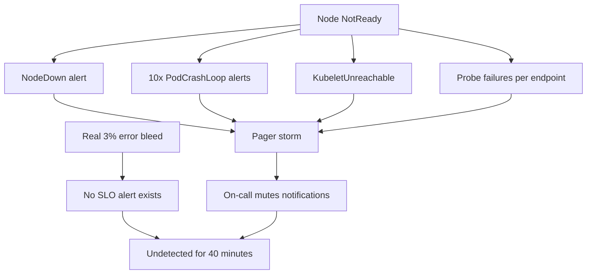
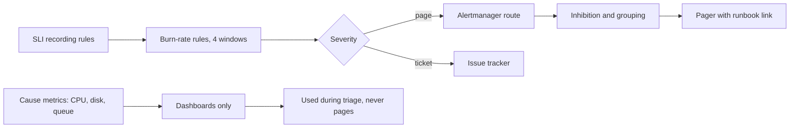

> **Scenario** — The on-call handover doc says "ignore DiskWillFillIn4Days, it always fires". Last night the pager went off 38 times: 31 were the same node restarting, 4 were CPU above 80% on a batch box, 3 were real. The real ones were acknowledged at 04:12, nineteen minutes after the first customer complaint.

## Why it matters

- Alert fatigue is a reliability problem, not a comfort problem: a muted pager delays every real detection.
- Each page has a cost measured in human sleep and next-day error rates; noisy alerting degrades the team that fixes production.
- Cause-based alerts fire on things users never notice, while symptom-based alerts fire once for the thing that matters.
- Without burn-rate maths, thresholds are guesses: `error_rate > 1%` pages on a 40-second blip and stays quiet during a slow month-long bleed.
- Alerts without a runbook and an owner become permanent noise that nobody can safely delete.

## Symptoms

| Signal | What you observe |
| --- | --- |
| Volume | Dozens of pages per night; acknowledge-without-action is the norm |
| Duplication | One node failure produces 30 alerts across 12 rules |
| Flapping | Alerts resolving and refiring within minutes |
| Timing | Real incidents detected by customers before the pager |
| Content | Alert body says "CPU high" with no link, no owner, no next step |
| Coverage | No alert exists for the last three real incidents |

## How it breaks

Alerts accumulate. Somebody adds a CPU threshold after an incident, somebody else adds a memory threshold, then a queue-depth threshold, each on a different window. None of them are wired to whether users are affected, so they fire during batch jobs, deploys, and autoscaling events. Because there is no inhibition, a single node failure lights up node, pod, endpoint, and probe alerts simultaneously. Meanwhile the one thing that reliably tracks harm — the SLI — is not alerted on at all, so real slow-burn degradation stays invisible until a customer notices.



## Root causes

1. Cause-based thresholds (CPU, memory, disk rate) instead of user-facing symptoms.
2. No error-budget model, so severity is decided by a number somebody liked.
3. Missing inhibition and grouping rules in the alert router.
4. Single-window alerts: short windows flap, long windows detect too late.
5. No ownership metadata, so nobody can retire a rule.
6. Alerting on every service equally, including ones with no user impact.

## How to solve it

### 1. Alert on the SLI with multi-window burn rates

An error budget is `1 - SLO`. For a 99.9% availability target over 30 days, the budget is 0.1% of requests, which is about 43 minutes of full outage. *Burn rate* is how many times faster than sustainable you are consuming it: burn rate 1 exhausts the budget in exactly 30 days.

The standard four-alert ladder pages fast for catastrophes and files tickets for slow bleeds:

| Burn rate | Long window | Short window | Budget consumed | Action |
| --- | --- | --- | --- | --- |
| 14.4 | 1 h | 5 m | 2% | Page |
| 6 | 6 h | 30 m | 5% | Page |
| 3 | 1 d | 2 h | 10% | Ticket |
| 1 | 3 d | 6 h | 10% | Ticket |

`14.4 = 0.02 × 30 × 24 / 1`, that is, consuming 2% of a 30-day budget in one hour.

```yaml
groups:
  - name: checkout-slo
    rules:
      - alert: CheckoutErrorBudgetBurnFast
        expr: |
          (
            sli:checkout_error_ratio:rate1h > (14.4 * 0.001)
            and
            sli:checkout_error_ratio:rate5m > (14.4 * 0.001)
          )
        for: 2m
        labels:
          severity: page
          slo: checkout-availability
          owner: team-payments
        annotations:
          summary: "Checkout burning error budget 14x"
          impact: "Roughly {{ $value | humanizePercentage }} of checkouts failing"
          runbook: "https://runbooks.internal/checkout-availability"

      - alert: CheckoutErrorBudgetBurnSlow
        expr: |
          (
            sli:checkout_error_ratio:rate6h > (6 * 0.001)
            and
            sli:checkout_error_ratio:rate30m > (6 * 0.001)
          )
        for: 15m
        labels: { severity: page, slo: checkout-availability, owner: team-payments }
        annotations:
          runbook: "https://runbooks.internal/checkout-availability"

      - alert: CheckoutErrorBudgetBurnTicket
        expr: |
          (
            sli:checkout_error_ratio:rate1d > (3 * 0.001)
            and
            sli:checkout_error_ratio:rate2h > (3 * 0.001)
          )
        for: 1h
        labels: { severity: ticket, slo: checkout-availability, owner: team-payments }
```

The short window is the reset condition: it stops the alert from staying fired for an hour after the incident is over.

### 2. Precompute the ratio at every window

```yaml
- record: sli:checkout_error_ratio:rate5m
  expr: sli:checkout_bad:rate5m / sli:checkout_requests:rate5m
- record: sli:checkout_error_ratio:rate1h
  expr: |
    sum(increase(http_server_requests_total{route="/checkout", outcome=~"server_error|exception|aborted"}[1h]))
    / sum(increase(http_server_requests_total{route="/checkout"}[1h]))
```

### 3. Suppress the storm in the router

```yaml
route:
  group_by: [alertname, cluster, slo]
  group_wait: 45s
  group_interval: 5m
  repeat_interval: 4h
  routes:
    - matchers: [severity="page"]
      receiver: pagerduty
    - matchers: [severity="ticket"]
      receiver: jira
inhibit_rules:
  - source_matchers: [alertname="NodeDown"]
    target_matchers: [severity=~"page|warning"]
    equal: [node]
  - source_matchers: [alertname=~".*ErrorBudgetBurnFast"]
    target_matchers: [alertname=~".*ErrorBudgetBurnSlow|.*ErrorBudgetBurnTicket"]
    equal: [slo]
```

`group_wait: 45s` alone collapses a node-failure storm into one notification.

### 4. Make every page carry an action

```yaml
annotations:
  summary: "Checkout availability SLO burning at {{ $labels.slo }}"
  impact: "Customers cannot complete purchases"
  first_action: "Check the deploy annotation on the checkout board; roll back if a release landed in the last 30 minutes"
  runbook: "https://runbooks.internal/checkout-availability"
  dashboard: "https://grafana.internal/d/checkout/triage"
```

### 5. Review alerts with data, not opinion

```promql
# Pages per week by alertname — the noise leaderboard
sort_desc(
  sum by (alertname) (
    increase(alertmanager_notifications_total{integration="pagerduty"}[7d])
  )
)

# Alerts that fire and self-resolve in under 10 minutes: candidates for deletion or a longer `for`
count by (alertname) (
  ALERTS{alertstate="firing"} unless ALERTS{alertstate="firing"} offset 10m
)
```

Run this weekly. Any rule with pages and no linked incident gets a `for` increase, a severity downgrade, or deletion.

## Target design



## Tradeoffs

| Option | Pros | Cons | Choose when |
| --- | --- | --- | --- |
| Multi-window burn rate | Fast for big breaks, quiet for blips | Needs a defined SLO and good SLI | User-facing services |
| Static threshold | Trivial to write and explain | Flaps; unrelated to user harm | Hard limits like disk full |
| Anomaly detection | Catches unknown-unknowns | False positives on seasonality | Mature setups, as a secondary signal |
| Cause-based paging | Fires before users notice | Pages for harmless events | Only where lead time is essential |
| Ticket instead of page | Protects sleep | Slower response | Slow burns and capacity trends |

## Verification checklist

- [ ] Every paging alert has `owner`, `runbook`, and a first action in its annotations.
- [ ] Pages per on-call shift is graphed; target is under two per night.
- [ ] Simulate a node failure in staging and confirm one grouped notification, not thirty.
- [ ] Inject a 20% error rate for five minutes and confirm the fast burn alert fires within three minutes.
- [ ] Inject a 0.4% error rate for a day and confirm only the ticket alert fires.
- [ ] Each of the last three incidents maps to an alert that would have fired.

## Anti-patterns

- Paging on p99 latency directly, which fires on every traffic spike and cold cache.
- Adding `for: 5m` to a flapping alert instead of asking whether it should exist.
- One receiver for everything, so tickets and pages share the same channel and both get ignored.
- Alerting per pod instead of per service, so autoscaling generates pages.
- Keeping an alert because "it fired once during an outage" without checking whether it fires at other times too.

## Related

- [SLO error budget burn rates](/systems/observability-sli/slo-error-budget-burn)
- [RED for services, USE for resources](/systems/observability-sli/red-and-use-methods)
- [Dashboards that answer questions](/systems/observability-sli/dashboards-that-answer-questions)
- [Synthetic checks vs real user monitoring](/systems/observability-sli/synthetic-vs-real-user-monitoring)
