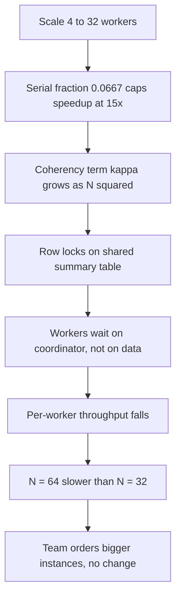
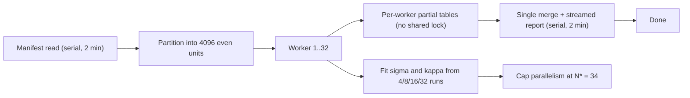

> **Scenario** — একটি nightly reconciliation job 4 worker-এ 6 ঘণ্টা নেয়। দল 32 worker-এ scale করে 45 মিনিট আশা করে, পায় 2 ঘ 10 মি। 64 worker-এ তা *আরও খারাপ* — 2 ঘ 35 মি। কেউ বলে "worker গুলো নিশ্চয়ই ছোট", আর বড় instance order করে।

## Why it matters

- Parallel speedup-এর একটা কঠিন গাণিতিক ছাদ আছে। ছাদ পেরিয়ে worker কেনা মানে টাকা দিয়ে contention কেনা।
- Retrograde region — যেখানে capacity বাড়ালে ধীর হয় — বাস্তব ও সাধারণ। Batch ও fan-out system-এ এটাই সবচেয়ে দামি ভুল রোগনির্ণয়।
- Amdahl's Law parallelisation-এ sprint খরচ করার *আগেই* সর্বোচ্চ সম্ভব speedup বলে দেয়।
- একই হিসাব বলে কেন 5% serial section আপনাকে 20×-এ আটকে রাখে, যত hardware ভাড়া করুন।
- এর দাম on-call দেয়: যে job আগে business day শুরুর আগে শেষ হত, এখন তার ভিতরে গড়ায়।

## Symptoms

| Signal | What you observe |
|---|---|
| Speedup curve | সমান হয়ে যায়, তারপর কোনো worker count-এর পরে নিচে নামে |
| Per-worker throughput | worker বাড়লে কমে |
| Lock wait / `pg_locks` | worker-এর সাথে superlinear বাড়ে |
| Worker-এ CPU | উঁচু `%sys`, কম `%usr` — coordination, কাজ নয় |
| Coordinator node | saturated, অথচ worker idle |
| Job duration variance | scale-out-এর পর হঠাৎ চওড়া হয় |

## How it breaks

Amdahl's Law: কাজের *p* ভগ্নাংশ parallelisable এবং (1 − *p*) serial হলে, *N* worker-এ:

**S(N) = 1 / ((1 − p) + p/N)**

Reconciliation job measure করুন। এক worker-এ phase timing: manifest পড়া ও advisory lock নেওয়া 12 মিনিট (serial), per-account matching 5 ঘ 36 মি (parallel), summary report লেখা 12 মিনিট (serial)। মোট 6 ঘ = 360 মিনিট, যার 24 মিনিট serial।

তাই (1 − p) = 24 / 360 = **0.0667**, আর p = 0.9333।

N → ∞ হলে সর্বোচ্চ সম্ভব speedup:

S(∞) = 1 / 0.0667 = **15×** → 360 / 15 = **24 মিনিট**, fleet যত বড়ই হোক।

এখন আসল সংখ্যা। N = 32-এ (1-worker serial সময়ের বিপরীতে হিসাব):

- S(32) = 1 / (0.0667 + 0.9333/32) = 1 / (0.0667 + 0.02917) = 1 / 0.09587 = **10.4×** → 360 / 10.4 = **34.6 মিনিট**

তারা 130 মিনিট দেখেছে, 34.6 নয়। শুধু Amdahl এটা ব্যাখ্যা করে না, কারণ Amdahl ধরে নেয় coordination বিনামূল্যে। Gunther-এর Universal Scalability Law একটি **coherency** term κ যোগ করে যা N² হিসেবে বাড়ে:

**C(N) = N / (1 + σ(N − 1) + κN(N − 1))**

এখানে σ = contention, κ = coherency (cross-talk) খরচ। তিনটি measured point থেকে σ ও κ fit করলে এই job-এর জন্য মোটামুটি σ = 0.07, κ = 0.0008। তাহলে:

- C(4) = 4 / (1 + 0.07×3 + 0.0008×4×3) = 4 / (1 + 0.21 + 0.0096) = 4 / 1.2196 = **3.28×**
- C(32) = 32 / (1 + 0.07×31 + 0.0008×32×31) = 32 / (1 + 2.17 + 0.7936) = 32 / 3.9636 = **8.07×**
- C(64) = 64 / (1 + 0.07×63 + 0.0008×64×63) = 64 / (1 + 4.41 + 3.2256) = 64 / 8.6356 = **7.41×**

C(64) < C(32)। এটাই retrograde region, আর production-এ দেখা দেওয়ার আগেই model-এ ছিল। Peak প্রায় N* = √((1 − σ)/κ) = √(0.93/0.0008) = √1162 ≈ **34 worker**। 34-এর পরে যা খরচ, তার return ঋণাত্মক।



## Root causes

1. একটি serial phase (manifest read, report write, advisory lock) যার সময় আলাদা করে কেউ মাপেনি।
2. Shared mutable state — প্রতিটি worker একই summary row update করছে — parallel কাজকে lock queue বানায়।
3. Coordinator সব worker-কে progress broadcast করে, ফলে O(N²) message।
4. অসম partitioning, তাই N যাই হোক job সবচেয়ে ধীর shard-এ বাঁধা।
5. Scaling সিদ্ধান্ত measured speedup curve-এর বদলে intuition-এ নেওয়া।
6. Per-worker fixed startup খরচ (connection setup, JIT warm-up) ক্রমশ ছোট কাজের টুকরোর উপর amortise হচ্ছে।
7. Database connection limit ছুঁয়ে গেছে, তাই worker CPU-তে নয়, pool-এ serialise হয়।

## How to solve it

### 1. Parallelise করার আগে serial fraction মাপুন

```python
# amdahl.py
def amdahl(serial_fraction: float, n: int) -> float:
    return 1.0 / (serial_fraction + (1 - serial_fraction) / n)

def usl(n: int, sigma: float, kappa: float) -> float:
    return n / (1 + sigma * (n - 1) + kappa * n * (n - 1))

serial_min, total_min = 24, 360
s = serial_min / total_min                      # 0.0667

for n in (4, 8, 16, 32, 64, 128):
    a = amdahl(s, n)
    u = usl(n, sigma=0.07, kappa=0.0008)
    print(f"N={n:4d}  Amdahl={a:5.2f}x ({total_min/a:6.1f} min)"
          f"   USL={u:5.2f}x ({total_min/u:6.1f} min)")

peak = int(((1 - 0.07) / 0.0008) ** 0.5)
print(f"USL peak concurrency N* = {peak}")      # 34
```

Output বলছে ছাদ 15× আর ব্যবহারিক peak 34 worker। পুরো scaling আলোচনা এক script-এ মিটল।

### 2. Shared write hotspot মেরে ফেলুন

Coherency term সাধারণত একটি row। Shared row-তে read-modify-write-এর বদলে per-worker partial result + একবার merge করুন।

```sql
-- BEFORE: প্রতিটি worker একই row-তে contend করে (kappa N^2 হিসেবে বাড়ে)
UPDATE recon_summary
   SET matched = matched + 1, amount = amount + $1
 WHERE run_id = $2;

-- AFTER: per-worker partial, cross-worker lock নেই
INSERT INTO recon_summary_partial (run_id, worker_id, matched, amount)
VALUES ($1, $2, 1, $3)
ON CONFLICT (run_id, worker_id)
DO UPDATE SET matched = recon_summary_partial.matched + 1,
              amount  = recon_summary_partial.amount + EXCLUDED.amount;

-- শেষে একবার serial merge (সস্তা, আর serial fraction-এ গোনা)
INSERT INTO recon_summary (run_id, matched, amount)
SELECT run_id, SUM(matched), SUM(amount)
  FROM recon_summary_partial
 WHERE run_id = $1
 GROUP BY run_id;
```

### 3. Serial phase নিজেই ছোট করুন

(1 − p) কমলেই Amdahl-এর ছাদ সরে। 12 মিনিটের report write streaming করে 2 মিনিটে নামালে (1 − p) 0.0667 থেকে 14/350 = 0.040 হয়, আর ছাদ 15× থেকে **25×**।

```python
# পরে memory-তে বানানোর বদলে report stream করুন
def write_report(conn, run_id: str, out) -> None:
    with conn.cursor(name='recon_stream') as cur:   # server-side cursor
        cur.itersize = 5_000
        cur.execute(
            "SELECT account_id, matched, amount FROM recon_result WHERE run_id = %s",
            (run_id,),
        )
        for account_id, matched, amount in cur:
            out.write(f"{account_id},{matched},{amount}\n")
```

### 4. Fleet-কে measured peak-এ cap করুন

```yaml
# recon-job.yaml — queue autoscaler-কে N* ছাড়াতে দেবেন না
apiVersion: batch/v1
kind: Job
metadata:
  name: nightly-recon
spec:
  parallelism: 32          # measured USL peak 34; নিচে থাকুন
  completions: 4096        # work unit, যাতে partition সমান থাকে
  backoffLimit: 2
  template:
    spec:
      restartPolicy: Never
      containers:
        - name: worker
          image: recon:1.14
          env:
            - name: DB_POOL_SIZE
              value: "2"   # 32 worker x 2 = 64 connection, 100 limit-এর নিচে
          resources:
            requests: { cpu: "1", memory: 1Gi }
            limits:   { cpu: "2", memory: 2Gi }
```

### 5. প্রতিটি optimisation-এর পরে σ ও κ আবার fit করুন

Representative dataset-এ N = 4, 8, 16, 32-এ job চালিয়ে দুই parameter fit করুন এবং runbook-এ N* লিখে রাখুন। Contention সরালে peak সরে; আবার না মাপলে আসল speedup পড়ে থাকে।

## Target design



## Tradeoffs

| Option | Pros | Cons | Choose when |
|---|---|---|---|
| আরও scale out | code change লাগে না | Amdahl ছাদ, তারপর retrograde | measured peak N*-এর নিচে থাকলে |
| Serial phase ছোট করা | ছাদ নিজেই বাড়ে | আসল engineering পরিশ্রম | serial fraction ~3%-এর বেশি |
| Per-worker partial + merge | κN² term সরায় | বাড়তি table ও merge step | worker shared row-তে contend করে |
| বড় instance (scale up) | সত্যিকার CPU-bound কাজে সাহায্য করে | lock contention-এ অকেজো | profile-এ `%usr`, `%sys` নয় |
| বর্তমান সময় মেনে নেওয়া | খরচ শূন্য | job window ছাড়াতে পারে | duration SLA-র ভালোভাবে ভিতরে |

## Verification checklist

- [ ] প্রতিটি run-এ serial ও parallel phase duration আলাদা করে timed ও logged।
- [ ] অন্তত চারটি worker count-এ, আসল data volume-এ speedup curve আছে।
- [ ] σ ও κ fitted, লিপিবদ্ধ, আর N* runbook-এ লেখা।
- [ ] Job spec-এর `parallelism` N*-এর সমান বা কম।
- [ ] `worker × DB_POOL_SIZE` database `max_connections`-এর নিচে।
- [ ] Hot loop-এর কোনো SQL statement worker-দের মধ্যে shared row update করে না।
- [ ] N*/2 থেকে N*-এ worker দ্বিগুণ করলে অন্তত 1.3× উন্নতি হয়; না হলে contention রয়ে গেছে।

## Anti-patterns

- সমান speedup curve-কে instance-size সমস্যা ভেবে scale up করা।
- যে workload-এর serial fraction কখনো মাপা হয়নি, তাকে parallelise করা।
- Queue-depth autoscaler-কে upper bound ছাড়া worker count বাছতে দেওয়া।
- সব worker-এর মধ্যে একটাই progress counter বা summary row share করা।
- প্রতি worker-এ heartbeat broadcast করা, যা O(N²) coordination traffic নিশ্চিত করে।
- ছোট dataset-এ benchmark করা, যেখানে serial phase হয় প্রভাবশালী হয় নয় অদৃশ্য।

## Related

- [Little's Law as a capacity planning tool](/systems/performance-capacity/littles-law-capacity-planning)
- [Thread and connection pool sizing formulas](/systems/performance-capacity/thread-and-connection-pool-sizing)
- [Profiling: telling CPU-bound from IO-bound](/systems/performance-capacity/profiling-cpu-vs-io-bound)
