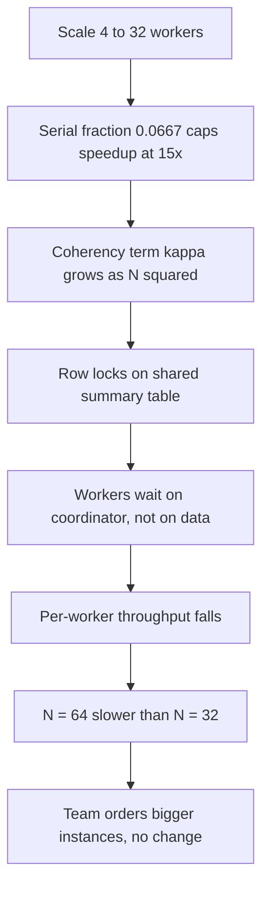
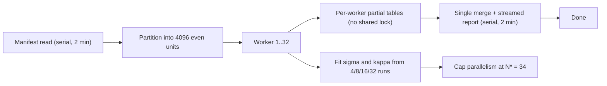

> **Scenario** - A nightly reconciliation job takes 6 hours on 4 workers. The team scales to 32 workers expecting 45 minutes and gets 2 h 10 m. At 64 workers it gets *worse* - 2 h 35 m. Somebody says "the workers must be too small" and orders bigger instances.

## Why it matters

- Parallel speedup has a hard mathematical ceiling. Buying more workers past that ceiling converts money into contention.
- The retrograde region - where adding capacity makes things slower - is real and common. It is the single most expensive misdiagnosis in batch and fan-out systems.
- Amdahl's Law gives you the maximum achievable speedup *before* you spend a sprint on parallelisation.
- The same arithmetic explains why a 5% serial section caps you at 20× no matter how much hardware you rent.
- On-call pays for this: a job that used to finish before the business day now overruns into it.

## Symptoms

| Signal | What you observe |
|---|---|
| Speedup curve | Flattens, then bends downward past some worker count |
| Per-worker throughput | Falls as worker count rises |
| Lock wait / `pg_locks` | Grows superlinearly with workers |
| CPU on workers | High `%sys`, low `%usr` - coordination, not work |
| Coordinator node | Saturated while workers idle |
| Job duration variance | Widens sharply after scaling out |

## How it breaks

Amdahl's Law: if fraction *p* of the work is parallelisable and (1 − *p*) is serial, then with *N* workers:

**S(N) = 1 / ((1 − p) + p/N)**

Measure the reconciliation job. Timing the phases on a single worker gives: 12 min reading the manifest and acquiring the advisory lock (serial), 5 h 36 m of per-account matching (parallel), 12 min writing the summary report (serial). Total 6 h = 360 min, with 24 min serial.

So (1 − p) = 24 / 360 = **0.0667**, and p = 0.9333.

Maximum possible speedup, as N → ∞:

S(∞) = 1 / 0.0667 = **15×** → 360 / 15 = **24 minutes**, ever, no matter the fleet size.

Now the actual numbers. At N = 4 (the baseline they measured *from* was already 4 workers, but compute against 1-worker serial time):

- S(32) = 1 / (0.0667 + 0.9333/32) = 1 / (0.0667 + 0.02917) = 1 / 0.09587 = **10.4×** → 360 / 10.4 = **34.6 min**

They observed 130 min, not 34.6. Amdahl alone does not explain it, because Amdahl assumes coordination is free. Gunther's Universal Scalability Law adds a **coherency** term κ that grows with N²:

**C(N) = N / (1 + σ(N − 1) + κN(N − 1))**

where σ is contention and κ is coherency (cross-talk) cost. Fit σ and κ from three measured points and you get, for this job, roughly σ = 0.07 and κ = 0.0008. Then:

- C(4) = 4 / (1 + 0.07×3 + 0.0008×4×3) = 4 / (1 + 0.21 + 0.0096) = 4 / 1.2196 = **3.28×**
- C(32) = 32 / (1 + 0.07×31 + 0.0008×32×31) = 32 / (1 + 2.17 + 0.7936) = 32 / 3.9636 = **8.07×**
- C(64) = 64 / (1 + 0.07×63 + 0.0008×64×63) = 64 / (1 + 4.41 + 3.2256) = 64 / 8.6356 = **7.41×**

C(64) < C(32). That is the retrograde region, and it appeared in the model before it appeared in production. The peak is near N* = √((1 − σ)/κ) = √(0.93/0.0008) = √1162 ≈ **34 workers**. Anything past 34 is spend with negative return.



## Root causes

1. A serial phase (manifest read, report write, advisory lock) nobody timed separately.
2. Shared mutable state - a single summary row updated by every worker - turning parallel work into a lock queue.
3. A coordinator that broadcasts progress to all workers, creating O(N²) messages.
4. Uneven partitioning, so the job is bounded by the slowest shard regardless of N.
5. Scaling decisions made on intuition instead of a measured speedup curve.
6. Fixed per-worker startup cost (connection setup, JIT warm-up) amortised over a shrinking slice of work.
7. Database connection limit reached, so workers serialise at the pool instead of the CPU.

## How to solve it

### 1. Measure the serial fraction before parallelising

```python
# amdahl.py
def amdahl(serial_fraction: float, n: int) -> float:
    return 1.0 / (serial_fraction + (1 - serial_fraction) / n)

def usl(n: int, sigma: float, kappa: float) -> float:
    return n / (1 + sigma * (n - 1) + kappa * n * (n - 1))

serial_min, total_min = 24, 360
s = serial_min / total_min                      # 0.0667

for n in (4, 8, 16, 32, 64, 128):
    a = amdahl(s, n)
    u = usl(n, sigma=0.07, kappa=0.0008)
    print(f"N={n:4d}  Amdahl={a:5.2f}x ({total_min/a:6.1f} min)"
          f"   USL={u:5.2f}x ({total_min/u:6.1f} min)")

peak = int(((1 - 0.07) / 0.0008) ** 0.5)
print(f"USL peak concurrency N* = {peak}")      # 34
```

Output tells you the ceiling is 15× and the practical peak is 34 workers. That is the whole scaling conversation, settled in one script.

### 2. Kill the shared write hotspot

The coherency term is usually one row. Replace read-modify-write on a shared row with per-worker partial results plus a single merge.

```sql
-- BEFORE: every worker contends on one row (kappa grows with N^2)
UPDATE recon_summary
   SET matched = matched + 1, amount = amount + $1
 WHERE run_id = $2;

-- AFTER: per-worker partials, no cross-worker lock
INSERT INTO recon_summary_partial (run_id, worker_id, matched, amount)
VALUES ($1, $2, 1, $3)
ON CONFLICT (run_id, worker_id)
DO UPDATE SET matched = recon_summary_partial.matched + 1,
              amount  = recon_summary_partial.amount + EXCLUDED.amount;

-- One serial merge at the end (cheap, and counted in the serial fraction)
INSERT INTO recon_summary (run_id, matched, amount)
SELECT run_id, SUM(matched), SUM(amount)
  FROM recon_summary_partial
 WHERE run_id = $1
 GROUP BY run_id;
```

### 3. Shrink the serial phase itself

Amdahl's ceiling moves only when (1 − p) shrinks. Cutting the 12-minute report write to 2 minutes by streaming it changes (1 − p) from 0.0667 to 14/350 = 0.040, and the ceiling from 15× to **25×**.

```python
# Stream the report instead of building it in memory after the fact
def write_report(conn, run_id: str, out) -> None:
    with conn.cursor(name='recon_stream') as cur:   # server-side cursor
        cur.itersize = 5_000
        cur.execute(
            "SELECT account_id, matched, amount FROM recon_result WHERE run_id = %s",
            (run_id,),
        )
        for account_id, matched, amount in cur:
            out.write(f"{account_id},{matched},{amount}\n")
```

### 4. Cap the fleet at the measured peak

```yaml
# recon-job.yaml - do not let the queue autoscaler run past N*
apiVersion: batch/v1
kind: Job
metadata:
  name: nightly-recon
spec:
  parallelism: 32          # measured USL peak is 34; stay below it
  completions: 4096        # work units, so partitions stay even
  backoffLimit: 2
  template:
    spec:
      restartPolicy: Never
      containers:
        - name: worker
          image: recon:1.14
          env:
            - name: DB_POOL_SIZE
              value: "2"   # 32 workers x 2 = 64 connections, under the 100 limit
          resources:
            requests: { cpu: "1", memory: 1Gi }
            limits:   { cpu: "2", memory: 2Gi }
```

### 5. Re-fit σ and κ after every optimisation

Run the job at N = 4, 8, 16, 32 on a representative dataset, fit the two parameters, and record N* in the runbook. The peak moves when you remove contention; if you do not re-measure, you leave real speedup on the table.

## Target design



## Tradeoffs

| Option | Pros | Cons | Choose when |
|---|---|---|---|
| Scale out further | No code change | Hits Amdahl ceiling, then retrograde | Below the measured peak N* |
| Shrink the serial phase | Raises the ceiling itself | Real engineering effort | Serial fraction above ~3% |
| Per-worker partials plus merge | Removes the κN² term | Extra table, extra merge step | Workers contend on shared rows |
| Bigger instances (scale up) | Helps genuinely CPU-bound work | Useless against lock contention | Profile shows `%usr`, not `%sys` |
| Accept the current duration | Zero cost | Job may overrun the window | Duration comfortably inside SLA |

## Verification checklist

- [ ] Serial and parallel phase durations are timed and logged separately every run.
- [ ] A speedup curve exists for at least four worker counts, on real data volume.
- [ ] σ and κ are fitted, recorded, and N* is written in the runbook.
- [ ] `parallelism` in the job spec is at or below N*.
- [ ] `workers × DB_POOL_SIZE` is below the database `max_connections`.
- [ ] No SQL statement in the hot loop updates a row shared across workers.
- [ ] Doubling workers from N*/2 to N* yields at least a 1.3× improvement; if not, contention remains.

## Anti-patterns

- Treating a flat speedup curve as an instance-size problem and scaling up.
- Parallelising a workload whose serial fraction was never measured.
- Letting a queue-depth autoscaler pick worker count with no upper bound.
- Sharing one progress counter or summary row across all workers.
- Broadcasting heartbeats to every worker, guaranteeing O(N²) coordination traffic.
- Benchmarking with a small dataset where the serial phase dominates or disappears.

## Related

- [Little's Law as a capacity planning tool](/systems/performance-capacity/littles-law-capacity-planning)
- [Thread and connection pool sizing formulas](/systems/performance-capacity/thread-and-connection-pool-sizing)
- [Profiling: telling CPU-bound from IO-bound](/systems/performance-capacity/profiling-cpu-vs-io-bound)
