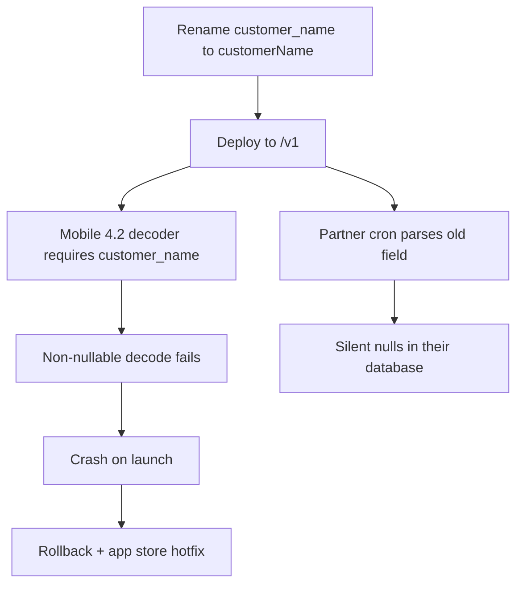
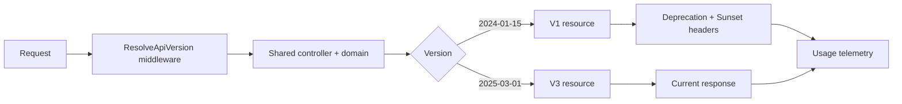

> **Scenario** - একটি cleanup PR consistency-র জন্য JSON field `customer_name`-কে `customerName` করল। বৃহস্পতিবার বিকেলে সেটি ship হলো। মাঠে থাকা দুটি mobile app version এখনো non-nullable decoder দিয়ে `customer_name` parse করে এবং launch-এই crash করে। API team-এর সব test পাস, কারণ সেই test-গুলো একই PR-এ আপডেট হয়েছিল।

## Why it matters

- একবার client ফোনে বসে গেলে বা partner-এর cron-এ ঢুকে গেলে আপনি upgrade জোর করতে পারবেন না। পুরোনো shape মাসের পর মাস চলতে হবে।
- Production-এ ধরা পড়া breaking change মানে rollback, support ঢেউ, আর app-store review-র সময় যা আপনার হাতে নেই।
- Caller ভাঙার ভয়ে দল cleanup বন্ধ করে দেয়, আর API-তে এমন field জমে যা মুছতে কেউ সাহস পায় না।
- Deprecation signal ছাড়া কে এখনো পুরোনো version-এ আছে তা জানা যায় না, তাই কখনো বন্ধও করা যায় না।
- Versioning কৌশল ঠিক করে দেয় পরের তিন বছর আপনার handler-এ কতগুলো code path থাকবে।

## Symptoms

| Signal | What you observe |
| --- | --- |
| Client crash spike | app release নয়, API deploy-এর কয়েক মিনিটে mobile crash rate লাফায় |
| Support pattern | কেবল N সপ্তাহের পুরোনো client সমস্যা জানায় |
| Frozen schema | field যোগের PR merge হয়; field মোছার PR এক বছর পড়ে থাকে |
| Unknown caller | "v1 কে ব্যবহার করে?" - log grep ছাড়া উত্তর নেই |
| Version sprawl | business logic জুড়ে `if ($version >= 3)` ছড়ানো |

## How it breaks

Failure প্রায় কখনোই যোগ করায় হয় না। হয় মোছা, নাম বদল, type বদল বা validation কড়া করায়। কড়া client decoder অপ্রত্যাশিত `null` বা অনুপস্থিত key-কে মারাত্মক ধরে, আর mobile client এক বিকেলে patch করা যায় না।

দ্বিতীয় failure হলো কাগজে-কলমে versioning। URL-এ `/v2` লেখা, কিন্তু `/v1` ও `/v2` একই controller ও একই serializer-এ যায়, তাই সেই serializer বদলালে v1-ও ভাঙে। Version prefix কিছুই কেনেনি।



## Root causes

1. কোনটি breaking change তার লিখিত সংজ্ঞা নেই।
2. Version prefix route-এ আছে, serialization layer-এ নেই।
3. Response সরাসরি ORM model থেকে serialize হয়, তাই column rename API change হয়ে যায়।
4. Client version telemetry নেই, তাই deprecation আন্দাজে চলে।
5. Deprecation এমন changelog-এ ঘোষণা হয় যা কেউ subscribe করে না।
6. Field মোছাকে timeline সহ breaking change না ধরে cleanup ধরা হয়।

## How to solve it

### 1. নিয়ম লিখে ফেলুন

**Non-breaking (যেকোনো সময় ship):** ঐচ্ছিক request field যোগ, response field যোগ, নতুন enum value যোগ *যদি client-দের unknown সহ্য করতে বলা থাকে*, নতুন endpoint, validation শিথিল করা।

**Breaking (নতুন version লাগবে):** field মোছা বা নাম বদল, type বদল (`"42"` থেকে `42`), ঐচ্ছিক request field বাধ্যতামূলক করা, validation কড়া করা, default sort order বা pagination size বদল, error code-এর অর্থ বদল, enum value মোছা।

Enum value যোগ করা বিতর্কিত। এটি তখনই নিরাপদ যখন প্রকাশিত contract বলে client-কে unknown value উপেক্ষা করতে হবে, এবং আপনি প্রথম দিন থেকেই তা বলেছেন।

### 2. শুধু route নয়, representation version করুন

```php
<?php

namespace App\Http\Resources\V1;

use Illuminate\Http\Resources\Json\JsonResource;

class OrderResource extends JsonResource
{
    public function toArray($request): array
    {
        return [
            'id'            => $this->public_id,
            'customer_name' => $this->customer->display_name,
            'total'         => (string) $this->total_minor,
            'status'        => $this->legacyStatus(),
            'created_at'    => $this->created_at->toIso8601String(),
        ];
    }

    /** v1 never learned about 'partially_refunded'. */
    private function legacyStatus(): string
    {
        return $this->status === 'partially_refunded' ? 'refunded' : $this->status;
    }
}
```

v2 resource আলাদা class। Controller ও domain model ভাগাভাগি হয়; কেবল boundary duplicate হয়। এই duplication-ই উদ্দেশ্য - এর কারণেই model স্বাধীনভাবে বদলাতে পারেন।

### 3. Header থেকে version, URL fallback সহ

```php
<?php

namespace App\Http\Middleware;

use Closure;
use Illuminate\Http\Request;
use Symfony\Component\HttpFoundation\Response;

class ResolveApiVersion
{
    private const SUPPORTED = ['2024-01-15', '2024-08-01', '2025-03-01'];
    private const CURRENT = '2025-03-01';

    public function handle(Request $request, Closure $next): Response
    {
        $requested = $request->header('API-Version')
            ?? $request->user()?->pinned_api_version
            ?? self::CURRENT;

        if (! in_array($requested, self::SUPPORTED, true)) {
            return response()->json([
                'error'     => 'unsupported_api_version',
                'requested' => $requested,
                'supported' => self::SUPPORTED,
            ], 400);
        }

        $request->attributes->set('api_version', $requested);

        $response = $next($request);
        $response->headers->set('API-Version', $requested);

        if ($requested !== self::CURRENT) {
            $response->headers->set('Deprecation', 'true');
            $response->headers->set('Sunset', 'Wed, 31 Dec 2025 23:59:59 GMT');
            $response->headers->set(
                'Link',
                '<https://docs.example.com/api/migration>; rel="deprecation"',
            );
        }

        return $response;
    }
}
```

Date-based version (Stripe-এর মডেল) প্রতি তিন বছরে monolithic v2 rewrite-এর বদলে অনেক ছোট compatibility shim ship করতে দেয়।

### 4. নতুন integration signup-এ pin করুন

Tenant প্রথম যে version-এ integrate করেছিল সেটি সংরক্ষণ করুন। স্পষ্টভাবে upgrade না করা পর্যন্ত তারা সেই shape পাবে, আর upgrade হবে ইচ্ছাকৃত API call - আকস্মিক deploy নয়।

### 5. মোছার আগে মাপুন

```sql
SELECT api_version,
       tenant_id,
       count(*) AS calls,
       max(created_at) AS last_seen
FROM api_request_log
WHERE created_at > now() - interval '30 days'
  AND api_version <> '2025-03-01'
GROUP BY api_version, tenant_id
ORDER BY calls DESC;
```

এই query ছোট তালিকা ফেরানোর পর - এবং প্রতিটি tenant-কে email করার পর - তবেই removal schedule করুন।

### 6. Client-কেও সহনশীল বানান

```ts
const OrderSchema = z.object({
  id: z.string(),
  customer_name: z.string().nullish(),
  customerName: z.string().nullish(),
  total: z.string(),
  status: z.string(), // not z.enum - unknown values must not throw
}).passthrough()

export function normalizeOrder(raw: unknown) {
  const parsed = OrderSchema.parse(raw)
  return {
    id: parsed.id,
    customerName: parsed.customerName ?? parsed.customer_name ?? 'Unknown',
    total: parsed.total,
    status: parsed.status,
  }
}
```

`passthrough()` ও status-এ সাধারণ `z.string()` ইচ্ছাকৃত: client নতুন field ও নতুন enum value দুটোতেই টিকে যায়।

## Target design



## Tradeoffs

| Option | Pros | Cons | Choose when |
| --- | --- | --- | --- |
| URL path (`/v1/`) | স্পষ্ট, cacheable, route করা সহজ | মোটা দাগ; প্রতিটি বদলে পুরো version | ছোট public API, বিরল পরিবর্তন |
| Header (`API-Version: date`) | সূক্ষ্ম, অনেক ছোট shim | হাতে test কঠিন, cache key vary করতে হয় | বড় public API, ঘন বিবর্তন |
| Version নেই, শুধু additive | duplicate code নেই | schema-তে মৃত field জমে থাকে | একসাথে deploy করা internal API |
| Per-tenant pinning | integrator-এর জন্য শূন্য চমক | তারা না সরা পর্যন্ত পুরোনো shape রাখতে হয় | enterprise partner |
| GraphQL field deprecation | সূক্ষ্ম, tooling সমর্থিত | কেবল GraphQL-এ চলে | আগেই GraphQL-এ আছেন |

## Verification checklist

- [ ] প্রতিটি PR-এ CI-তে আগের version-এর contract test `main`-এর বিরুদ্ধে চালান।
- [ ] v2-তে field যোগের পর v1 response snapshot byte-অভিন্ন - assert করুন।
- [ ] প্রতিটি non-current version response-এ `Deprecation` ও `Sunset` header আছে কিনা দেখুন।
- [ ] ৩০ দিনের request log query করে removal candidate-এর caller শূন্য নিশ্চিত করুন।
- [ ] Cache version header-এ vary করে কিনা যাচাই করুন, যাতে v1 client cached v3 body না পায়।
- [ ] Staging-এ client-কে unknown enum value দিয়ে দেখুন crash করে না।

## Anti-patterns

- "consistency-র জন্য" field rename করে data একই বলে সেটাকে non-breaking দাবি করা।
- Eloquent/ActiveRecord model সরাসরি serialize করা, যা database schema-কে public contract-এর সাথে বেঁধে ফেলে।
- একই release-এ deprecation ঘোষণা করে field মুছে ফেলা।
- ব্যবহার না মেপে চিরকাল সাতটি version রক্ষণাবেক্ষণ করা।
- Serialization boundary-র বদলে business logic-এর ভেতরে `if ($version === 'v1')`।
- Pagination default ২০ থেকে ৫০ করে সেটাকে ক্ষতিহীন ধরে নেওয়া।

## Related

- [Contract testing across team boundaries](/systems/api-integration/contract-testing-across-teams)
- [Pagination at scale: offsets, cursors, and drift](/systems/api-integration/pagination-at-scale)
- [Bulk endpoints and partial failure semantics](/systems/api-integration/bulk-endpoints-partial-failure)
