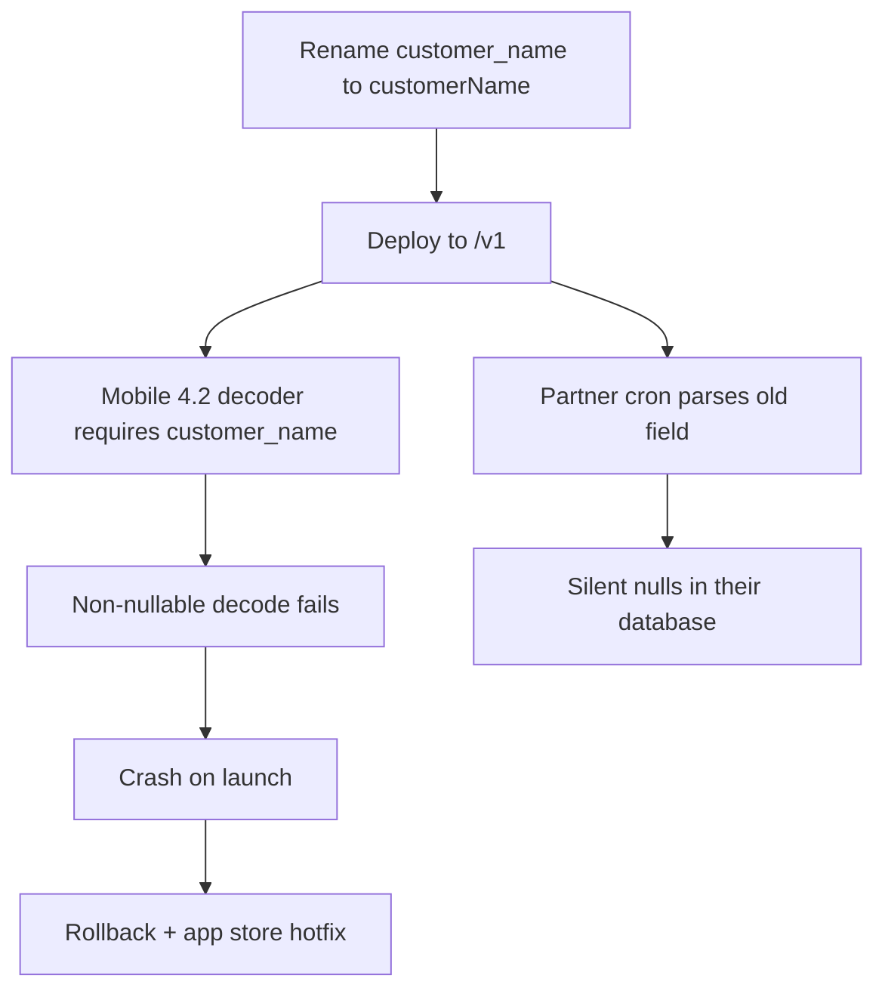
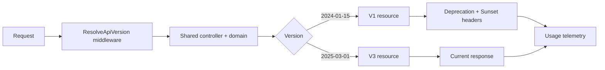

> **Scenario** - A cleanup PR renames the JSON field `customer_name` to `customerName` for consistency. It ships on a Thursday afternoon. Two mobile app versions still in the wild parse `customer_name` with a non-nullable decoder and crash on launch. The API team's tests all pass, because the API team's tests were updated in the same PR.

## Why it matters

- Once a client is installed on a phone or baked into a partner's cron job, you cannot force an upgrade. The old shape must keep working for months.
- Breaking changes discovered in production cost a rollback, a support wave, and app-store review time you do not control.
- Teams that fear breaking callers stop cleaning up, and the API accumulates fields nobody dares delete.
- Without a deprecation signal, you never learn who is still on the old version, so you can never turn it off.
- Versioning strategy decides how many code paths your handlers carry for the next three years.

## Symptoms

| Signal | What you observe |
| --- | --- |
| Client crash spike | Mobile crash rate jumps within minutes of an API deploy, not an app release |
| Support pattern | Only clients older than N weeks report the issue |
| Frozen schema | PRs adding fields get merged; PRs removing fields sit for a year |
| Unknown callers | You cannot answer "who still uses v1?" without grepping logs |
| Version sprawl | `if ($version >= 3)` branches scattered through business logic |

## How it breaks

The failure is almost never adding something. It is removing, renaming, retyping, or tightening. A strict client decoder treats an unexpected `null` or a missing key as fatal, and mobile clients cannot be patched in an afternoon.

The second failure mode is versioning that exists on paper only. The URL says `/v2`, but both `/v1` and `/v2` route to the same controller and the same serializer, so a change to that serializer breaks v1 anyway. The version prefix bought nothing.



## Root causes

1. No written definition of what counts as a breaking change.
2. Version prefixes exist in routes but not in the serialization layer.
3. Responses are serialized straight from ORM models, so a column rename becomes an API change.
4. No client version telemetry, so deprecation is guesswork.
5. Deprecation is announced in a changelog nobody subscribes to.
6. Field removal is treated as cleanup rather than as a breaking change with a timeline.

## How to solve it

### 1. Write down the rules

**Non-breaking (ship any time):** adding an optional request field, adding a response field, adding an enum value *if clients were told to tolerate unknowns*, adding an endpoint, relaxing validation.

**Breaking (needs a new version):** removing or renaming a field, changing a type (`"42"` to `42`), making an optional request field required, tightening validation, changing default sort order or pagination size, changing an error code's meaning, removing an enum value.

Adding an enum value is the contentious one. It is only safe if your published contract says clients must ignore unknown values, and you have said so from day one.

### 2. Version the representation, not just the route

```php
<?php

namespace App\Http\Resources\V1;

use Illuminate\Http\Resources\Json\JsonResource;

class OrderResource extends JsonResource
{
    public function toArray($request): array
    {
        return [
            'id'            => $this->public_id,
            'customer_name' => $this->customer->display_name,
            'total'         => (string) $this->total_minor,
            'status'        => $this->legacyStatus(),
            'created_at'    => $this->created_at->toIso8601String(),
        ];
    }

    /** v1 never learned about 'partially_refunded'. */
    private function legacyStatus(): string
    {
        return $this->status === 'partially_refunded' ? 'refunded' : $this->status;
    }
}
```

The v2 resource is a separate class. The controller and the domain model are shared; only the boundary is duplicated. That duplication is the point - it is what lets you change the model freely.

### 3. Resolve the version from a header with a URL fallback

```php
<?php

namespace App\Http\Middleware;

use Closure;
use Illuminate\Http\Request;
use Symfony\Component\HttpFoundation\Response;

class ResolveApiVersion
{
    private const SUPPORTED = ['2024-01-15', '2024-08-01', '2025-03-01'];
    private const CURRENT = '2025-03-01';

    public function handle(Request $request, Closure $next): Response
    {
        $requested = $request->header('API-Version')
            ?? $request->user()?->pinned_api_version
            ?? self::CURRENT;

        if (! in_array($requested, self::SUPPORTED, true)) {
            return response()->json([
                'error'     => 'unsupported_api_version',
                'requested' => $requested,
                'supported' => self::SUPPORTED,
            ], 400);
        }

        $request->attributes->set('api_version', $requested);

        $response = $next($request);
        $response->headers->set('API-Version', $requested);

        if ($requested !== self::CURRENT) {
            $response->headers->set('Deprecation', 'true');
            $response->headers->set('Sunset', 'Wed, 31 Dec 2025 23:59:59 GMT');
            $response->headers->set(
                'Link',
                '<https://docs.example.com/api/migration>; rel="deprecation"',
            );
        }

        return $response;
    }
}
```

Date-based versions (the Stripe model) let you ship many small compatibility shims rather than a monolithic v2 rewrite every three years.

### 4. Pin new integrations at signup

Store the version a tenant first integrated against. They keep getting that shape until they explicitly upgrade, and an upgrade is a deliberate API call, not a surprise deploy.

### 5. Measure before you delete

```sql
SELECT api_version,
       tenant_id,
       count(*) AS calls,
       max(created_at) AS last_seen
FROM api_request_log
WHERE created_at > now() - interval '30 days'
  AND api_version <> '2025-03-01'
GROUP BY api_version, tenant_id
ORDER BY calls DESC;
```

Only after this query returns a short list - and each of those tenants has been emailed - do you schedule the removal.

### 6. Make the client forgiving too

```ts
const OrderSchema = z.object({
  id: z.string(),
  customer_name: z.string().nullish(),
  customerName: z.string().nullish(),
  total: z.string(),
  status: z.string(), // not z.enum - unknown values must not throw
}).passthrough()

export function normalizeOrder(raw: unknown) {
  const parsed = OrderSchema.parse(raw)
  return {
    id: parsed.id,
    customerName: parsed.customerName ?? parsed.customer_name ?? 'Unknown',
    total: parsed.total,
    status: parsed.status,
  }
}
```

`passthrough()` and a plain `z.string()` for status are deliberate: the client survives both added fields and added enum values.

## Target design



## Tradeoffs

| Option | Pros | Cons | Choose when |
| --- | --- | --- | --- |
| URL path (`/v1/`) | Obvious, cacheable, easy to route | Coarse; every change is a whole version | Small public API, rare changes |
| Header (`API-Version: date`) | Fine-grained, many small shims | Harder to test by hand, cache key must vary | Large public API, frequent evolution |
| Never version, additive only | No duplicate code | Schema accumulates dead fields forever | Internal APIs you deploy together |
| Per-tenant pinning | Zero surprise for integrators | You maintain old shapes until they move | Enterprise partners |
| GraphQL field deprecation | Fine-grained, tooling-supported | Only works within GraphQL | Already on GraphQL |

## Verification checklist

- [ ] Run the previous version's contract tests against `main` in CI on every PR.
- [ ] Assert a v1 response snapshot is byte-identical after a v2 field addition.
- [ ] Confirm `Deprecation` and `Sunset` headers appear on every non-current version response.
- [ ] Query 30 days of request logs and confirm the removal candidate has zero callers.
- [ ] Verify caches vary on the version header, so a v1 client cannot receive a cached v3 body.
- [ ] Feed a client an unknown enum value in staging and confirm it does not crash.

## Anti-patterns

- Renaming a field "for consistency" and calling it non-breaking because the data is the same.
- Serializing Eloquent or ActiveRecord models directly, coupling your database schema to your public contract.
- Announcing deprecation and removing the field in the same release.
- Maintaining seven versions forever because nobody measured usage.
- `if ($version === 'v1')` inside business logic rather than at the serialization boundary.
- Changing pagination defaults from 20 to 50 and assuming it is harmless.

## Related

- [Contract testing across team boundaries](/systems/api-integration/contract-testing-across-teams)
- [Pagination at scale: offsets, cursors, and drift](/systems/api-integration/pagination-at-scale)
- [Bulk endpoints and partial failure semantics](/systems/api-integration/bulk-endpoints-partial-failure)
