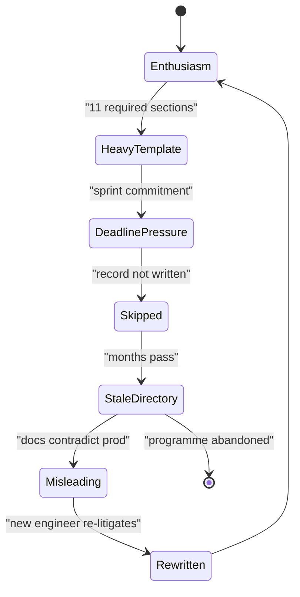
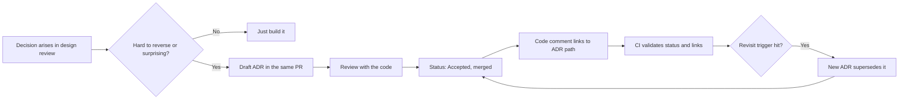

> **Scenario** — দুই বছর পর নতুন এক staff engineer জিজ্ঞেস করেন, মিনিটে ৪০টা message-এর workload-এ platform কেন Kafka ব্যবহার করে। সিদ্ধান্ত নেওয়া কেউ আর কোম্পানিতে নেই। Wiki-তে "Event Architecture (DRAFT)" নামের একটি পাতা ১৯ মাস আগে edit করা, আর বেঁচে থাকা একমাত্র প্রমাণ একটা Slack thread যা retention policy কেটে দিয়েছে।

## Why it matters

- অলিখিত সিদ্ধান্ত দল বদলালেই আবার নতুন করে তর্কে ওঠে। এটা senior-engineer সপ্তাহে মাপা এক পুনরাবৃত্ত খরচ, চিরকাল দিতে হয়।
- Rejected alternative না থাকলে ভবিষ্যতের দল বুঝতে পারে না যে সিদ্ধান্তের পেছনের constraint এখনো আছে কি না। ফলে হয় cargo-cult, নয় অন্ধভাবে উপড়ে ফেলা — দুটোই ব্যয়বহুল।
- Onboarding সময়ের বেশিরভাগ যায় "কেন এমন" বুঝতে, "এটা কী করে" নয়। কোড দ্বিতীয়টার উত্তর দেয়; প্রথমটার উত্তর repository-তে কোথাও নেই।
- Founder-দের জন্য: acquirer-এর technical due diligence ঠিক এই প্রশ্নগুলোই করে। ৪০টি ছোট decision record একজন director-এর স্মৃতির চেয়ে অনেক ভালো উত্তর।
- লিখিত trail ছাড়া meeting-এ নেওয়া সিদ্ধান্ত সাধারণত যে শেষে কথা বলেছে তার হয়, যার কাছে constraint ছিল তার নয়।

## Symptoms

| Signal | What you observe |
|---|---|
| পুনরাবৃত্ত তর্ক | একই architectural প্রশ্ন ৬-৯ মাস পরপর নতুন তথ্য ছাড়াই ফিরে আসে |
| Wiki rot | Decision পাতা আছে কিন্তু DRAFT নামে, দুটি migration-এর আগের |
| Onboarding প্রশ্ন | নতুনরা প্রথম মাসে "কীভাবে"-র চেয়ে "কেন" অনেক বেশি জিজ্ঞেস করে |
| Reversal churn | সিদ্ধান্ত উল্টে যায়, আবার ফিরে আসে, কারণ মূল constraint লেখা ছিল না |
| ADR count | প্রথম মাসে ১২টি, পরের আট মাসে শূন্য |
| Record-এর গঠন | শুধু কী বাছা হয়েছে লেখা; কী বাদ গেছে বা খরচ কী — নেই |

## How it breaks

ADR প্রোগ্রাম অনুমানযোগ্য ভাবেই ব্যর্থ হয়। কেউ এ নিয়ে পড়ে, `docs/adr/` বানায়, "Stakeholder Sign-off" ও "Risk Matrix" সহ এগারো section-এর template লেখে, ছয়টি record file করে। সপ্তম সিদ্ধান্তটা আসে deadline-এর চাপে sprint-এর মাঝখানে। Record লিখতে নব্বই মিনিট লাগবে, তাই লেখা হয় না। অষ্টমটাও না। ছয় মাস পর directory হয়ে যায় দল যেসব সিদ্ধান্ত পেরিয়ে এসেছে তার জাদুঘর — যা সক্রিয়ভাবে বিভ্রান্তিকর, কিছু না থাকার চেয়েও খারাপ, কারণ মানুষ বিশ্বাস করে আর ভুল করে।

আরেক failure হলো অবস্থান। আলাদা wiki, Notion বা Google Drive-এ থাকা record code review-র সময় অদৃশ্য — অথচ ঠিক তখনই কেউ সেটার বিপরীতে যেতে চলেছে। Repository-র record diff-এ দেখা যায়, change-এর সাথেই review হয়, আর কোডের মতো একই tool দিয়ে খোঁজা যায়।



## Root causes

1. Template এত ভারী যে সিদ্ধান্তের সময় লেখা যায় না, পরে লিখতে হয় — মানে কখনোই না।
2. Record repository-র বাইরে থাকে, তাই development workflow-এ কিছুই সেটা সামনে আনে না।
3. Status lifecycle নেই, তাই superseded record আর চালু record দেখতে একই রকম।
4. শুধু সফল সিদ্ধান্ত লেখা হয়; rejected option — আসল কাজের অংশ — বাদ পড়ে।
5. Trigger rule নেই, তাই প্রতিটি সিদ্ধান্ত record "পাওয়ার যোগ্য" কি না তা নিয়েই তর্ক চলে।
6. কোড থেকে record-এ link নেই, তাই একটা file সরালেই সম্পর্ক হারিয়ে যায়।

## How to solve it

### 1. পনেরো মিনিটে লেখা যায় এমন template নিন

```md
# ADR-0023: Use Postgres LISTEN/NOTIFY instead of Kafka for job dispatch

- Status: Accepted
- Date: 2026-03-11
- Deciders: platform team (A. Rahman, S. Chen)
- Supersedes: —
- Superseded by: —

## Context

Job dispatch peaks at 40 messages/minute with a 2s latency budget. We already run
Postgres 15 with a 3-node HA cluster and no message broker. Two teams need to
consume the same events within the next quarter.

## Decision

Dispatch via Postgres LISTEN/NOTIFY with an outbox table for durability.

## Options considered

| Option | Why not |
|---|---|
| Kafka (MSK) | ~$430/month plus an on-call surface nobody currently knows; 40 msg/min does not need a log |
| SQS | Fine technically, but adds a second failure domain and no ordering guarantee we need |
| Postgres outbox + NOTIFY | Chosen: no new infrastructure, transactional with the write |

## Consequences

- Positive: events are written in the same transaction as the business row, so no dual-write race.
- Positive: zero new infrastructure and no new on-call surface.
- Negative: no replay beyond the outbox retention window (currently 7 days).
- Negative: this ceases to work somewhere above ~2,000 msg/min; revisit at 500.

## Revisit when

Sustained throughput exceeds 500 messages/minute, or a consumer needs replay
older than 7 days.
```

"Revisit when" অংশটাই সবচেয়ে দামি লাইন। এটা সিদ্ধান্তকে স্থায়ী রায় থেকে স্পষ্ট trigger সহ একটা বাজিতে বদলায় — সেজন্যই এখন সহজ option বেছে নেওয়া নিরাপদ।

### 2. Repository-তে রাখুন, numbered ও immutable

```bash
mkdir -p docs/adr
next=$(printf "%04d" $(( $(ls docs/adr | grep -Eo '^[0-9]{4}' | sort -n | tail -1 | sed 's/^0*//') + 1 )))
cp docs/adr/0000-template.md "docs/adr/${next}-short-title.md"
```

সিদ্ধান্ত বদলাতে accepted record কখনো edit করবেন না। নতুন একটি লিখুন আর পুরনোটিতে `Superseded by: ADR-0031` বসান। ইতিহাসটাই মূল কথা।

### 3. Trigger rule ঠিক করুন যাতে scope নিয়ে তর্ক না হয়

Record লিখুন যখন সিদ্ধান্ত **ফেরানো কঠিন** বা **অপ্রত্যাশিত**। বাস্তবে: যা runtime dependency যোগ করে, যা backfill লাগে এমনভাবে data model বদলায়, যা vendor বাছে, বা যেটা একজন যোগ্য engineer যুক্তিসঙ্গতভাবে অন্যভাবে সিদ্ধান্ত নিতে পারতেন।

### 4. কোড থেকে record-এ link দিন

```ts
// Dispatch runs through the outbox rather than a broker.
// See docs/adr/0023-postgres-notify-job-dispatch.md — revisit above 500 msg/min.
export async function dispatch(event: DomainEvent, tx: Transaction) {
  await tx.insert('outbox', { payload: event, created_at: new Date() })
}
```

একটি path সহ এক লাইনের comment। কেউ outbox মুছে broker বসাতে গেলে review diff-এ সে যে যুক্তিটা ফেলে দিচ্ছে সেটা দেখতে পায়।

### 5. CI-তে index যাচাই করুন

```bash
#!/usr/bin/env bash
# scripts/check-adr.sh — every ADR must declare a status; superseded links must resolve.
set -euo pipefail
fail=0
for f in docs/adr/[0-9]*.md; do
  grep -q '^- Status: \(Proposed\|Accepted\|Superseded\|Deprecated\)$' "$f" \
    || { echo "missing/invalid status: $f"; fail=1; }
  target=$(grep -Eo '^- Superseded by: ADR-[0-9]{4}' "$f" | grep -Eo '[0-9]{4}' || true)
  if [ -n "$target" ] && ! ls docs/adr/${target}-*.md >/dev/null 2>&1; then
    echo "dangling supersede reference in $f -> ADR-$target"; fail=1
  fi
done
exit "$fail"
```

### 6. কোডের পরে নয়, কোডের সাথেই review করুন

যে pull request outbox টেবিল আনে সেখানেই `docs/adr/0023-*.md` থাকে। যাঁরা দ্বিমত করেন তাঁরা PR-এ তর্ক করেন, আর তর্কটা সংরক্ষিত থাকে। এতে deadline সমস্যাও মেটে: ৩০০ শব্দ লেখা change-এরই অংশ, কোনো শুক্রবারের জন্য তোলা বাড়তি কাজ নয়।

## Target design



## Tradeoffs

| Option | Pros | Cons | Choose when |
|---|---|---|---|
| Repo-তে হালকা ADR | সিদ্ধান্তের সময়েই লেখা; কোডের সাথে review; searchable | Numbering discipline লাগে | যেকোনো আকারের engineering দলের default |
| Review period সহ RFC | প্রতিশ্রুতির আগে বিস্তৃত মতামত | ধীর; দুজনের সিদ্ধান্তের জন্য ভারী | তিন বা তার বেশি দল প্রভাবিত হলে |
| Wiki-তে design doc | সমৃদ্ধ formatting, comment, non-engineer বান্ধব | Code review-এ অদৃশ্য; চুপচাপ পচে | Product বা executive-মুখী design |
| কোনো record নয় | Overhead শূন্য | সিদ্ধান্ত বারবার তর্কে; স্মৃতিই প্রতিষ্ঠান | যে prototype মুছে ফেলবেন |

## Verification checklist

- [ ] Application repository-তে `docs/adr/` আছে এবং গত ৬০ দিনের মধ্যে একটি record আছে।
- [ ] অন্তত একটি record-এর status `Superseded` ও link resolve করে, অর্থাৎ lifecycle ব্যবহৃত হচ্ছে।
- [ ] প্রতিটি PR-এ CI status/link check চলে এবং এখন pass করছে।
- [ ] কোডবেসের তিনটি architectural চমক বাছুন; প্রতিটির ব্যাখ্যা করা record আছে।
- [ ] প্রতিটি record অন্তত একটি rejected option ও তার কারণ লেখে।
- [ ] অন্তত অর্ধেক record-এ সুনির্দিষ্ট "Revisit when" trigger আছে।

## Anti-patterns

- Risk matrix ও sign-off table সহ template — এই আনুষ্ঠানিকতাই নিশ্চিত করে অষ্টম record কেউ লিখবে না।
- সিদ্ধান্ত বদলালে accepted record জায়গায় edit করা, যাতে তখনকার সঠিক যুক্তি মুছে যায়।
- শুধু সফল সিদ্ধান্তের record লেখা, যা directory-কে marketing artefact বানায়।
- Code review-র সময় কেউ খোলে না এমন wiki-তে ADR রাখা।
- ADR-কে approval gate ভাবা: এটা সিদ্ধান্ত নথিভুক্ত করে, অনুমতিপত্র নয়।

## Related

- [Build versus buy without regret](/systems/product-platform/build-vs-buy-decisions)
- [Modular monolith versus microservices](/systems/product-platform/modular-monolith-vs-microservices)
- [Prioritising technical debt with evidence](/systems/product-platform/technical-debt-prioritization)
