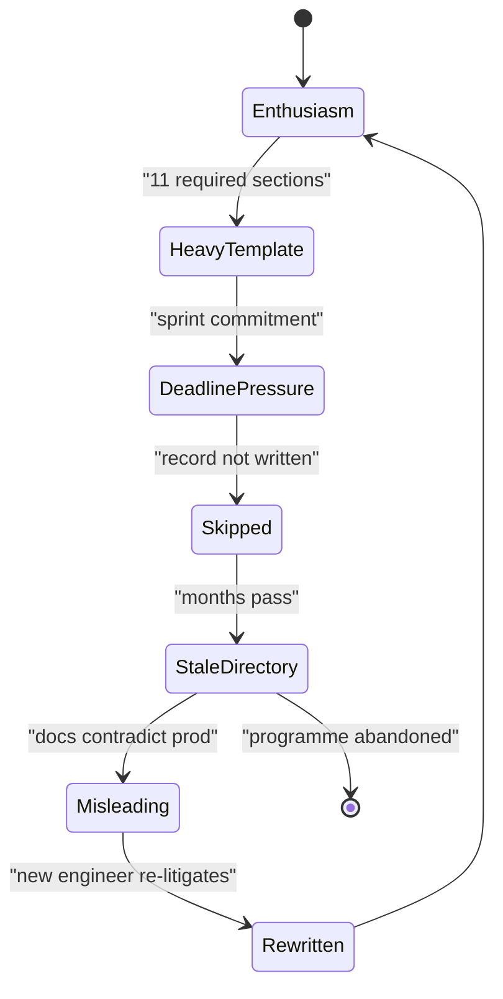
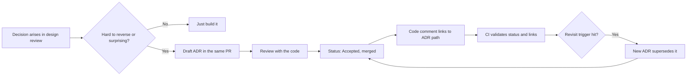

> **Scenario** - Two years after the fact, a new staff engineer asks why the platform uses Kafka for a workload that produces 40 messages per minute. Nobody who made the decision still works there. The wiki has a page titled "Event Architecture (DRAFT)" last edited 19 months ago, and the only surviving artefact is a Slack thread that has been truncated by the retention policy.

## Why it matters

- Undocumented decisions get re-litigated every time the team changes. That is a recurring cost measured in senior-engineer weeks, paid forever.
- Without the rejected alternatives, a future team cannot tell whether the constraint that drove the choice still holds. They either cargo-cult it or rip it out blindly, and both are expensive.
- Onboarding time is dominated by "why is it like this", not "what does this do". Code answers the second question; nothing in the repository answers the first.
- For founders: an acquirer's technical due diligence asks exactly these questions. A repository of 40 short decision records is a materially better answer than a director's memory.
- Decisions made in meetings without a written trail tend to be made by whoever spoke last, not by whoever had the constraint.

## Symptoms

| Signal | What you observe |
|---|---|
| Repeated debates | The same architectural question resurfaces every 6-9 months with no new information |
| Wiki rot | Decision pages exist but are titled DRAFT and predate two migrations |
| Onboarding questions | New hires ask "why" far more than "how" in their first month |
| Reversal churn | A choice is reversed, then reversed back, because the original constraint was undocumented |
| ADR count | Started strong at 12 records in month one, then zero for the next eight months |
| Record shape | Existing ADRs describe only what was chosen, never what was rejected or what it costs |

## How it breaks

ADR programmes fail in a predictable way. Someone reads about them, creates `docs/adr/`, writes a template with eleven required sections including "Stakeholder Sign-off" and "Risk Matrix", and files six records. The seventh decision happens during a sprint under deadline pressure. Writing the record would take ninety minutes, so it does not happen. The eighth does not happen either. Six months later the directory is a museum of decisions the team has already outgrown, which makes it actively misleading - worse than nothing, because people trust it and are wrong.

The other failure is placement. Records that live in a separate wiki, a Notion space, or a Google Drive folder are invisible during code review, which is exactly when someone is about to contradict one. Records in the repository show up in the diff, get reviewed alongside the change, and are searchable with the same tools as the code.



## Root causes

1. The template is too heavy to write during the decision, so it is written after - which means never.
2. Records live outside the repository, so nothing in the development workflow surfaces them.
3. No status lifecycle, so a superseded record looks identical to a current one.
4. Only successes are recorded; the rejected options - the actually useful part - are omitted.
5. No trigger rule, so the team argues about whether each decision "deserves" a record instead of writing it.
6. Nobody links from code to the record, so the connection is lost the first time a file is moved.

## How to solve it

### 1. Use a template short enough to write in fifteen minutes

```md
# ADR-0023: Use Postgres LISTEN/NOTIFY instead of Kafka for job dispatch

- Status: Accepted
- Date: 2026-03-11
- Deciders: platform team (A. Rahman, S. Chen)
- Supersedes: -
- Superseded by: -

## Context

Job dispatch peaks at 40 messages/minute with a 2s latency budget. We already run
Postgres 15 with a 3-node HA cluster and no message broker. Two teams need to
consume the same events within the next quarter.

## Decision

Dispatch via Postgres LISTEN/NOTIFY with an outbox table for durability.

## Options considered

| Option | Why not |
|---|---|
| Kafka (MSK) | ~$430/month plus an on-call surface nobody currently knows; 40 msg/min does not need a log |
| SQS | Fine technically, but adds a second failure domain and no ordering guarantee we need |
| Postgres outbox + NOTIFY | Chosen: no new infrastructure, transactional with the write |

## Consequences

- Positive: events are written in the same transaction as the business row, so no dual-write race.
- Positive: zero new infrastructure and no new on-call surface.
- Negative: no replay beyond the outbox retention window (currently 7 days).
- Negative: this ceases to work somewhere above ~2,000 msg/min; revisit at 500.

## Revisit when

Sustained throughput exceeds 500 messages/minute, or a consumer needs replay
older than 7 days.
```

The "Revisit when" section is the highest-value line in the document. It converts a decision from a permanent verdict into a bet with a stated trigger, which is what makes it safe to choose the simple option now.

### 2. Keep them in the repository, numbered and immutable

```bash
mkdir -p docs/adr
next=$(printf "%04d" $(( $(ls docs/adr | grep -Eo '^[0-9]{4}' | sort -n | tail -1 | sed 's/^0*//') + 1 )))
cp docs/adr/0000-template.md "docs/adr/${next}-short-title.md"
```

Never edit an accepted record to change the decision. Write a new one and set `Superseded by: ADR-0031` on the old one. The history is the point.

### 3. Define the trigger rule so nobody argues about scope

Write a record when the decision is **hard to reverse** or **surprising**. Concretely: anything that adds a runtime dependency, changes a data model in a way that requires a backfill, picks a vendor, or that a competent engineer would reasonably have decided differently.

### 4. Link code to the record

```ts
// Dispatch runs through the outbox rather than a broker.
// See docs/adr/0023-postgres-notify-job-dispatch.md - revisit above 500 msg/min.
export async function dispatch(event: DomainEvent, tx: Transaction) {
  await tx.insert('outbox', { payload: event, created_at: new Date() })
}
```

One comment line with a path. When someone deletes the outbox and installs a broker, the review diff shows them the reasoning they are about to discard.

### 5. Check the index in CI

```bash
#!/usr/bin/env bash
# scripts/check-adr.sh - every ADR must declare a status; superseded links must resolve.
set -euo pipefail
fail=0
for f in docs/adr/[0-9]*.md; do
  grep -q '^- Status: \(Proposed\|Accepted\|Superseded\|Deprecated\)$' "$f" \
    || { echo "missing/invalid status: $f"; fail=1; }
  target=$(grep -Eo '^- Superseded by: ADR-[0-9]{4}' "$f" | grep -Eo '[0-9]{4}' || true)
  if [ -n "$target" ] && ! ls docs/adr/${target}-*.md >/dev/null 2>&1; then
    echo "dangling supersede reference in $f -> ADR-$target"; fail=1
  fi
done
exit "$fail"
```

### 6. Review the record with the code, not after it

The pull request that introduces the outbox table contains `docs/adr/0023-*.md`. Reviewers who disagree argue in the PR, where the argument is preserved. This also solves the deadline problem: writing 300 words is part of the change, not an extra chore scheduled for a Friday that never comes.

## Target design



## Tradeoffs

| Option | Pros | Cons | Choose when |
|---|---|---|---|
| Lightweight ADRs in-repo | Written during the decision; reviewed with code; searchable | Requires numbering discipline; can drift from a separate wiki | Default for engineering teams of any size |
| RFC process with review period | Broad input before commitment; good for cross-team changes | Slow; heavy for a two-person decision | Changes affecting three or more teams |
| Design docs in a wiki | Rich formatting, comments, non-engineer friendly | Invisible during code review; rots quietly | Product-facing or executive-facing design |
| No formal record | Zero overhead | Decisions re-litigated; institutional memory is a person | Prototypes you intend to delete |

## Verification checklist

- [ ] `docs/adr/` exists in the application repository and contains a record dated within the last 60 days.
- [ ] At least one record has status `Superseded` with a resolving link, proving the lifecycle is used.
- [ ] The CI status/link check runs on every PR and currently passes.
- [ ] Pick three architectural surprises in the codebase; each has a record explaining it.
- [ ] Every record lists at least one rejected option with a reason.
- [ ] At least half the records include a concrete "Revisit when" trigger.

## Anti-patterns

- A template with a risk matrix and a sign-off table - the ceremony guarantees nobody writes the eighth record.
- Editing an accepted record in place when the decision changes, erasing the reasoning that was correct at the time.
- Writing records only for decisions that went well, which makes the directory a marketing artefact.
- Storing ADRs in a wiki nobody opens during code review.
- Treating an ADR as approval-gated: it documents a decision, it is not a permission slip.

## Related

- [Build versus buy without regret](/systems/product-platform/build-vs-buy-decisions)
- [Modular monolith versus microservices](/systems/product-platform/modular-monolith-vs-microservices)
- [Prioritising technical debt with evidence](/systems/product-platform/technical-debt-prioritization)
