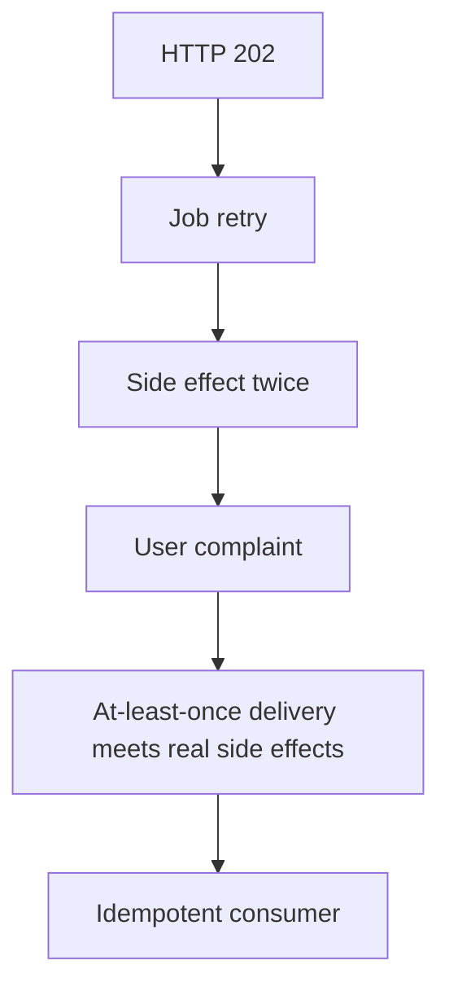

> **Lesson 134 · advanced** - Charges, emails, and webhooks cannot be rolled back - bracket every external call with dedup and a decision record.

## Why it matters

- Queues make latency someone else’s problem until a poison message blocks the lane.
- At-least-once delivery plus a side effect without an idempotency table is duplicate SMS, duplicate mail, duplicate charges.
- Schema evolution on events is how Friday’s consumer dies on Monday’s field rename.
- This lesson is specifically about **At-least-once delivery meets real side effects**. Tags: at-least-once, side-effects, payments, webhooks, stripe.

## Symptoms

| Signal | What you observe |
| --- | --- |
| Lag | Horizon / queue depth climbs while HTTP still looks healthy |
| Poison | One bad payload retries forever and starves the rest |
| Dup work | Mail count is 2× the ticket count |
| Schema | Old workers JSON-decode a field that no longer exists |

## How it breaks



The named technology is rarely the villain. Two code paths (often a Vue/Quasar screen and a Laravel write) assume opposite contracts. Production finds the race. For this topic that contract is: Charges, emails, and webhooks cannot be rolled back - bracket every external call with dedup and a decision record.

## Root causes

1. Consumer was not idempotent on message id.
2. Retry without backoff and without a dead-letter.
3. Side effects ran before the outbox row committed.
4. Producers shipped breaking event shapes without a version field.

## How to solve it

### 1. Write the invariant in one sentence

Charges, emails, and webhooks cannot be rolled back - bracket every external call with dedup and a decision record. Put that sentence in the PR, the Pinia action, and the Laravel class.

### 2. Guard the edge in code

```ts
// Pinia only reflects job state from the API — it does not enqueue twice
export async function enqueueExport(ticketId: number) {
  return api.post('/api/tickets/export', { ticketId })
}
```

```php
class SendTicketMail implements ShouldQueue
{
    public function handle(): void
    {
        if (ProcessedMessage::query()->where('id', $this->messageId)->exists()) return;
        Mail::to($this->email)->send(new TicketCreated($this->ticket));
        ProcessedMessage::query()->create(['id' => $this->messageId]);
    }
}
```

### 3. Keep a chart you will actually look at

Queue depth, dead-letter rate, and duplicate side-effect count. If the chart cannot catch a regression in **At-least-once delivery meets real side effects**, the lesson is not done.

## Worked example

Ticket-created mail used `ShouldQueue` with three retries. SMTP succeeded, the worker timed out, and Laravel retried. An idempotency row on message id made the second attempt a no-op.

On this topic, start from the symptom in the table that matches your last incident, then walk the diagram until the guard above would have fired.

## Check before you ship

- [ ] The invariant for **At-least-once delivery meets real side effects** is written in one sentence.
- [ ] Empty, duplicate, timeout, or permission paths have a test or a staged rehearsal.
- [ ] A dashboard or log query would catch a regression within one deploy.
- [ ] Related reading still makes sense: idempotent-consumers, exactly-once-delivery-illusion, saga-compensation-design.

## What not to do

- Copy a blog snippet that retries forever or caches the error as success.
- Treat Pinia as the source of truth for a Laravel row.
- Skip the previous numbered lesson if this one feels dense — the path is beginner → intermediate → advanced on purpose.
