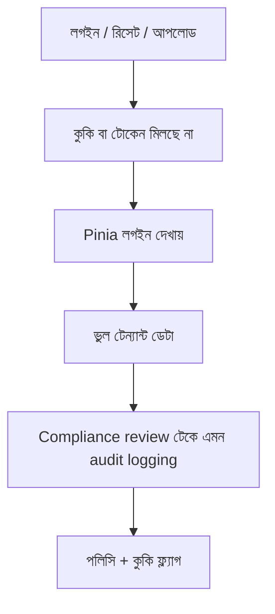

> **পাঠ 44 · মাঝারি ধাপ** - append-only trail, async job-এও actor attribution, retention যা "কে বদলেছে?" উত্তর দেয়।

## কেন এটা জরুরি

- সেশন কুকি, JWT, আর Pinia-র user অবজেক্ট যদি তিনজন তিন কথা বলে, অ্যাকাউন্ট হাইজ্যাক সাপোর্ট টিকিটের ছদ্মবেশে আসে।
- আক্রমণকারী লগইন ফর্ম না, পাসওয়ার্ড রিসেট, MFA রিকভারি আর ফাইল আপলোড দিয়ে ঢোকে।
- এক ইউজার ফ্যাক্টরিতে লেখা ইউনিট টেস্ট টেন্যান্ট ফাঁস ধরে না।
- এই পাঠটা ঠিক **Compliance review টেকে এমন audit logging** নিয়ে। ট্যাগ: audit, compliance, observability, retention।

## কী দেখে বুঝবেন সমস্যা আছে

| সংকেত | যা দেখা যায় |
| --- | --- |
| সেশন গোলমাল | ট্যাব রিস্টোরের পর ইউজার A ইউজার B-র টিকিট দেখে |
| রিসেট অপব্যবহার | রিসেট টোকেন ইমেইল HTML-এ দিনের পর দিন বাঁচে |
| আপলোড | SVG/HTML “ছবি” হিসেবে সেভ, পরে স্টাফকে সার্ভ হয় |
| অমর JWT | লগআউট শুধু Pinia খালি করে, টোকেন তবু চলে |

## কীভাবে ভাঙে



ভাঙে প্রযুক্তির নামে নয়, চুক্তির অভাবে। Vue/Quasar স্ক্রিন আর Laravel রাইট যদি উল্টো উত্তর ধরে, প্রোডাকশন সেই রেসটা খুঁজে বের করে। এই টপিকের চুক্তিটা হলো: append-only trail, async job-এও actor attribution, retention যা "কে বদলেছে?" উত্তর দেয়।

## মূল কারণ

1. সেশন ফিক্সেশন, বা Laravel সেশন কুকিতে SameSite নেই।
2. JWT-কে সেশন ভাবা হয়েছে, ডিনাইলিস্ট বা ছোট TTL+রিফ্রেশ নেই।
3. Axios-এ CSRF যায়নি, withCredentials “পরে ঠিক করব” ছিল।
4. পলিসি রোল স্ট্রিং চেক করেছে, সারির টেন্যান্ট আইডি নয়।

## কীভাবে সমাধান করবেন

### ১. ইনভেরিয়েন্ট এক বাক্যে লিখুন

append-only trail, async job-এও actor attribution, retention যা "কে বদলেছে?" উত্তর দেয়। এই বাক্য পিআর, Pinia অ্যাকশন, আর Laravel ক্লাসে রাখুন।

### ২. কোডে কিনারা আটকে দিন

```ts
// boot/axios.ts — Quasar
api.defaults.withCredentials = true
api.interceptors.request.use((config) => {
  const xsrf = document.cookie.split('; ').find((row) => row.startsWith('XSRF-TOKEN='))
  if (xsrf) config.headers['X-XSRF-TOKEN'] = decodeURIComponent(xsrf.slice(11))
  return config
})
```

```php
// app/Policies/TicketPolicy.php
public function view(User $user, Ticket $ticket): bool
{
    return $user->tenant_id === $ticket->tenant_id
        && $user->can('tickets.view');
}
```

### ৩. যে চার্ট সত্যি দেখবেন, সেটাই রাখুন

কারণ অনুযায়ী ব্যর্থ লগইন, রিসেট টোকেন পুনব্যবহার, আর ক্রস-টেন্যান্ট ৪০৩ হার। **Compliance review টেকে এমন audit logging**-এর রিগ্রেশন এই চার্টে না ধরা পড়লে পাঠ শেষ হয়নি।

## কাজের উদাহরণ

Quasar অ্যাডমিন শুধু Pinia লিখে “ইউজার স্যুইচ” করেছে। Laravel সেশন আগের স্টাফেরই ছিল। প্রতি পলিসিতে tenant_id বাঁধা আর প্রিভিলেজ বদলে সেশন ঘোরানো সেই ফাঁস বন্ধ করে।

এই টপিকে নিজের শেষ ইনসিডেন্টের লক্ষণ টেবিলে মিলিয়ে নিন, তারপর ডায়াগ্রাম ধরে এগোন যতক্ষণ না উপরের গার্ড আগুন ধরত।

## শিপ করার আগে

- [ ] **Compliance review টেকে এমন audit logging**-এর ইনভেরিয়েন্ট এক বাক্যে লেখা।
- [ ] খালি, ডুপ্লিকেট, টাইমআউট বা পারমিশন পাথের টেস্ট বা রিহার্সাল আছে।
- [ ] এক ডিপ্লয়ের মধ্যে রিগ্রেশন ধরার লগ বা চার্ট আছে।
- [ ] আত্মীয় পাঠ এখনও মিলছে: rbac-vs-abac-modeling, multi-tenant-authorization-leaks।

## যা করবেন না

- অনন্ত রিট্রাই বা এররকে সাকসেস হিসেবে ক্যাশ করা ব্লগ স্নিপেট কপি করবেন না।
- Laravel সারির সত্য Pinia-কে বলে দেবেন না।
- ঘন মনে হলে আগের নম্বরের পাঠ আগে শেষ করুন। পথটা ইচ্ছা করেই শুরু → মাঝারি → উন্নত।
