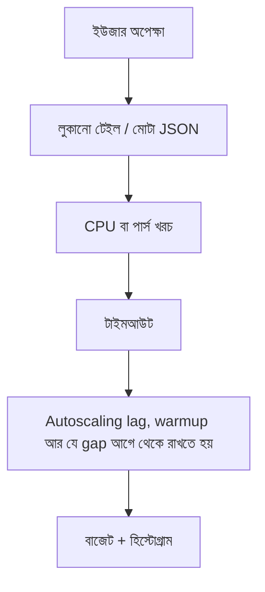

> **পাঠ 141 · উন্নত ধাপ** - metric delay + scheduling + JIT warmup প্রায়ই ৩-৪ মিনিট - traffic এত অপেক্ষা করে না।

## কেন এটা জরুরি

- গড় লুকিয়ে রাখে p99, যা ইউজার Quasar স্পিনারে আসলে অনুভব করে।
- পেলোড সাইজ, সিরিয়ালাইজেশন আর N+1 জোটে, Kubernetes-এর আগেই।
- শুধু লগইন হ্যামার করা লোড টেস্ট টিকিট লিস্টের ক্যাপাসিটি নিয়ে মিথ্যা বলে।
- এই পাঠটা ঠিক **Autoscaling lag, warmup আর যে gap আগে থেকে রাখতে হয়** নিয়ে। ট্যাগ: autoscaling, kubernetes, hpa, warmup, headroom।

## কী দেখে বুঝবেন সমস্যা আছে

| সংকেত | যা দেখা যায় |
| --- | --- |
| টেইল | একই এন্ডপয়েন্টে p50 ৪০ ms, p99 ২.১ s |
| পেলোড | নেস্টেড কমেন্টে টিকিট JSON ১.৪ MB |
| CPU | ওয়ার্কার কোয়েরি না করে এনকোডিং করে ব্যস্ত |
| ল্যাব vs প্রোড | স্টেজিং-এর k6-এ প্রোডাকশনের ক্যাশ স্ট্যাম্পিড নেই |

## কীভাবে ভাঙে



ভাঙে প্রযুক্তির নামে নয়, চুক্তির অভাবে। Vue/Quasar স্ক্রিন আর Laravel রাইট যদি উল্টো উত্তর ধরে, প্রোডাকশন সেই রেসটা খুঁজে বের করে। এই টপিকের চুক্তিটা হলো: metric delay + scheduling + JIT warmup প্রায়ই ৩-৪ মিনিট - traffic এত অপেক্ষা করে না।

## মূল কারণ

1. ড্যাশবোর্ডে শুধু গড় লেটেন্সি।
2. API এমন গ্রাফ পাঠায় যে UI আঁকে না।
3. Vue বিল্ডে রুটপ্রতি বাইট বাজেট নেই।
4. লোড টেস্ট উষ্ণ ক্যাশ আর এক টেন্যান্ট।

## কীভাবে সমাধান করবেন

### ১. ইনভেরিয়েন্ট এক বাক্যে লিখুন

metric delay + scheduling + JIT warmup প্রায়ই ৩-৪ মিনিট - traffic এত অপেক্ষা করে না। এই বাক্য পিআর, Pinia অ্যাকশন, আর Laravel ক্লাসে রাখুন।

### ২. কোডে কিনারা আটকে দিন

```ts
// Keep the list payload boring
const columns = ['id', 'title', 'status', 'updated_at'] as const
```

```php
return TicketResource::collection(
    $tickets->map(fn (Ticket $t) => $t->only(['id', 'title', 'status', 'updated_at']))
);
```

### ৩. যে চার্ট সত্যি দেখবেন, সেটাই রাখুন

লেটেন্সির হিস্টোগ্রাম (শুধু গড় নয়), রেসপন্স বাইট, আর রিকোয়েস্টপ্রতি CPU। **Autoscaling lag, warmup আর যে gap আগে থেকে রাখতে হয়**-এর রিগ্রেশন এই চার্টে না ধরা পড়লে পাঠ শেষ হয়নি।

## কাজের উদাহরণ

টিকিট ডিটেইল রিসোর্স পুরো কমেন্ট থ্রেড এমবেড করত। মোবাইল Vue JSON.parse-এ ৮০০ ms খরচ করে। সামারি এন্ডপয়েন্ট আর পেজ করা কমেন্ট কলে p99 অর্ধেক হয়।

এই টপিকে নিজের শেষ ইনসিডেন্টের লক্ষণ টেবিলে মিলিয়ে নিন, তারপর ডায়াগ্রাম ধরে এগোন যতক্ষণ না উপরের গার্ড আগুন ধরত।

## শিপ করার আগে

- [ ] **Autoscaling lag, warmup আর যে gap আগে থেকে রাখতে হয়**-এর ইনভেরিয়েন্ট এক বাক্যে লেখা।
- [ ] খালি, ডুপ্লিকেট, টাইমআউট বা পারমিশন পাথের টেস্ট বা রিহার্সাল আছে।
- [ ] এক ডিপ্লয়ের মধ্যে রিগ্রেশন ধরার লগ বা চার্ট আছে।
- [ ] আত্মীয় পাঠ এখনও মিলছে: littles-law-capacity-planning, load-testing-that-reflects-reality, cost-per-request-optimization।

## যা করবেন না

- অনন্ত রিট্রাই বা এররকে সাকসেস হিসেবে ক্যাশ করা ব্লগ স্নিপেট কপি করবেন না।
- Laravel সারির সত্য Pinia-কে বলে দেবেন না।
- ঘন মনে হলে আগের নম্বরের পাঠ আগে শেষ করুন। পথটা ইচ্ছা করেই শুরু → মাঝারি → উন্নত।
