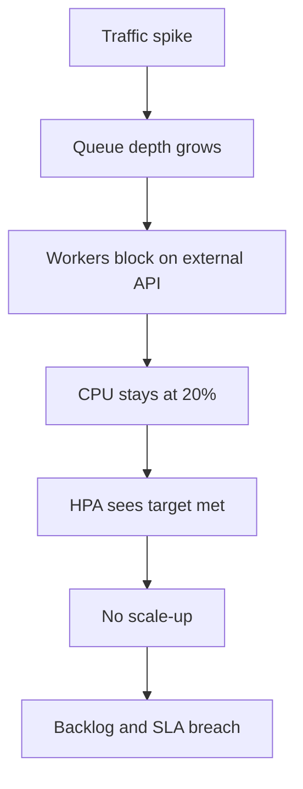
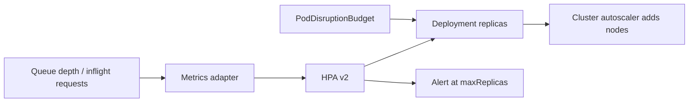

> **পরিস্থিতি** — একটা queue worker fleet ২০% CPU-তে বসে আছে অথচ ৪ লাখ message জমে গেছে। HPA-র target ৭০% CPU, তাই কখনো scale হয় না। Worker-রা একটা ধীর third-party API-তে আটকে আছে, আর traffic spike শেষ হওয়ার ছয় ঘণ্টা পর backlog পরিষ্কার হয়।

## কেন গুরুত্বপূর্ণ

- ভুল signal-এ autoscaling না-থাকার চেয়েও খারাপ: queue বাড়তে থাকা অবস্থায় এটি আত্মবিশ্বাসের সাথে নিষ্ক্রিয় থাকে।
- I/O-bound workload বেশিরভাগ সময় অপেক্ষায় থাকে, তাই CPU কখনো প্রকৃত demand প্রতিফলিত করে না।
- দেরিতে scale মানে user আগেই টের পেয়েছে; অতি-উৎসাহী scale মানে flapping, cold cache আর বড় বিল।
- Pod-level scaling node capacity-তে আটকে যায় — cluster autoscaler ছাড়া HPA শুধু `Pending` pod বানায়।

## লক্ষণ

| Signal | যা দেখবেন |
|---|---|
| HPA status | backlog বাড়তে থাকা অবস্থায় `TARGET: 21%/70%`, `REPLICAS: 4` |
| Queue | consumer lag রৈখিকভাবে বাড়ছে, replica-তে কোনো পরিবর্তন নেই |
| Latency | queue wait time প্রধান, service time সমতল — Little's Law-এর স্বাক্ষর |
| Replica graph | করাতদাঁত: দশ মিনিটে ৪ → ২০ → ৪ |
| Scheduler | নতুন pod `Pending`, কারণ `Insufficient cpu` |

## কীভাবে ভাঙে

CPU utilisation একটা *resource* metric, *demand* metric নয়। যে worker-এর মূল সীমাবদ্ধতা external API-র বিপরীতে concurrency, তার CPU backlog যত গভীরই হোক নিচেই থাকে। HPA একটা সুস্থ সংখ্যা দেখে এবং তার input অনুযায়ী সঠিক কাজই করে — input-টাই ভুল।

উল্টো failure হলো flapping। ছোট stabilisation window আর আঁটসাঁট target থাকলে একটা scrape target ছাড়ালেই pod যোগ হয়, বাড়তি capacity utilisation target-এর নিচে নামায়, controller আবার pod সরায়। প্রতিটি চক্রে warm connection pool ও JIT state হারায়, latency বাড়ে, আর তা আরও scaling ডেকে আনে।



## মূল কারণ

1. I/O-bound বা concurrency-bound workload-এ scaling metric হিসেবে CPU।
2. Stabilisation window বা scaling policy নেই, তাই controller একটাই noisy scrape-এ প্রতিক্রিয়া দেখায়।
3. `maxReplicas` traffic pattern-এর প্রকৃত চাহিদার নিচে সেট করা।
4. Cluster autoscaler নেই, তাই pod scaling নীরবে node capacity-তে থেমে যায়।
5. Scale-down scale-up-এর মতোই আক্রমণাত্মক, যা threshold-এর আশেপাশে thrash নিশ্চিত করে।

## কীভাবে সমাধান করবেন

### ১. Demand প্রকাশ করে এমন signal বাছুন

Little's Law দিয়ে target বের করুন: প্রয়োজনীয় concurrency = arrival rate × service time। ৫০০ msg/s আর ২০০ms processing হলে প্রায় ১০০ concurrent worker লাগবে।

```yaml
apiVersion: autoscaling/v2
kind: HorizontalPodAutoscaler
metadata:
  name: orders-worker
spec:
  scaleTargetRef:
    apiVersion: apps/v1
    kind: Deployment
    name: orders-worker
  minReplicas: 4
  maxReplicas: 120
  metrics:
    - type: External
      external:
        metric:
          name: rabbitmq_queue_messages_ready
          selector:
            matchLabels: { queue: orders }
        target:
          type: AverageValue
          averageValue: "300"        # messages of backlog per pod
  behavior:
    scaleUp:
      stabilizationWindowSeconds: 30
      policies:
        - type: Percent
          value: 100
          periodSeconds: 30          # at most double every 30s
    scaleDown:
      stabilizationWindowSeconds: 600
      policies:
        - type: Percent
          value: 20
          periodSeconds: 60          # shed slowly
```

অসমমিত behavior-ই মূল কথা: দ্রুত scale up, ধীরে scale down।

### ২. HTTP service-এ concurrency বা latency-তে scale করুন

```yaml
metrics:
  - type: Pods
    pods:
      metric: { name: http_inflight_requests }
      target: { type: AverageValue, averageValue: "25" }
```

### ৩. Node আদৌ আসতে পারে কিনা নিশ্চিত করুন

```bash
kubectl get hpa orders-worker -w
kubectl get pods -n prod --field-selector=status.phase=Pending
kubectl describe pod orders-worker-xyz | grep -A5 Events
kubectl get nodes -l workload=workers --show-labels
```

Pod `Pending` থাকলে আসল সীমা cluster autoscaler বা node pool-এর maximum।

### ৪. Autoscaler-এর উপরেই alert দিন

```yaml
- alert: HpaAtMaxReplicas
  expr: kube_horizontalpodautoscaler_status_current_replicas
        >= kube_horizontalpodautoscaler_spec_max_replicas
  for: 15m
```

## কাঙ্ক্ষিত ডিজাইন



## Tradeoff

| Option | সুবিধা | খরচ | কখন বেছে নেবেন |
|---|---|---|---|
| CPU-ভিত্তিক HPA | বাড়তি infrastructure লাগে না, সবসময় আছে | I/O-bound demand দেখতে পায় না | সত্যিকারের CPU-bound service, যেমন transcoding |
| Queue depth (KEDA/external metric) | সরাসরি backlog অনুসরণ করে, zero-তে নামতে পারে | metrics adapter ও broker exporter লাগে | async worker ও batch consumer |
| Concurrency / inflight request | user-visible latency-র নিকটতম proxy | app-এ instrumentation দরকার | পরিবর্তনশীল service time-এর HTTP API |
| Scheduled scaling | পূর্বানুমেয়, জানা peak-এ lag নেই | অপ্রত্যাশিত traffic দেখে না | দৈনিক বা সাপ্তাহিক শক্ত seasonality |

## যাচাই checklist

- [ ] CPU না বাড়িয়ে queue depth বাড়ানো load test ৬০ সেকেন্ডের মধ্যে scale-up ঘটায়।
- [ ] ৩০ মিনিটের স্থিতিশীল load-এ replica সংখ্যা ২০%-এর কম পরিবর্তিত হয় (flapping নেই)।
- [ ] `maxReplicas × pod request` node pool-এর সীমার মধ্যে থাকে, নয়তো cluster autoscaler তা ঢাকে।
- [ ] Rollout-এর সময় scale-down PodDisruptionBudget লঙ্ঘন করে না।
- [ ] Game day-তে HPA-at-max alert বাজে, আর runbook-এ করণীয় লেখা আছে।
- [ ] নতুন pod-এর cold-start time মাপা এবং stabilisation window-এর চেয়ে ছোট।

## Anti-pattern

- Node pool quota বা downstream database connection limit না দেখে `maxReplicas` ৫০০ করা।
- গড় latency-তে scale করা, যা incident-এর পিছনে চলে এবং দ্রুত fail হওয়া request-এ কমেও যেতে পারে।
- ৯০ সেকেন্ড cold start-এর service-এ `minReplicas: 1` রাখা।
- CPU limit ও CPU-ভিত্তিক HPA একসাথে ব্যবহার, যাতে throttled pod কৃত্রিমভাবে সীমিত utilisation দেখায়।
- যার আসল bottleneck একটাই database, সেই service autoscale করা — এতে saturated server-এ শুধু connection বাড়ে।

## সম্পর্কিত

- [OOMKilled and resource limits](/systems/devops-containers/oom-and-resource-limits)
- [Node draining and disruption budgets](/systems/devops-containers/node-draining-and-disruption-budgets)
- [Backpressure in queue-heavy architectures](/systems/messaging-async/backpressure-queue-design)
