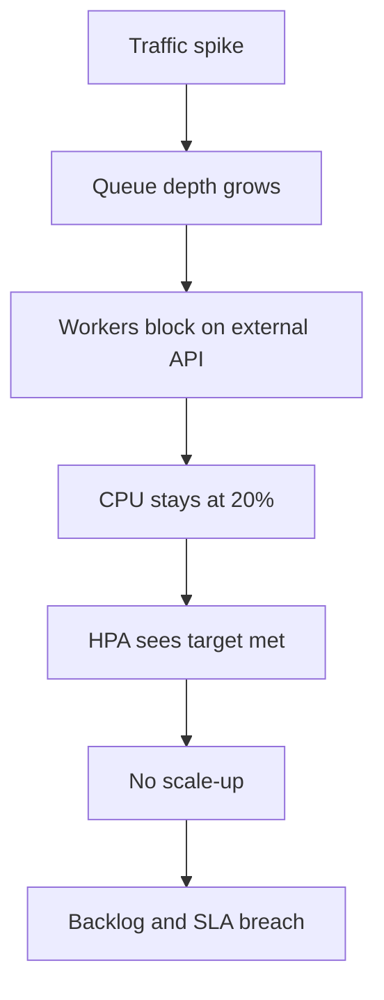
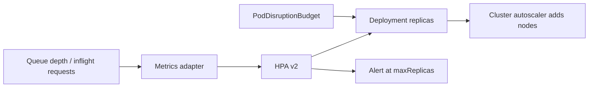

> **Scenario** - A queue worker fleet sits at 20% CPU while 400,000 messages pile up. The HPA targets 70% CPU, so it never scales. The workers are blocked on a slow third-party API, and the backlog clears six hours after the traffic spike ended.

## Why it matters

- Autoscaling on the wrong signal is worse than no autoscaling: it produces confident inaction while the queue grows.
- I/O-bound workloads spend most of their time waiting, so CPU never reflects the actual demand.
- Scaling too late means users have already felt it; scaling too eagerly means flapping, cold caches, and a bigger bill.
- Pod-level scaling is bounded by node capacity - without a cluster autoscaler, the HPA just creates `Pending` pods.

## Symptoms

| Signal | What you observe |
|---|---|
| HPA status | `TARGET: 21%/70%`, `REPLICAS: 4` while the backlog climbs |
| Queue | Consumer lag growing linearly with no matching replica change |
| Latency | Queue wait time dominates, service time flat - a Little's Law signature |
| Replica graph | Sawtooth: 4 to 20 to 4 within ten minutes |
| Scheduler | New pods stuck `Pending` with `Insufficient cpu` |

## How it breaks

CPU utilisation is a *resource* metric, not a *demand* metric. For a worker whose critical resource is concurrency against an external API, CPU stays low no matter how deep the backlog gets. The HPA sees a healthy number and does the correct thing given its inputs - the inputs are wrong.

The mirror-image failure is flapping. With a short stabilisation window and a tight target, one scrape above target adds pods, the extra capacity drops utilisation below target, and the controller removes them again. Each cycle discards warm connection pools and JIT state, which raises latency, which triggers more scaling.



## Root causes

1. Scaling metric is CPU for an I/O-bound or concurrency-bound workload.
2. No stabilisation window or scaling policy, so the controller reacts to a single noisy scrape.
3. `maxReplicas` set below what the traffic pattern actually requires.
4. No cluster autoscaler, so pod scaling silently caps at node capacity.
5. Scale-down as aggressive as scale-up, guaranteeing thrash around the threshold.

## How to solve it

### 1. Pick a signal that expresses demand

Use Little's Law to derive the target: required concurrency = arrival rate × service time. For a queue at 500 msg/s with 200ms processing, you need ~100 concurrent workers.

```yaml
apiVersion: autoscaling/v2
kind: HorizontalPodAutoscaler
metadata:
  name: orders-worker
spec:
  scaleTargetRef:
    apiVersion: apps/v1
    kind: Deployment
    name: orders-worker
  minReplicas: 4
  maxReplicas: 120
  metrics:
    - type: External
      external:
        metric:
          name: rabbitmq_queue_messages_ready
          selector:
            matchLabels: { queue: orders }
        target:
          type: AverageValue
          averageValue: "300"        # messages of backlog per pod
  behavior:
    scaleUp:
      stabilizationWindowSeconds: 30
      policies:
        - type: Percent
          value: 100
          periodSeconds: 30          # at most double every 30s
    scaleDown:
      stabilizationWindowSeconds: 600
      policies:
        - type: Percent
          value: 20
          periodSeconds: 60          # shed slowly
```

Asymmetric behavior is the point: scale up fast, scale down slowly.

### 2. For HTTP services, scale on concurrency or latency

```yaml
metrics:
  - type: Pods
    pods:
      metric: { name: http_inflight_requests }
      target: { type: AverageValue, averageValue: "25" }
```

### 3. Make sure nodes can actually appear

```bash
kubectl get hpa orders-worker -w
kubectl get pods -n prod --field-selector=status.phase=Pending
kubectl describe pod orders-worker-xyz | grep -A5 Events
kubectl get nodes -l workload=workers --show-labels
```

If pods sit `Pending`, the cluster autoscaler or node pool maximum is the real limit.

### 4. Alert on the autoscaler itself

```yaml
- alert: HpaAtMaxReplicas
  expr: kube_horizontalpodautoscaler_status_current_replicas
        >= kube_horizontalpodautoscaler_spec_max_replicas
  for: 15m
```

## Target design



## Tradeoffs

| Option | Pros | Cons | Choose when |
|---|---|---|---|
| CPU-based HPA | Zero extra infrastructure, always available | Blind to I/O-bound demand | Genuinely CPU-bound services like transcoding |
| Queue depth (KEDA/external metric) | Directly tracks backlog, scales to zero | Needs a metrics adapter and broker exporter | Async workers and batch consumers |
| Concurrency / inflight requests | Closest proxy to user-visible latency | Requires instrumentation in the app | HTTP APIs with variable service time |
| Scheduled scaling | Predictable, no lag at known peaks | Blind to unexpected traffic | Strong daily or weekly seasonality |

## Verification checklist

- [ ] A load test that raises queue depth without raising CPU triggers a scale-up within 60s.
- [ ] Replica count during a steady 30-minute load varies by less than 20% (no flapping).
- [ ] `maxReplicas × pod request` fits within the node pool ceiling, or the cluster autoscaler covers it.
- [ ] Scale-down does not violate the PodDisruptionBudget during a rollout.
- [ ] The HPA-at-max alert fires in a game day, and the runbook says what to do.
- [ ] Cold-start time for a new pod is measured and shorter than the stabilisation window.

## Anti-patterns

- Raising `maxReplicas` to 500 without checking node pool quota or downstream database connection limits.
- Scaling on average latency, which lags the incident and can fall as fast requests fail early.
- Setting `minReplicas: 1` for a service with a 90-second cold start.
- Using CPU limits and CPU-based HPA together, so throttled pods report artificially capped utilisation.
- Autoscaling a service whose real bottleneck is a single database - you just add more connections to a saturated server.

## Related

- [OOMKilled and resource limits](/systems/devops-containers/oom-and-resource-limits)
- [Node draining and disruption budgets](/systems/devops-containers/node-draining-and-disruption-budgets)
- [Backpressure in queue-heavy architectures](/systems/messaging-async/backpressure-queue-design)
