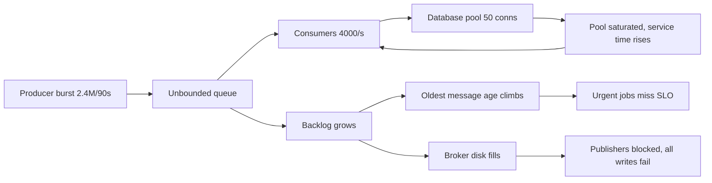
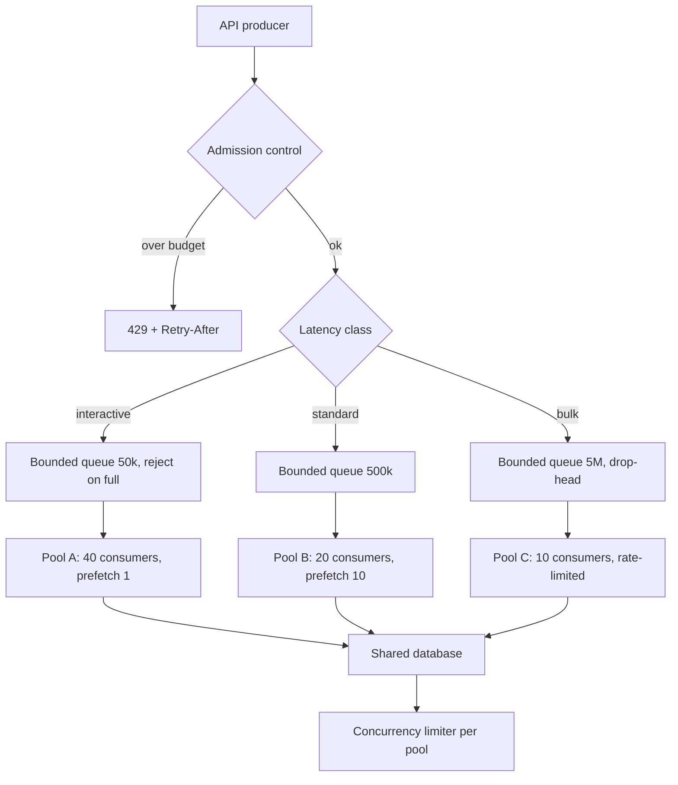

> **Scenario** — একটি marketing send নব্বই সেকেন্ডে ২৪ লক্ষ notification job enqueue করে। Consumer drain করে ৪,০০০/s হারে। Queue healthy, কোনো error নেই, অথচ একই queue ভাগ করা password-reset email দশ মিনিট দেরিতে পৌঁছাতে শুরু করে। দুই ঘণ্টায় broker-এর disk ৯১%।

## Why it matters

- Unbounded queue overload ঠেকায় না; দৃশ্যমান error-কে অদৃশ্য delay-তে বদলায়। User চল্লিশ মিনিট পরের confirmation email-এর চেয়ে ২০০ms-এ 503 বেশি পছন্দ করবে।
- Bulk work-এর সাথে queue ভাগ করা latency-sensitive কাজ bulk-এর backlog উত্তরাধিকার পায়। একটি marketing campaign নীরবে password-reset SLO ভাঙে।
- Backlog মাপা হয় message-এ, কিন্তু user অনুভব করে সময়ে। ৪,০০০/s-এ ৯,০০,০০০ message মানে ২২৫ সেকেন্ড delay; ৪০০/s-এ একই backlog মানে ৩৭ মিনিট। শুধু message count কিছুই বলে না।
- Queue durability সমস্যায় পরিণত হয়। Broker disk ভরলে সে *সব* write নেওয়া বন্ধ করে, যেগুলো ঠিক থাকত সেগুলোসহ।

## Symptoms

| Signal | What you observe |
|---|---|
| Queue depth | পুরো shift জুড়ে একটানা বাড়ে, কখনো শূন্যে নামে না |
| Consumer CPU | ১০০%-এ আটকে, অথবা সন্দেহজনকভাবে idle অথচ depth বাড়ছে |
| Message age | oldest-message-age রৈখিকভাবে বাড়ে; এই metric-ই আসল, depth নয় |
| Latency | Producer p99 অপরিবর্তিত — ব্যথা পুরোটাই consumer দিকে |
| Broker disk | একটানা বাড়ে; RabbitMQ memory/disk alarm তুলে publisher block করে |
| Mixed traffic | একই queue-তে bulk backlog-এর কারণে কম-volume, বেশি-জরুরি job দেরি করে |
| Redelivery | Processing চলাকালে visibility timeout শেষ হয়, ধীর message অনন্তকাল reprocess হয় |

## How it breaks

Queue একটি buffer, আর buffer শুধু *burst* শোষণ করে। গড় arrival rate λ যদি গড় service rate μ-এর চেয়ে বেশি হয় এবং তা টিকে থাকে, backlog অসীম বাড়ে — কোনো queue size তা ঠিক করে না। Queue-র কাজ variance শোষণ করা, deficit নয়।

Delay-র হিসাবটাই দল ভুল করে। Little's Law সরাসরি দেয়: `W = L / λ`। ৯,০০,০০০ message আর ৪,০০০/s drain rate মানে ২২৫ সেকেন্ড অপেক্ষা। Utilisation ρ = λ/μ ১-এর কাছে গেলে queueing delay `1/(1-ρ)` হারে বাড়ে — ৯০% utilisation-এ service time-এর ১০x, ৯৯%-এ ১০০x। Consumer বাড়ানো ততক্ষণই কাজ করে যতক্ষণ তারা shared downstream-এ contend না করে; এরপর μ বাড়া থামে এবং আপনি queue-টাকে database-এর connection pool-এ সরিয়েছেন মাত্র।



`J` থেকে `C`-তে ফেরা loop-টাই বিপজ্জনক: backlog বাড়লে consumer database-এ আরও চাপ দেয়, service time বাড়ে, μ কমে, backlog আরও দ্রুত বাড়ে।

## Root causes

1. Queue depth unbounded, তাই disk না ভরা পর্যন্ত overload-এর কোনো দৃশ্যমান failure point নেই।
2. Bulk ও interactive কাজ একই queue ভাগ করে, ফলে দ্রুততম job-এর SLO ধীরতম job-এর backlog-এর সমান।
3. Producer-এর কোনো rate limit বা admission control নেই; enqueue সবসময় সফল হয়।
4. Consumer concurrency downstream-এর ক্ষমতা নয়, CPU দেখে tune করা।
5. Alert queue *depth*-এ (যে সংখ্যা কেউ ব্যাখ্যা করতে পারে না), message *age*-এ নয় (যা SLO-তে map করে)।
6. Visibility timeout p99 processing time-এর চেয়ে ছোট, তাই ধীর message redeliver হয়ে দুবার process হয়।

## How to solve it

### 1. Feature নয়, latency class অনুযায়ী queue আলাদা করুন

সবচেয়ে বেশি leverage দেওয়া পরিবর্তন। তিনটি queue, তিনটি consumer pool, তিনটি স্বাধীন backlog।

```yaml
# Sizing follows the SLO, not the message volume.
queues:
  interactive:          # password reset, OTP — SLO: p99 under 5s
    max_length: 50_000
    overflow: reject-publish     # fail fast; the caller retries or degrades
    consumers: 40
    prefetch: 1
  standard:             # order confirmations — SLO: p99 under 60s
    max_length: 500_000
    overflow: reject-publish
    consumers: 20
    prefetch: 10
  bulk:                 # marketing sends — SLO: complete within 6h
    max_length: 5_000_000
    overflow: drop-head          # oldest marketing message is the least valuable
    consumers: 10
    prefetch: 100
```

Interactive queue-তে `prefetch: 1` গুরুত্বপূর্ণ: বেশি prefetch একটি consumer-কে এমন message জমিয়ে রাখতে দেয় যা সে কয়েক মিনিট ধরে process করবে না — এটাই head-of-line blocking।

### 2. প্রতিটি queue bound করুন এবং overflow-এর মানে ঠিক করুন

Unbounded queue মানে পরে আরও খারাপভাবে fail করার সিদ্ধান্ত। RabbitMQ, SQS ও Kafka আলাদা ভাষায় বলে, কিন্তু পছন্দ একটাই: producer reject করুন, নয়তো সবচেয়ে পুরোনো message ফেলে দিন।

```python
# Producer-side admission control: check the SLO budget before enqueueing bulk work.
MAX_ACCEPTABLE_AGE_S = {"interactive": 5, "standard": 60, "bulk": 21_600}

def enqueue(queue: str, payload: dict) -> None:
    oldest_age_s = metrics.gauge(f"queue.{queue}.oldest_message_age_seconds")
    if oldest_age_s > MAX_ACCEPTABLE_AGE_S[queue] * 0.8:
        # Shed at the door, where the caller can still degrade gracefully.
        raise QueueOverCapacity(queue, oldest_age_s)
    broker.publish(queue, payload)
```

### 3. Producer পর্যন্ত backpressure পৌঁছে দিন

Synchronous producer-এর জন্য signal হলো `Retry-After` সহ HTTP 429। Stream producer-এর জন্য bounded buffer সহ blocking `send`।

```ts
// Bounded channel: the producer awaits when the buffer is full instead of growing it.
class BoundedQueue<T> {
  private buffer: T[] = []
  private waiters: Array<() => void> = []

  constructor(private readonly capacity: number) {}

  async push(item: T, timeoutMs = 2_000): Promise<void> {
    if (this.buffer.length >= this.capacity) {
      // This await IS the backpressure. It slows the producer to the consumer's rate.
      const admitted = await this.waitForSpace(timeoutMs)
      if (!admitted) throw new BackpressureTimeout()
    }
    this.buffer.push(item)
  }
}
```

### 4. Age ও drain time-এ alert দিন, depth-এ কখনো নয়

```promql
# Time to drain, in seconds. This is what you put in the alert and the runbook.
(
  sum by (queue) (rabbitmq_queue_messages_ready)
)
/
clamp_min(sum by (queue) (rate(rabbitmq_queue_messages_delivered_total[5m])), 1)
```

`oldest_message_age_seconds` queue-র SLO-র ৫০% ছাড়ালে এবং projected drain time SLO ছাড়ালে page করুন। বিশ মিনিটে drain হওয়া ২০ লক্ষ message-এর bulk backlog ঠিক আছে; চার মিনিটে drain হওয়া ৫,০০০ message-এর interactive backlog একটি incident।

### 5. Visibility timeout মাপা p99 থেকে সেট করুন, তারপর heartbeat দিন

Processing p99 যদি 45s হয়, 30s visibility timeout load-এ নিশ্চিতভাবে duplicate কাজ তৈরি করে। অন্তত 2x p99 রাখুন এবং দীর্ঘ handler-এর ভেতর থেকে lease বাড়ান।

## Target design



## Tradeoffs

| Option | Pros | Cons | Choose when |
|---|---|---|---|
| Unbounded queue | Producer কখনো reject হয় না | Failure মানে delay, তারপর ভরা disk, তারপর পূর্ণ outage | Production-এ কখনো নয় |
| Bounded + reject publish | Caller degrade করতে পারে এমন জায়গায় দ্রুত fail | Producer-কে rejection সামলাতে হবে | সত্যিকার SLO সহ interactive কাজ |
| Bounded + drop oldest | সবচেয়ে তাজা data প্রবাহিত থাকে | নীরব data loss; dropped counter ও alert দরকার | Telemetry, metric, presence update |
| Lag দেখে consumer autoscale | প্রকৃত চাহিদা বৃদ্ধি শোষণ করে | Downstream-ও scale করলে তবেই কাজ করে | Stateless consumer, elastic downstream |
| এক queue-তে priority | নতুন infrastructure লাগে না | কম priority starve করে; বেশিরভাগ broker দুর্বলভাবে implement করে | মাত্র দুই class, কম volume |
| Class অনুযায়ী আলাদা queue | পূর্ণ isolation; স্বাধীন tuning | বেশি queue operate ও monitor করতে হয় | Bulk ও interactive মেশানো যেকোনো system |

## Verification checklist

- [ ] প্রতিটি queue-র `max_length` আছে এবং overflow policy সচেতনভাবে নথিভুক্ত।
- [ ] Dashboard-এ `oldest_message_age_seconds` ও projected drain time দেখায়; depth গৌণ।
- [ ] Alert threshold প্রতিটি queue-র SLO থেকে আসে, গোল সংখ্যা থেকে নয়।
- [ ] স্বাভাবিকের ৫x enqueue rate-এর load test API-তে 429 তৈরি করে, বাড়তে থাকা backlog নয়।
- [ ] Visibility timeout মাপা p99-এর অন্তত 2x, এবং দীর্ঘ handler heartbeat দেয়।
- [ ] Interactive ও bulk কাজ প্রমাণযোগ্যভাবে ভিন্ন queue ও ভিন্ন consumer pool ব্যবহার করে।
- [ ] Consumer concurrency downstream connection pool দিয়ে bound করা এবং সেই সংখ্যা লেখা আছে।
- [ ] প্রতিটি `drop-head` queue-র জন্য dropped-message counter ও alert আছে।

## Anti-patterns

- Backlog drain করতে consumer বাড়িয়ে বদলে database ফেলে দেওয়া — queue সরিয়েছেন, ছোট করেননি।
- স্থির threshold-এ queue depth-এ alert দেওয়া; ১ লক্ষ message এক queue-তে স্বাভাবিক, অন্যটিতে বিপর্যয়।
- "সরলতার জন্য" এক queue ব্যবহার করে একটি `priority` field যোগ করা যা broker মূলত উপেক্ষা করে।
- Handler idempotent কিনা না দেখে redelivery থামাতে visibility timeout বাড়ানো।
- λ > μ কাঠামোগত হলেও বাড়তে থাকা backlog-কে capacity সমস্যা ভাবা; shared bottleneck-এ বেশি consumer rate deficit ঠিক করতে পারে না।

## Related

- [The exactly-once delivery illusion](/systems/messaging-async/exactly-once-delivery-illusion)
- [Consumer lag and scaling](/systems/messaging-async/consumer-lag-and-scaling)
- [Queue vs stream selection](/systems/messaging-async/queue-vs-stream-selection)
- [Poison messages and dead letter queues](/systems/messaging-async/poison-message-and-dlq)
- [p99 tail latency and capacity planning](/systems/performance-capacity/p99-tail-latency-planning)
