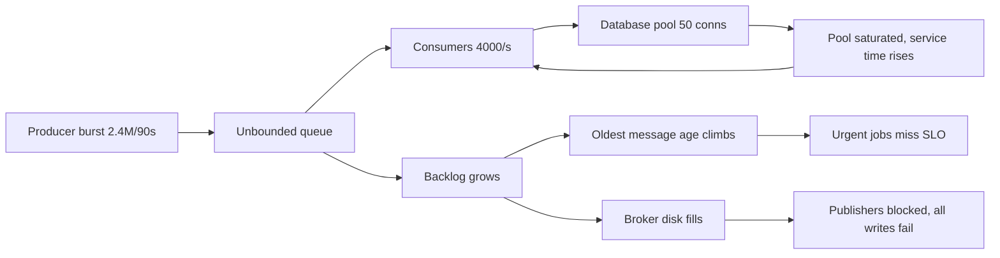
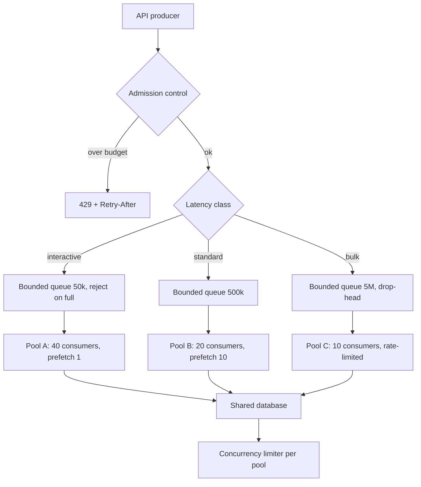

> **Scenario** — A marketing send enqueues 2.4 million notification jobs in ninety seconds. Consumers drain at 4,000/s. The queue is healthy, nothing errors, and password-reset emails — sharing the same queue — start arriving ten minutes late. By hour two the broker's disk is at 91%.

## Why it matters

- An unbounded queue does not prevent overload; it converts a visible error into an invisible delay. Users would rather get a 503 in 200ms than a confirmation email in forty minutes.
- Latency-sensitive work sharing a queue with bulk work inherits the bulk work's backlog. One marketing campaign silently breaks the password-reset SLO.
- Backlog is measured in messages, but users experience it in time. 900,000 messages at 4,000/s is 225 seconds of delay; the same backlog at 400/s is 37 minutes. The message count alone tells you nothing.
- Queues turn into durability problems. When the broker fills its disk it stops accepting *all* writes, including the ones that would have been fine.

## Symptoms

| Signal | What you observe |
|---|---|
| Queue depth | Monotonically increasing across a whole shift, never draining to zero |
| Consumer CPU | Pinned at 100%, or suspiciously idle while depth grows |
| Message age | Oldest-message-age climbs linearly; this is the metric that matters, not depth |
| Latency | Producer p99 unchanged — the pain is entirely on the consumer side |
| Broker disk | Steady climb; RabbitMQ raises a memory/disk alarm and blocks publishers |
| Mixed traffic | Low-volume, high-urgency jobs delayed by a bulk backlog on the same queue |
| Redeliveries | Visibility timeouts expire mid-processing, so slow messages are reprocessed forever |

## How it breaks

A queue is a buffer, and a buffer only absorbs *bursts*. If the mean arrival rate λ exceeds the mean service rate μ for any sustained period, the backlog grows without bound — no queue size fixes that. The queue's job is to absorb variance, not deficit.

The delay is the part teams get wrong. Little's Law gives it directly: `W = L / λ`. With 900,000 messages queued and a drain rate of 4,000/s, the wait is 225 seconds. When utilisation ρ = λ/μ approaches 1, queueing delay grows as `1/(1-ρ)` — at 90% utilisation you wait 10x the service time; at 99% you wait 100x. Adding consumers helps only until they contend on a shared downstream, at which point μ stops rising and you have moved the queue into the database's connection pool.



The loop from `J` back to `C` is the dangerous one: as the backlog grows, consumers push harder on the database, service time rises, μ falls, and the backlog grows faster.

## Root causes

1. Queue depth is unbounded, so overload has no visible failure point until the disk fills.
2. Bulk and interactive work share a queue, so the SLO of the fastest job equals the backlog of the slowest.
3. Producers have no rate limit and no admission control; enqueue always succeeds.
4. Consumer concurrency is tuned to CPU, not to the downstream's capacity.
5. Alerts are on queue *depth* (a number nobody can interpret) rather than message *age* (which maps to the SLO).
6. Visibility timeout is shorter than the p99 processing time, so slow messages are redelivered and processed twice.

## How to solve it

### 1. Separate queues by latency class, not by feature

The single highest-leverage change. Three queues, three consumer pools, three independent backlogs.

```yaml
# Sizing follows the SLO, not the message volume.
queues:
  interactive:          # password reset, OTP — SLO: p99 under 5s
    max_length: 50_000
    overflow: reject-publish     # fail fast; the caller retries or degrades
    consumers: 40
    prefetch: 1
  standard:             # order confirmations — SLO: p99 under 60s
    max_length: 500_000
    overflow: reject-publish
    consumers: 20
    prefetch: 10
  bulk:                 # marketing sends — SLO: complete within 6h
    max_length: 5_000_000
    overflow: drop-head          # oldest marketing message is the least valuable
    consumers: 10
    prefetch: 100
```

`prefetch: 1` on the interactive queue matters: a high prefetch lets one consumer hoard messages it will not process for minutes, which is head-of-line blocking with extra steps.

### 2. Bound every queue and decide what overflow means

An unbounded queue is a decision to fail later and worse. RabbitMQ, SQS, and Kafka all express this differently, but the choice is the same: reject the producer, or drop the oldest message.

```python
# Producer-side admission control: check the SLO budget before enqueueing bulk work.
MAX_ACCEPTABLE_AGE_S = {"interactive": 5, "standard": 60, "bulk": 21_600}

def enqueue(queue: str, payload: dict) -> None:
    oldest_age_s = metrics.gauge(f"queue.{queue}.oldest_message_age_seconds")
    if oldest_age_s > MAX_ACCEPTABLE_AGE_S[queue] * 0.8:
        # Shed at the door, where the caller can still degrade gracefully.
        raise QueueOverCapacity(queue, oldest_age_s)
    broker.publish(queue, payload)
```

### 3. Propagate backpressure to the producer

For synchronous producers, the signal is HTTP 429 with `Retry-After`. For stream producers, it is a blocking `send` with a bounded buffer.

```ts
// Bounded channel: the producer awaits when the buffer is full instead of growing it.
class BoundedQueue<T> {
  private buffer: T[] = []
  private waiters: Array<() => void> = []

  constructor(private readonly capacity: number) {}

  async push(item: T, timeoutMs = 2_000): Promise<void> {
    if (this.buffer.length >= this.capacity) {
      // This await IS the backpressure. It slows the producer to the consumer's rate.
      const admitted = await this.waitForSpace(timeoutMs)
      if (!admitted) throw new BackpressureTimeout()
    }
    this.buffer.push(item)
  }
}
```

### 4. Alert on age and drain time, never on depth

```promql
# Time to drain, in seconds. This is what you put in the alert and the runbook.
(
  sum by (queue) (rabbitmq_queue_messages_ready)
)
/
clamp_min(sum by (queue) (rate(rabbitmq_queue_messages_delivered_total[5m])), 1)
```

Page when `oldest_message_age_seconds` exceeds 50% of the queue's SLO, and when projected drain time exceeds the SLO. A 2-million-message bulk backlog draining in twenty minutes is fine; a 5,000-message interactive backlog draining in four minutes is an incident.

### 5. Set the visibility timeout from measured p99, then heartbeat

If processing p99 is 45s, a 30s visibility timeout guarantees duplicate work under load. Set it to at least 2x p99 and extend the lease from inside long handlers.

## Target design



## Tradeoffs

| Option | Pros | Cons | Choose when |
|---|---|---|---|
| Unbounded queue | Never rejects a producer | Failure is delay, then a full disk, then total outage | Never in production |
| Bounded + reject publish | Fails fast where the caller can degrade | Producer must handle rejection | Interactive work with a real SLO |
| Bounded + drop oldest | Keeps the freshest data flowing | Silent data loss; needs a dropped counter and alert | Telemetry, metrics, presence updates |
| Autoscale consumers on lag | Absorbs genuine demand growth | Only works if the downstream also scales; often just moves the queue | Stateless consumers, elastic downstream |
| Priority within one queue | No new infrastructure | Starvation of low priority; most brokers implement it poorly | Two classes only, low volume |
| Separate queues per class | Full isolation; independent tuning | More queues to operate and monitor | Any system mixing bulk and interactive |

## Verification checklist

- [ ] Every queue has a `max_length` and a documented, deliberate overflow policy.
- [ ] Dashboards show `oldest_message_age_seconds` and projected drain time; depth is secondary.
- [ ] Alert thresholds are derived from each queue's SLO, not from a round number of messages.
- [ ] A load test at 5x normal enqueue rate produces 429s at the API, not a growing backlog.
- [ ] Visibility timeout is at least 2x measured p99 processing time, and long handlers heartbeat.
- [ ] Interactive and bulk work provably use different queues and different consumer pools.
- [ ] Consumer concurrency is bounded by the downstream connection pool, and that number is written down.
- [ ] A dropped-message counter exists and is alerted on for every `drop-head` queue.

## Anti-patterns

- Scaling consumers to drain a backlog and taking the database down instead — you moved the queue, you did not shrink it.
- Alerting on queue depth with a fixed threshold; 100k messages is fine for one queue and catastrophic for another.
- Using one queue "for simplicity" and adding a `priority` field the broker mostly ignores.
- Raising the visibility timeout to stop redeliveries without checking whether the handler is idempotent.
- Treating a growing backlog as a capacity problem when λ > μ structurally; more consumers cannot fix a rate deficit at a shared bottleneck.

## Related

- [The exactly-once delivery illusion](/systems/messaging-async/exactly-once-delivery-illusion)
- [Consumer lag and scaling](/systems/messaging-async/consumer-lag-and-scaling)
- [Queue vs stream selection](/systems/messaging-async/queue-vs-stream-selection)
- [Poison messages and dead letter queues](/systems/messaging-async/poison-message-and-dlq)
- [p99 tail latency and capacity planning](/systems/performance-capacity/p99-tail-latency-planning)
