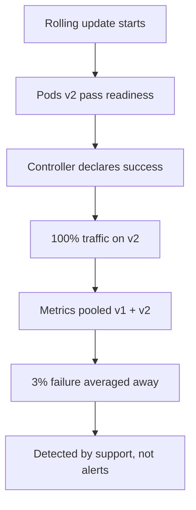
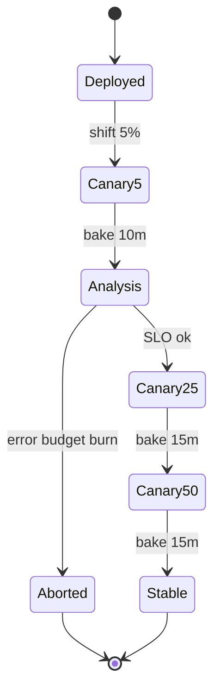

> **পরিস্থিতি** — একটা checkout release staging পাস করে চার মিনিটে ১০০%-এ চলে যায়। বিশ মিনিট পর support জানায় শুধু একটি card issuer-এর payment fail করছে। Bug-টি ৩% traffic-কে ছুঁয়েছিল, কিন্তু কেউ টের পাওয়ার আগেই প্রতিটি pod নতুন build চালাচ্ছে।

## কেন গুরুত্বপূর্ণ

- Blast radius একটা design সিদ্ধান্ত। সরাসরি ১০০%-এ ship করা মানে পুরো error budget একটা অপরীক্ষিত build-এর হাতে তুলে দেওয়া।
- Detection-এর জন্য traffic *এবং* সময় দুটোই লাগে। metric scrape ও alert window-এর চেয়ে দ্রুত rollout সংজ্ঞাগতভাবেই অপরীক্ষণীয়।
- Rollback-এর গতি খুব আলাদা: blue-green সেকেন্ডে selector flip করে, rolling update-কে প্রতিটি pod আবার pull ও restart করতে হয়।
- খরচও আলাদা — blue-green-এ release window-এ দ্বিগুণ capacity লাগে, canary-তে প্রায় ১০% বাড়তি।

## লক্ষণ

| Signal | যা দেখবেন |
|---|---|
| Incident timeline | rollout শেষ হওয়ার ১৫-৪০ মিনিট পর bug ধরা পড়ে |
| Error rate | পরিষ্কার spike নয়, ছোট স্থায়ী bump (০.৫-৩%) যা alert threshold-এর নিচে লুকায় |
| Rollback | সব pod restart লাগে বলে `kubectl rollout undo`-তে ৫-৮ মিনিট |
| Deploy log | নতুন pod-এর প্রথম Prometheus scrape-এর আগেই rollout শেষ |
| Support | Failure এক region, এক client version বা এক payment provider-এ কেন্দ্রীভূত |

## কীভাবে ভাঙে

Default `RollingUpdate` canary নয়। এটি ঢেউয়ে ঢেউয়ে pod বদলায়, মাঝখানে কোনো analysis নেই, আর Deployment controller-এর একমাত্র সাফল্যের মাপকাঠি "নতুন pod Ready হয়েছে"। Ready মানে probe পাস করেছে, order এখনো সম্পন্ন হচ্ছে তা নয়।

আরও খারাপ: rolling update-এর সময় দুই version একসাথে traffic serve করে অথচ তুলনার উপায় নেই — v1 ও v2-র metric একই Service-এ মিশে যায়, তাই ৩% failure সুস্থ দেখানো dashboard-এ গড় হয়ে মিলিয়ে যায়।



## মূল কারণ

1. Readiness-কে correctness-এর বিকল্প ধরা হয়।
2. Metric-এ version label নেই, তাই per-version তুলনা অসম্ভব।
3. `maxSurge`/`maxUnavailable` গতির জন্য tune করা, ফলে এক scrape interval-এই পুরো fleet বদলে যায়।
4. Traffic increment-এর মাঝে কোনো স্বয়ংক্রিয় bake time বা analysis step নেই।
5. Rollback-এ rebuild বা পূর্ণ restart লাগে, তাই operator দ্বিধা করে এবং forward debug করতে যায়।

## কীভাবে সমাধান করবেন

### ১. Version label সহ metric পাঠান

```ts
httpRequests.inc({ route, status, version: process.env.APP_VERSION ?? 'unknown' })
```

এই label ছাড়া canary analysis সম্ভব নয় — স্বয়ংক্রিয় হোক বা মানুষের।

### ২. স্বয়ংক্রিয় analysis সহ canary

```yaml
apiVersion: argoproj.io/v1alpha1
kind: Rollout
metadata:
  name: checkout
spec:
  replicas: 20
  strategy:
    canary:
      canaryService: checkout-canary
      stableService: checkout-stable
      steps:
        - setWeight: 5
        - pause: { duration: 10m }
        - analysis:
            templates: [{ templateName: error-rate }]
        - setWeight: 25
        - pause: { duration: 15m }
        - setWeight: 50
        - pause: { duration: 15m }
        - setWeight: 100
```

```yaml
apiVersion: argoproj.io/v1alpha1
kind: AnalysisTemplate
metadata:
  name: error-rate
spec:
  metrics:
    - name: http-5xx-ratio
      interval: 1m
      failureLimit: 2
      successCondition: result[0] < 0.01
      provider:
        prometheus:
          address: http://prometheus.monitoring:9090
          query: |
            sum(rate(http_requests_total{app="checkout",version="{{args.canary-hash}}",status=~"5.."}[2m]))
              / sum(rate(http_requests_total{app="checkout",version="{{args.canary-hash}}"}[2m]))
```

### ৩. Atomic flip দরকার হলে blue-green

```bash
kubectl apply -f deploy/checkout-green.yaml
kubectl rollout status deploy/checkout-green --timeout=5m
# smoke test green directly, bypassing the public Service
kubectl run smoke --rm -it --image=curlimages/curl -- \
  curl -fsS http://checkout-green:8080/readyz
# atomic cutover
kubectl patch service checkout -p '{"spec":{"selector":{"app":"checkout","slot":"green"}}}'
# instant rollback: patch the selector back to blue
```

### ৪. Rollback window-এ পুরনো version জীবিত রাখুন

অন্তত একটি পূর্ণ alert window (সাধারণত ৩০-৬০ মিনিট) blue-কে zero-এ scale করবেন না। এক ঘণ্টার capacity একটা incident-এর চেয়ে সস্তা।

## কাঙ্ক্ষিত ডিজাইন



## Tradeoff

| Option | সুবিধা | খরচ | কখন বেছে নেবেন |
|---|---|---|---|
| Rolling update | বাড়তি capacity লাগে না, Kubernetes-এ built-in | per-version analysis নেই, rollback ধীর | কম ঝুঁকির internal service |
| Analysis সহ canary | ছোট blast radius, স্বয়ংক্রিয় abort | traffic volume ও version-labelled metric লাগে | বেশি traffic-এর user-facing path |
| Blue-green | তাৎক্ষণিক cutover ও rollback, traffic-এর আগে test | ২x capacity, stateful schema change-এ কঠিন | ঝুঁকিপূর্ণ config বা infra পরিবর্তনযুক্ত release |
| Feature flag release | deploy ও release আলাদা, per-user targeting | flag debt, code path বেড়ে যায় | infra নয়, behavioural পরিবর্তন |

## যাচাই checklist

- [ ] গত ২৪ ঘণ্টার error rate Prometheus version label দিয়ে ভাগ করা যায়।
- [ ] ইচ্ছাকৃত ভাঙা canary bake window-এর মধ্যেই স্বয়ংক্রিয়ভাবে abort হয়।
- [ ] ১০০% canary থেকে stable-এ rollback end-to-end ৬০ সেকেন্ডের নিচে মাপা।
- [ ] Bake time দুইটি scrape interval + alert-এর `for:` সময়ের চেয়ে বড়।
- [ ] Blue-green smoke test public Service নয়, সরাসরি নিষ্ক্রিয় slot-এ যায়।
- [ ] Runbook-এ লেখা আছে কে এবং কীভাবে rollout abort করবে, CI access ছাড়াই।

## Anti-pattern

- Pod ঢেউয়ে ঢেউয়ে যায় বলে rolling update-কে canary বলা।
- ৬০ সেকেন্ডের bake time, যা নিশ্চিত করে analysis কোনো অর্থবহ sample পাবে না।
- CPU ও memory দেখে canary করা, যার কোনোটাই ভুল দাম বা fail হওয়া payment ধরে না।
- আলাদা hardware-এর "canary node pool"-এ canary চালানো, তারপর noise-কে দোষ দেওয়া।
- নতুন ReplicaSet Ready হওয়ামাত্র পুরনোটা zero-এ scale করা, অর্থাৎ দ্রুততম rollback মুছে ফেলা।

## সম্পর্কিত

- [Rollback versus forward fix](/systems/devops-containers/rollback-vs-forward-fix)
- [Kubernetes rollout failure modes](/systems/devops-containers/k8s-rollout-failure-modes)
- [Database migrations in the deploy pipeline](/systems/devops-containers/migrations-in-the-deploy-pipeline)
