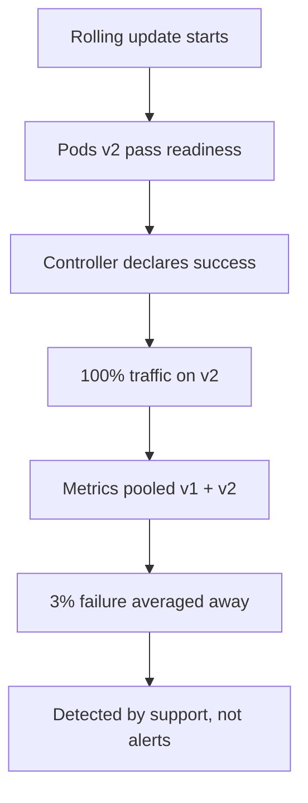
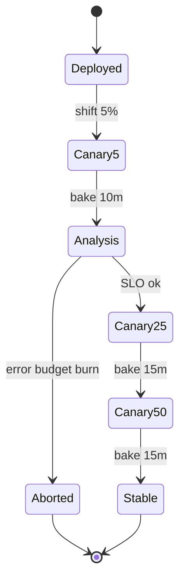

> **Scenario** - A checkout release passes staging and rolls out to 100% in four minutes. Twenty minutes later, support reports failed payments for one card issuer only. The bug affected 3% of traffic, but by the time anyone noticed, every pod was running the new build.

## Why it matters

- Blast radius is a design choice. Shipping to 100% instantly means 100% of the error budget is exposed to an unproven build.
- Detection needs traffic *and* time. A rollout faster than your metric scrape and alert window is untestable by definition.
- Rollback speed differs sharply: blue-green flips a selector in seconds, a rolling update must re-pull and restart every pod.
- Cost differs too - blue-green needs double capacity for the release window, canary needs about 10% extra.

## Symptoms

| Signal | What you observe |
|---|---|
| Incident timeline | Bug detected 15-40 minutes after a rollout already completed |
| Error rate | Small persistent bump (0.5-3%) rather than a clean spike, hiding under alert thresholds |
| Rollback | `kubectl rollout undo` takes 5-8 minutes because all pods must restart |
| Deploy log | Rollout finished before the first Prometheus scrape of the new pods |
| Support | Failures concentrated in one region, one client version, or one payment provider |

## How it breaks

A default `RollingUpdate` is not a canary. It replaces pods in waves with no analysis between them, and the Deployment controller's only success criterion is "the new pods became Ready". Ready means the probe passed, not that orders are still completing.

Worse, during a rolling update both versions serve traffic simultaneously with no way to compare them - the metrics of v1 and v2 are pooled in the same Service, so the 3% failure is averaged into a healthy-looking dashboard.



## Root causes

1. Readiness is treated as a proxy for correctness.
2. No version label on metrics, so per-version comparison is impossible.
3. `maxSurge`/`maxUnavailable` tuned for speed, so the whole fleet turns over in one scrape interval.
4. No automated bake time or analysis step between traffic increments.
5. Rollback requires a rebuild or a full restart, so operators hesitate and try to debug forward instead.

## How to solve it

### 1. Emit version-labelled metrics

```ts
httpRequests.inc({ route, status, version: process.env.APP_VERSION ?? 'unknown' })
```

Without this label, no canary analysis is possible - automated or human.

### 2. Canary with automated analysis

```yaml
apiVersion: argoproj.io/v1alpha1
kind: Rollout
metadata:
  name: checkout
spec:
  replicas: 20
  strategy:
    canary:
      canaryService: checkout-canary
      stableService: checkout-stable
      steps:
        - setWeight: 5
        - pause: { duration: 10m }
        - analysis:
            templates: [{ templateName: error-rate }]
        - setWeight: 25
        - pause: { duration: 15m }
        - setWeight: 50
        - pause: { duration: 15m }
        - setWeight: 100
```

```yaml
apiVersion: argoproj.io/v1alpha1
kind: AnalysisTemplate
metadata:
  name: error-rate
spec:
  metrics:
    - name: http-5xx-ratio
      interval: 1m
      failureLimit: 2
      successCondition: result[0] < 0.01
      provider:
        prometheus:
          address: http://prometheus.monitoring:9090
          query: |
            sum(rate(http_requests_total{app="checkout",version="{{args.canary-hash}}",status=~"5.."}[2m]))
              / sum(rate(http_requests_total{app="checkout",version="{{args.canary-hash}}"}[2m]))
```

### 3. Blue-green when you need an atomic flip

```bash
kubectl apply -f deploy/checkout-green.yaml
kubectl rollout status deploy/checkout-green --timeout=5m
# smoke test green directly, bypassing the public Service
kubectl run smoke --rm -it --image=curlimages/curl -- \
  curl -fsS http://checkout-green:8080/readyz
# atomic cutover
kubectl patch service checkout -p '{"spec":{"selector":{"app":"checkout","slot":"green"}}}'
# instant rollback: patch the selector back to blue
```

### 4. Keep the old version alive for the rollback window

Do not scale blue to zero for at least one full alert window (typically 30-60 minutes). Capacity for an hour is cheaper than an incident.

## Target design



## Tradeoffs

| Option | Pros | Cons | Choose when |
|---|---|---|---|
| Rolling update | No extra capacity, built into Kubernetes | No per-version analysis, slow rollback | Low-risk internal services |
| Canary with analysis | Small blast radius, automated abort | Needs traffic volume and version-labelled metrics | High-traffic user-facing paths |
| Blue-green | Instant cutover and rollback, test before traffic | 2x capacity, hard with stateful schema changes | Releases coupled to risky config or infra changes |
| Feature flag release | Decouples deploy from release, per-user targeting | Flag debt, code paths multiply | Behavioural changes rather than infra changes |

## Verification checklist

- [ ] Prometheus can split error rate by version label for the last 24 hours.
- [ ] A deliberately broken canary is aborted automatically within the bake window.
- [ ] Rollback from 100% canary to stable measured end-to-end in under 60 seconds.
- [ ] Bake time exceeds two scrape intervals plus the alert `for:` duration.
- [ ] Blue-green smoke tests hit the inactive slot directly, not through the public Service.
- [ ] The runbook names who can abort a rollout and how, without needing CI access.

## Anti-patterns

- Calling a rolling update a canary because the pods roll out in waves.
- A 60-second bake time, which guarantees the analysis sees no meaningful sample.
- Canarying on CPU and memory, neither of which detects wrong prices or failed payments.
- Running the canary on a dedicated "canary node pool" with different hardware, then blaming the noise.
- Scaling the old ReplicaSet to zero the moment the new one is Ready, deleting your fastest rollback.

## Related

- [Rollback versus forward fix](/systems/devops-containers/rollback-vs-forward-fix)
- [Kubernetes rollout failure modes](/systems/devops-containers/k8s-rollout-failure-modes)
- [Database migrations in the deploy pipeline](/systems/devops-containers/migrations-in-the-deploy-pipeline)
