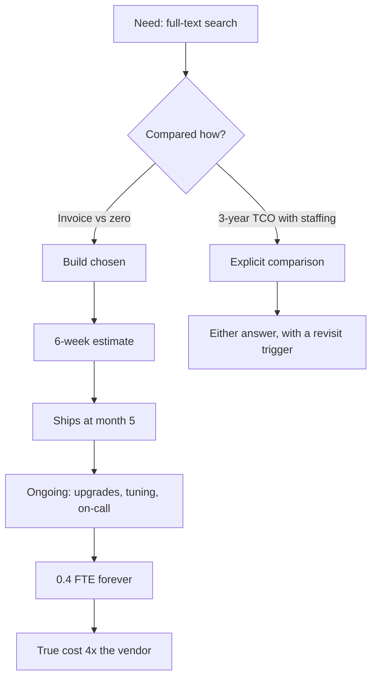
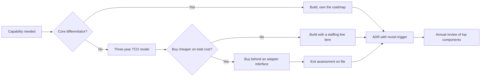

> **Scenario** - একটি দল মাসে $2,400-এর search vendor বাদ দিয়ে Elasticsearch-এ নিজেরা বানানোর সিদ্ধান্ত নেয়, বাজেট ছয় সপ্তাহ। চৌদ্দ মাস পর দুই engineer-এর প্রায় ২০% সময় যায় cluster upgrade, relevance tuning আর বারবার আসা রাত ৩টার disk-watermark page-এ। সরাসরি infrastructure খরচ মাসে $900। পুরোপুরি হিসাব করলে খরচ প্রায় $9,000।

## Why it matters

- দল আসলে যে তুলনাটা করে তা হলো "vendor invoice বনাম শূন্য", কারণ engineering সময় তো payroll-এ আগেই আছে। এই framing প্রায় প্রতিবারই ভুল উত্তর দেয়।
- Operational load-ই সেই খরচ যা জমতে থাকে। যে কেনা component একটা pager rotation মুছে দেয় তার দাম invoice-এর চেয়ে বেশি; যে বানানো component একটা rotation যোগ করে তার খরচ infrastructure-এর চেয়ে বেশি।
- Exit cost ঠিক করে সিদ্ধান্তটা কতটা ফেরানো যায়। যে vendor দুই সপ্তাহে ছাড়া যায় সেটা ভাড়া; যার data model আপনার schema-জুড়ে ছড়িয়েছে সেটা বিয়ে।
- Founder-দের জন্য: যার জন্য customer টাকা দেয় তা বানান, যা কাজ করবে বলে ধরে নেয় তা কিনুন। নিজের feature-flag service লিখেছেন বলে কেউ আপনার product বাছেনি।
- দুই দিকেই failure mode আছে। Commodity infrastructure বানালে দল পুড়ে যায়; core differentiator-এ vendor বসালে product-এর সীমা vendor ঠিক করে দেয়।

## Symptoms

| Signal | What you observe |
|---|---|
| Estimate drift | ছয় সপ্তাহের build পঞ্চম মাসে, সাথে "known limitation"-এর তালিকা |
| লুকানো staffing | কেউ পরিকল্পনা করেনি এমন component-এ এক-দুই engineer স্থায়ীভাবে আটকে |
| Pager attribution | বারবার আসা page এমন infrastructure-এর যা দল নিজে owning বেছেছে |
| Vendor sprawl | নয়টি SaaS tool, তিনটি overlapping, কারোরই নামসহ owner নেই |
| Lock-in চমক | সরে যেতে ৪০টি file ছুঁতে হয়, কারণ vendor-এর type সর্বত্র ছড়িয়েছে |
| Decision amnesia | কেন সিদ্ধান্ত হয়েছিল বা কী বদলালে বদলাবে - কেউ বলতে পারে না |

## How it breaks

Build-বনাম-buy আসলে total-cost-of-ownership-এর প্রশ্ন, কিন্তু উত্তর দেওয়া হয় sticker-price-এর প্রশ্ন হিসেবে। Build দিক নিয়মিতভাবে বাদ দেয় maintenance, on-call, upgrade, security patching, bus-factor-এর জন্য দ্বিতীয় engineer, আর যে feature ship হলো না তার opportunity cost। Buy দিক বাদ দেয় integration কাজ, data egress, vendor দাম বদলালে migration খরচ, আর vendor অধিগৃহীত হওয়ার ঝুঁকি।

আরেকটি কাঠামোগত ভুল হলো একবার সিদ্ধান্ত নিয়ে আর কখনো না দেখা। ২০ customer-এ সঠিক build ২,০০০-এ ভুল হতে পারে, আর ৫০GB-তে সস্তা vendor ৫TB-তে বাজেট line। লিখিত trigger ছাড়া সিদ্ধান্ত কেবল সংকটের সময় পুনর্বিবেচনা হয় - migration চালানোর সবচেয়ে খারাপ সময়।



## Root causes

1. Engineering সময়কে বিনামূল্যে ধরা, কারণ সেটা তো payroll-এ আছেই।
2. তিন বছরের horizon নেই: তুলনা শুধু build sprint নিয়ে, রক্ষণাবেক্ষণের দশক নিয়ে নয়।
3. Exit cost কখনো হিসাব হয় না, তাই lock-in ধরা পড়ে migration-এর সময়।
4. Vendor বিচার হয় feature দিয়ে, সে যত operational load সরায় তা দিয়ে নয়।
5. Revisit trigger নেই, তাই scale বদলালে সঠিক সিদ্ধান্ত নীরবে ভুল হয়ে যায়।
6. Status: infrastructure বানানো vendor integrate করার চেয়ে আকর্ষণীয়, আর আকর্ষণ কোনো business case নয়।

## How to solve it

### 1. তিন বছরের cost model কোডে লিখে ফেলুন

```python
# tco.py - run it, argue with the inputs, not with intuition.
LOADED_HOURLY = 95  # salary + benefits + overhead, per engineer-hour

def build_cost(
    dev_weeks: float,
    engineers: int,
    ops_hours_per_month: float,
    infra_per_month: float,
    years: int = 3,
) -> float:
    build = dev_weeks * engineers * 40 * LOADED_HOURLY
    run = years * 12 * (ops_hours_per_month * LOADED_HOURLY + infra_per_month)
    return build + run

def buy_cost(
    license_per_month: float,
    integration_weeks: float,
    ops_hours_per_month: float,
    years: int = 3,
) -> float:
    integrate = integration_weeks * 40 * LOADED_HOURLY
    run = years * 12 * (license_per_month + ops_hours_per_month * LOADED_HOURLY)
    return integrate + run

# The scenario above, with honest inputs:
print(build_cost(dev_weeks=20, engineers=2, ops_hours_per_month=64, infra_per_month=900))
print(buy_cost(license_per_month=2400, integration_weeks=2, ops_hours_per_month=4))
```

`ops_hours_per_month` নিজের ইতিহাস থেকে বের করুন: আপনি ইতিমধ্যে চালান এমন component-এর page, upgrade window ও tuning ticket গুনুন, তারপর সেই সংখ্যাটাই ব্যবহার করুন - আশাবাদী অনুমান নয়।

### 2. তুলনার আগে component-এর শ্রেণি ঠিক করুন

| Class | Definition | Default |
|---|---|---|
| Core differentiator | এর জন্যই customer আপনাকে বাছে | Build |
| Supporting | দরকারি, কিন্তু কেউ এ নিয়ে vendor তুলনা করে না | Buy |
| Commodity | সবার লাগে, standard আছে | Buy |
| Regulated | Compliance নিয়ন্ত্রণ ও residency ঠিক করে | Engineer নয়, auditor-এর উপর নির্ভর |

Legal research product-এর search relevance core। Internal admin panel-এর search commodity। আপনি কী বিক্রি করছেন তার উপর নির্ভর করে একই technology রেখার দুই পাশে পড়ে।

### 3. সই করার আগে exit-এর দাম হিসাব করুন

```md
## Exit assessment: <vendor>

- Data export: format, completeness, and how long a full export takes today.
- Coupling surface: number of modules importing vendor types (measure it, do not guess).
- Replacement: is there a second vendor with a compatible interface, or is this bespoke?
- Estimated migration: engineer-weeks, based on the coupling surface above.
- Contract: notice period, price-increase cap, data-deletion terms.
```

Vendor-কে নিজের interface-এর পেছনে রাখুন যাতে coupling surface এক module-এ থাকে:

```ts
// One adapter, one seam. Swapping vendors touches this file and nothing else.
export interface SearchProvider {
  index(docs: SearchDoc[]): Promise<void>
  query(q: string, opts: QueryOptions): Promise<SearchHit[]>
}

export class VendorSearch implements SearchProvider { /* ... */ }
export class SelfHostedSearch implements SearchProvider { /* ... */ }
```

### 4. ছয় মাসের build নয়, দুই সপ্তাহের bounded spike চালান

সত্যিই বুঝতে না পারলে আসল dataset ও আসল load profile-এর বিরুদ্ধে timeboxed spike করুন। Spike শুরুর আগেই exit criterion লিখুন: নির্দিষ্ট latency, নির্দিষ্ট recall, নির্দিষ্ট operational effort। লিখিত exit criterion ছাড়া spike-ই implementation হয়ে যায়।

### 5. Revisit trigger সহ সিদ্ধান্ত লিখে রাখুন

ADR ব্যবহার করুন। Revisit trigger এমন সংখ্যা হোক যা কেউ সত্যিই দেখবে: "index ৫০০GB ছাড়ালে, search-এর on-call page মাসে দুইয়ের বেশি হলে, বা vendor-এর list price মাসে $6,000 ছাড়ালে পুনর্বিবেচনা।"

### 6. শীর্ষ তিনটি component-এ প্রতি বছর model আবার চালান

Component-প্রতি পনেরো মিনিট, বছরে একবার, বর্তমান সংখ্যা দিয়ে। বেশিরভাগ বদলাবে না। যেটা বদলাবে সেটাই meeting-এর খরচের চেয়ে বেশি বাঁচাবে।

## Target design



## Tradeoffs

| Option | Pros | Cons | Choose when |
|---|---|---|---|
| নিজে বানানো | নিখুঁত fit, per-seat খরচ নেই, পূর্ণ নিয়ন্ত্রণ | স্থায়ী staffing ও on-call; opportunity cost | এই সক্ষমতার জন্যই customer টাকা দেয় |
| SaaS কেনা | দ্রুত, on-call vendor-এর, খরচ অনুমেয় | Lock-in, দামের ঝুঁকি, data residency প্রশ্ন | Supporting বা commodity সক্ষমতা |
| Open source self-host | Licence খরচ নেই, source access, vendor ঝুঁকি নেই | Upgrade, security patch ও pager আপনার | শক্ত ops সক্ষমতা ও স্থিতিশীল প্রয়োজন |
| আগে কিনুন, পরে বানান | এখনই ship, সিদ্ধান্ত পিছিয়ে | Migration খরচ আসল আর প্রায়ই চিরকাল পেছায় | অনিশ্চিত প্রয়োজন, adapter boundary আছে |

## Verification checklist

- [ ] সিদ্ধান্তের জন্য লিখিত তিন বছরের TCO model আছে, loaded hourly cost ও ops hour স্পষ্ট input হিসেবে।
- [ ] Build option-এর `ops_hours_per_month` আপনি চালান এমন তুলনীয় component থেকে নেওয়া।
- [ ] Component-কে core, supporting, commodity বা regulated হিসেবে শ্রেণিবদ্ধ করা এবং লেখা আছে।
- [ ] Critical path-এর প্রতিটি vendor-এর exit assessment আছে।
- [ ] Vendor-এর type ঠিক একটি module-এ আছে; SDK import grep করে যাচাই করুন।
- [ ] ADR-এ সংখ্যাসহ revisit trigger ও পরবর্তী review-এর তারিখ আছে।

## Anti-patterns

- Engineer-দের বেতন তো দেওয়াই আছে বলে vendor invoice-কে শূন্যের সাথে তুলনা করা।
- Commodity infrastructure - queue, flag, auth, search - বানানো কারণ সেটা product-এর কাজের চেয়ে মজার।
- Core differentiator-এর মালিক এমন vendor কেনা, যাতে product-এর সীমা vendor-এর roadmap হয়ে যায়।
- SDK-র type কোডবেসজুড়ে ছড়াতে দেওয়া, ফলে প্রতি sprint-এ exit cost নীরবে বাড়ে।
- ছয় সপ্তাহের estimate-কে খরচ ধরা, যখন আসল খরচ রক্ষণাবেক্ষণের দশক।

## Related

- [Architecture decision records that get read](/systems/product-platform/architecture-decision-records)
- [Running an internal platform as a product](/systems/product-platform/internal-platform-as-product)
- [Cost attribution and showback](/systems/product-platform/cost-attribution-and-showback)
