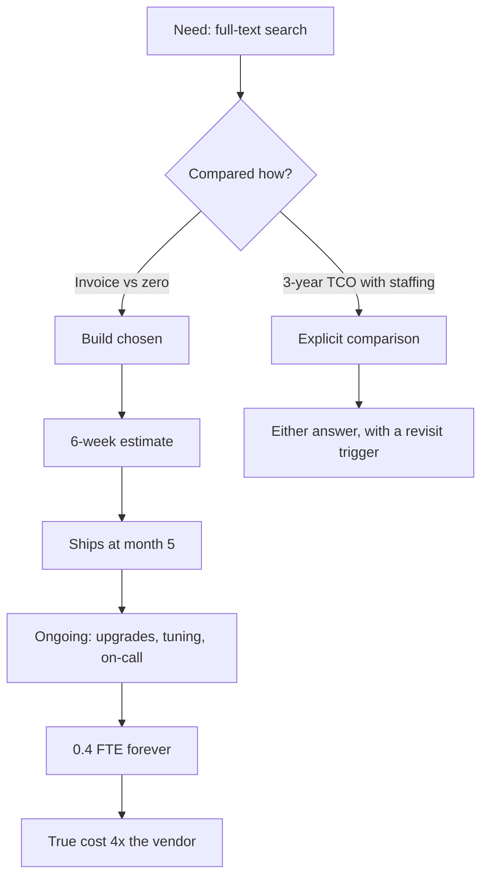
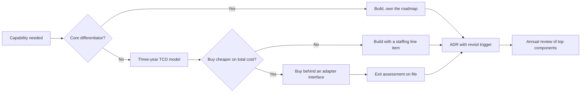

> **Scenario** - A team declines a $2,400/month search vendor and builds on Elasticsearch instead, budgeting six weeks. Fourteen months later two engineers spend roughly 20% of their time on cluster upgrades, relevance tuning, and a recurring 3am disk-watermark page. The direct infrastructure cost is $900/month. The fully loaded cost is closer to $9,000.

## Why it matters

- The comparison teams actually run is "vendor invoice versus zero", because engineering time already appears in the payroll line. That framing gets the answer wrong nearly every time.
- Operational load is the term that compounds. A bought component that removes a pager rotation is worth more than its invoice; a built component that adds one costs more than its infrastructure.
- Exit cost decides how reversible the decision is. A vendor you can leave in two weeks is a rental; one whose data model has spread through your schema is a marriage.
- For founders: build what your customers pay you for, buy what they assume works. Nobody chose your product because you wrote your own feature-flag service.
- Both directions have a failure mode. Building commodity infrastructure burns the team; buying a component that sits on your core differentiator caps the product.

## Symptoms

| Signal | What you observe |
|---|---|
| Estimate drift | The six-week build is at month five with a list of "known limitations" |
| Hidden staffing | One or two engineers are permanently attached to a component nobody planned to staff |
| Pager attribution | A recurring page belongs to infrastructure the team chose to own |
| Vendor sprawl | Nine SaaS tools, three of which overlap, none with a named owner |
| Lock-in surprise | Migrating away requires touching 40 files because the vendor's types leaked everywhere |
| Decision amnesia | Nobody can say why the choice was made or what would change it |

## How it breaks

Build-versus-buy is a total-cost-of-ownership question that gets answered as a sticker-price question. The build side systematically omits maintenance, on-call, upgrades, security patching, the second engineer needed for bus-factor, and the opportunity cost of the features not shipped. The buy side systematically omits integration work, data egress, the migration cost when the vendor changes pricing, and the risk that the vendor is acquired.

The other structural error is deciding once and never revisiting. A build that was correct at 20 customers can be wrong at 2,000, and a vendor that was cheap at 50GB is a budget item at 5TB. Without a written trigger, the decision is revisited only during a crisis, which is the worst time to run a migration.



## Root causes

1. Engineering time treated as free because it is already on the payroll.
2. No three-year horizon: the comparison covers the build sprint, not the maintenance decade.
3. Exit cost never estimated, so lock-in is discovered during the migration.
4. Vendor evaluated on features rather than on the operational load it removes.
5. No revisit trigger, so a correct decision silently becomes a wrong one as scale changes.
6. Status-seeking: building infrastructure is more interesting than integrating a vendor, and interest is not a business case.

## How to solve it

### 1. Write the three-year cost model down, in code

```python
# tco.py - run it, argue with the inputs, not with intuition.
LOADED_HOURLY = 95  # salary + benefits + overhead, per engineer-hour

def build_cost(
    dev_weeks: float,
    engineers: int,
    ops_hours_per_month: float,
    infra_per_month: float,
    years: int = 3,
) -> float:
    build = dev_weeks * engineers * 40 * LOADED_HOURLY
    run = years * 12 * (ops_hours_per_month * LOADED_HOURLY + infra_per_month)
    return build + run

def buy_cost(
    license_per_month: float,
    integration_weeks: float,
    ops_hours_per_month: float,
    years: int = 3,
) -> float:
    integrate = integration_weeks * 40 * LOADED_HOURLY
    run = years * 12 * (license_per_month + ops_hours_per_month * LOADED_HOURLY)
    return integrate + run

# The scenario above, with honest inputs:
print(build_cost(dev_weeks=20, engineers=2, ops_hours_per_month=64, infra_per_month=900))
print(buy_cost(license_per_month=2400, integration_weeks=2, ops_hours_per_month=4))
```

Estimate `ops_hours_per_month` from your own history: count the pages, the upgrade windows, and the tuning tickets for a component you already own, then use that number rather than an optimistic guess.

### 2. Classify the component before comparing

| Class | Definition | Default |
|---|---|---|
| Core differentiator | Customers choose you because of it | Build |
| Supporting | Required, but no customer compares vendors on it | Buy |
| Commodity | Everyone needs it, standards exist | Buy |
| Regulated | Compliance dictates control and residency | Depends on the auditor, not the engineer |

Search relevance for a legal research product is core. Search for an internal admin panel is commodity. The same technology lands on different sides of the line depending on what you sell.

### 3. Price the exit before you sign

```md
## Exit assessment: <vendor>

- Data export: format, completeness, and how long a full export takes today.
- Coupling surface: number of modules importing vendor types (measure it, do not guess).
- Replacement: is there a second vendor with a compatible interface, or is this bespoke?
- Estimated migration: engineer-weeks, based on the coupling surface above.
- Contract: notice period, price-increase cap, data-deletion terms.
```

Keep the vendor behind your own interface so the coupling surface stays at one module:

```ts
// One adapter, one seam. Swapping vendors touches this file and nothing else.
export interface SearchProvider {
  index(docs: SearchDoc[]): Promise<void>
  query(q: string, opts: QueryOptions): Promise<SearchHit[]>
}

export class VendorSearch implements SearchProvider { /* ... */ }
export class SelfHostedSearch implements SearchProvider { /* ... */ }
```

### 4. Run a two-week bounded spike, not a six-month build

If you genuinely cannot tell, timebox a spike against a real dataset and a real load profile. The exit criterion is written before the spike starts: specific latency, specific recall, specific operational effort. A spike without a written exit criterion becomes the implementation.

### 5. Record the decision with a revisit trigger

Use an ADR. The revisit trigger should be a number someone will actually observe: "revisit if the index exceeds 500GB, if on-call pages for search exceed two per month, or if the vendor's list price rises above $6,000/month."

### 6. Re-run the model annually on the top three components

Fifteen minutes per component, once a year, with the current numbers. Most will not change. The one that does will save more than the meeting cost.

## Target design



## Tradeoffs

| Option | Pros | Cons | Choose when |
|---|---|---|---|
| Build in-house | Exact fit, no per-seat cost, full control | Permanent staffing and on-call; opportunity cost | The capability is why customers pay you |
| Buy SaaS | Fast, vendor carries on-call, predictable cost | Lock-in, price risk, data residency questions | Supporting or commodity capability |
| Self-host open source | No licence cost, source access, no vendor risk | You own upgrades, security patches, and the pager | Strong ops capability and a stable requirement |
| Buy now, build later | Ships immediately, defers the decision | Migration cost is real and usually deferred forever | Uncertain requirements, adapter boundary in place |

## Verification checklist

- [ ] A written three-year TCO model exists for the decision, with loaded hourly cost and ops hours as explicit inputs.
- [ ] `ops_hours_per_month` for the build option was derived from a comparable component you already run.
- [ ] The component is classified as core, supporting, commodity, or regulated, and the classification is written down.
- [ ] An exit assessment exists for every vendor on the critical path.
- [ ] Vendor types appear in exactly one module; verify with a grep for the SDK import.
- [ ] The ADR includes a numeric revisit trigger and a date for the next review.

## Anti-patterns

- Comparing the vendor invoice against zero because engineers are already paid.
- Building commodity infrastructure - queues, flags, auth, search - because it is more interesting than the product work.
- Buying a vendor that owns your core differentiator, capping the product at the vendor's roadmap.
- Letting the SDK's types spread across the codebase, so the exit cost quietly grows every sprint.
- Treating a six-week estimate as the cost when the maintenance decade is the cost.

## Related

- [Architecture decision records that get read](/systems/product-platform/architecture-decision-records)
- [Running an internal platform as a product](/systems/product-platform/internal-platform-as-product)
- [Cost attribution and showback](/systems/product-platform/cost-attribution-and-showback)
