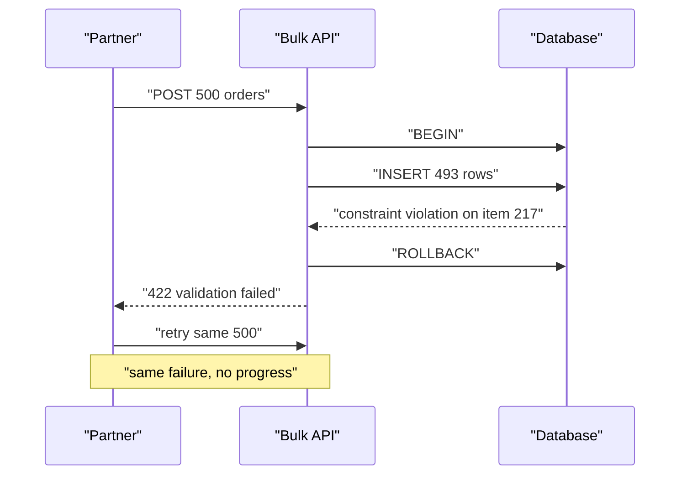
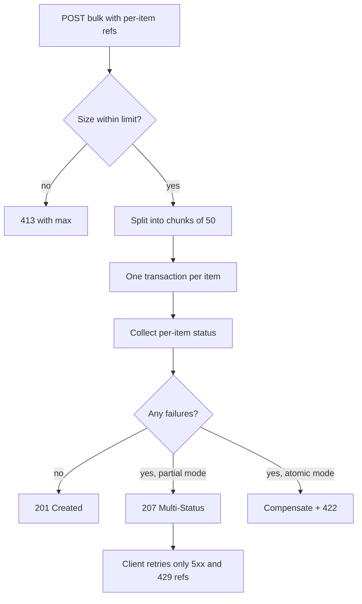

> **Scenario** — এক partner `POST /v1/orders/bulk`-এ ৫০০টি order পাঠাল। সাতটি validation-এ fail, একটি duplicate SKU constraint-এ আটকাল, বাকিরা সফল। আপনার handler সব একটি transaction-এ মুড়ে রেখেছে, তাই ৫০০টিই rollback হলো আর আপনি একটিমাত্র error message সহ `422` ফেরালেন। Partner অভিন্ন batch চারবার retry করল, একই সাত row-তে আটকাল, শেষে support-কে জিজ্ঞেস করল তাদের ৪৯৩টি বৈধ order কোথায়।

## Why it matters

- Bulk endpoint থাকে কারণ per-item request ধীর; batch all-or-nothing হলে একটি খারাপ row ৪৯৩টি বৈধ row আটকে দেয়।
- আংশিক ব্যর্থ batch-এ `200 OK` client-কে body উপেক্ষা করতে শেখায়, আর failure দিনের পর দিন অলক্ষ্যে থাকে।
- Per-item idempotency ছাড়া আংশিক সাফল্যের পর batch retry করলে যা আগে সফল হয়েছিল সব duplicate হয়।
- ৫০০ row-র উপর দীর্ঘ transaction lock ধরে রাখে ও সম্পর্কহীন write আটকায়।
- অস্পষ্ট semantics প্রতিটি integration-কে "এই status code-এর মানে কী" নিয়ে support আলাপে পরিণত করে।

## Symptoms

| Signal | What you observe |
| --- | --- |
| Retry loop | একই batch payload ৪–১০ বার আসে, অগ্রগতি নেই |
| Duplicated row | আংশিক সাফল্য + সরল retry সফল item দুইবার বানায় |
| Lock contention | bulk window-তে `pg_stat_activity`-তে দীর্ঘ `idle in transaction` |
| Ignored error | ৪০% item fail করা batch-এ client log-এ `200` |
| Timeout | ৫০০ batch request deadline ছাড়ায়; ২০০ চলে, ৫০০ চলে না |
| Vague error | কোন item তা না জানিয়ে `{"error": "validation failed"}` |

## How it breaks

দুটি নকশাই fail করে। All-or-nothing transaction সঠিক কিন্তু অকেজো: একটি খারাপ item পুরো batch নষ্ট করে, আর client bisect ছাড়া খারাপ item খুঁজে পায় না। সরল best-effort loop আরও খারাপ: এটি `200` ফেরায়, body-তে সাফল্য ও ব্যর্থতা মেশানো থাকে, আর client `res.ok`-কেই সাফল্য ধরে।

তারপর retry আসে। Per-item key ছাড়া প্রথম চেষ্টায় সফল item 12 দ্বিতীয় চেষ্টাতেও সফল হয়, এবং এখন দুটি order।



## Root causes

1. Transaction boundary per item বা per chunk নয়, per request-এ বসানো।
2. "কিছু কাজ করেছে" বোঝাতে HTTP-তে স্বাভাবিক code নেই, তাই দল `200` বা `422` বাছে — দুটোই বিভ্রান্তিকর।
3. Item-এ client-প্রদত্ত reference নেই, তাই ফলাফল মিলিয়ে নেওয়া যায় না।
4. Retry শুধু ব্যর্থ item নয়, পুরো batch পুনরায় পাঠায়।
5. Batch size-এর সীমা নেই, তাই latency ও lock duration client যা পাঠায় তার সাথে বাড়ে।
6. Error per-item structure নয়, একটি সমতল string হিসেবে ফেরে।

## How to solve it

### 1. স্পষ্ট semantics বাছুন ও নথিভুক্ত করুন

| Mode | Status code | Meaning |
| --- | --- | --- |
| `atomic` | `201` বা `422` | সব item প্রযোজ্য, নয়তো কিছুই নয়। client ঠিক করে সব আবার পাঠায়। |
| `partial` (default) | `207 Multi-Status` | প্রতিটি item-এর নিজস্ব status; client শুধু failure retry করে। |

`207 Multi-Status` এসেছে WebDAV থেকে, কিন্তু ঠিক এই কাজেই ব্যাপকভাবে ব্যবহৃত। গুরুত্বপূর্ণ অংশ সংখ্যাটি নয় — গুরুত্বপূর্ণ হলো এটি `200` *নয়*, তাই শুধু `res.ok` দেখা client-কে ভালো করে তাকাতেই হয়।

### 2. প্রতি item-এ client reference বাধ্যতামূলক করুন

```json
{
  "mode": "partial",
  "items": [
    { "ref": "po-9912", "sku": "TSHIRT-M", "qty": 2, "customer_id": "cus_81" },
    { "ref": "po-9913", "sku": "MUG-L", "qty": 1, "customer_id": "cus_44" }
  ]
}
```

`ref` হলো per-item idempotency key, batch-এর `Idempotency-Key`-এর scope-এ। এটি response item-by-item মেলাতে দেয় এবং শুধু failure retry করা সম্ভব করে।

### 3. Chunk-এ প্রসেস করুন, chunk-প্রতি transaction

```php
<?php

namespace App\Http\Controllers\Api;

use Illuminate\Http\JsonResponse;
use Illuminate\Http\Request;
use Illuminate\Support\Facades\DB;

class BulkOrderController
{
    private const MAX_ITEMS = 500;
    private const CHUNK = 50;

    public function store(Request $request): JsonResponse
    {
        $items = $request->input('items', []);
        $mode = $request->input('mode', 'partial');

        if (count($items) > self::MAX_ITEMS) {
            return response()->json([
                'error' => 'batch_too_large',
                'max'   => self::MAX_ITEMS,
                'got'   => count($items),
            ], 413);
        }

        $results = [];

        foreach (array_chunk($items, self::CHUNK, true) as $chunk) {
            foreach ($chunk as $index => $item) {
                try {
                    $order = DB::transaction(
                        fn () => app(CreateOrder::class)->handle($item, $request->user()),
                    );

                    $results[$index] = [
                        'ref'    => $item['ref'] ?? null,
                        'index'  => $index,
                        'status' => 201,
                        'id'     => $order->public_id,
                    ];
                } catch (ValidationException $e) {
                    $results[$index] = $this->failure($item, $index, 422, $e->errors());
                } catch (DuplicateRefException $e) {
                    $results[$index] = [
                        'ref'    => $item['ref'] ?? null,
                        'index'  => $index,
                        'status' => 200,
                        'id'     => $e->existingId,
                        'note'   => 'already_created',
                    ];
                } catch (\Throwable $e) {
                    report($e);
                    $results[$index] = $this->failure($item, $index, 500, [
                        'message' => 'internal_error',
                    ]);
                }
            }
        }

        ksort($results);
        $failed = collect($results)->where('status', '>=', 400);

        if ($mode === 'atomic' && $failed->isNotEmpty()) {
            // Atomic mode replays compensation for the ones that succeeded.
            app(CompensateOrders::class)->handle(collect($results)->where('status', 201));

            return response()->json([
                'applied' => false,
                'results' => array_values($results),
            ], 422);
        }

        return response()->json([
            'summary' => [
                'total'     => count($results),
                'succeeded' => count($results) - $failed->count(),
                'failed'    => $failed->count(),
            ],
            'results' => array_values($results),
        ], $failed->isEmpty() ? 201 : 207);
    }

    private function failure(array $item, int $index, int $status, array $errors): array
    {
        return [
            'ref'    => $item['ref'] ?? null,
            'index'  => $index,
            'status' => $status,
            'errors' => $errors,
        ];
    }
}
```

লক্ষ করুন duplicate কেসে error নয়, `already_created` সহ `200` ফেরে। আগে থেকেই থাকা retried item client-এর দৃষ্টিতে *সাফল্য*।

### 4. Failure retry করা সহজ করুন

```ts
type BulkItem = { ref: string; sku: string; qty: number; customerId: string }
type BulkResult = { ref: string | null; index: number; status: number; id?: string }
type BulkResponse = { results: BulkResult[] }

export async function submitBatch(items: BulkItem[], maxRounds = 3): Promise<BulkResult[]> {
  const batchKey = crypto.randomUUID()
  const settled = new Map<string, BulkResult>()
  let pending = items

  for (let round = 0; round < maxRounds && pending.length > 0; round++) {
    const res = await fetch('/v1/orders/bulk', {
      method: 'POST',
      headers: {
        'Content-Type': 'application/json',
        'Idempotency-Key': batchKey,
      },
      body: JSON.stringify({ mode: 'partial', items: pending }),
    })

    if (res.status !== 207 && res.status !== 201) {
      throw new Error(`bulk request rejected: HTTP ${res.status}`)
    }

    const body = (await res.json()) as BulkResponse
    const retryable = new Set<string>()

    for (const result of body.results) {
      if (!result.ref) continue
      if (result.status >= 500 || result.status === 429) {
        retryable.add(result.ref)
      } else {
        settled.set(result.ref, result)
      }
    }

    pending = pending.filter((item) => retryable.has(item.ref))
    if (pending.length > 0) {
      await new Promise((r) => setTimeout(r, 500 * 2 ** round + Math.random() * 250))
    }
  }

  return [...settled.values()]
}
```

কেবল `5xx` ও `429` item retry হয়; `422` চিরকাল `422` থাকবে এবং সেটি মানুষের জন্য report-এর বিষয়।

### 5. Batch cap দিন এবং জানিয়ে দিন

Body-তে সর্বোচ্চ সীমা সহ `413 Payload Too Large` ফেরান এবং নথিভুক্ত করুন। Error message থেকে সীমা জানা client ৩০ সেকেন্ডের timeout থেকে জানা client-এর চেয়ে ভালো অবস্থায় থাকে।

## Target design



## Tradeoffs

| Option | Pros | Cons | Choose when |
| --- | --- | --- | --- |
| পুরো batch-এ এক transaction | সরল atomicity | এক খারাপ row ৪৯৯টি নষ্ট করে, দীর্ঘ lock | ছোট batch যেখানে all-or-nothing দরকার |
| Per-item transaction + `207` | সর্বোচ্চ অগ্রগতি, নির্দিষ্ট retry | client-কে per-item result সামলাতে হয় | partner-facing bulk import |
| Chunked transaction | lock time ও round trip-এর ভারসাম্য | chunk-level semantics নথিভুক্ত করতে হয় | বড় import, chunk atomicity সহনীয় |
| Async job + status URL | request timeout নেই, বিশাল batch | polling, বাড়তি endpoint, বেশি state | ~৫,০০০+ item-এর batch |
| Bulk বাদ, per-item বাধ্য | তুচ্ছ সরল semantics | latency ও rate-limit চাপ | কম volume integration |

## Verification checklist

- [ ] ৭টি জানা-খারাপ সহ ৫০০ item পাঠিয়ে ৪৯৩ row ও `207` response নিশ্চিত করুন।
- [ ] অভিন্ন batch আবার পাঠিয়ে duplicate নেই ও পুনরাবৃত্ত item `already_created` চিহ্নিত — যাচাই করুন।
- [ ] শুধু ব্যর্থ ref retry করে দেখুন batch idempotency key তখনো প্রযোজ্য।
- [ ] `pg_stat_activity`-তে bulk path-এর কোনো transaction ২০০ms ছাড়ায় না — assert করুন।
- [ ] `MAX_ITEMS + 1` পাঠিয়ে body-তে সীমা সহ `413` নিশ্চিত করুন।
- [ ] Batch-এর মাঝপথে process kill করে দেখুন অর্ধলিখিত order নেই।

## Anti-patterns

- ৪০% item fail করা batch-এ `200 OK` ফেরানো।
- শুধু array index দিয়ে error জানানো, ফলে retry-তে ক্রম বদলানো client ভুল item-এ error মেলায়।
- Per-item status না দেখে loop-এ `422` item retry করা।
- ৫০০ insert এক transaction-এ মুড়ে পরে ভাবা কেন সম্পর্কহীন write timeout করছে।
- অসীম batch size নিয়ে request timeout-কেই কার্যত সীমা বানানো।
- সত্যিকারের ভিন্ন batch-এ একই `Idempotency-Key` পুনর্ব্যবহার, যা বাসি response replay করে।

## Related

- [Idempotency keys for payment APIs](/systems/api-integration/idempotency-keys-for-payments)
- [Pagination at scale: offsets, cursors, and drift](/systems/api-integration/pagination-at-scale)
- [Retry with jitter, budgets, and honest error classes](/systems/api-integration/retry-with-jitter-strategy)
