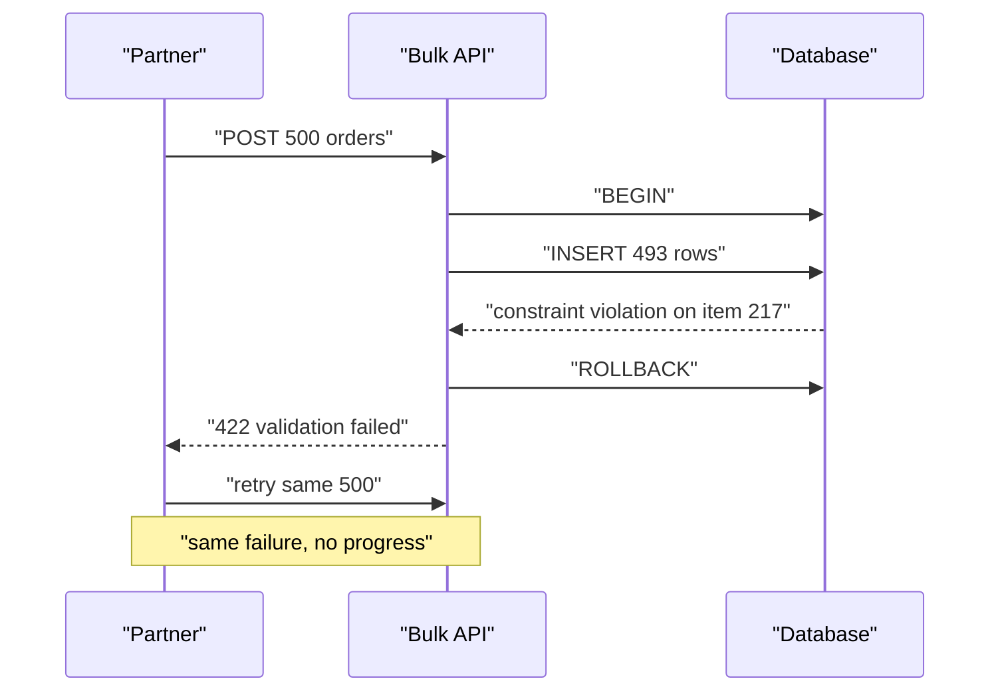
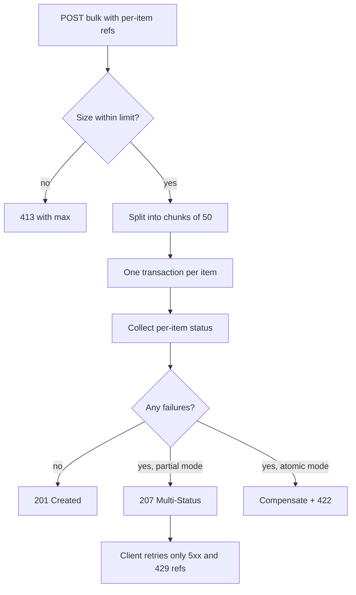

> **Scenario** - A partner posts 500 orders to `POST /v1/orders/bulk`. Seven fail validation, one hits a duplicate SKU constraint, and the rest succeed. Your handler wraps everything in one transaction, so all 500 roll back and you return `422` with a single error message. The partner retries the identical batch four times, hits the same seven rows, and eventually calls support to ask why none of their 493 valid orders exist.

## Why it matters

- Bulk endpoints exist because per-item requests are too slow; if a batch is all-or-nothing, one bad row blocks a legitimate 493.
- `200 OK` on a partially failed batch teaches clients to ignore the body, and failures go unnoticed for days.
- Without per-item idempotency, retrying a batch after a partial success duplicates everything that already worked.
- Long transactions over 500 rows hold locks and block unrelated writes.
- Ambiguous semantics turn every integration into a support conversation about what a status code means.

## Symptoms

| Signal | What you observe |
| --- | --- |
| Retry loops | The same batch payload arrives 4–10 times with no progress |
| Duplicated rows | Partial success plus naive retry creates the successful items twice |
| Lock contention | `pg_stat_activity` shows long `idle in transaction` during bulk windows |
| Ignored errors | Client logs show `200` for batches where 40% of items failed |
| Timeouts | Batch size 500 exceeds the request deadline; 200 works, 500 does not |
| Vague errors | `{"error": "validation failed"}` with no indication of which item |

## How it breaks

Two designs both fail. The all-or-nothing transaction is correct but useless: any single bad item wastes the whole batch, and the client has no way to find the bad item other than bisecting. The naive best-effort loop is worse: it returns `200`, the body contains a mixture of successes and failures, and clients treat `res.ok` as success.

Then the retry arrives. Without per-item keys, item 12 that succeeded on attempt one succeeds again on attempt two, and now there are two orders.



## Root causes

1. Transaction boundaries are set per request instead of per item or per chunk.
2. HTTP has no natural code for "some worked", so teams pick `200` or `422` and both mislead.
3. Items carry no client-supplied reference, so results cannot be matched back.
4. Retries repeat the whole batch instead of only the failed items.
5. Batch size is unbounded, so latency and lock duration scale with whatever the client sends.
6. Errors are returned as a flat string rather than a per-item structure.

## How to solve it

### 1. Pick explicit semantics and document them

| Mode | Status code | Meaning |
| --- | --- | --- |
| `atomic` | `201` or `422` | All items applied, or none. Client fixes and resends everything. |
| `partial` (default) | `207 Multi-Status` | Each item has its own status; client retries only failures. |

`207 Multi-Status` comes from WebDAV but is widely used for exactly this. The important part is not the number - it is that it is *not* `200`, so a client checking `res.ok` alone is forced to look closer.

### 2. Require a client reference per item

```json
{
  "mode": "partial",
  "items": [
    { "ref": "po-9912", "sku": "TSHIRT-M", "qty": 2, "customer_id": "cus_81" },
    { "ref": "po-9913", "sku": "MUG-L", "qty": 1, "customer_id": "cus_44" }
  ]
}
```

The `ref` is the per-item idempotency key, scoped to the batch's `Idempotency-Key`. It lets the response be matched item-by-item and makes a retry of only the failures possible.

### 3. Process in chunks, one transaction per chunk

```php
<?php

namespace App\Http\Controllers\Api;

use Illuminate\Http\JsonResponse;
use Illuminate\Http\Request;
use Illuminate\Support\Facades\DB;

class BulkOrderController
{
    private const MAX_ITEMS = 500;
    private const CHUNK = 50;

    public function store(Request $request): JsonResponse
    {
        $items = $request->input('items', []);
        $mode = $request->input('mode', 'partial');

        if (count($items) > self::MAX_ITEMS) {
            return response()->json([
                'error' => 'batch_too_large',
                'max'   => self::MAX_ITEMS,
                'got'   => count($items),
            ], 413);
        }

        $results = [];

        foreach (array_chunk($items, self::CHUNK, true) as $chunk) {
            foreach ($chunk as $index => $item) {
                try {
                    $order = DB::transaction(
                        fn () => app(CreateOrder::class)->handle($item, $request->user()),
                    );

                    $results[$index] = [
                        'ref'    => $item['ref'] ?? null,
                        'index'  => $index,
                        'status' => 201,
                        'id'     => $order->public_id,
                    ];
                } catch (ValidationException $e) {
                    $results[$index] = $this->failure($item, $index, 422, $e->errors());
                } catch (DuplicateRefException $e) {
                    $results[$index] = [
                        'ref'    => $item['ref'] ?? null,
                        'index'  => $index,
                        'status' => 200,
                        'id'     => $e->existingId,
                        'note'   => 'already_created',
                    ];
                } catch (\Throwable $e) {
                    report($e);
                    $results[$index] = $this->failure($item, $index, 500, [
                        'message' => 'internal_error',
                    ]);
                }
            }
        }

        ksort($results);
        $failed = collect($results)->where('status', '>=', 400);

        if ($mode === 'atomic' && $failed->isNotEmpty()) {
            // Atomic mode replays compensation for the ones that succeeded.
            app(CompensateOrders::class)->handle(collect($results)->where('status', 201));

            return response()->json([
                'applied' => false,
                'results' => array_values($results),
            ], 422);
        }

        return response()->json([
            'summary' => [
                'total'     => count($results),
                'succeeded' => count($results) - $failed->count(),
                'failed'    => $failed->count(),
            ],
            'results' => array_values($results),
        ], $failed->isEmpty() ? 201 : 207);
    }

    private function failure(array $item, int $index, int $status, array $errors): array
    {
        return [
            'ref'    => $item['ref'] ?? null,
            'index'  => $index,
            'status' => $status,
            'errors' => $errors,
        ];
    }
}
```

Note the duplicate case returns `200` with `already_created` rather than an error. A retried item that already exists is a *success* from the client's point of view.

### 4. Make retrying the failures trivial

```ts
type BulkItem = { ref: string; sku: string; qty: number; customerId: string }
type BulkResult = { ref: string | null; index: number; status: number; id?: string }
type BulkResponse = { results: BulkResult[] }

export async function submitBatch(items: BulkItem[], maxRounds = 3): Promise<BulkResult[]> {
  const batchKey = crypto.randomUUID()
  const settled = new Map<string, BulkResult>()
  let pending = items

  for (let round = 0; round < maxRounds && pending.length > 0; round++) {
    const res = await fetch('/v1/orders/bulk', {
      method: 'POST',
      headers: {
        'Content-Type': 'application/json',
        'Idempotency-Key': batchKey,
      },
      body: JSON.stringify({ mode: 'partial', items: pending }),
    })

    if (res.status !== 207 && res.status !== 201) {
      throw new Error(`bulk request rejected: HTTP ${res.status}`)
    }

    const body = (await res.json()) as BulkResponse
    const retryable = new Set<string>()

    for (const result of body.results) {
      if (!result.ref) continue
      if (result.status >= 500 || result.status === 429) {
        retryable.add(result.ref)
      } else {
        settled.set(result.ref, result)
      }
    }

    pending = pending.filter((item) => retryable.has(item.ref))
    if (pending.length > 0) {
      await new Promise((r) => setTimeout(r, 500 * 2 ** round + Math.random() * 250))
    }
  }

  return [...settled.values()]
}
```

Only `5xx` and `429` items are retried; a `422` will be `422` forever and belongs in a report for a human.

### 5. Cap the batch and say so

Return `413 Payload Too Large` with the maximum in the body, and document it. A client that discovers the limit from an error message is better off than one that discovers it from a 30-second timeout.

## Target design



## Tradeoffs

| Option | Pros | Cons | Choose when |
| --- | --- | --- | --- |
| One transaction for the batch | Simple atomicity | One bad row wastes 499 good ones, long locks | Small batches needing all-or-nothing |
| Per-item transaction + `207` | Maximum progress, precise retries | Client must handle per-item results | Partner-facing bulk imports |
| Chunked transactions | Balances lock time and round trips | Partial chunk semantics to document | Large imports, tolerant of chunk-level atomicity |
| Async job + status URL | No request timeout, huge batches | Polling, extra endpoints, more state | Batches over ~5,000 items |
| Reject bulk, force per-item | Trivial semantics | Latency and rate-limit pressure | Low volume integrations |

## Verification checklist

- [ ] Submit 500 items with 7 known-bad and confirm 493 rows exist and the response is `207`.
- [ ] Resubmit the identical batch and confirm no duplicates, with repeats marked `already_created`.
- [ ] Retry only the failed refs and confirm the batch idempotency key still applies.
- [ ] Assert no transaction in the bulk path exceeds 200ms in `pg_stat_activity`.
- [ ] Send `MAX_ITEMS + 1` and confirm `413` with the limit in the body.
- [ ] Kill the process halfway through a batch and confirm no half-written orders.

## Anti-patterns

- Returning `200 OK` for a batch where 40% of items failed.
- Reporting errors by array index only, so a client that reorders its retry maps errors to the wrong items.
- Retrying `422` items in a loop because the retry code does not inspect per-item status.
- Wrapping 500 inserts in one transaction and then wondering why unrelated writes time out.
- Accepting unbounded batch sizes and letting the request timeout be the de facto limit.
- Reusing the same `Idempotency-Key` across genuinely different batches, which replays a stale response.

## Related

- [Idempotency keys for payment APIs](/systems/api-integration/idempotency-keys-for-payments)
- [Pagination at scale: offsets, cursors, and drift](/systems/api-integration/pagination-at-scale)
- [Retry with jitter, budgets, and honest error classes](/systems/api-integration/retry-with-jitter-strategy)
