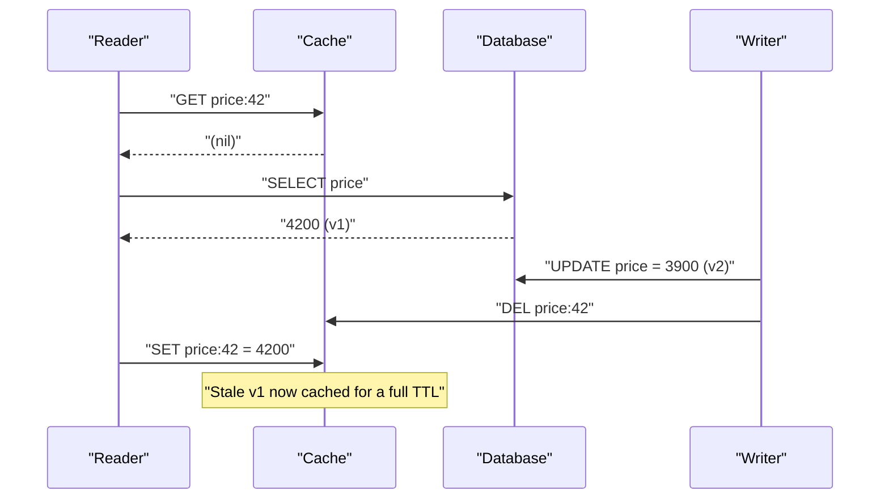
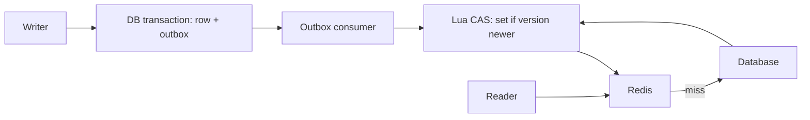

> **Scenario** — একটি pricing service cache-aside ব্যবহার করে। support agent একটি product-এর দাম 4,200 থেকে 3,900 করেন, write commit হয়, cache delete হয়। দুই ঘণ্টা পরেও ছয়টি app pod-এর একটিতে customer 4,200 দেখছে। Database ঠিক আছে; cache-এ এমন একটি value আছে যা কোনো writer কখনো লেখেনি।

## Why it matters

- Cache-aside-এ একটি সুপরিচিত interleaving আছে যেখানে ধীর reader আপনার update-এর *আগে* fetch করা value দিয়ে fresh entry overwrite করে, আর সেই stale entry পুরো TTL টিকে যায়।
- ভুল দাম, ভুল balance, ভুল permission flag — এগুলো correctness bug, performance bug নয়; এতে refund আর support ticket তৈরি হয়।
- Write strategy ঠিক করে cache down হলে কী হবে। write-through প্রতিটি write-এর dependency-তে cache বসায়; cache-aside বসায় না।
- Write-behind throughput-এর জন্য durability বিক্রি করে। dirty entry memory-তে থাকা অবস্থায় process মরলে সেই write হারিয়ে যায়, কেউ জানাবে না।
- দল প্রথম sprint-এ অনানুষ্ঠানিকভাবে একবার strategy বেছে নেয় এবং বছরের পর বছর তার consistency profile বহন করে।

## Symptoms

| Signal | What you observe |
|--------|------------------|
| Stale reads | কিছু pod পুরনো value দেয়, কিছু নতুন — ঠিক এক TTL ধরে |
| Reproducibility | চাইলে reproduce হয় না — concurrent slow read লাগে |
| Write path errors | write-through-এ: Redis unreachable হলে save-এ 500 |
| Data loss | write-behind-এ: pod OOMKill-এর পর row নেই, কোনো error log-ও নেই |
| Cache/DB drift | reconciliation job ছোট কিন্তু non-zero শতাংশ mismatch পায় |
| Timing | mismatch high read concurrency + write-এর সময়ে জমে |

## How it breaks

Classic cache-aside race-এ মাত্র দুজন actor লাগে। Reader R miss করে, database query করে, version 1 পায়। R cache-এ লেখার আগেই writer W version 2 commit করে এবং cache key delete করে। এরপর R তার `SET` শেষ করে version 1 দিয়ে। এখন cache-এ database-এর চেয়ে পুরনো value, আর invalidate করার মতো কোনো event বাকি নেই।

Write-through-এর সমস্যা উল্টো: cache ও database দুটি আলাদা সিস্টেম, transaction ছাড়াই ক্রমান্বয়ে update হয়। database commit সফল কিন্তু cache write fail হলে silent divergence; cache write সফল কিন্তু commit rollback হলে cache বাস্তবতার চেয়ে এগিয়ে।



## Root causes

1. read-populate ও write-invalidate একে অপরের সাপেক্ষে ordered নয়।
2. পুরনো read থেকে আসা in-flight `SET`-এর তুলনায় key delete করা idempotent নয়।
3. cached payload-এ কোনো version বা generation number নেই, তাই দেরিতে আসা write-কে "দেরি" বলে শনাক্ত করা যায় না।
4. দুটি storage system shared transaction বা outbox ছাড়াই update হচ্ছে।
5. TTL এত বড় যে stale entry ওই write-এর সাথে সম্পর্ক ধরার সময়সীমা পেরিয়ে টিকে থাকে।
6. একাধিক writer (admin UI, batch import, API) কিন্তু কেবল কয়েকটি invalidate করে।

## How to solve it

### 1. Pick the write strategy deliberately

```php
// Cache-aside: application owns both reads and invalidation.
public function price(int $id): int
{
    return Cache::remember("price:{$id}", 600, fn () => Price::findOrFail($id)->amount);
}

public function updatePrice(int $id, int $amount): void
{
    DB::transaction(function () use ($id, $amount) {
        Price::whereKey($id)->update(['amount' => $amount]);
    });
    Cache::forget("price:{$id}");           // invalidate after commit
    dispatch(new ForgetPriceAgain($id))->delay(now()->addSeconds(2)); // delayed second delete
}
```

```php
// Write-through: the cache write is part of the save path.
public function updatePriceWriteThrough(int $id, int $amount): void
{
    DB::transaction(function () use ($id, $amount) {
        Price::whereKey($id)->update(['amount' => $amount]);
    });
    Cache::put("price:{$id}", $amount, 600); // populate, do not just delete
}
```

`ForgetPriceAgain` হলো *delayed double delete*: দ্বিতীয় delete তখন পড়ে যখন in-flight ধীর reader তার `SET` শেষ করে ফেলেছে, তাই poisoned entry দশ মিনিটের বদলে দুই সেকেন্ড বাঁচে।

### 2. Version the payload so late writes lose

value-র সাথে monotonically increasing version রাখুন এবং নতুন entry overwrite করতে অস্বীকার করুন। Lua script compare-and-set-কে atomic করে।

```bash
EVAL "
local cur = redis.call('HGET', KEYS[1], 'v')
if cur and tonumber(cur) >= tonumber(ARGV[1]) then return 0 end
redis.call('HSET', KEYS[1], 'v', ARGV[1], 'val', ARGV[2])
redis.call('EXPIRE', KEYS[1], ARGV[3])
return 1
" 1 price:42 7 3900 600
```

```ts
export async function setIfNewer(key: string, version: number, value: string, ttl = 600) {
  return redis.eval(CAS_SCRIPT, 1, key, String(version), value, String(ttl))
}
```

version হিসেবে row-এর `updated_at` epoch millis বা Postgres `xmin`-ভিত্তিক sequence ব্যবহার করুন। v1 fetch করা reader আর v2 clobber করতে পারবে না।

### 3. Invalidate from the commit, not from the request handler

একাধিক service একই row লিখলে invalidation সরিয়ে change stream-এর (outbox table বা logical replication) একটি consumer-এ নিন। invalidation-এর একজন writer মানে একটিই ordering।

```php
// Outbox row written in the same transaction as the data change.
DB::transaction(function () use ($id, $amount) {
    Price::whereKey($id)->update(['amount' => $amount]);
    CacheOutbox::create(['key' => "price:{$id}", 'version' => now()->getTimestampMs()]);
});
```

### 4. Bound the damage with a short TTL

যে strategy-ই নিন, TTL আপনার শেষ ভরসা। ঘণ্টায় বদলানো value-তে দশ মিনিটের TTL ঠিক আছে; এক দিনের TTL মানে একটি missed invalidation = এক দিনের incident।

## Target design



## Tradeoffs

| Option | Pros | Cons | Choose when |
|--------|------|------|-------------|
| Cache-aside | cache outage-এ ধীর হয়, ভাঙে না; যা পড়া হয় তাই cache | classic stale-write race; প্রতিটি writer-কে invalidate মনে রাখতে হয় | read-heavy workload, staleness সহনীয় (default পছন্দ) |
| Write-through | write-এর পর cache সবসময় populated; post-write miss নেই | write latency-তে cache যুক্ত; cache down মানে write fail বা drift | write বিরল, read কখনো miss করা যাবে না |
| Write-behind | সর্বনিম্ন write latency, DB write batch হয় | crash-এ data loss; ordering ও duplicate আপনার দায় | metric, counter — loss-tolerant high-volume write |
| Read-through (library-owned) | consistent access pattern, ad-hoc miss code নেই | database call লুকিয়ে ফেলে; trace ও timeout কঠিন | অনেক service একটি cache client library ভাগ করে |
| Versioned CAS on top of any of these | দেরিতে আসা writer fresh data clobber করতে পারে না | version source ও Lua/atomic support লাগে | কয়েক লাইন জটিলতার চেয়ে correctness বেশি গুরুত্বপূর্ণ |

## Verification checklist

- [ ] এমন test লিখুন যা reader-কে `SELECT` ও `SET`-এর মাঝে থামায়, write চালায়, reader resume করে, এবং cache-এ নতুন value assert করে।
- [ ] write burst জুড়ে `redis-cli HGET price:42 v` কখনো কমে না।
- [ ] Redis kill করে দেখুন write path সফল হয় (cache-aside) নাকি স্পষ্ট error দিয়ে জোরে fail করে (write-through)।
- [ ] nightly reconciliation job cached key-র sample database-এর সাথে মিলিয়ে mismatch count metric হিসেবে দেয়।
- [ ] প্রতিটি writer path — admin UI, CLI import, queue worker, API — invalidation test suite-এ আছে।
- [ ] প্রতিটি write-এর পর delayed double-delete job queue-তে আসে এবং delay window-এর মধ্যে শেষ হয়।

## Anti-patterns

- transaction commit-এর *আগে* cache update — rollback হলে cache স্থায়ীভাবে এগিয়ে থাকে।
- database transaction-এর ভেতর invalidate করা: অন্য session নতুন row দেখার আগেই delete ঘটে যায়।
- request handler থেকে `DEL` + `SET` করে pod জুড়ে ordering-এ ভরসা করা।
- durable buffer ছাড়া write-behind, এবং postmortem-এ গ্যাপ আবিষ্কার করা।
- invalidation strategy হিসেবে "clear all cache" admin button — correctness bug-কে stampede-এ পরিণত করে।
- একই entity-র জন্য service-ভেদে ভিন্ন TTL, ফলে stale window নির্ভর করে কোন service-কে জিজ্ঞেস করলেন তার উপর।

## Related

- [Distributed cache consistency across regions](/systems/caching-cdn/distributed-cache-consistency)
- [Cache invalidation strategies that survive deploys](/systems/caching-cdn/cache-invalidation-strategies)
- [Negative caching for null and 404 results](/systems/caching-cdn/negative-caching-null-results)
- [TTL and jitter design for cache fleets](/systems/caching-cdn/ttl-and-jitter-design)
