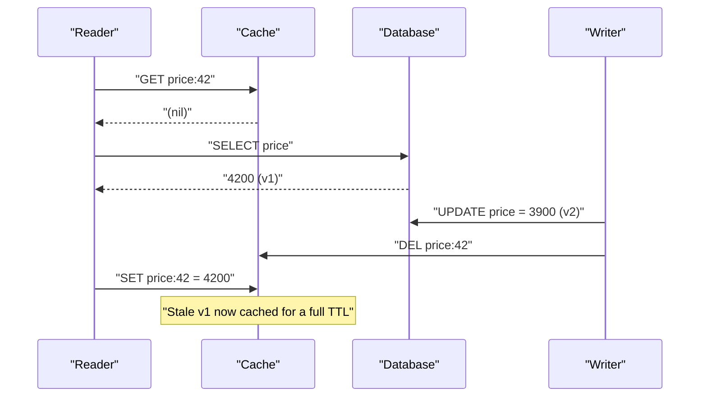
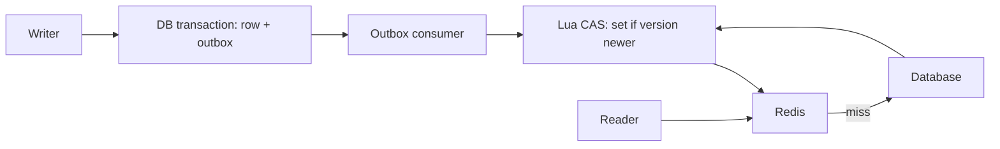

> **Scenario** — A pricing service uses cache-aside. A support agent changes a product price from 4,200 to 3,900, the write commits, and the cache is deleted. Two hours later customers still see 4,200 on one of the six app pods. The database is correct; the cache holds a value that no writer ever wrote.

## Why it matters

- Cache-aside has a well-known interleaving where a slow reader writes a value it fetched *before* your update, overwriting the fresh entry with a stale one that then survives the full TTL.
- Wrong prices, wrong balances, and wrong permission flags are correctness bugs, not performance bugs — they generate refunds and support tickets.
- The write strategy determines what happens when the cache is down. Write-through makes the cache a dependency of every write; cache-aside does not.
- Write-behind trades durability for throughput. If the process dies with dirty entries in memory, those writes are gone and nothing will tell you.
- Teams pick a strategy once, informally, in the first sprint, and inherit its consistency profile for years.

## Symptoms

| Signal | What you observe |
|--------|------------------|
| Stale reads | Some pods serve the old value, others the new one, for exactly one TTL |
| Reproducibility | Impossible to reproduce on demand — it needs a concurrent slow read |
| Write path errors | With write-through: 500s on save when Redis is unreachable |
| Data loss | With write-behind: rows missing after a pod OOMKill, no error logged |
| Cache/DB drift | A reconciliation job finds a small, non-zero percentage of mismatched keys |
| Timing | Mismatches cluster around periods of high read concurrency plus writes |

## How it breaks

The classic cache-aside race needs only two actors. Reader R misses, queries the database, and gets version 1. Before R writes to the cache, writer W commits version 2 and deletes the cache key. R then completes its `SET` with version 1. The cache now holds a value that is older than the database and there is no event left to invalidate it.

Write-through has the opposite problem: the cache and the database are two systems updated in sequence without a transaction. If the database commit succeeds and the cache write fails, you have a silent divergence; if the cache write succeeds and the commit rolls back, the cache is ahead of reality.



## Root causes

1. The read-populate and the write-invalidate are not ordered relative to each other.
2. Deleting a key is not idempotent with respect to a concurrent in-flight `SET` from an older read.
3. No version or generation number in the cached payload, so a late write cannot be detected as late.
4. Two storage systems updated without a shared transaction or an outbox.
5. TTL long enough that a stale entry survives well past the point where anyone would connect it to the write.
6. Multiple writers (admin UI, batch import, API) with only some of them invalidating.

## How to solve it

### 1. Pick the write strategy deliberately

```php
// Cache-aside: application owns both reads and invalidation.
public function price(int $id): int
{
    return Cache::remember("price:{$id}", 600, fn () => Price::findOrFail($id)->amount);
}

public function updatePrice(int $id, int $amount): void
{
    DB::transaction(function () use ($id, $amount) {
        Price::whereKey($id)->update(['amount' => $amount]);
    });
    Cache::forget("price:{$id}");           // invalidate after commit
    dispatch(new ForgetPriceAgain($id))->delay(now()->addSeconds(2)); // delayed second delete
}
```

```php
// Write-through: the cache write is part of the save path.
public function updatePriceWriteThrough(int $id, int $amount): void
{
    DB::transaction(function () use ($id, $amount) {
        Price::whereKey($id)->update(['amount' => $amount]);
    });
    Cache::put("price:{$id}", $amount, 600); // populate, do not just delete
}
```

The `ForgetPriceAgain` job is *delayed double delete*: the second delete lands after any in-flight slow reader has finished its `SET`, so the poisoned entry lives for two seconds instead of ten minutes.

### 2. Version the payload so late writes lose

Store a monotonically increasing version alongside the value and refuse to overwrite a newer entry. A Lua script makes the compare-and-set atomic.

```bash
EVAL "
local cur = redis.call('HGET', KEYS[1], 'v')
if cur and tonumber(cur) >= tonumber(ARGV[1]) then return 0 end
redis.call('HSET', KEYS[1], 'v', ARGV[1], 'val', ARGV[2])
redis.call('EXPIRE', KEYS[1], ARGV[3])
return 1
" 1 price:42 7 3900 600
```

```ts
export async function setIfNewer(key: string, version: number, value: string, ttl = 600) {
  return redis.eval(CAS_SCRIPT, 1, key, String(version), value, String(ttl))
}
```

Use the row's `updated_at` epoch millis or a Postgres `xmin`-derived sequence as the version. A reader that fetched v1 can no longer clobber v2.

### 3. Invalidate from the commit, not from the request handler

If several services write the same rows, move invalidation to a single consumer of the change stream (outbox table or logical replication). One writer of invalidations means one ordering.

```php
// Outbox row written in the same transaction as the data change.
DB::transaction(function () use ($id, $amount) {
    Price::whereKey($id)->update(['amount' => $amount]);
    CacheOutbox::create(['key' => "price:{$id}", 'version' => now()->getTimestampMs()]);
});
```

### 4. Bound the damage with a short TTL

Whatever strategy you pick, the TTL is your backstop. A ten-minute TTL on a value that changes hourly is fine; a one-day TTL means a single missed invalidation is a day-long incident.

## Target design



## Tradeoffs

| Option | Pros | Cons | Choose when |
|--------|------|------|-------------|
| Cache-aside | Cache outage degrades to slow, not broken; only cached what is read | Classic stale-write race; every writer must remember to invalidate | Read-heavy workloads with tolerable staleness (the default choice) |
| Write-through | Cache always populated after a write; no post-write miss | Write latency includes the cache; cache down means writes fail or drift | Writes are rare and reads must never miss |
| Write-behind | Lowest write latency, batches DB writes | Data loss on crash; ordering and duplicate handling are on you | Metrics, counters, and other loss-tolerant high-volume writes |
| Read-through (library-owned) | Consistent access pattern, no ad-hoc miss code | Hides the database call; harder to trace and to timeout properly | Many services share one cache client library |
| Versioned CAS on top of any of these | Late writers cannot clobber fresh data | Requires a version source and Lua/atomic support | Correctness matters more than a few lines of complexity |

## Verification checklist

- [ ] Write a test that pauses a reader between `SELECT` and `SET`, performs a write, resumes the reader, and asserts the cache holds the new value.
- [ ] `redis-cli HGET price:42 v` returns a version that never decreases across a write burst.
- [ ] Kill Redis and confirm the write path still succeeds (cache-aside) or fails loudly with a clear error (write-through).
- [ ] A nightly reconciliation job compares a sample of cached keys against the database and reports mismatch count as a metric.
- [ ] Every writer path — admin UI, CLI import, queue worker, API — is covered by the invalidation test suite.
- [ ] Delayed double-delete jobs appear in the queue after each write and complete within their delay window.

## Anti-patterns

- Updating the cache *before* the transaction commits — a rollback leaves the cache permanently ahead.
- Invalidating inside a database transaction: the delete happens before other sessions can see the new row.
- Using `DEL` plus `SET` from the request handler and trusting the ordering across pods.
- Write-behind without a durable buffer, then discovering the gap during a postmortem.
- Adding a "clear all cache" admin button as the invalidation strategy — it converts a correctness bug into a stampede.
- Different TTLs for the same entity across services, so the stale window depends on which service you ask.

## Related

- [Distributed cache consistency across regions](/systems/caching-cdn/distributed-cache-consistency)
- [Cache invalidation strategies that survive deploys](/systems/caching-cdn/cache-invalidation-strategies)
- [Negative caching for null and 404 results](/systems/caching-cdn/negative-caching-null-results)
- [TTL and jitter design for cache fleets](/systems/caching-cdn/ttl-and-jitter-design)
