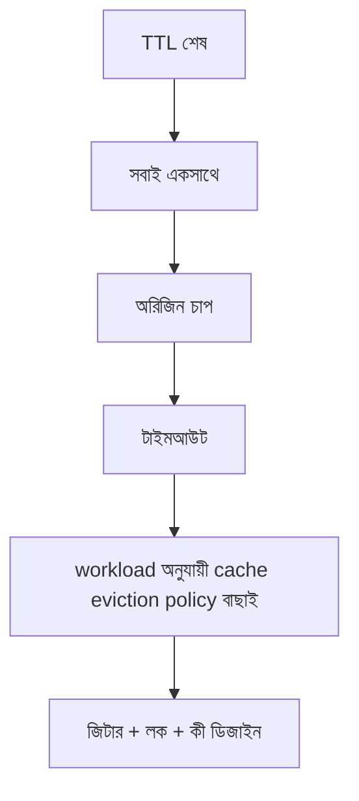

> **পাঠ 53 · মাঝারি ধাপ** - noeviction ভরা Redis-কে write outage বানায়; allkeys-lru দরকারি session ফেলে দেয়। cluster নয়, keyspace ধরে বাছুন।

## কেন এটা জরুরি

- জিটার ছাড়া ক্যাশ-অ্যাসাইড প্রতি TTL-এ সবাই একসাথে আঘাত করে। CDN-এ পার্সোনাল HTML মানে কালকের প্রাইভেসি ইনসিডেন্ট।
- ডিপ্লয়ের পর ঠান্ডা Redis আউটেজের মতো দেখায়, MySQL ঠিক থাকলেও।
- ইভিকশন পলিসি প্রোডাক্ট সিদ্ধান্ত: LRU, TTL, না স্পষ্ট ইনভ্যালিডেট।
- এই পাঠটা ঠিক **workload অনুযায়ী cache eviction policy বাছাই** নিয়ে। ট্যাগ: eviction, lru, lfu, redis, memory।

## কী দেখে বুঝবেন সমস্যা আছে

| সংকেত | যা দেখা যায় |
| --- | --- |
| স্ট্যাম্পিড | প্রতি ৫ মিনিটে সেকেন্ডে MySQL CPU ১০০% |
| পুরনো প্রাইভেট | হেডারে ইউজার B ইউজার A-র নাম দেখে |
| কোল্ড স্টার্ট | ডিপ্লয়ের পর প্রথম রিকোয়েস্ট ৩ সেকেন্ড, তারপর ৪০ ms |
| ভুল কী | ক্যাশ কীতে লোকেল বা টেন্যান্ট নেই |

## কীভাবে ভাঙে



ভাঙে প্রযুক্তির নামে নয়, চুক্তির অভাবে। Vue/Quasar স্ক্রিন আর Laravel রাইট যদি উল্টো উত্তর ধরে, প্রোডাকশন সেই রেসটা খুঁজে বের করে। এই টপিকের চুক্তিটা হলো: noeviction ভরা Redis-কে write outage বানায়; allkeys-lru দরকারি session ফেলে দেয়। cluster নয়, keyspace ধরে বাছুন।

## মূল কারণ

1. সব কী-তে এক TTL, জিটার নেই, সিঙ্গেলফ্লাইট লক নেই।
2. CDN `/dashboard` ক্যাশ করেছে, `Vary: Cookie` বা private Cache-Control নেই।
3. রিলিজের পর হট কী ওয়ার্ম করার জব নেই।
4. কী `ticket:{id}`, `ticket:{tenant}:{id}:{locale}` নয়।

## কীভাবে সমাধান করবেন

### ১. ইনভেরিয়েন্ট এক বাক্যে লিখুন

noeviction ভরা Redis-কে write outage বানায়; allkeys-lru দরকারি session ফেলে দেয়। cluster নয়, keyspace ধরে বাছুন। এই বাক্য পিআর, Pinia অ্যাকশন, আর Laravel ক্লাসে রাখুন।

### ২. কোডে কিনারা আটকে দিন

```ts
// Remember: Pinia is not Redis. Cache server JSON, not the whole store.
export async function ticketSummary(id: number) {
  return await api.get(`/api/tickets/${id}/summary`)
}
```

```php
$ttl = 60 + random_int(0, 15); // jitter so TTLs do not align
return Cache::remember("ticket:{$tenant}:{$id}:summary", $ttl, function () use ($id) {
    return Ticket::query()->with('assignee')->findOrFail($id);
});
```

### ৩. যে চার্ট সত্যি দেখবেন, সেটাই রাখুন

ক্যাশ হিট রেশিও, TTL শেষে অরিজিন QPS, আর পার্সোনালাইজেশন কী সংঘাত। **workload অনুযায়ী cache eviction policy বাছাই**-এর রিগ্রেশন এই চার্টে না ধরা পড়লে পাঠ শেষ হয়নি।

## কাজের উদাহরণ

হোমপেজ ফ্র্যাগমেন্ট এজে “হ্যালো, আসিফ” ক্যাশ করে। পরের ভিজিটর আসিফের অভিবাদন পায়। অ্যানোনিমাস CDN HTML আর প্রাইভেট XHR আলাদা করলে দুপুরের মধ্যে ঠিক হয়।

এই টপিকে নিজের শেষ ইনসিডেন্টের লক্ষণ টেবিলে মিলিয়ে নিন, তারপর ডায়াগ্রাম ধরে এগোন যতক্ষণ না উপরের গার্ড আগুন ধরত।

## শিপ করার আগে

- [ ] **workload অনুযায়ী cache eviction policy বাছাই**-এর ইনভেরিয়েন্ট এক বাক্যে লেখা।
- [ ] খালি, ডুপ্লিকেট, টাইমআউট বা পারমিশন পাথের টেস্ট বা রিহার্সাল আছে।
- [ ] এক ডিপ্লয়ের মধ্যে রিগ্রেশন ধরার লগ বা চার্ট আছে।
- [ ] আত্মীয় পাঠ এখনও মিলছে: redis-hot-key-sharding, ttl-and-jitter-design, cache-warming-after-deploy।

## যা করবেন না

- অনন্ত রিট্রাই বা এররকে সাকসেস হিসেবে ক্যাশ করা ব্লগ স্নিপেট কপি করবেন না।
- Laravel সারির সত্য Pinia-কে বলে দেবেন না।
- ঘন মনে হলে আগের নম্বরের পাঠ আগে শেষ করুন। পথটা ইচ্ছা করেই শুরু → মাঝারি → উন্নত।
