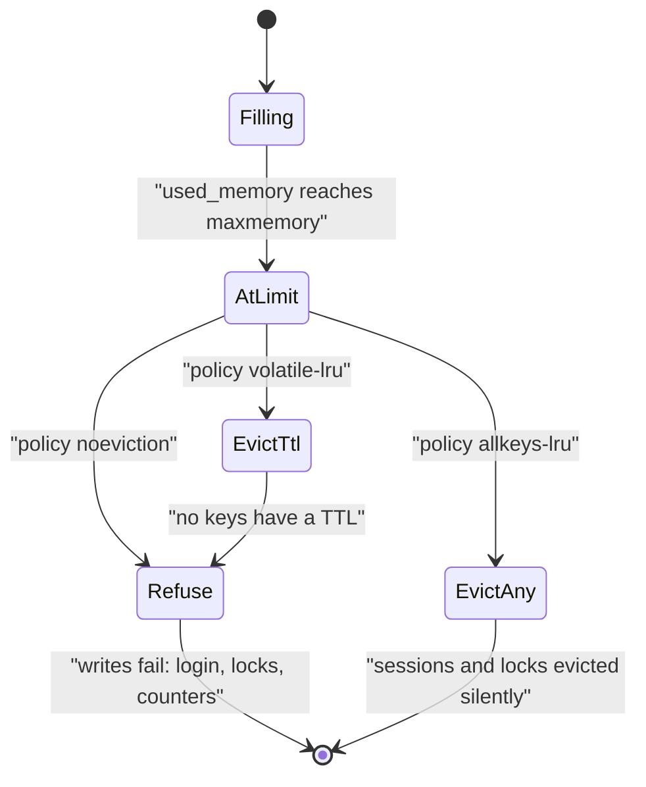
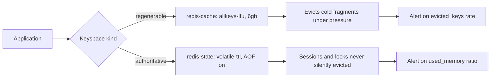

> **Scenario** - A Redis instance shared by sessions, rate limiters, and page fragments hits its 8 GB `maxmemory`. The policy is the default `noeviction`, so every write starts returning `OOM command not allowed when used memory > 'maxmemory'`. Logins fail, rate limiters stop recording, and the read path keeps working perfectly - which is why it takes eleven minutes to find.

## Why it matters

- The eviction policy decides what your cache does when it is full, and "full" is the normal steady state of a healthy cache. It is not an edge case.
- `noeviction` turns a memory limit into a write outage for every keyspace on the instance, including ones that were never meant to be cache.
- `allkeys-lru` on a mixed instance will happily evict a live session or a distributed lock to make room for a page fragment.
- Evicting the wrong thing is silent. There is no error, just a miss, so the symptom shows up as origin load or as a user being logged out.
- LRU and LFU behave very differently under scan-heavy traffic; picking by habit means your hit ratio is whatever the default gives you.

## Symptoms

| Signal | What you observe |
|--------|------------------|
| Write errors | `OOM command not allowed when used memory > 'maxmemory'` |
| `INFO stats` | `evicted_keys` climbing steadily, or pinned at zero while writes fail |
| Session loss | Users logged out at random, correlated with memory pressure |
| Hit ratio | Drops after a batch job scans a large keyspace once |
| `used_memory_rss` | Well above `used_memory`, indicating fragmentation |
| Lock failures | Distributed locks disappearing mid-critical-section |

## How it breaks

Redis enforces `maxmemory` at write time. Under `noeviction` it refuses the write; under an `allkeys-*` policy it evicts something to make room; under a `volatile-*` policy it evicts only among keys that carry a TTL - and if none do, it behaves like `noeviction` while looking configured.

The mixed-workload failure is the common one. Sessions, locks, queues, and cache fragments on one instance have incompatible eviction requirements: fragments are regenerable, sessions are not, locks must never disappear early. A single policy cannot express all three.



## Root causes

1. One Redis instance serving keyspaces with fundamentally different durability requirements.
2. Default `noeviction` left in place because nobody chose deliberately.
3. `volatile-*` policy selected while most keys are written without a TTL.
4. `maxmemory` unset or set equal to the container limit, so the kernel OOM-kills before Redis can evict.
5. No alert on `evicted_keys` or on `used_memory / maxmemory` ratio.
6. Scan-heavy batch jobs polluting an LRU cache with keys that will never be read again.

## How to solve it

### 1. Separate keyspaces by durability requirement

The cleanest fix is not a policy - it is two instances. Cache is regenerable and should evict; sessions and locks are authoritative and must not.

```yaml
# redis-cache.yaml - evictable, sized for hit ratio
maxmemory: 6gb
maxmemory-policy: allkeys-lfu
maxmemory-samples: 10
```

```yaml
# redis-state.yaml - sessions, locks, rate limiters
maxmemory: 2gb
maxmemory-policy: volatile-ttl
appendonly: "yes"
```

If a second instance is genuinely impossible, use separate logical databases and enforce that every key in the shared instance carries a TTL, so `volatile-*` has something to work with.

### 2. Choose LRU or LFU from the access pattern

```bash
# Inspect what is configured right now
redis-cli CONFIG GET maxmemory-policy
redis-cli CONFIG GET maxmemory
redis-cli INFO memory | grep -E 'used_memory_human|maxmemory_human|mem_fragmentation_ratio'
redis-cli INFO stats | grep -E 'evicted_keys|keyspace_hits|keyspace_misses'

# Switch at runtime, then persist to the config file
redis-cli CONFIG SET maxmemory-policy allkeys-lfu
redis-cli CONFIG REWRITE
```

LRU keeps whatever was touched most recently, which a single large scan will destroy. LFU keeps whatever is touched most *often*, so a one-pass batch job cannot evict your genuinely hot working set. For a read cache fronting a database, LFU is usually the better default.

### 3. Always set a TTL, even under `allkeys-*`

TTLs bound staleness and give the eviction machinery a cheap first choice. Enforce it in the cache wrapper so no call site can write an immortal key.

```php
final class BoundedCache
{
    private const MAX_TTL = 86_400;

    public function put(string $key, mixed $value, int $ttl): void
    {
        if ($ttl <= 0 || $ttl > self::MAX_TTL) {
            throw new InvalidArgumentException("TTL must be 1..".self::MAX_TTL." seconds");
        }
        Cache::put($key, $value, $ttl);
    }
}
```

### 4. Leave headroom and watch fragmentation

Set `maxmemory` to roughly 70–75% of the container limit. Redis needs room for replication buffers, client output buffers, and copy-on-write during `BGSAVE`; `used_memory_rss` can sit well above `used_memory` when fragmentation is high.

```bash
redis-cli CONFIG SET maxmemory 6gb            # container limit 8gb
redis-cli CONFIG SET activedefrag yes
```

### 5. Alert before the wall

```ts
// Exported every 15s alongside the rest of your golden signals.
export function memoryPressure(info: RedisInfo): number {
  return info.used_memory / info.maxmemory
}
// Page at 0.9 sustained for 5 minutes; ticket at 0.8.
```

## Target design



## Tradeoffs

| Option | Pros | Cons | Choose when |
|--------|------|------|-------------|
| `noeviction` | Nothing is ever silently lost | Full memory means write outage | The instance is a store of record, not a cache |
| `allkeys-lru` | Simple, adapts to recency | Scans evict the working set; evicts non-cache keys too | Uniform cache-only workload with temporal locality |
| `allkeys-lfu` | Resists scan pollution; keeps genuinely hot keys | Slower to adapt to a shifting working set | Read caches with a stable hot set (usually best) |
| `volatile-lru` / `volatile-ttl` | Protects keys without a TTL | Degenerates to `noeviction` if nothing has a TTL | Mixed instance where you can guarantee TTLs on cache keys |
| `allkeys-random` | Cheapest to compute | Ignores value; hit ratio suffers | Very high write rates where eviction cost dominates |
| Separate instances | Each policy matches its data | More infrastructure and connections to manage | Any production system past the prototype stage |

## Verification checklist

- [ ] `redis-cli CONFIG GET maxmemory-policy` returns a deliberately chosen value on every instance, documented in the runbook.
- [ ] `redis-cli CONFIG GET maxmemory` is non-zero and below the container memory limit.
- [ ] Fill the cache past `maxmemory` in staging and confirm `evicted_keys` rises while writes still succeed.
- [ ] Confirm sessions survive that same test - if they do not, the keyspaces are not separated.
- [ ] `evicted_keys` rate and `used_memory / maxmemory` are both on a dashboard with alerts.
- [ ] Run a large `SCAN`-based batch job and verify hit ratio recovers within minutes (LFU) rather than collapsing.
- [ ] Every write path goes through a wrapper that requires a TTL.

## Anti-patterns

- Leaving `maxmemory 0` in a container with a hard memory limit, so the kernel kills Redis instead of Redis evicting.
- Storing sessions and cache fragments on the same instance with `allkeys-lru`.
- Reacting to OOM errors by raising `maxmemory` to the container limit, which moves the failure from Redis to the OOM killer.
- Choosing `volatile-lru` while the majority of keys are written with no expiry.
- Treating `evicted_keys > 0` as an incident; for a cache it is normal and healthy.
- Using `FLUSHALL` to relieve memory pressure during peak traffic, which trades an OOM for a stampede.

## Related

- [Redis hot key sharding and client-side caching](/systems/caching-cdn/redis-hot-key-sharding)
- [TTL and jitter design for cache fleets](/systems/caching-cdn/ttl-and-jitter-design)
- [Cache warming after deploy and cold-start collapse](/systems/caching-cdn/cache-warming-after-deploy)
- [Cache invalidation strategies that survive deploys](/systems/caching-cdn/cache-invalidation-strategies)
