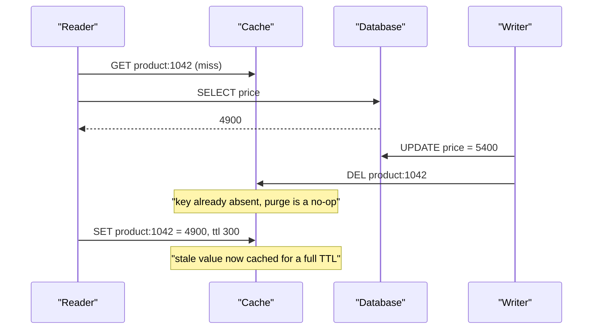
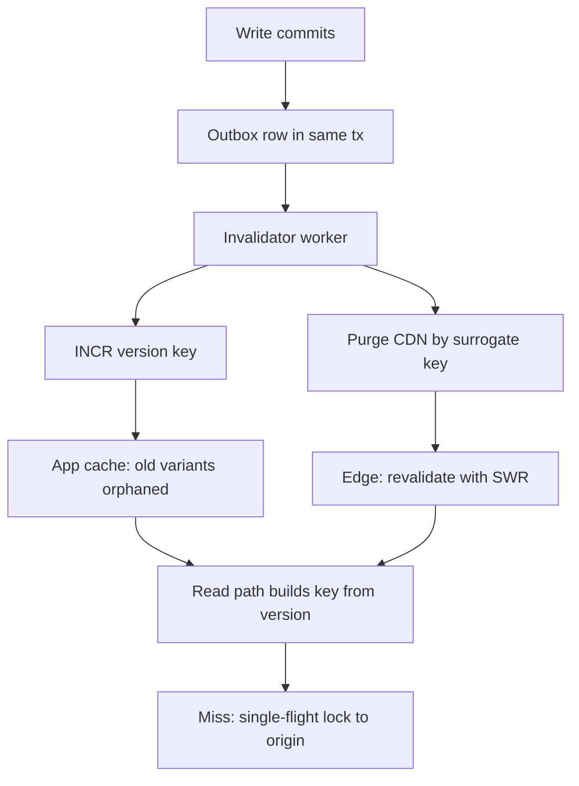

> **Scenario** - দুপুর ২:০২-এ একটি deploy নতুন pricing rule ছাড়ে। API সাথে সাথে নতুন দাম ফেরত দেয়, কিন্তু ৩০% user পরের চার ঘণ্টা পুরোনো দাম দেখে। Cache TTL ৩০০ সেকেন্ড, তাই চার ঘণ্টার stale read কোথা থেকে আসছে কেউ ব্যাখ্যা করতে পারে না।

## Why it matters

- Stale price, stale permission ও stale feature flag আসলে performance-এর পোশাক পরা correctness bug। Revoked role-এর পরেও টিকে থাকা cached ACL একটি security incident।
- চার ঘণ্টার উত্তর প্রায় সবসময় *স্তরে স্তরে* cache: browser, CDN, reverse proxy, application cache, ORM identity map। প্রতিটি স্তরের TTL overlap নয়, গুণ হয়।
- সব purge করা সমাধান নয়। Peak-এ global flush ১০০% traffic একসাথে origin-এ পাঠায়, আর cache stampede database-কে stale data-র চেয়ে অনেক বেশি ক্ষতি করে।
- Aggregate metric-এ invalidation bug অদৃশ্য। Hit rate ৯৪%-এই থাকে; শুধু নির্দিষ্ট edge node-এর ৬% user ghost দেখে।

## Symptoms

| Signal | What you observe |
|---|---|
| Staleness duration | কনফিগার করা যেকোনো একক TTL-এর চেয়ে অনেক বেশি |
| Distribution | কিছু user সাথে সাথে ঠিক, কিছু আটকে; CDN POP বা pod-এর সাথে correlate করে |
| Hit rate | Incident-এর সময় অপরিবর্তিত - cache কাজ করছে, শুধু ভুল |
| Purge-এর পর | Origin QPS ১০-৬০s-এর জন্য ২০-৫০x, p99 খাড়া উপরে |
| Post-deploy | পুরোনো cached JSON থেকে আসা response-এ নতুন schema-র field অনুপস্থিত |
| `Age` header | `max-age`-এর চেয়ে বড় মান, shared cache বা SWR ফাঁস করে |
| Reproduction | Locally reproduce হয় না; শুধু একটি CDN region আক্রান্ত |

## How it breaks

তিনটি স্বাধীন মেকানিজম একই user-visible উপসর্গ তৈরি করে।

**Layer multiplication.** 3600s browser `max-age`-এর পিছনে 600s CDN TTL, তার পিছনে 300s application TTL - worst case ৪,৫০০s, ৩০০s নয়। প্রতিটি স্তর নিচের স্তর থেকে populate করতে পারে যা আগেই stale ছিল।

**Key skew.** Write path `product:1042` invalidate করে কিন্তু read path রাখে `product:1042:v2:en-GB:currency-EUR`। Purge সফল হয়, success রিপোর্ট করে, আর কিছুই মোছে না। এটিই সবচেয়ে সাধারণ invalidation bug।

**Race on repopulate.** এক reader miss করে, database query করে, তারপর descheduled হয়। Writer row update করে ও purge করে। Reader ফিরে এসে তার *update-পূর্ব* মান এখন খালি cache-এ লিখে দেয়, যা পুরো এক TTL বেঁচে থাকে।



## Root causes

1. Cache key read path-এ তৈরি হয় কিন্তু write path-এ হাতে লেখা string দিয়ে invalidate করা হয়।
2. একাধিক cache layer, প্রত্যেকের আলাদা TTL, কোনো shared version token নেই।
3. Write-through বা read-after-write path নেই, তাই প্রথম reader lag থাকা replica থেকে repopulate করে।
4. CDN-এ URL দিয়ে purge, অথচ key `Accept-Language`, `Accept-Encoding` বা cookie-তে vary করে।
5. Deploy response shape বদলায় কিন্তু cache key namespace বদলায় না।
6. Transaction commit-এর আগেই invalidation চালানো, তাই reader pre-commit snapshot থেকে repopulate করে।

## How to solve it

### 1. Key ঠিক এক জায়গায় তৈরি করুন

Key builder-ই key বানানোর একমাত্র পথ হতে হবে, এবং invalidation API-কে read API-র মতো একই argument নিতে হবে।

```ts
type ProductKeyParts = { id: number; locale: string; currency: string }

const CACHE_SCHEMA_VERSION = 'v3' // bump on any response-shape change

export const productKey = (p: ProductKeyParts) =>
  `product:${CACHE_SCHEMA_VERSION}:${p.id}:${p.locale}:${p.currency}`

// One tag per entity; the tag is what the write path knows about.
export const productTag = (id: number) => `product:${id}`

export async function readProduct(p: ProductKeyParts) {
  return cache.remember(productKey(p), 300, () => db.product(p), { tags: [productTag(p.id)] })
}

// The writer never constructs a key. It cannot get the locale/currency fan-out wrong.
export async function invalidateProduct(id: number) {
  await cache.invalidateTag(productTag(id))
}
```

Tag-based invalidation এটাকে নিরাপদ করে: এক entity বদলালে সব variant purge হয়, writer-কে সেগুলো গুনতে হয় না।

### 2. মোছার বদলে namespace version করুন

Hot key-তে delete stampede তৈরি করে। একটি indirection pointer পুরো namespace atomically বদলে দেয় আর পুরোনো entry নিজে নিজেই expire হয়।

```python
# Read: two round trips, but no purge storm and no thundering herd.
def read_product(product_id: int, locale: str) -> dict:
    version = redis.get(f"ver:product:{product_id}") or "1"
    key = f"product:{version}:{product_id}:{locale}"
    cached = redis.get(key)
    if cached is not None:
        return json.loads(cached)
    value = db.fetch_product(product_id, locale)
    # Jittered TTL so a batch import does not create synchronised expiry.
    redis.set(key, json.dumps(value), ex=300 + random.randint(0, 60))
    return value

def invalidate_product(product_id: int) -> None:
    # Atomic: every variant is orphaned at once, old keys expire on their own TTL.
    redis.incr(f"ver:product:{product_id}")
```

### 3. Commit-এর পরে invalidate করুন, transaction-এর ভেতরে কখনো নয়

```php
// Laravel: afterCommit guarantees the reader cannot repopulate from an uncommitted snapshot.
DB::transaction(function () use ($product, $priceCents) {
    $product->update(['price_cents' => $priceCents]);

    DB::afterCommit(function () use ($product) {
        Cache::tags(["product:{$product->id}"])->flush();
        CdnPurge::dispatch("product:{$product->id}");
    });
});
```

Replica থেকেও read করলে invalidation-কে replica catch up করা পর্যন্ত অপেক্ষা করতে হবে, নয়তো read path-কে `read_after_write_window` সেকেন্ড primary-তে pin করতে হবে।

### 4. CDN key স্পষ্ট করুন এবং surrogate key দিয়ে purge করুন

```nginx
# Normalise the cache key so purges match what was actually stored.
proxy_cache_key "$scheme|$host|$uri|$arg_currency|$http_accept_language";

location /api/products/ {
    proxy_cache products;
    proxy_cache_valid 200 60s;
    # Serve stale while a single request refreshes upstream.
    proxy_cache_use_stale updating error timeout http_500 http_502 http_503;
    proxy_cache_background_update on;
    proxy_cache_lock on;
    proxy_cache_lock_timeout 5s;
    add_header X-Cache-Status $upstream_cache_status always;
}
```

CDN-এ origin থেকে `Surrogate-Key: product-1042 catalogue` পাঠান এবং key দিয়ে purge করুন। Query parameter বা `Vary` header key-তে ঢুকলেই URL purge ভেঙে যায়।

`proxy_cache_lock on` লাইনটাই purge-পরবর্তী stampede আটকায়: প্রতি key-তে একটিমাত্র request origin-এ যায়, বাকিরা অপেক্ষা করে বা stale পায়।

### 5. মোট staleness budget বেঁধে দিন

যোগফল লিখে রাখুন এবং প্রয়োগ করুন। Product requirement যদি হয় "দাম পরিবর্তন ৬০ সেকেন্ডে দৃশ্যমান", তাহলে browser + CDN + app TTL-এর যোগফল ৬০s-এর নিচে থাকতে হবে, আর যা পারবে না তা ওই স্তরে cache করা যাবে না।

## Target design



## Tradeoffs

| Option | Pros | Cons | Choose when |
|---|---|---|---|
| শুধু ছোট TTL | বোঝা সহজ; self-healing | Origin load না বাড়িয়ে staleness কমানো যায় না | ৬০s staleness গ্রহণযোগ্য এমন data |
| Event-driven purge | প্রায় তাৎক্ষণিক correctness | নির্ভরযোগ্য delivery দরকার; event হারালে অনির্দিষ্ট staleness | দাম, permission, publish/unpublish |
| Versioned key | Atomic, stampede-free, purge fan-out নেই | অতিরিক্ত round trip; orphan expire না হওয়া পর্যন্ত memory ধরে | অনেক variant সহ hot entity |
| Write-through | Write-এর পর cache কখনো খালি নয় | Write latency-তে cache write যোগ হয়; dual-write failure | Read-heavy, কম write |
| Tag-based invalidation | Writer variant গুনতে হয় না | Tag সমর্থন করা cache backend দরকার | locale/currency/role fan-out আছে এমন entity |

## Verification checklist

- [ ] Grep প্রমাণ করে key-builder module-এর বাইরে কোনো cache key তৈরি হয় না।
- [ ] মোট staleness budget নথিভুক্ত এবং প্রতিটি স্তরের TTL-এর যোগফল তার নিচে।
- [ ] Integration test write, invalidate ও budget-এর মধ্যে fresh read assert করে - শুধু app cache নয়, CDN দিয়েও।
- [ ] Peak-এ এক entity purge করলে origin QPS 2x-এর বেশি বাড়ে না (`proxy_cache_lock` বা single-flight প্রমাণিতভাবে চালু)।
- [ ] `X-Cache-Status` ও `Age` expose করা ও POP অনুযায়ী graph করা।
- [ ] Response shape বদলালে `CACHE_SCHEMA_VERSION` বাড়ে; না বাড়লে test fail করে।
- [ ] Invalidation event durable (outbox), এবং dropped-event alert আছে।

## Anti-patterns

- Incident response হিসেবে `FLUSHALL` বা পুরো CDN purge - stale-read bug-এর বদলে origin outage কিনলেন।
- Transaction-এর ভেতরে invalidate করা, যা নিশ্চিতভাবে pre-commit মান cache করে।
- "আপাতত ঠিক করতে" সব কিছুতে `Cache-Control: no-cache`; origin খরচ ৩০x বাড়ে আর আসল bug পরের release পর্যন্ত টিকে থাকে।
- Retry ছাড়া message bus-এ fire-and-forget invalidation; একটি message হারালে একটি key স্থায়ীভাবে stale।
- Batch-import করা dataset-এ অভিন্ন TTL, ফলে দশ লক্ষ key একই সেকেন্ডে expire হয়।

## Related

- [Cache stampede prevention](/systems/caching-cdn/cache-stampede-prevention)
- [TTL and jitter design](/systems/caching-cdn/ttl-and-jitter-design)
- [CDN cache key normalization](/systems/caching-cdn/cdn-cache-key-normalization)
- [Stale-while-revalidate patterns](/systems/caching-cdn/stale-while-revalidate-patterns)
- [Distributed cache consistency](/systems/caching-cdn/distributed-cache-consistency)
