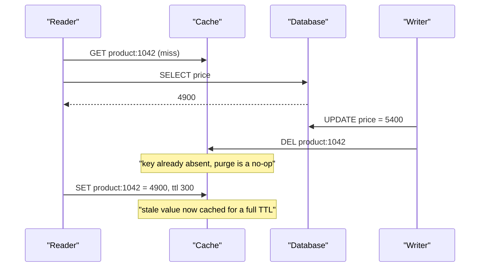
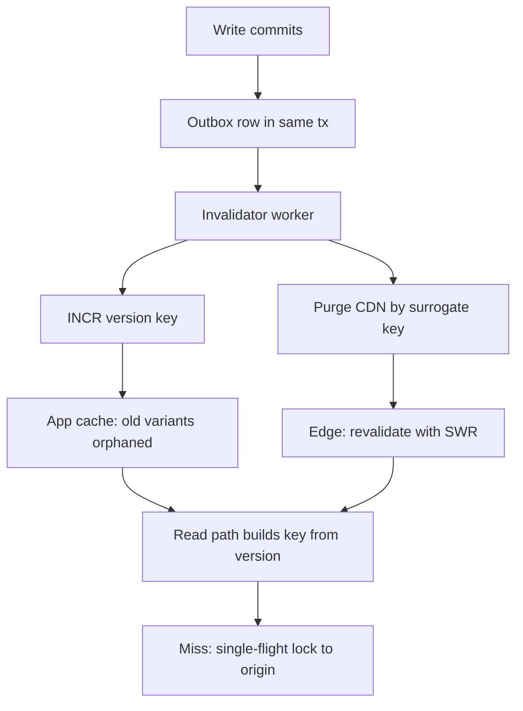

> **Scenario** — A deploy ships a new pricing rule at 14:02. The API returns the new price immediately, but 30% of users see the old one for the next four hours. The cache TTL is 300 seconds, so nobody can explain where a four-hour stale read comes from.

## Why it matters

- Stale prices, stale permissions, and stale feature flags are all correctness bugs wearing a performance costume. A cached ACL that outlives a revoked role is a security incident.
- The four-hour answer is almost always *layered* caches: browser, CDN, reverse proxy, application cache, ORM identity map. Each layer's TTL multiplies rather than overlaps.
- Purging everything is not a fix. A global flush at peak sends 100% of traffic to the origin at once, and the cache stampede takes the database down harder than the stale data ever hurt.
- Invalidation bugs are invisible in aggregate metrics. Hit rate stays at 94%; only the 6% of users on a specific edge node see the ghost.

## Symptoms

| Signal | What you observe |
|---|---|
| Staleness duration | Far longer than any single configured TTL |
| Distribution | Some users fixed instantly, others stuck; correlates with CDN POP or pod |
| Hit rate | Unchanged during the incident — the cache is working, it is just wrong |
| After a purge | Origin QPS spikes 20-50x for 10-60s, p99 goes vertical |
| Post-deploy | Errors referencing fields that only exist in the new schema, served from old cached JSON |
| `Age` header | Values greater than `max-age`, revealing a `stale-while-revalidate` or shared cache |
| Reproduction | Cannot reproduce locally; only one CDN region is affected |

## How it breaks

Three independent mechanisms produce the same user-visible symptom.

**Layer multiplication.** A 300s application TTL behind a 600s CDN TTL behind a 3600s browser `max-age` gives a worst case of 4,500s, not 300s. Each layer can populate from a lower layer that was already stale.

**Key skew.** The write path invalidates `product:1042` but the read path stores `product:1042:v2:en-GB:currency-EUR`. The purge succeeds, reports success, and deletes nothing. This is the single most common invalidation bug.

**Race on repopulate.** A reader misses, queries the database, and is descheduled. The writer updates the row and purges. The reader resumes and writes its *pre-update* value into the now-empty cache, where it lives for a full TTL.



## Root causes

1. Cache keys built in the read path but invalidated with a hand-written string in the write path.
2. Multiple cache layers with independent TTLs and no shared version token.
3. No write-through or read-after-write path, so the first reader repopulates from a replica with lag.
4. Purge-by-URL on a CDN that varies on `Accept-Language`, `Accept-Encoding`, or a cookie.
5. Deploys that change the response shape without changing the cache key namespace.
6. Invalidation fired before the transaction commits, so the reader repopulates from the pre-commit snapshot.

## How to solve it

### 1. Derive the key in exactly one place

The key builder must be the only way to construct a key, and the invalidation API must take the same arguments as the read API.

```ts
type ProductKeyParts = { id: number; locale: string; currency: string }

const CACHE_SCHEMA_VERSION = 'v3' // bump on any response-shape change

export const productKey = (p: ProductKeyParts) =>
  `product:${CACHE_SCHEMA_VERSION}:${p.id}:${p.locale}:${p.currency}`

// One tag per entity; the tag is what the write path knows about.
export const productTag = (id: number) => `product:${id}`

export async function readProduct(p: ProductKeyParts) {
  return cache.remember(productKey(p), 300, () => db.product(p), { tags: [productTag(p.id)] })
}

// The writer never constructs a key. It cannot get the locale/currency fan-out wrong.
export async function invalidateProduct(id: number) {
  await cache.invalidateTag(productTag(id))
}
```

Tag-based invalidation is what makes this safe: one entity change purges every variant, without the writer enumerating them.

### 2. Version the namespace instead of deleting

For hot keys, a delete creates a stampede. An indirection pointer swaps the whole namespace atomically and lets old entries expire naturally.

```python
# Read: two round trips, but no purge storm and no thundering herd.
def read_product(product_id: int, locale: str) -> dict:
    version = redis.get(f"ver:product:{product_id}") or "1"
    key = f"product:{version}:{product_id}:{locale}"
    cached = redis.get(key)
    if cached is not None:
        return json.loads(cached)
    value = db.fetch_product(product_id, locale)
    # Jittered TTL so a batch import does not create synchronised expiry.
    redis.set(key, json.dumps(value), ex=300 + random.randint(0, 60))
    return value

def invalidate_product(product_id: int) -> None:
    # Atomic: every variant is orphaned at once, old keys expire on their own TTL.
    redis.incr(f"ver:product:{product_id}")
```

### 3. Invalidate after commit, never inside the transaction

```php
// Laravel: afterCommit guarantees the reader cannot repopulate from an uncommitted snapshot.
DB::transaction(function () use ($product, $priceCents) {
    $product->update(['price_cents' => $priceCents]);

    DB::afterCommit(function () use ($product) {
        Cache::tags(["product:{$product->id}"])->flush();
        CdnPurge::dispatch("product:{$product->id}");
    });
});
```

If you also read from replicas, the invalidation must wait for the replica to catch up, or the read path must pin to the primary for `read_after_write_window` seconds.

### 4. Make the CDN key explicit and purge by surrogate key

```nginx
# Normalise the cache key so purges match what was actually stored.
proxy_cache_key "$scheme|$host|$uri|$arg_currency|$http_accept_language";

location /api/products/ {
    proxy_cache products;
    proxy_cache_valid 200 60s;
    # Serve stale while a single request refreshes upstream.
    proxy_cache_use_stale updating error timeout http_500 http_502 http_503;
    proxy_cache_background_update on;
    proxy_cache_lock on;
    proxy_cache_lock_timeout 5s;
    add_header X-Cache-Status $upstream_cache_status always;
}
```

On a CDN, emit `Surrogate-Key: product-1042 catalogue` from the origin and purge by key. URL purges break the moment a query parameter or `Vary` header enters the key.

`proxy_cache_lock on` is the line that prevents the post-purge stampede: only one request per key reaches the origin, the rest wait or get stale.

### 5. Bound the total staleness budget

Write the sum down and enforce it. If the product requirement is "price changes visible within 60 seconds", then browser + CDN + app TTLs must sum to under 60s, and anything that cannot meet it must not be cached at that layer.

## Target design



## Tradeoffs

| Option | Pros | Cons | Choose when |
|---|---|---|---|
| Short TTL only | Trivial to reason about; self-healing | Bounded staleness you cannot shorten without more origin load | Data where 60s of staleness is acceptable |
| Event-driven purge | Near-immediate correctness | Needs reliable delivery; a dropped event means indefinite staleness | Prices, permissions, publish/unpublish |
| Versioned keys | Atomic, stampede-free, no purge fan-out | Extra round trip; memory holds orphans until they expire | Hot entities with many cached variants |
| Write-through | Cache is never empty after a write | Write latency includes cache write; dual-write failure modes | Read-heavy, low write rate |
| Tag-based invalidation | Writer does not enumerate variants | Requires a cache backend that supports tags | Any entity with locale/currency/role fan-out |

## Verification checklist

- [ ] Grep proves no cache key is constructed outside the key-builder module.
- [ ] Total staleness budget is documented and the sum of every layer's TTL is under it.
- [ ] An integration test writes, invalidates, and asserts a fresh read within the budget — through the CDN, not just the app cache.
- [ ] Purging one entity at peak does not raise origin QPS by more than 2x (`proxy_cache_lock` or single-flight is proven on).
- [ ] `X-Cache-Status` and `Age` are exposed and graphed per POP.
- [ ] Deploying a response-shape change bumps `CACHE_SCHEMA_VERSION`; a test fails if the shape changes without it.
- [ ] Invalidation events are durable (outbox), and a dropped-event alert exists.

## Anti-patterns

- `FLUSHALL` or a full CDN purge as the incident response — you traded a stale-read bug for an origin outage.
- Invalidating inside the transaction, which reliably caches the pre-commit value.
- `Cache-Control: no-cache` on everything to "fix it for now"; origin cost goes up 30x and the real bug survives to the next release.
- Fire-and-forget invalidation over a message bus with no retry; one dropped message means one permanently stale key.
- Uniform TTLs across a batch-imported dataset, so a million keys expire in the same second.

## Related

- [Cache stampede prevention](/systems/caching-cdn/cache-stampede-prevention)
- [TTL and jitter design](/systems/caching-cdn/ttl-and-jitter-design)
- [CDN cache key normalization](/systems/caching-cdn/cdn-cache-key-normalization)
- [Stale-while-revalidate patterns](/systems/caching-cdn/stale-while-revalidate-patterns)
- [Distributed cache consistency](/systems/caching-cdn/distributed-cache-consistency)
