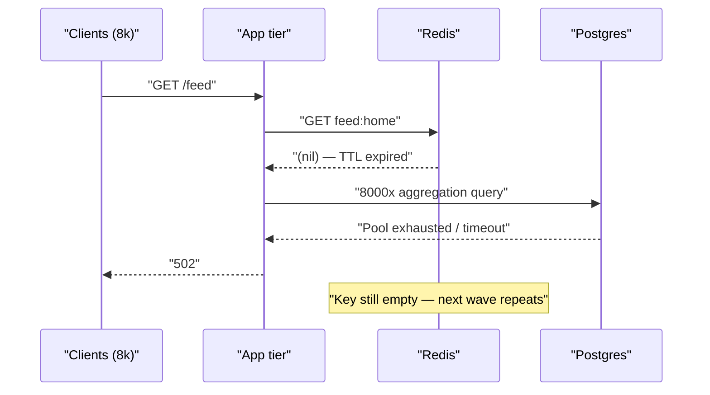
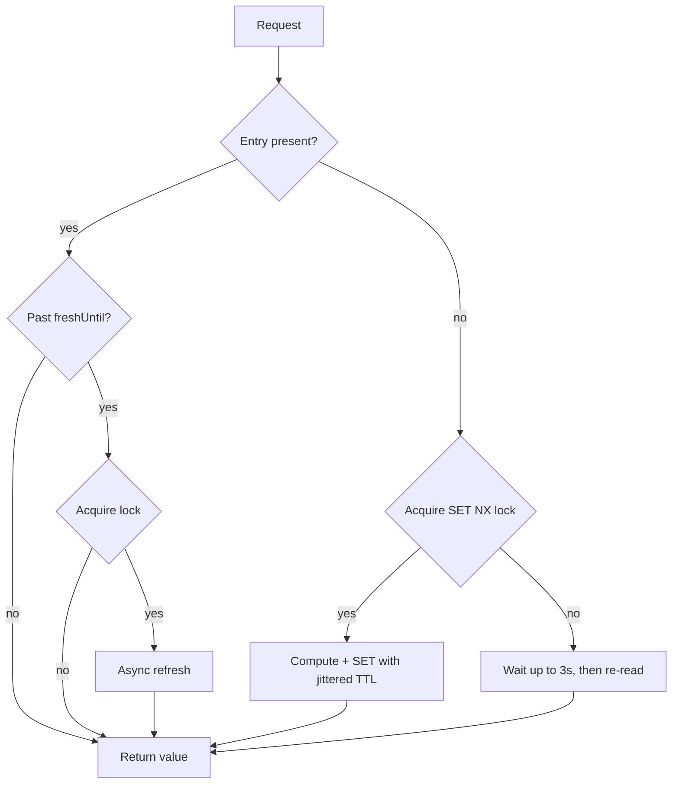

> **Scenario** — homepage feed একটি single key-তে Redis-এ cache করা, TTL 300 সেকেন্ড। promo night-এ রাত 21:00-এ key expire হয়, 8,000 concurrent request একসাথে miss করে, এবং প্রত্যেকটি একই 700 ms aggregation query primary database-এ চালায়। দুই সেকেন্ডের মধ্যে connection pool শেষ, চার মিনিট ধরে সাইট 502 দেয়।

## Why it matters

- Stampede একটি *cache expiry*-কে — যা রুটিন ও প্রত্যাশিত ঘটনা — পুরো origin outage-এ পরিণত করে। কিছুই ভাঙেনি; শুধু একটি timer fire করেছে।
- Blast radius popularity-র সাথে বাড়ে। key যত hot, collapse তত খারাপ — অর্থাৎ আপনার সবচেয়ে ভালো পারফর্ম করা page আগে fail করে।
- Recovery স্বয়ংক্রিয় নয়। database saturate হয়ে গেলে recomputation নিজেই timeout করে, cache repopulate হয় না, পরের wave-ও miss করে।
- On-call "database CPU 100%" alert পেয়ে প্রথম দশ মিনিট query plan দেখে — cache TTL নয়।
- প্রতিটি duplicate recomputation টাকা: যেখানে একটি aggregation যথেষ্ট, সেখানে 8,000।

## Symptoms

| Signal | What you observe |
|--------|------------------|
| Origin QPS | flat baseline, TTL-এর exact multiple-এ vertical spike |
| Redis `keyspace_misses` | হঠাৎ step increase ও sustained, `keyspace_hits` পড়ে যায় |
| DB active connections | spike-এর 1–3 সেকেন্ডের মধ্যে pool saturated |
| p99 latency | কোনো deploy ছাড়াই 40 ms থেকে timeout ceiling (30 s) |
| Error pattern | app tier থেকে 502/504, 500 নয় — request শেষই হয় না |
| Periodicity | TTL-এর interval মিলিয়ে incident ফিরে আসে, প্রায়ই round clock boundary-তে |

## How it breaks

Cache read কোনো critical section নয়। key উধাও হলে প্রতিটি concurrent request স্বাধীনভাবে miss দেখে এবং প্রত্যেকে ভাবে value recompute করা তার দায়িত্ব। "miss" আর "write"-এর মাঝে কোনো coordination point নেই, তাই recomputation-এর concurrency = request concurrency।

Failure নিজেকেই amplify করে: recomputation ধীর হয় *কারণ* বাকি recomputation-গুলো database overload করেছে। query যদি request timeout-এর চেয়ে বেশি সময় নেয়, কোনো request-ই `SET` শেষ করতে পারে না, cache খালি থেকে যায়, এবং traffic shed না করা পর্যন্ত stampede থামে না।



## Root causes

1. cache miss ও recomputation-এর মাঝে mutual exclusion নেই — miss path-এর concurrency unbounded।
2. Hard expiry semantics: TTL-এ value এক মুহূর্তে পুরোপুরি usable থেকে পুরোপুরি অনুপস্থিত হয়ে যায়।
3. সব replica একই মুহূর্তে seed হয়েছে (deploy, warm script বা bulk import), তাই TTL পুরোপুরি correlated।
4. Recomputation cost যথেষ্ট বেশি (শত শত ms, microsecond নয়) যাতে duplicated work সত্যিই ক্ষতি করে।
5. miss path-এ কোনো load shedding নেই — app আগেই reject না করে 8,000 database call queue করে।
6. Timeout recomputation-এর চেয়ে লম্বা, তাই failing request connection ছাড়ে না, ধরে রাখে।

## How to solve it

### 1. Single-flight with a short lock

শুধু একটি request recompute করার অনুমতি পায়; বাকিরা অল্প সময় wait করে বা stale serve করে। `SET NX PX` হলো primitive — holder crash করলে `PX` lock নিজে ছেড়ে দেয়।

```bash
# Acquire: succeeds for exactly one caller
SET lock:feed:home <random-token> NX PX 5000
# Release: only if we still own it (avoid deleting someone else's lock)
EVAL "if redis.call('GET', KEYS[1]) == ARGV[1] then return redis.call('DEL', KEYS[1]) else return 0 end" 1 lock:feed:home <random-token>
```

Laravel-এ এটাই `Cache::lock()`:

```php
public function homeFeed(): array
{
    return Cache::remember('feed:home', 300, function () {
        // Only one process computes; others block up to 3s then re-read.
        return Cache::lock('lock:feed:home', 5)->block(3, function () {
            return Cache::get('feed:home') ?? $this->aggregateFeed();
        });
    });
}
```

### 2. Serve stale while one worker refreshes

payload-এর সাথে একটি logical freshness timestamp রাখুন এবং *physical* TTL তার চেয়ে অনেক বড় দিন। logical deadline পেরোনো reader সাথে সাথে পুরনো value serve করে এবং async refresh trigger করে।

```ts
type Entry<T> = { value: T; freshUntil: number }

const LOGICAL_TTL_MS = 300_000
const PHYSICAL_TTL_S = 3_600

export async function getWithEarlyRefresh<T>(
  key: string,
  compute: () => Promise<T>,
): Promise<T> {
  const raw = await redis.get(key)
  if (!raw) return refresh(key, compute)

  const entry = JSON.parse(raw) as Entry<T>
  if (Date.now() < entry.freshUntil) return entry.value

  // Stale but usable: one holder refreshes in the background, everyone else
  // gets the old value with zero added latency.
  const gotLock = await redis.set(`lock:${key}`, '1', 'NX', 'PX', 5_000)
  if (gotLock) void refresh(key, compute).catch(() => redis.del(`lock:${key}`))
  return entry.value
}

async function refresh<T>(key: string, compute: () => Promise<T>): Promise<T> {
  const value = await compute()
  const entry: Entry<T> = { value, freshUntil: Date.now() + LOGICAL_TTL_MS }
  await redis.set(key, JSON.stringify(entry), 'EX', PHYSICAL_TTL_S)
  await redis.del(`lock:${key}`)
  return value
}
```

### 3. Probabilistic early expiration (XFetch)

hard cutoff-এর বদলে deadline যত কাছে আসে তত বেশি probability-তে refresh করুন, recomputation কত ব্যয়বহুল তা দিয়ে weighted। এতে refresh TTL-এর শেষ কয়েক সেকেন্ডে ছড়িয়ে যায়, এক বিন্দুতে জমে না।

```ts
// delta = measured compute time in ms, beta = aggressiveness (1.0 is a fine default)
const shouldRefreshEarly =
  Date.now() - entry.deltaMs * 1.0 * Math.log(Math.random()) >= entry.freshUntil
```

### 4. Let the CDN absorb the herd

anonymous, cacheable response-এর জন্য `stale-while-revalidate` একই ধারণা edge-এ নিয়ে যায় এবং request app tier-এ পৌঁছানোর আগেই collapse করে।

```nginx
location /feed {
    proxy_cache app_cache;
    proxy_cache_valid 200 5m;
    # One request per key goes upstream; the rest wait on it.
    proxy_cache_lock on;
    proxy_cache_lock_timeout 5s;
    # Keep serving the old object while the single refresh is in flight.
    proxy_cache_use_stale updating error timeout http_500 http_502 http_503;
    proxy_cache_background_update on;
    add_header X-Cache-Status $upstream_cache_status always;
}
```

## Target design



## Tradeoffs

| Option | Pros | Cons | Choose when |
|--------|------|------|-------------|
| Single-flight lock | ঠিক একটি recomputation; বোঝা সহজ | waiter-রা পুরো latency দেয়; lock নিজেই নতুন failure mode | recomputation দ্রুত (~500 ms-এর কম) ও stale data অগ্রহণযোগ্য |
| Serve stale + async refresh | latency spike নেই, origin key-প্রতি 1 QPS দেখে | user এক TTL পুরনো data দেখতে পারে | freshness tolerance সেকেন্ডে মাপা যায়, millisecond-এ নয় |
| Probabilistic early expiry | lock নেই, coordination নেই, origin load মসৃণ | কিছু duplicated work; measured compute cost লাগে | এক দানব key নয়, অনেক medium-hot key |
| CDN `proxy_cache_lock` | herd app-এ পৌঁছায়ই না | শুধু shared, non-personalized response-এ কাজ করে | ছোট URL সেটে anonymous traffic |
| Never expire, refresh by event | expiry-driven spike একেবারেই নেই | invalidation bug মানে স্থায়ীভাবে ভুল data | প্রতিটি writer আপনার নিয়ন্ত্রণে ও নির্ভরযোগ্য change event দেয় |

## Verification checklist

- [ ] miss path load-test: 2,000 RPS-এ `redis-cli DEL feed:home` চালিয়ে দেখুন origin QPS প্রায় 1-এ থাকে।
- [ ] `redis-cli --hotkeys` (বা sampled `MONITOR`) refresh cycle-প্রতি একটি `SET` দেখায়, হাজারটি নয়।
- [ ] অনেক key-তে `TTL feed:home` ছড়ানো মান দেয়, একই সংখ্যা নয়।
- [ ] origin restart-এর সময় `X-Cache-Status` `HIT`, `UPDATING` বা `STALE` দেখায় — volume-এ কখনো `MISS` নয়।
- [ ] Lock TTL p99 recomputation time-এর চেয়ে বড় এবং request timeout-এর চেয়ে ছোট।
- [ ] refresh চলাকালীন lock-holder process kill করুন; `PX` window-এর মধ্যে পরের request recover করে কিনা দেখুন।
- [ ] একটি dashboard panel origin QPS ও cache miss rate একই axis-এ plot করে।

## Anti-patterns

- "miss কমাতে" TTL বাড়ানো — এতে stampede-এর frequency কমে, size বাড়ে।
- expiry ছাড়া `SETNX`: একটি worker crash করলেই key চিরকাল locked।
- recomputation-এর চেয়ে ছোট TTL-এ lock করা, ফলে দুই worker "একই" lock ধরে দুজনেই write করে।
- failure-এ miss path retry করা — retry storm আর stampede একসাথে বাড়ে।
- deploy-এর পর tight loop-এ প্রতিটি key warm করা, যা আবার perfectly correlated TTL তৈরি করে।
- local in-process cache যোগ করে সমস্যা সমাধান ধরে নেওয়া; herd শুধু pod count দিয়ে ভাগ হয়, 200 pod-এ তা যথেষ্ট নয়।

## Related

- [TTL and jitter design for cache fleets](/systems/caching-cdn/ttl-and-jitter-design)
- [stale-while-revalidate and stale-if-error patterns](/systems/caching-cdn/stale-while-revalidate-patterns)
- [Cache warming after deploy and cold-start collapse](/systems/caching-cdn/cache-warming-after-deploy)
- [Cache invalidation strategies that survive deploys](/systems/caching-cdn/cache-invalidation-strategies)
