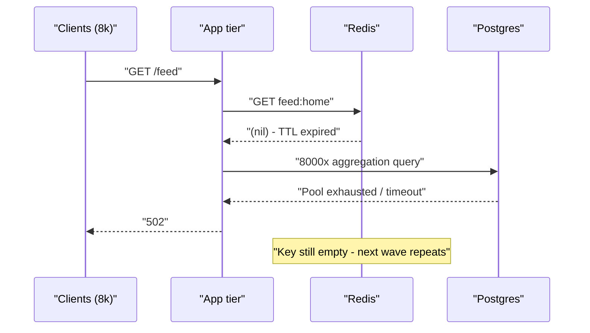
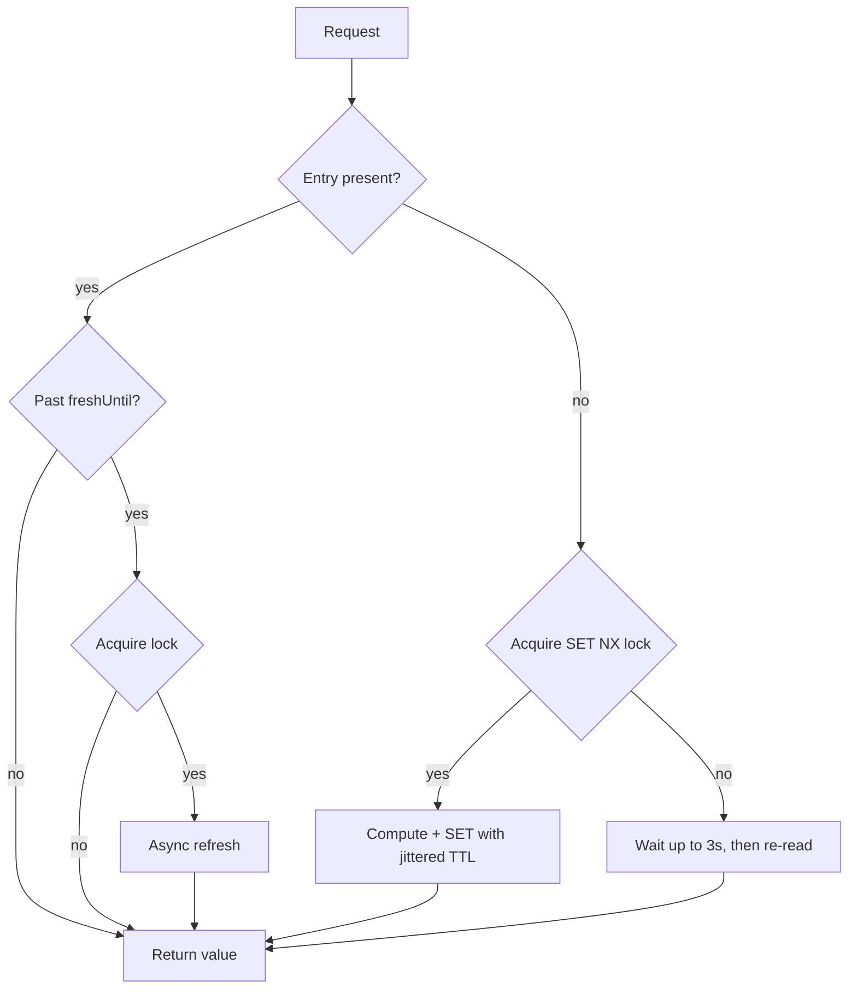

> **Scenario** - The homepage feed is cached in Redis under a single key with a 300-second TTL. At 21:00 on a promo night the key expires, 8,000 concurrent requests all miss, and every one of them runs the same 700 ms aggregation query against the primary database. Connection pool exhausts in under two seconds and the site returns 502 for four minutes.

## Why it matters

- A stampede converts a *cache expiry* - a routine, expected event - into a full origin outage. Nothing was broken; a timer fired.
- The blast radius scales with popularity. The hotter the key, the worse the collapse, so your best-performing pages fail first.
- Recovery is not automatic. Once the database is saturated, the recomputation itself times out, nothing repopulates the cache, and the next wave misses too.
- On-call gets paged for "database CPU 100%" and spends the first ten minutes looking at query plans instead of at cache TTLs.
- Every duplicate recomputation is money: 8,000 identical aggregations where one would do.

## Symptoms

| Signal | What you observe |
|--------|------------------|
| Origin QPS | Flat baseline with a vertical spike at an exact multiple of the TTL |
| Redis `keyspace_misses` | Sharp step increase, then sustained, while `keyspace_hits` drops |
| DB active connections | Pool saturated within 1–3 seconds of the spike |
| p99 latency | Jumps from 40 ms to timeout ceiling (30 s) with no code deploy |
| Error pattern | 502/504 from the app tier, not 500 - requests never finish |
| Periodicity | Incidents recur at intervals matching the TTL, often on round clock boundaries |

## How it breaks

A cache read is not a critical section. When the key disappears, every concurrent request independently sees a miss, and each one believes it is responsible for recomputing the value. There is no coordination point between "miss" and "write", so the concurrency of the recomputation equals the request concurrency.

The failure amplifies itself: the recomputation is slow *because* the database is now overloaded by the other recomputations. If the query takes longer than the request timeout, no request ever completes the `SET`, so the cache stays empty and the stampede never ends until traffic is shed.



## Root causes

1. No mutual exclusion between the cache miss and the recomputation - the miss path is unbounded in concurrency.
2. Hard expiry semantics: at TTL the value goes from perfectly usable to completely gone in one instant.
3. All replicas were seeded at the same moment (deploy, warm script, or a bulk import), so their TTLs are perfectly correlated.
4. The recomputation cost is high enough that duplicated work actually matters (hundreds of milliseconds, not microseconds).
5. No load shedding on the miss path - the app happily queues 8,000 database calls instead of rejecting early.
6. Timeouts longer than the recomputation, so failing requests hold connections instead of releasing them.

## How to solve it

### 1. Single-flight with a short lock

Only one request is allowed to recompute; the rest either wait briefly or serve stale. `SET NX PX` is the primitive - the `PX` guarantees the lock self-releases if the holder crashes.

```bash
# Acquire: succeeds for exactly one caller
SET lock:feed:home <random-token> NX PX 5000
# Release: only if we still own it (avoid deleting someone else's lock)
EVAL "if redis.call('GET', KEYS[1]) == ARGV[1] then return redis.call('DEL', KEYS[1]) else return 0 end" 1 lock:feed:home <random-token>
```

In Laravel this is `Cache::lock()`, which wraps the same pattern:

```php
public function homeFeed(): array
{
    return Cache::remember('feed:home', 300, function () {
        // Only one process computes; others block up to 3s then re-read.
        return Cache::lock('lock:feed:home', 5)->block(3, function () {
            return Cache::get('feed:home') ?? $this->aggregateFeed();
        });
    });
}
```

### 2. Serve stale while one worker refreshes

Store the payload with a logical freshness timestamp and a *physical* TTL well beyond it. Readers past the logical deadline serve the old value immediately and trigger an async refresh.

```ts
type Entry<T> = { value: T; freshUntil: number }

const LOGICAL_TTL_MS = 300_000
const PHYSICAL_TTL_S = 3_600

export async function getWithEarlyRefresh<T>(
  key: string,
  compute: () => Promise<T>,
): Promise<T> {
  const raw = await redis.get(key)
  if (!raw) return refresh(key, compute)

  const entry = JSON.parse(raw) as Entry<T>
  if (Date.now() < entry.freshUntil) return entry.value

  // Stale but usable: one holder refreshes in the background, everyone else
  // gets the old value with zero added latency.
  const gotLock = await redis.set(`lock:${key}`, '1', 'NX', 'PX', 5_000)
  if (gotLock) void refresh(key, compute).catch(() => redis.del(`lock:${key}`))
  return entry.value
}

async function refresh<T>(key: string, compute: () => Promise<T>): Promise<T> {
  const value = await compute()
  const entry: Entry<T> = { value, freshUntil: Date.now() + LOGICAL_TTL_MS }
  await redis.set(key, JSON.stringify(entry), 'EX', PHYSICAL_TTL_S)
  await redis.del(`lock:${key}`)
  return value
}
```

### 3. Probabilistic early expiration (XFetch)

Instead of a hard cutoff, refresh with rising probability as the deadline approaches, weighted by how expensive the recomputation is. This spreads refreshes over the last seconds of the TTL rather than concentrating them at one instant.

```ts
// delta = measured compute time in ms, beta = aggressiveness (1.0 is a fine default)
const shouldRefreshEarly =
  Date.now() - entry.deltaMs * 1.0 * Math.log(Math.random()) >= entry.freshUntil
```

### 4. Let the CDN absorb the herd

For anonymous, cacheable responses, `stale-while-revalidate` moves the same idea to the edge and collapses requests before they reach your app tier at all.

```nginx
location /feed {
    proxy_cache app_cache;
    proxy_cache_valid 200 5m;
    # One request per key goes upstream; the rest wait on it.
    proxy_cache_lock on;
    proxy_cache_lock_timeout 5s;
    # Keep serving the old object while the single refresh is in flight.
    proxy_cache_use_stale updating error timeout http_500 http_502 http_503;
    proxy_cache_background_update on;
    add_header X-Cache-Status $upstream_cache_status always;
}
```

## Target design



## Tradeoffs

| Option | Pros | Cons | Choose when |
|--------|------|------|-------------|
| Single-flight lock | Exactly one recomputation; simple to reason about | Waiters still pay full latency; lock is a new failure mode | Recomputation is fast (under ~500 ms) and stale data is unacceptable |
| Serve stale + async refresh | Zero latency spike, origin sees 1 QPS per key | Users can see data one TTL old | Freshness tolerance is measured in seconds, not milliseconds |
| Probabilistic early expiry | No lock, no coordination, smooth origin load | Some duplicated work; needs a measured compute cost | Many medium-hot keys rather than one giant key |
| CDN `proxy_cache_lock` | Herd never touches your app | Only works for shared, non-personalized responses | Anonymous traffic on a small set of URLs |
| Never expire, refresh by event | No expiry-driven spikes at all | Invalidation bugs mean permanently wrong data | You control every writer and can emit reliable change events |

## Verification checklist

- [ ] Load-test the miss path: `redis-cli DEL feed:home` under 2,000 RPS and confirm origin QPS stays near 1.
- [ ] `redis-cli --hotkeys` (or `MONITOR` sampled) shows a single `SET` per refresh cycle, not thousands.
- [ ] `TTL feed:home` across many keys returns spread values, not one identical number.
- [ ] `X-Cache-Status` shows `HIT`, `UPDATING`, or `STALE` during an origin restart - never `MISS` at volume.
- [ ] Lock TTL is strictly greater than p99 recomputation time and strictly less than the request timeout.
- [ ] Kill the process holding the lock mid-refresh; confirm the lock expires and the next request recovers within its `PX` window.
- [ ] A dashboard panel plots origin QPS against cache miss rate on the same axis.

## Anti-patterns

- Raising the TTL to "reduce misses" - it lowers the frequency of the stampede and increases its size.
- `SETNX` without an expiry: one crashed worker and the key is locked forever.
- Locking with a TTL shorter than the recomputation, so two workers hold the "same" lock and both write.
- Retrying the miss path on failure - the retry storm and the stampede compound.
- Warming every key in a tight loop after deploy, which recreates perfectly correlated TTLs.
- Adding a local in-process cache and calling it fixed; you divide the herd by the pod count, which is not enough at 200 pods.

## Related

- [TTL and jitter design for cache fleets](/systems/caching-cdn/ttl-and-jitter-design)
- [stale-while-revalidate and stale-if-error patterns](/systems/caching-cdn/stale-while-revalidate-patterns)
- [Cache warming after deploy and cold-start collapse](/systems/caching-cdn/cache-warming-after-deploy)
- [Cache invalidation strategies that survive deploys](/systems/caching-cdn/cache-invalidation-strategies)
