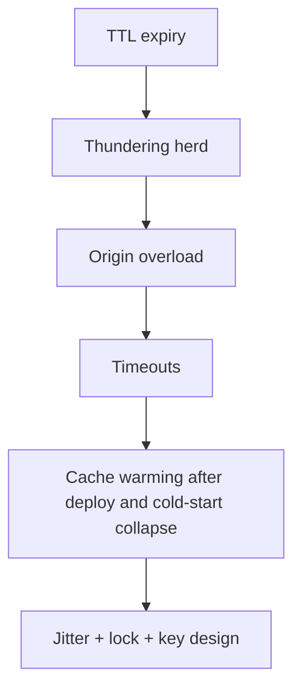

> **Lesson 51 · intermediate** - A key-prefix version bump empties the cache at peak traffic and the database falls over 40 seconds later - warm before you shift traffic.

## Why it matters

- Cache-aside without jitter thunders every TTL. Personalized HTML on a CDN cache is tomorrow’s privacy incident.
- After deploy, a cold Redis looks like an outage even when MySQL is fine.
- Eviction policy is a product decision: LRU vs TTL vs explicit invalidate.
- This lesson is specifically about **Cache warming after deploy and cold-start collapse**. Tags: cache-warming, deploy, cold-start, canary.

## Symptoms

| Signal | What you observe |
| --- | --- |
| Stampede | MySQL CPU 100% every 5 minutes on the second |
| Stale private | User B sees User A’s name in the header |
| Cold start | First request after deploy is 3s, then 40ms |
| Wrong key | Locale or tenant missing from the cache key |

## How it breaks



The named technology is rarely the villain. Two code paths (often a Vue/Quasar screen and a Laravel write) assume opposite contracts. Production finds the race. For this topic that contract is: A key-prefix version bump empties the cache at peak traffic and the database falls over 40 seconds later - warm before you shift traffic.

## Root causes

1. Same TTL on every key, no lottery/jitter, no singleflight lock.
2. CDN cached `/dashboard` without `Vary: Cookie` or a private Cache-Control.
3. No warming job for the ten hottest keys after release.
4. Key designed as `ticket:{id}` instead of `ticket:{tenant}:{id}:{locale}`.

## How to solve it

### 1. Write the invariant in one sentence

A key-prefix version bump empties the cache at peak traffic and the database falls over 40 seconds later - warm before you shift traffic. Put that sentence in the PR, the Pinia action, and the Laravel class.

### 2. Guard the edge in code

```ts
// Remember: Pinia is not Redis. Cache server JSON, not the whole store.
export async function ticketSummary(id: number) {
  return await api.get(`/api/tickets/${id}/summary`)
}
```

```php
$ttl = 60 + random_int(0, 15); // jitter so TTLs do not align
return Cache::remember("ticket:{$tenant}:{$id}:summary", $ttl, function () use ($id) {
    return Ticket::query()->with('assignee')->findOrFail($id);
});
```

### 3. Keep a chart you will actually look at

Cache hit ratio, origin QPS at TTL expiry, and personalization cache-key collisions. If the chart cannot catch a regression in **Cache warming after deploy and cold-start collapse**, the lesson is not done.

## Worked example

A homepage fragment cached “Hello, Asif” at the edge. The next visitor got Asif’s greeting. Splitting anonymous CDN HTML from a private XHR to Laravel fixed it in an afternoon.

On this topic, start from the symptom in the table that matches your last incident, then walk the diagram until the guard above would have fired.

## Check before you ship

- [ ] The invariant for **Cache warming after deploy and cold-start collapse** is written in one sentence.
- [ ] Empty, duplicate, timeout, or permission paths have a test or a staged rehearsal.
- [ ] A dashboard or log query would catch a regression within one deploy.
- [ ] Related reading still makes sense: cache-stampede-prevention, cache-eviction-policy-choice, cache-invalidation-strategies.

## What not to do

- Copy a blog snippet that retries forever or caches the error as success.
- Treat Pinia as the source of truth for a Laravel row.
- Skip the previous numbered lesson if this one feels dense — the path is beginner → intermediate → advanced on purpose.
