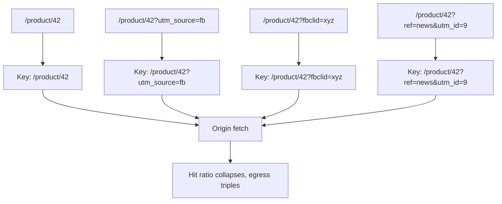
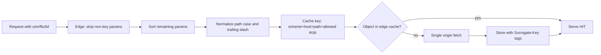

> **Scenario** — Marketing এমন campaign চালু করে যা প্রতিটি shared link-এ `?utm_source=…&utm_campaign=…&fbclid=…` জুড়ে দেয়। CDN প্রতিটি আলাদা query string-কে আলাদা object ধরে। রাতারাতি edge hit ratio 94% থেকে 31%-এ নামে, origin egress তিনগুণ হয়, আর মাসিক CDN বিল একজন ইঞ্জিনিয়ারের খরচের সমান বাড়ে।

## Why it matters

- Hit ratio কোনো vanity metric নয়। 94%-এ origin প্রতি 100 request-এর 6টি serve করে; 31%-এ 69টি — কোনো code deploy ছাড়াই marketing পরিবর্তনে origin load 11 গুণ।
- Cache fragmentation *latency*-ও নষ্ট করে। edge-এ miss মানে origin পর্যন্ত পুরো round trip, প্রায়ই মহাসাগর পেরিয়ে।
- Egress ও origin compute-এর বিল হয়। fragmentation fixed cost-কে variable cost বানায়, যা marketing দলের সৃজনশীলতার সাথে scale করে।
- ঢিলেঢালা `Vary` header `User-Agent` ধরে fragment করতে পারে, যার cardinality কার্যত সীমাহীন — একটি object হাজার হাজার হয়ে যায়।
- উল্টো ব্যর্থতা আরও খারাপ: যে parameter সত্যিই response বদলায় তাকে normalize করে ফেললে সবাইকে ভুল content দেওয়া হয়।

## Symptoms

| Signal | What you observe |
|--------|------------------|
| Edge hit ratio | deploy ছাড়াই হঠাৎ পতন, প্রায়ই campaign চালুর পর |
| Cache storage | প্রকৃত URL সংখ্যার চেয়ে object count অনেক দ্রুত বাড়ে |
| Origin egress | user traffic সমতল, অথচ origin থেকে bytes বাড়ছে |
| `X-Cache-Status` | কয়েক সেকেন্ড আগে serve হওয়া URL-এও `MISS` |
| Log analysis | একই path-এর কয়েক ডজন query-string permutation |
| `Vary` header | `User-Agent`, `Accept-Encoding` + cookie, বা `*` আছে |

## How it breaks

Cache key ডিফল্টে পুরো request line: scheme, host, path ও সম্পূর্ণ query string, সাথে `Vary` header যা নাম করে। উচ্চ cardinality-র যেকোনো উপাদান একই content-এর জন্য সংরক্ষিত object সংখ্যা গুণ করে দেয়।

Cookie সবচেয়ে নীরব অপরাধী। origin যদি কোনো cacheable response-এ `Set-Cookie` পাঠায়, বেশিরভাগ proxy সেটিকে একেবারেই cache করে না — object fragment হয় না, বরং কখনোই cache হয় না। দুই ব্যর্থতাই একই কম hit ratio হিসেবে দেখা দেয়।



## Root causes

1. ডিফল্ট cache key-তে raw query string থাকে, origin যে parameter উপেক্ষা করে সেগুলোসহ।
2. response body সত্যিই বদলায় এমন parameter-এর কোনো allow-list নেই।
3. query parameter sort করা হয় না, তাই `?a=1&b=2` ও `?b=2&a=1` দুটি object।
4. device বা session পার্থক্যের জন্য ভোঁতা অস্ত্র হিসেবে `Vary: User-Agent` বা `Vary: Cookie`।
5. shared হওয়া উচিত এমন response-এ `Set-Cookie` (প্রায়ই analytics বা session cookie) পাঠানো।
6. একই path-এর case ও trailing-slash variant আলাদা object হিসেবে গণ্য।

## How to solve it

### 1. Allow-list the parameters that matter

তালিকার বাইরের সব কিছু key থেকে বাদ। handler কোড থেকে শুরু করুন: কোন parameter সে আসলে পড়ে?

```nginx
# Build a normalized key from an explicit allow-list.
map $args $cache_args {
    default                    "";
    "~*(^|&)(page=[^&]*)"      $2;
    "~*(^|&)(sort=[^&]*)"      $2;
    "~*(^|&)(per_page=[^&]*)"  $2;
}

proxy_cache_path /var/cache/nginx levels=1:2 keys_zone=app_cache:100m
                 max_size=20g inactive=24h use_temp_path=off;

server {
    location /product/ {
        proxy_cache app_cache;
        # utm_*, fbclid, gclid and friends never reach the key.
        proxy_cache_key "$scheme$host$uri|$cache_args";
        proxy_cache_valid 200 301 5m;
        proxy_cache_valid 404 30s;
        proxy_cache_lock on;
        proxy_cache_background_update on;
        proxy_cache_use_stale updating error timeout http_502 http_503;

        # Analytics cookies must not poison a shared object.
        proxy_ignore_headers Set-Cookie Cache-Control Expires;
        proxy_hide_header Set-Cookie;
        proxy_cache_valid any 1m;

        add_header X-Cache-Status $upstream_cache_status always;
    }
}
```

nginx-এর সামনে CDN থাকলে সেখানেও একই allow-list দিন — দুটি key সংজ্ঞা মিলতে হবে, নাহলে দ্বিতীয় একটি fragmentation layer তৈরি হয়।

### 2. Normalize deterministically in the application

origin যখন canonical URL বানায়, একটি shared helper-এ parameter sort ও filter করুন, যাতে link, sitemap ও redirect সবাই একমত থাকে।

```ts
const KEY_PARAMS = new Set(['page', 'sort', 'per_page', 'lang'])

export function canonicalUrl(rawUrl: string): string {
  const url = new URL(rawUrl)
  const kept = [...url.searchParams.entries()]
    .filter(([k]) => KEY_PARAMS.has(k))
    .sort(([a], [b]) => a.localeCompare(b))

  url.search = new URLSearchParams(kept).toString()
  url.pathname = url.pathname.replace(/\/+$/, '') || '/'
  return url.toString()
}
```

non-canonical form থেকে canonical-এ `301` দিন, edge নিজেই variant গুলো collapse করবে।

### 3. Keep `Vary` narrow and intentional

`Vary` প্রতিটি নামকৃত header-এর cardinality দিয়ে সংরক্ষিত object গুণ করে। `Accept-Encoding` ঠিক আছে (তিনটি মান)। `User-Agent` নয়।

```
Cache-Control: public, max-age=300, stale-while-revalidate=600
Vary: Accept-Encoding, Accept-Language
Surrogate-Key: product-42 catalog
```

device-নির্দিষ্ট output-এর জন্য edge-এ low-cardinality signal বানান — user agent থেকে derived `X-Device: mobile|desktop` — এবং তার উপর `Vary` করুন।

### 4. Use surrogate keys for purging

key normalize হলে object-এ tag দিন, যাতে URL ধরে নয় (যা আর ঠিকভাবে জানেন না), entity ধরে purge করতে পারেন।

```bash
curl -X POST "https://api.cdn.example/service/$SVC/purge/product-42" \
     -H "Fastly-Key: $CDN_TOKEN"
```

## Target design



## Tradeoffs

| Option | Pros | Cons | Choose when |
|--------|------|------|-------------|
| Strip all query params | সর্বোচ্চ hit ratio, path-প্রতি একটি object | pagination, filter, search ভাঙে | সম্পূর্ণ static asset ও marketing page |
| Allow-list of key params | সঠিক ও উচ্চ ratio | handler নতুন parameter পড়লেই তালিকা হালনাগাদ করতে হয় | dynamic page ও API-তে default |
| Deny-list of tracking params | সহজে যোগ করা যায়; handler audit লাগে না | নতুন tracking parameter নিয়মিত আসে ও নীরবে fragment করে | পুরোপুরি audit করা যায় না এমন legacy সিস্টেম |
| `Vary` on a normalized device header | হাজারের বদলে দুটি variant | edge transform ও device detection লাগে | device class-ভেদে সত্যিই ভিন্ন markup |
| No normalization | ভুল করার কিছু নেই | hit ratio বাইরের link builder-দের হাতে | traffic এত কম যে origin cost অপ্রাসঙ্গিক |

## Verification checklist

- [ ] `curl -sI "$HOST/product/42?utm_source=x"` ও `curl -sI "$HOST/product/42"` একই stored object থেকে `X-Cache-Status: HIT` দেয়।
- [ ] `?a=1&b=2` ও `?b=2&a=1` একটি cache entry তৈরি করে।
- [ ] শুধু global average নয়, path pattern-প্রতি edge hit ratio dashboard-এ আছে।
- [ ] cached object count স্বতন্ত্র canonical URL সংখ্যার এক order of magnitude-এর মধ্যে।
- [ ] `curl -sI "$HOST/product/42" | grep -i vary` শুধু low-cardinality header দেখায়।
- [ ] কোনো cacheable 200 response-এ `Set-Cookie` নেই (integration test-এ assert করুন)।
- [ ] handler-এ নতুন query parameter যোগ করলে allow-list হালনাগাদ না হওয়া পর্যন্ত CI fail করে।

## Anti-patterns

- `Vary: *` — নিরাপত্তা ব্যবস্থার মতো দেখায়, আসলে সব response uncacheable করে।
- "নিরাপদ থাকতে" cache key-তে session cookie রাখা — এটি user-প্রতি একটি object।
- handler যে parameter সত্যিই পড়ে তা বাদ দেওয়া, ফলে page 2-তে সবাই page 1 পায়।
- CDN-এ normalize করে nginx-এ না করা, ফলে প্রথমটির পেছনে দ্বিতীয় fragmentation layer।
- third party-র বানানো URL-এ URL ধরে purge করা, যেগুলো আপনি enumerate করতে পারেন না।
- শুধু global hit ratio মাপা, যা সুস্থ average-এর ভেতর একটি ভাঙা endpoint লুকায়।

## Related

- [Edge caching personalized content without leaking it](/systems/caching-cdn/edge-caching-personalized-content)
- [stale-while-revalidate and stale-if-error patterns](/systems/caching-cdn/stale-while-revalidate-patterns)
- [Distributed cache consistency across regions](/systems/caching-cdn/distributed-cache-consistency)
- [Cache invalidation strategies that survive deploys](/systems/caching-cdn/cache-invalidation-strategies)
