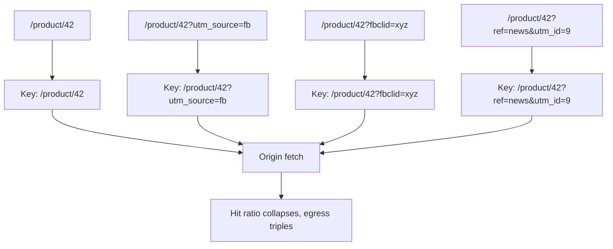
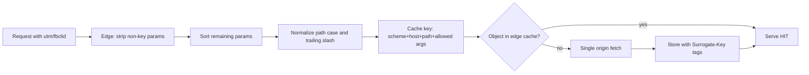

> **Scenario** - Marketing launches a campaign that appends `?utm_source=…&utm_campaign=…&fbclid=…` to every shared link. The CDN treats each unique query string as a distinct object. Overnight the edge hit ratio drops from 94% to 31%, origin egress triples, and the monthly CDN bill grows by the cost of an engineer.

## Why it matters

- Hit ratio is not a vanity metric. At 94% the origin serves 6 of every 100 requests; at 31% it serves 69 - an 11× increase in origin load from a marketing change, with no code deploy.
- Cache fragmentation also wrecks *latency*. A miss at the edge is a full round trip to origin, often across an ocean.
- Egress and origin compute are billed. Fragmentation converts a fixed cost into a variable one that scales with how creative your marketing team is.
- A sloppy `Vary` header can fragment by `User-Agent`, which has effectively unbounded cardinality - one object becomes tens of thousands.
- The inverse failure is worse: normalizing away a parameter that *does* change the response serves the wrong content to everybody.

## Symptoms

| Signal | What you observe |
|--------|------------------|
| Edge hit ratio | Sudden drop with no deploy, often after a campaign launch |
| Cache storage | Object count grows far faster than the number of real URLs |
| Origin egress | Bytes served from origin rise while user traffic is flat |
| `X-Cache-Status` | `MISS` on requests for URLs that were served seconds earlier |
| Log analysis | Same path with dozens of query-string permutations |
| `Vary` header | Contains `User-Agent`, `Accept-Encoding` plus cookies, or `*` |

## How it breaks

The cache key is, by default, the full request line: scheme, host, path, and the entire query string, plus whatever the `Vary` header names. Any component with high cardinality multiplies the number of stored objects for the same underlying content.

Cookies are the quietest offender. If the origin ever emits `Set-Cookie` on a cacheable response, most proxies refuse to cache it at all - so the object is not fragmented, it is simply never cached. Both failures show up as the same low hit ratio.



## Root causes

1. The default cache key includes the raw query string, including parameters the origin ignores.
2. No allow-list of parameters that actually affect the response body.
3. Query parameters not sorted, so `?a=1&b=2` and `?b=2&a=1` are two objects.
4. `Vary: User-Agent` or `Vary: Cookie` used as a blunt instrument for device or session differences.
5. `Set-Cookie` (often an analytics or session cookie) emitted on responses that should be shared.
6. Case and trailing-slash variants of the same path treated as different objects.

## How to solve it

### 1. Allow-list the parameters that matter

Everything not on the list is stripped from the key. Start from the handler code: which parameters does it read?

```nginx
# Build a normalized key from an explicit allow-list.
map $args $cache_args {
    default                    "";
    "~*(^|&)(page=[^&]*)"      $2;
    "~*(^|&)(sort=[^&]*)"      $2;
    "~*(^|&)(per_page=[^&]*)"  $2;
}

proxy_cache_path /var/cache/nginx levels=1:2 keys_zone=app_cache:100m
                 max_size=20g inactive=24h use_temp_path=off;

server {
    location /product/ {
        proxy_cache app_cache;
        # utm_*, fbclid, gclid and friends never reach the key.
        proxy_cache_key "$scheme$host$uri|$cache_args";
        proxy_cache_valid 200 301 5m;
        proxy_cache_valid 404 30s;
        proxy_cache_lock on;
        proxy_cache_background_update on;
        proxy_cache_use_stale updating error timeout http_502 http_503;

        # Analytics cookies must not poison a shared object.
        proxy_ignore_headers Set-Cookie Cache-Control Expires;
        proxy_hide_header Set-Cookie;
        proxy_cache_valid any 1m;

        add_header X-Cache-Status $upstream_cache_status always;
    }
}
```

If the CDN sits in front of nginx, apply the same allow-list there - the two key definitions must agree, or you get a second fragmentation layer.

### 2. Normalize deterministically in the application

When the origin generates canonical URLs, sort and filter parameters in one shared helper so links, sitemaps, and redirects all agree.

```ts
const KEY_PARAMS = new Set(['page', 'sort', 'per_page', 'lang'])

export function canonicalUrl(rawUrl: string): string {
  const url = new URL(rawUrl)
  const kept = [...url.searchParams.entries()]
    .filter(([k]) => KEY_PARAMS.has(k))
    .sort(([a], [b]) => a.localeCompare(b))

  url.search = new URLSearchParams(kept).toString()
  url.pathname = url.pathname.replace(/\/+$/, '') || '/'
  return url.toString()
}
```

Issue a `301` from any non-canonical form to the canonical one and the edge collapses the variants for you.

### 3. Keep `Vary` narrow and intentional

`Vary` multiplies stored objects by the cardinality of each named header. `Accept-Encoding` is fine (three values). `User-Agent` is not.

```
Cache-Control: public, max-age=300, stale-while-revalidate=600
Vary: Accept-Encoding, Accept-Language
Surrogate-Key: product-42 catalog
```

For device-specific output, normalize into a low-cardinality signal at the edge - a `X-Device: mobile|desktop` header derived from the user agent - and `Vary` on that instead.

### 4. Use surrogate keys for purging

Once keys are normalized, tag objects so you can purge by entity rather than by URL, which you no longer know exactly.

```bash
curl -X POST "https://api.cdn.example/service/$SVC/purge/product-42" \
     -H "Fastly-Key: $CDN_TOKEN"
```

## Target design



## Tradeoffs

| Option | Pros | Cons | Choose when |
|--------|------|------|-------------|
| Strip all query params | Maximum hit ratio, one object per path | Breaks pagination, filters, and search | Purely static assets and marketing pages |
| Allow-list of key params | Correct and high ratio | Must be updated whenever a handler reads a new parameter | Default for dynamic pages and APIs |
| Deny-list of tracking params | Easy to bolt on; no handler audit | New tracking parameters appear constantly and silently fragment | Legacy systems you cannot fully audit |
| `Vary` on a normalized device header | Two variants instead of thousands | Requires an edge transform and device detection | Genuinely different markup per device class |
| No normalization | Nothing to get wrong | Hit ratio at the mercy of external link builders | Traffic is small enough that origin cost is irrelevant |

## Verification checklist

- [ ] `curl -sI "$HOST/product/42?utm_source=x"` and `curl -sI "$HOST/product/42"` both return `X-Cache-Status: HIT` from the same stored object.
- [ ] `?a=1&b=2` and `?b=2&a=1` produce a single cache entry.
- [ ] Edge hit ratio per path pattern is on a dashboard, not just a global average.
- [ ] Cached object count is within an order of magnitude of the number of distinct canonical URLs.
- [ ] `curl -sI "$HOST/product/42" | grep -i vary` lists only low-cardinality headers.
- [ ] No cacheable 200 response carries `Set-Cookie` (assert this in an integration test).
- [ ] Adding a new query parameter to a handler fails CI unless the allow-list is updated.

## Anti-patterns

- `Vary: *`, which makes every response uncacheable while looking like a safety measure.
- Including a session cookie in the cache key "just to be safe" - that is one object per user.
- Stripping a parameter the handler actually reads, so page 2 serves page 1 to everyone.
- Normalizing at the CDN but not at nginx, creating a second fragmentation layer behind the first.
- Purging by URL when your URLs are generated by third parties and you cannot enumerate them.
- Measuring only the global hit ratio, which hides a badly fragmented endpoint inside a healthy average.

## Related

- [Edge caching personalized content without leaking it](/systems/caching-cdn/edge-caching-personalized-content)
- [stale-while-revalidate and stale-if-error patterns](/systems/caching-cdn/stale-while-revalidate-patterns)
- [Distributed cache consistency across regions](/systems/caching-cdn/distributed-cache-consistency)
- [Cache invalidation strategies that survive deploys](/systems/caching-cdn/cache-invalidation-strategies)
