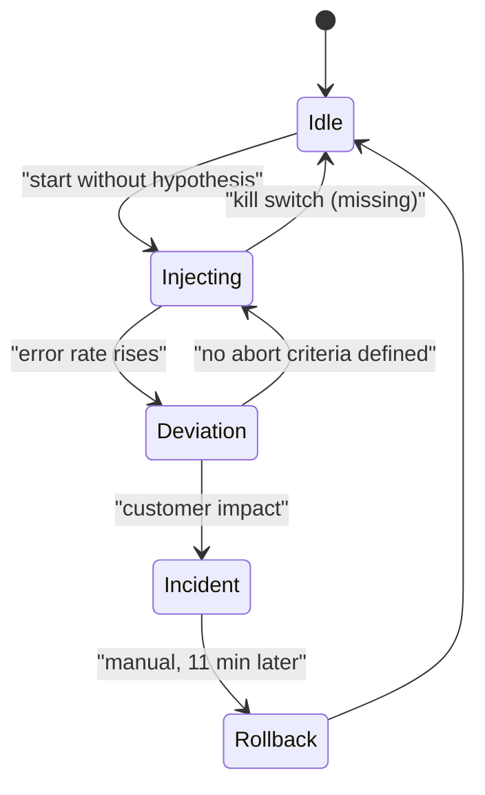
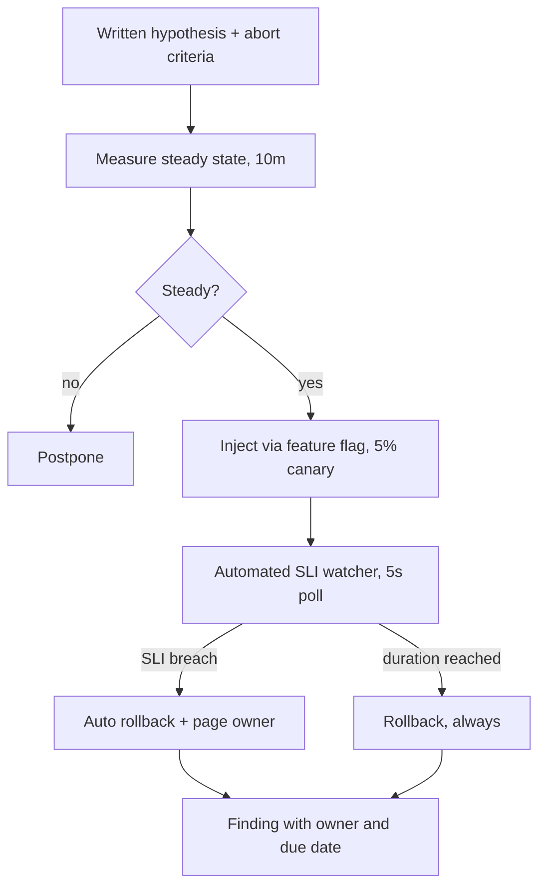

> **Scenario** - এক team বুধবার ১৫:০০-এ payments namespace-এর ৩০% pod terminate করে প্রথম "chaos day" চালায়। কোনো steady-state hypothesis নেই, abort criteria নেই, থামানোর feature flag নেই। এগারো মিনিট পর তাদের হাতে আসল Sev-1, ৪০ মিনিটের payment outage, আর leadership-এর তরফে chaos engineering-এ নিষেধাজ্ঞা।

## Why it matters

- Chaos engineering শুধু controlled experiment হিসেবেই মূল্য দেয়। Hypothesis ও stop condition ছাড়া এটা ইচ্ছাকৃতভাবে ঘটানো outage থেকে আলাদা নয়।
- Untested failure path-ই fail করে। ৮ মাসে কেউ চালায়নি এমন fallback কোডের কাজ করার সম্ভাবনা ৫০/৫০।
- Finding-ই আসল ফল: "আমরা ধরে নিয়েছিলাম Redis timeout gracefully degrade করে, করে না" - এটা সবুজ dashboard-এর চেয়ে দামি।
- একটা খারাপভাবে চালানো experiment বছরের পর বছরের জন্য ভালো experiment চালানোর সাংগঠনিক অনুমতি কেড়ে নেয়।
- Recovery time শুধু measure করেই জানা যায়, আর সেটা রবিবার ০৩:০০-র চেয়ে বুধবার ১৫:০০-তে জানা ভালো।

## Symptoms

| Signal | What you observe (যা chaos আগে ধরার কথা) |
|---|---|
| Unknown MTTR | "Primary DB failover হলে recover-এ কত সময়?" - কেউ উত্তর দিতে পারে না |
| Stale runbooks | Runbook ছয় মাস আগে মুছে ফেলা dashboard দেখায় |
| Untested fallback | ৯০ দিনে production log-এ ০ hit থাকা `catch` branch |
| Hidden coupling | "Optional" cache, যার অনুপস্থিতিতে ১০০% error rate |
| Retry amplification | এক dependency blip-এ ৬ গুণ inbound traffic |
| Config drift | কোডের timeout মান config map-এর মানের সাথে মেলে না |

## How it breaks

বিপজ্জনক pattern হলো instrumentation ছাড়া chaos। Steady state দেখতে না পারলে experiment deviation ঘটাল কি না বোঝা যায় না, আর কখন abort করতে হবে সেটাও ঠিক করা যায় না। দ্বিতীয় failure mode হলো blast radius যা আসলে bounded নয়: ৩০% pod মারা শোনায় সীমিত, যতক্ষণ না জানা যায় একই namespace-এ single-replica leader election sidecar থাকে, আর টিকে থাকা pod-এর connection pool পুনর্বণ্টিত load নিতে পারে না। Experiment আসল দুর্বলতা খুঁজে পায় - production-এ, পুরো customer impact নিয়ে সেটা ব্যবহার করে।



## Root causes

1. Measured steady state নেই, তাই customer অভিযোগ না করা পর্যন্ত deviation অদৃশ্য।
2. লিখিত hypothesis নেই, তাই experiment-এর pass বা fail condition নেই।
3. Blast radius traffic share বা tenant দিয়ে নয়, namespace দিয়ে নির্ধারিত।
4. SLI-এর সাথে বাঁধা automated abort নেই।
5. Injection হাতে করা (`kubectl delete pod`), undo করার একক command নেই।
6. Owning team যখন নেই, তখন experiment চালানো।

## How to solve it

### 1. কিছু ছোঁয়ার আগে experiment লিখে ফেলুন

```yaml
# experiments/redis-timeout-2024-06.yaml
title: "Session cache timeout degrades gracefully"
hypothesis: >
  With redis-session unreachable, /login p99 stays under 900ms and
  the login success rate stays above 99.0%, because sessions fall
  back to the Postgres store.
steady_state:
  - metric: login_success_rate
    window: 10m
    baseline: ">= 99.5%"
  - metric: login_p99_ms
    window: 10m
    baseline: "<= 450"
blast_radius:
  scope: "canary deployment only, 5% of traffic"
  tenants: "internal test tenants"
abort_if:
  - "login_success_rate < 98.0% for 60s"
  - "any 5xx on /payments"
duration: 6m
rollback: "kubectl -n canary delete networkpolicy chaos-redis-deny"
owner: "@platform-oncall"
scheduled: "Wed 15:00 Asia/Dhaka"
```

`rollback` লাইনটাই ফাইলের সবচেয়ে গুরুত্বপূর্ণ অংশ। এটা যদি একক command না হয়, experiment তৈরি নয়।

### 2. আগে অন্তত ১০ মিনিট steady state প্রতিষ্ঠা করুন

Dashboard খুলে baseline metric স্থির কি না দেখুন, screenshot নিন। সিস্টেম steady state-এ না থাকলে (deploy চলছে, backfill চলছে) পিছিয়ে দিন।

### 3. Blast radius infrastructure নয়, traffic দিয়ে বাঁধুন

Infrastructure ধ্বংসের চেয়ে request subset-এ লক্ষ্য করা injection ভালো:

```ts
// Flag-চালিত fault injection, per request evaluate হয়।
function maybeInjectFault(req: Request): void {
  const exp = flags.get('chaos.redis_timeout')
  if (!exp?.enabled) return
  if (!exp.tenants.includes(req.tenantId)) return
  if (hash(req.id) % 100 >= exp.percent) return
  throw new FaultInjected('redis timeout (simulated)')
}
```

Flag-চালিত fault-এর kill switch গঠনগতভাবেই থাকে: `enabled: false` করলে experiment পরের request-এই শেষ, পরের pod restart-এ নয়।

### 4. Abort automate করুন

```python
import time

def run_experiment(exp, sli, inject, rollback):
    inject()
    started = time.monotonic()
    try:
        while time.monotonic() - started < exp.duration_s:
            value = sli.login_success_rate(window_s=60)
            if value < exp.abort_threshold:
                return {"result": "aborted", "sli": value}
            time.sleep(5)
        return {"result": "hypothesis_held"}
    finally:
        rollback()  # abort, exception বা স্বাভাবিক শেষ - সব ক্ষেত্রেই চলে
```

`finally` block optional নয়। Crash-এর পরেও fault রেখে দিতে পারে এমন experiment একটা মাইন।

### 5. Scope ধীরে বাড়ান

Synthetic traffic-সহ staging দিয়ে শুরু, তারপর internal tenant-সহ canary, তারপর production-এর ছোট শতাংশ, তারপর region। প্রথম দিনেই production ধ্বংসে যাবেন না।

### 6. চালানোর খবর নয়, finding প্রকাশ করুন

Deliverable হলো owner ও তারিখসহ দুর্বলতার তালিকা। "Hypothesis held"-ও একটা ফল - মানে fallback আজ কাজ করে, আর প্রমাণসহ সেটা বলা যায়।

## Target design



## Tradeoffs

| Option | Pros | Cons | Choose when |
|---|---|---|---|
| শুধু staging chaos | Customer ঝুঁকি শূন্য | Staging-এ আসল traffic ও data shape নেই | Tooling শেখা, প্রথম experiment |
| Canary production chaos | আসল পরিস্থিতি, bounded impact | Canary routing ও flag লাগে | Steady state measurable হলে |
| Full production chaos | গভীরতম সমস্যা ধরে | Unbounded হলে আসল customer impact | পরিণত SLI, drilled rollback, exec সম্মতি |
| Flag-based fault injection | তাৎক্ষণিক rollback, নিখুঁত targeting | Call site-এ কোড বদল লাগে | Application-level fault |
| Infrastructure injection | কোড বদল নেই; আসল failure test | মোটা blast radius, ধীর rollback | Node, network, disk failure |
| Scheduled game day | পুরো team শেখে; runbook tested | People-hour-এ ব্যয়বহুল | Quarterly, peak season-এর আগে |

## Verification checklist

- [ ] প্রতিটি experiment ফাইলে `hypothesis`, `abort_if` ও এক-command `rollback` আছে।
- [ ] Production run-এর আগে staging-এ rollback সফলভাবে চালানো হয়েছে।
- [ ] T-১০ মিনিটে steady-state dashboard screenshot নেওয়া হয়েছে।
- [ ] Threshold ইচ্ছাকৃতভাবে trip করিয়ে abort automation test করা হয়েছে।
- [ ] Owning team online, এবং শুরুর আগে incident channel-এ ঘোষণা দেওয়া হয়েছে।
- [ ] Run-এর পর `kubectl -n canary get networkpolicy` (বা সমতুল্য) পরিষ্কার state দেখায়।
- [ ] ২৪ ঘণ্টার ভেতর finding owner-সহ ticket হিসেবে জমা।
- [ ] Experiment-এর পর non-canary population-এর customer-facing SLI অপরিবর্তিত।

## Anti-patterns

- Steady state measure করার আগেই production-এ chaos চালানো।
- Injection মানে `kubectl delete pod`, আর rollback মানে "deployment controller-এর জন্য অপেক্ষা"।
- এমন experiment যেখানে মানুষকে খেয়াল করে abort করতে হয়।
- শুক্রবার বিকেলে বা peak sales window-এ game day রাখা।
- Fault আসলে inject হয়েছিল কি না না দেখে "কিছু ভাঙেনি"-কে সফলতা ধরা।
- Finding tracked backlog-এর বদলে Slack thread-এ রাখা।
- আসল incident-কে পরে chaos experiment বলে চালানো।

## Related

- [Partial failure in fan-out requests](/systems/reliability-edge-cases/partial-failure-handling)
- [Dependency startup ordering](/systems/reliability-edge-cases/dependency-startup-ordering)
- [Graceful degradation by design](/systems/reliability-edge-cases/graceful-degradation-design)
- [Multi-region failover without dual writes](/systems/product-platform/multi-region-failover)
