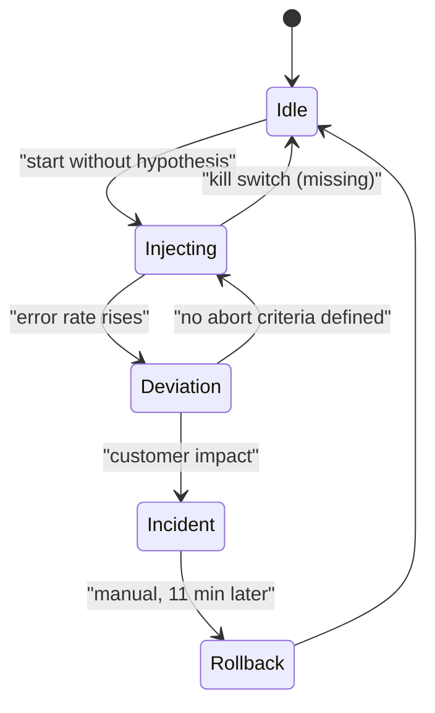
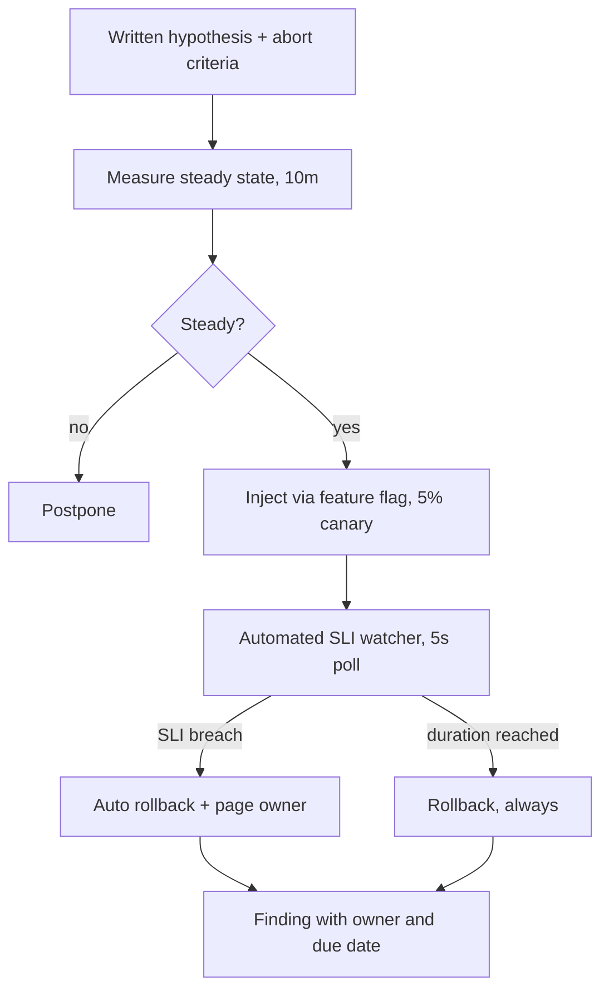

> **Scenario** — A team runs its first "chaos day" at 15:00 on a Wednesday by terminating 30% of pods in the payments namespace. There is no steady-state hypothesis, no abort criteria, and no feature flag to stop it. Eleven minutes later they have a real Sev-1, a 40-minute payment outage, and a leadership ban on chaos engineering.

## Why it matters

- Chaos engineering only produces value as a controlled experiment. Without a hypothesis and a stop condition, it is indistinguishable from an outage you caused on purpose.
- Untested failure paths are the ones that fail. The fallback code that nobody has exercised in 8 months has a 50/50 chance of working.
- The findings are what matter: "we assumed a Redis timeout degrades gracefully, and it does not" is worth more than a green dashboard.
- One badly-run experiment costs you organizational permission to run good ones for years.
- Recovery time is a number you can only learn by measuring it, and you should learn it at 15:00 on a Wednesday rather than 03:00 on a Sunday.

## Symptoms

| Signal | What you observe (that chaos should have found first) |
|---|---|
| Unknown MTTR | Nobody can answer "how long to recover if the primary DB fails over?" |
| Stale runbooks | Runbook references a dashboard deleted six months ago |
| Untested fallback | `catch` branches with 0 hits in production logs over 90 days |
| Hidden coupling | An "optional" cache whose absence causes 100% error rate |
| Retry amplification | A single dependency blip produces 6x inbound traffic |
| Config drift | Timeout values in code differ from the values in the config map |

## How it breaks

The dangerous pattern is chaos without instrumentation. If you cannot see steady state, you cannot tell whether the experiment caused a deviation, and you cannot decide when to abort. The second failure mode is blast radius that is not actually bounded: killing 30% of pods sounds contained until you learn that a single-replica leader election sidecar lives in the same namespace, and that the connection pool on the surviving pods cannot absorb the redistributed load. The experiment discovers a real weakness — by exploiting it in production, at full customer impact.



## Root causes

1. No measured steady state, so deviation is invisible until customers complain.
2. No written hypothesis, so the experiment has no pass or fail condition.
3. Blast radius defined by namespace rather than by traffic share or tenant.
4. No automated abort tied to an SLI.
5. Injection performed by hand (`kubectl delete pod`) with no single command to undo it.
6. Experiment run at a time when the owning team is not available.

## How to solve it

### 1. Write the experiment down before touching anything

```yaml
# experiments/redis-timeout-2024-06.yaml
title: "Session cache timeout degrades gracefully"
hypothesis: >
  With redis-session unreachable, /login p99 stays under 900ms and
  the login success rate stays above 99.0%, because sessions fall
  back to the Postgres store.
steady_state:
  - metric: login_success_rate
    window: 10m
    baseline: ">= 99.5%"
  - metric: login_p99_ms
    window: 10m
    baseline: "<= 450"
blast_radius:
  scope: "canary deployment only, 5% of traffic"
  tenants: "internal test tenants"
abort_if:
  - "login_success_rate < 98.0% for 60s"
  - "any 5xx on /payments"
duration: 6m
rollback: "kubectl -n canary delete networkpolicy chaos-redis-deny"
owner: "@platform-oncall"
scheduled: "Wed 15:00 Asia/Dhaka"
```

The `rollback` field is the most important line in the file. If it is not a single command, the experiment is not ready.

### 2. Establish steady state first, for at least 10 minutes

Run the dashboard, confirm the baseline metrics are stable, and screenshot them. If the system is not in steady state (a deploy is rolling, a backfill is running), postpone.

### 3. Bound the blast radius by traffic, not infrastructure

Prefer injection targeted at a request subset over infrastructure destruction:

```ts
// Fault injection driven by a flag, evaluated per request.
function maybeInjectFault(req: Request): void {
  const exp = flags.get('chaos.redis_timeout')
  if (!exp?.enabled) return
  if (!exp.tenants.includes(req.tenantId)) return
  if (hash(req.id) % 100 >= exp.percent) return
  throw new FaultInjected('redis timeout (simulated)')
}
```

A flag-driven fault has a kill switch by construction: set `enabled: false` and the experiment is over in the next request, not in the next pod restart.

### 4. Automate the abort

```python
import time

def run_experiment(exp, sli, inject, rollback):
    inject()
    started = time.monotonic()
    try:
        while time.monotonic() - started < exp.duration_s:
            value = sli.login_success_rate(window_s=60)
            if value < exp.abort_threshold:
                return {"result": "aborted", "sli": value}
            time.sleep(5)
        return {"result": "hypothesis_held"}
    finally:
        rollback()  # runs on abort, exception, or normal completion
```

The `finally` block is not optional. An experiment that can leave the fault in place after a crash is a landmine.

### 5. Escalate scope over time

Start in staging with synthetic traffic, then canary with internal tenants, then a small production percentage, then a region. Do not jump to production destruction on day one.

### 6. Publish the finding, not the fact that you ran it

The deliverable is a list of weaknesses with owners and dates. "Hypothesis held" is also a result — it means the fallback works today and you can say so with evidence.

## Target design



## Tradeoffs

| Option | Pros | Cons | Choose when |
|---|---|---|---|
| Staging-only chaos | Zero customer risk | Staging lacks real traffic and data shapes | Learning the tooling, first experiments |
| Canary production chaos | Real conditions, bounded impact | Requires canary routing and flags | Steady state is measurable |
| Full production chaos | Finds the deepest issues | Real customer impact if unbounded | Mature SLIs, drilled rollback, exec buy-in |
| Flag-based fault injection | Instant rollback, precise targeting | Needs code changes at call sites | Application-level faults |
| Infrastructure injection | No code changes; tests real failure | Coarse blast radius, slower rollback | Node, network, and disk failures |
| Scheduled game day | Whole team learns; runbooks tested | Expensive in people-hours | Quarterly, before peak season |

## Verification checklist

- [ ] Every experiment file has `hypothesis`, `abort_if`, and a one-command `rollback`.
- [ ] Rollback has been executed successfully in staging before the production run.
- [ ] Steady-state dashboard screenshotted at T-10 minutes.
- [ ] Abort automation tested by deliberately setting a threshold that will trip.
- [ ] Owning team is online, and the experiment is announced in the incident channel before it starts.
- [ ] `kubectl -n canary get networkpolicy` (or equivalent) shows a clean state after the run.
- [ ] Findings are filed as tickets with owners within 24 hours.
- [ ] Post-experiment: unchanged customer-facing SLIs for the non-canary population.

## Anti-patterns

- Running chaos in production before you can measure steady state.
- `kubectl delete pod` as the injection mechanism, with rollback being "wait for the deployment controller".
- Experiments that require a human to notice and abort.
- Scheduling a game day on a Friday afternoon or during a peak sales window.
- Treating "nothing broke" as success without checking whether the fault was actually injected.
- Keeping findings in a Slack thread instead of a tracked backlog.
- Calling a real incident a chaos experiment after the fact.

## Related

- [Partial failure in fan-out requests](/systems/reliability-edge-cases/partial-failure-handling)
- [Dependency startup ordering](/systems/reliability-edge-cases/dependency-startup-ordering)
- [Graceful degradation by design](/systems/reliability-edge-cases/graceful-degradation-design)
- [Multi-region failover without dual writes](/systems/product-platform/multi-region-failover)
