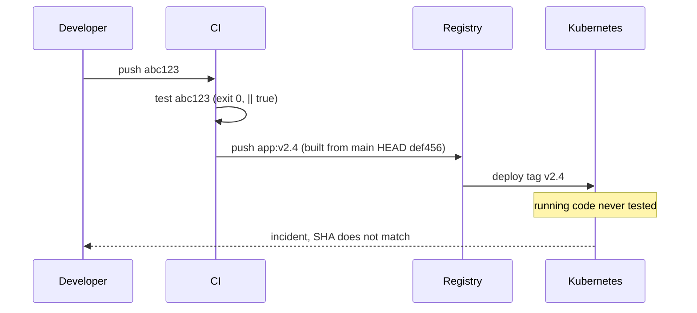
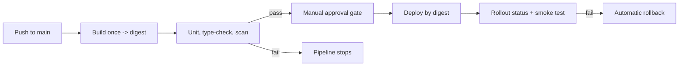

> **পরিস্থিতি** — একটা সবুজ pipeline production-এ `app:v2.4` deploy করল। Image-টি deploy job-এ আবার build হয়েছিল এমন একটা branch থেকে যা CI চলার পর এগিয়ে গেছে, আর test suite exit 0 দিয়েছে কারণ মাস কয়েক আগে একটা flaky test unblock করতে `|| true` বসানো হয়েছিল।

## কেন গুরুত্বপূর্ণ

- Pipeline একটা control system। Gate যদি পাশ কাটানো যায়, তবে "all checks passed" ব্যাজটা প্রমাণ নয়, সাজসজ্জা।
- Mutable tag যা test হয়েছে আর যা চলছে তার সংযোগ ছিঁড়ে দেয়, ফলে প্রতিটি incident তদন্ত শুরু হয় "আসলে কোন commit deployed?" দিয়ে।
- Deploy job-এ আবার build করলে build time দ্বিগুণ হয় এবং artifact test-করা artifact থেকে আলাদা হওয়া নিশ্চিত হয়।
- Supply-chain ঝুঁকি এখন production ঝুঁকি: compromised base image বা dependency অরক্ষিত pipeline দিয়ে সোজা চলে যায়।

## লক্ষণ

| Signal | যা দেখবেন |
|---|---|
| Registry | এক সপ্তাহে একই tag-এর পেছনে একাধিক digest |
| Pipeline | Deploy stage test-করা image promote না করে আবার build করে |
| Test log | test step-এ `|| true`, `--passWithNoTests` বা `continue-on-error: true` |
| Incident | চলমান container-এর commit SHA merge commit-এর সাথে মেলে না |
| Merge | `git log --first-parent`-এ `main`-এ সরাসরি push |

## কীভাবে ভাঙে

Pipeline দেখতে রৈখিক, কিন্তু মাঝখানে একটা ছেদ আছে। CI commit `abc123` build ও test করে। Deploy job আবার `main` checkout করে — এখন সেটা `def456` — পুনরায় build করে একই release tag দেয়। `def456` কখনো test হয়নি।

পাশাপাশি, যে test কখনো fail করে না সে কোনো gate হতে পারে না। `|| true` আর `continue-on-error` gate-কে log statement বানায়, আর শূন্য file মেলানো test suite এক সেকেন্ডেরও কমে সাফল্য জানায়।



## মূল কারণ

1. Deployment immutable digest-এর বদলে mutable tag ব্যবহার করে।
2. Artifact একবার build করে promote না করে প্রতি stage-এ আবার build হয়।
3. Test failure `|| true` বা `continue-on-error` দিয়ে চাপা দেওয়া।
4. Branch protection নেই, তাই pipeline বাধ্যতামূলক নয়, পরামর্শমূলক।
5. Image digest, commit SHA ও pipeline run জোড়া দেওয়ার কোনো provenance record নেই।

## কীভাবে সমাধান করবেন

### ১. একবার build, digest promote

```yaml
name: release
on:
  push: { branches: [main] }
permissions:
  contents: read
  packages: write
  id-token: write
jobs:
  build:
    runs-on: ubuntu-latest
    outputs:
      digest: ${{ steps.build.outputs.digest }}
    steps:
      - uses: actions/checkout@v4
      - id: build
        uses: docker/build-push-action@v6
        with:
          push: true
          tags: ghcr.io/acme/api:${{ github.sha }}
          provenance: true
          sbom: true

  test:
    needs: build
    runs-on: ubuntu-latest
    steps:
      - uses: actions/checkout@v4
      - run: npm ci
      - run: npm run test -- --run --reporter=verbose   # no || true
      - run: npx vue-tsc --build --force
      - run: |
          trivy image --exit-code 1 --severity HIGH,CRITICAL \
            ghcr.io/acme/api@${{ needs.build.outputs.digest }}

  deploy:
    needs: [build, test]
    environment: production          # requires manual approval
    runs-on: ubuntu-latest
    steps:
      - run: |
          kubectl set image deploy/api \
            api=ghcr.io/acme/api@${{ needs.build.outputs.digest }} -n prod
          kubectl rollout status deploy/api -n prod --timeout=10m
```

Deploy step কোনো tag দেখে না — শুধু সেই digest যা test job যাচাই করেছে।

### ২. Gate বাধ্যতামূলক করুন

```bash
gh api -X PUT repos/acme/api/branches/main/protection \
  -f required_status_checks[strict]=true \
  -f required_status_checks[contexts][]=test \
  -f enforce_admins=true \
  -f required_pull_request_reviews[required_approving_review_count]=1
```

### ৩. On-call পড়তে পারে এমন provenance রাখুন

```bash
kubectl get deploy api -n prod \
  -o jsonpath='{.spec.template.spec.containers[0].image}{"\n"}'
cosign verify ghcr.io/acme/api@sha256:... \
  --certificate-identity-regexp '^https://github.com/acme/api/' \
  --certificate-oidc-issuer https://token.actions.githubusercontent.com
```

### ৪. কোনো test না মিললে pipeline fail করান

```json
{ "scripts": { "test": "vitest run --passWithNoTests=false" } }
```

## কাঙ্ক্ষিত ডিজাইন



## Tradeoff

| Option | সুবিধা | খরচ | কখন বেছে নেবেন |
|---|---|---|---|
| Merge-এ সম্পূর্ণ স্বয়ংক্রিয় deploy | দ্রুত feedback, ছোট batch | বাস্তব automated verification ও rollback লাগে | canary analysis সহ পরিণত test suite |
| Manual approval gate | production-এর আগে মানুষের বিচার | দেরি বাড়ে, approval নিছক আনুষ্ঠানিকতা হতে পারে | নিয়ন্ত্রিত পরিবেশ বা ঝুঁকিপূর্ণ window |
| Digest pinning | হুবহু reproducibility, যাচাইযোগ্য provenance | প্রতি release-এ manifest বদলায় | যেকোনো production deployment |
| Blocking vulnerability scan | জানা CVE gate-এই আটকায় | নতুন CVE অসংশ্লিষ্ট hotfix আটকাতে পারে | নথিভুক্ত break-glass path থাকলে |

## যাচাই checklist

- [ ] ইচ্ছাকৃত fail করা test deploy job আটকায়, scratch branch-এ যাচাই করা।
- [ ] `grep -rn "|| true\|continue-on-error" .github/workflows/` test step-এ কিছু ফেরত দেয় না।
- [ ] Production manifest tag নয়, `@sha256:...` ব্যবহার করে।
- [ ] Production-এ চলা image digest ঠিক একটি commit ও একটি pipeline run-এ ম্যাপ করে।
- [ ] Branch protection admin account থেকেও `main`-এ সরাসরি push আটকায়।
- [ ] Break-glass path নথিভুক্ত, দুইজন লাগে, এবং audit করা হয়।

## Anti-pattern

- Release unblock করতে `|| true` যোগ করে আর কখনো না সরানো।
- `:latest` deploy করে `kubectl rollout restart`-কে release পদ্ধতি ভাবা।
- Permission-এ যাতে কিছু fail না করে সেজন্য CI service account-কে cluster-admin দেওয়া।
- পূর্ণ end-to-end suite শুধু রাতে চালানো, ফলে একটা merge ১২ ঘণ্টা ভাঙা অবস্থায় থাকে।
- Rollback path নেই এমন stage-এ approval gate বসানো, যা নিরাপত্তা না বাড়িয়ে শুধু দেরি বাড়ায়।

## সম্পর্কিত

- [Docker image layer optimization](/systems/devops-containers/docker-image-layer-optimization)
- [Database migrations in the deploy pipeline](/systems/devops-containers/migrations-in-the-deploy-pipeline)
- [Blue-green vs canary releases](/systems/devops-containers/blue-green-vs-canary-releases)
