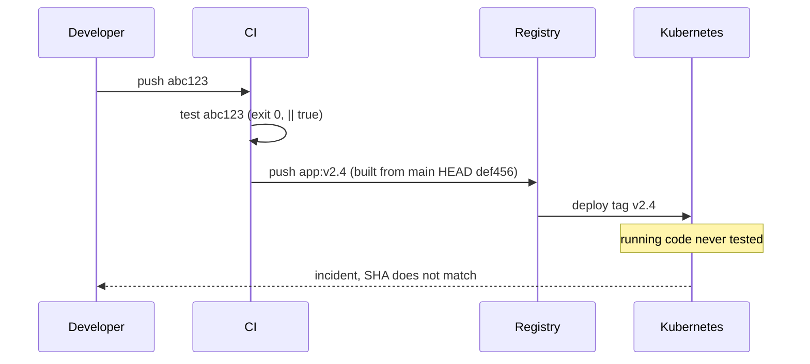
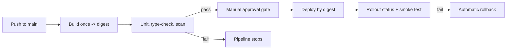

> **Scenario** — A green pipeline deploys `app:v2.4` to production. The image was rebuilt in the deploy job from a branch that had moved on since CI ran, and the test suite exited 0 because a `|| true` was added months ago to unblock a flaky test.

## Why it matters

- A pipeline is a control system. If the gates can be bypassed, the "all checks passed" badge is decoration, not evidence.
- Mutable tags break the link between what was tested and what runs, which makes every incident investigation start with "which commit is actually deployed?".
- Rebuilding in the deploy job doubles build time and guarantees the artifact differs from the tested one.
- Supply-chain risk is now a production risk: a compromised base image or dependency ships straight through an unguarded pipeline.

## Symptoms

| Signal | What you observe |
|---|---|
| Registry | Multiple digests behind the same tag over a week |
| Pipeline | Deploy stage builds the image again instead of promoting the tested one |
| Test logs | `|| true`, `--passWithNoTests`, or `continue-on-error: true` in the test step |
| Incident | Running container's commit SHA does not match the merge commit |
| Merges | Direct pushes to `main` in `git log --first-parent` |

## How it breaks

The pipeline appears linear but has a break in the middle. CI builds and tests commit `abc123`. The deploy job checks out `main` again — now `def456` — rebuilds, and tags it with the same release tag. Nothing tested `def456`.

Meanwhile, tests that never fail cannot gate anything. `|| true` and `continue-on-error` turn a gate into a logging statement, and a test suite that silently matches zero files reports success in under a second.



## Root causes

1. Deployment references a mutable tag instead of an immutable digest.
2. The artifact is rebuilt per stage rather than built once and promoted.
3. Test failures are suppressed with `|| true` or `continue-on-error`.
4. No branch protection, so the pipeline is advisory rather than required.
5. No provenance record linking image digest, commit SHA, and pipeline run.

## How to solve it

### 1. Build once, promote the digest

```yaml
name: release
on:
  push: { branches: [main] }
permissions:
  contents: read
  packages: write
  id-token: write
jobs:
  build:
    runs-on: ubuntu-latest
    outputs:
      digest: ${{ steps.build.outputs.digest }}
    steps:
      - uses: actions/checkout@v4
      - id: build
        uses: docker/build-push-action@v6
        with:
          push: true
          tags: ghcr.io/acme/api:${{ github.sha }}
          provenance: true
          sbom: true

  test:
    needs: build
    runs-on: ubuntu-latest
    steps:
      - uses: actions/checkout@v4
      - run: npm ci
      - run: npm run test -- --run --reporter=verbose   # no || true
      - run: npx vue-tsc --build --force
      - run: |
          trivy image --exit-code 1 --severity HIGH,CRITICAL \
            ghcr.io/acme/api@${{ needs.build.outputs.digest }}

  deploy:
    needs: [build, test]
    environment: production          # requires manual approval
    runs-on: ubuntu-latest
    steps:
      - run: |
          kubectl set image deploy/api \
            api=ghcr.io/acme/api@${{ needs.build.outputs.digest }} -n prod
          kubectl rollout status deploy/api -n prod --timeout=10m
```

The deploy step never sees a tag — only the digest that the test job verified.

### 2. Make the gates mandatory

```bash
gh api -X PUT repos/acme/api/branches/main/protection \
  -f required_status_checks[strict]=true \
  -f required_status_checks[contexts][]=test \
  -f enforce_admins=true \
  -f required_pull_request_reviews[required_approving_review_count]=1
```

### 3. Record provenance the on-call can read

```bash
kubectl get deploy api -n prod \
  -o jsonpath='{.spec.template.spec.containers[0].image}{"\n"}'
cosign verify ghcr.io/acme/api@sha256:... \
  --certificate-identity-regexp '^https://github.com/acme/api/' \
  --certificate-oidc-issuer https://token.actions.githubusercontent.com
```

### 4. Fail the pipeline when tests match nothing

```json
{ "scripts": { "test": "vitest run --passWithNoTests=false" } }
```

## Target design



## Tradeoffs

| Option | Pros | Cons | Choose when |
|---|---|---|---|
| Fully automated deploy on merge | Fast feedback, small batches | Requires real automated verification and rollback | Mature test suites with canary analysis |
| Manual approval gate | Human judgement before production | Adds delay, approval can become a rubber stamp | Regulated environments or risky windows |
| Digest pinning | Exact reproducibility, verifiable provenance | Manifests churn on every release | Any production deployment |
| Blocking vulnerability scan | Stops known CVEs at the gate | New CVEs can block unrelated hotfixes | With a documented break-glass path |

## Verification checklist

- [ ] A deliberately failing test blocks the deploy job, verified on a scratch branch.
- [ ] `grep -rn "|| true\|continue-on-error" .github/workflows/` returns nothing in test steps.
- [ ] The production manifest references `@sha256:...`, not a tag.
- [ ] The image digest running in production maps to exactly one commit and one pipeline run.
- [ ] Branch protection blocks a direct push to `main` from an admin account.
- [ ] The break-glass path is documented, requires two people, and is audited.

## Anti-patterns

- Adding `|| true` to unblock a release and never removing it.
- Deploying `:latest` and treating `kubectl rollout restart` as a release mechanism.
- Giving the CI service account cluster-admin so nothing ever fails on permissions.
- Running the full end-to-end suite only nightly, so a merge can sit broken for 12 hours.
- Approval gates on a stage that has no rollback path, which just adds delay without adding safety.

## Related

- [Docker image layer optimization](/systems/devops-containers/docker-image-layer-optimization)
- [Database migrations in the deploy pipeline](/systems/devops-containers/migrations-in-the-deploy-pipeline)
- [Blue-green vs canary releases](/systems/devops-containers/blue-green-vs-canary-releases)
