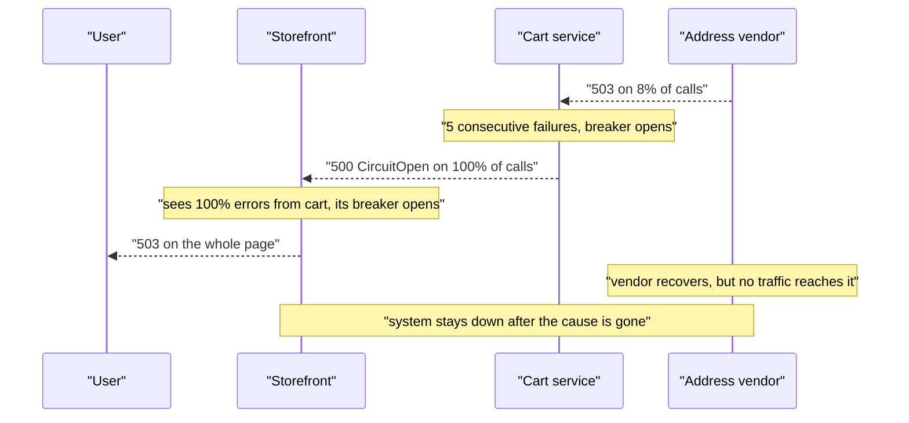
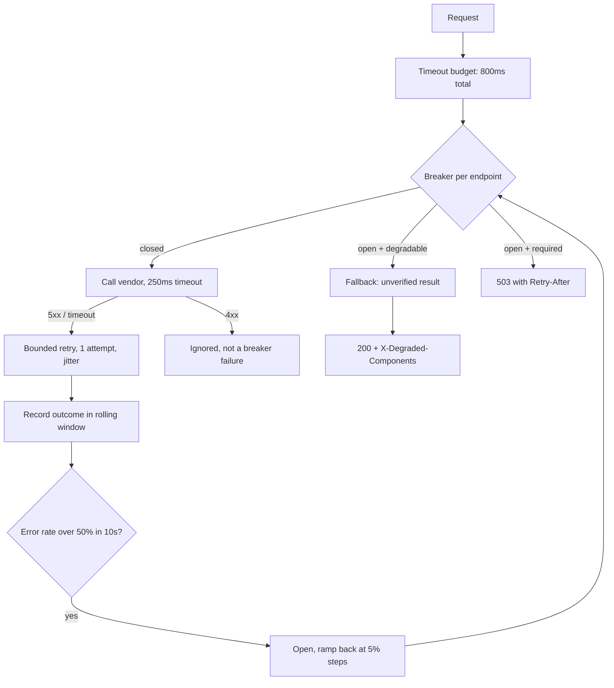

> **Scenario** - Address-validation vendor ৮% call-এ 503 দিতে শুরু করে। Checkout-এর circuit breaker ৫টি consecutive failure-এর পর খুলে যায় এবং *সবকিছু* short-circuit করে - যে ৯২% সফল হতো সেগুলোসহ। চার মিনিটের মধ্যে cart service-এর breaker খোলে, তারপর storefront-এর। একটি আংশিক vendor degradation পুরো সাইটের outage হয়ে যায়।

## Why it matters

- Circuit breaker একটি load-shedding যন্ত্র, error handler নয়। ভুল কনফিগারে এটি ৮% dependency failure-কে ১০০% feature failure বানায়, তারপর উপরে ছড়িয়ে দেয়।
- Breaker গুণিতকভাবে যুক্ত হয়। ২০% error rate-এ খোলে এমন breaker সহ তিনটি service cascade করবে: C খোলে, B দেখে C থেকে ১০০% error আর খোলে, A দেখে B থেকে ১০০% আর খোলে।
- Fallback ছাড়া খোলা breaker user-এর কাছে outage-এর মতোই, অথচ dependency dashboard-এ *healthy* দেখায়, কারণ আপনি fail হওয়া call তৈরি করাই বন্ধ করেছেন।
- বেশিরভাগ incident আসলে recovery path-এ দীর্ঘ হয়। একটি সফল probe-এর পরেই পুরোপুরি বন্ধ হওয়া breaker আটকে রাখা সব load এখনও ভঙ্গুর vendor-এর দিকে ছুড়ে দেয়।

## Symptoms

| Signal | What you observe |
|---|---|
| Error rate | Breaker খোলার মুহূর্তে এক ধাপে ৮% থেকে ১০০% |
| Dependency metric | Vendor-এ outbound request rate প্রায় শূন্য - দেখে মনে হয় সেরে গেছে |
| Latency | তীব্রভাবে কমে; short-circuit করা call 1ms-এর কমে ফেরে |
| Cascade timing | পরপর service-এর breaker ৩০-১২০s ব্যবধানে খোলে, upstream path আঁকে |
| Recovery | Error rate দোলে: open, half-open, এক success, closed, সাথে সাথে আবার open |
| Vendor log | ঠিক যখন আপনার breaker বন্ধ হয় তখন traffic spike, তারপর আবার failure |
| Scope | Hostname দিয়ে key করা breaker-এর কারণে সম্পর্কহীন feature fail করে |

## How it breaks

দুটি design ভুল একসাথে কাজ করে।

**Breaker-এর scope খুব প্রশস্ত।** Hostname দিয়ে key করলে একটি degraded endpoint ওই host-এর সব endpoint-এর call trip করে। Address validation fail করলে vendor-এর health check, geocoding ও postcode lookup সবই বন্ধ হয়।

**খোলা মানে fail করার সিদ্ধান্ত, অথচ fail করার মানে কেউ ঠিক করেনি।** স্পষ্ট fallback না থাকলে `CircuitOpenError` 500 হিসেবে উপরে যায়। Caller-এর breaker সেই 500-কে *আপনার* service-এর failure ধরে খুলে যায়। এটাই cascade: প্রতিটি স্তর বিশ্বস্তভাবে বলে "আমার dependency নষ্ট" যতক্ষণ না user-facing স্তর বলে "সব নষ্ট"।



## Root causes

1. Breaker endpoint ও criticality নয়, host বা service দিয়ে key করা।
2. Fallback নেই: circuit খুললে degrade না করে throw করে।
3. *যেকোনো* error-কে failure গোনা, 4xx client error ও validation failure সহ, যেগুলো dependency health নিয়ে কিছুই বলে না।
4. Rolling error *rate* ও minimum request volume-এর বদলে consecutive-failure threshold।
5. Half-open state একটি request ঢোকায় আর একটিমাত্র success-এ পুরোপুরি বন্ধ হয়।
6. Non-critical dependency-র breaker-কে পুরো request fail করতে দেওয়া।
7. Timeout caller-এর budget-এর চেয়ে বড়, তাই breaker failure দেখার আগেই caller time out করে।

## How to solve it

### 1. Endpoint অনুযায়ী breaker scope করুন এবং dependency শ্রেণিবদ্ধ করুন

```ts
type Criticality = 'required' | 'degradable'

type BreakerConfig = {
  key: string                    // "vendor:address:POST /v2/validate" - not just the host
  criticality: Criticality
  errorRateThreshold: number     // fraction, not consecutive failures
  minimumRequests: number        // never open on 3 requests out of 3
  windowMs: number
  halfOpenPermits: number
}

const ADDRESS_VALIDATE: BreakerConfig = {
  key: 'vendor:address:POST /v2/validate',
  criticality: 'degradable',     // checkout can proceed with an unvalidated address
  errorRateThreshold: 0.5,       // NOT 0.05 - 8% failing is not a reason to stop trying
  minimumRequests: 20,
  windowMs: 10_000,
  halfOpenPermits: 5,
}
```

এখানে `errorRateThreshold: 0.5` সবচেয়ে গুরুত্বপূর্ণ সংখ্যা। Breaker-এর কাজ *বেশিরভাগ* অচল dependency-তে আঘাত করা থামানো। ৮% failure-এ সঠিক প্রতিক্রিয়া bounded retry, circuit trip নয়।

### 2. "Open" মানে degrade করুক, throw নয়

```php
// Every degradable dependency must have a named fallback, enforced by the type system.
final class AddressValidationClient
{
    public function validate(Address $address): ValidationResult
    {
        return $this->breaker->call(
            operation: fn () => $this->http->post('/v2/validate', $address->toArray()),
            fallback: fn () => ValidationResult::unverified(
                address: $address,
                reason: 'validator_unavailable',
            ),
        );
    }
}
```

Downstream-এ `unverified` অবশ্যই order pipeline-এর সামলানো একটি বাস্তব state হতে হবে: order-কে asynchronous re-validation-এর জন্য flag করুন, কেনাকাটা আটকাবেন না। Fallback-এর নাম দিতে না পারলে dependency `required` - তার breaker নয়, timeout ও সৎ error দরকার।

### 3. সঠিক failure গুনুন

```python
# Only server-side and transport failures indicate dependency health.
COUNTS_AS_FAILURE = {500, 502, 503, 504, 429}

def record(response: Response | None, exc: Exception | None) -> Outcome:
    if isinstance(exc, (ConnectTimeout, ReadTimeout, ConnectionError)):
        return Outcome.FAILURE
    if exc is not None:
        return Outcome.FAILURE
    if response.status_code in COUNTS_AS_FAILURE:
        return Outcome.FAILURE
    if 400 <= response.status_code < 500:
        # A malformed request is our bug, not their outage. Never trips the breaker.
        return Outcome.IGNORED
    return Outcome.SUCCESS
```

422-কে failure গুনলে *আপনার* দিকের একটি খারাপ deploy সম্পূর্ণ সুস্থ vendor-এর বিরুদ্ধে breaker খুলে দেয়।

### 4. ধাপে ধাপে recover করুন, এক লাফে নয়

```ts
// Half-open should ramp, so a fragile vendor is not hit with the full held-back load.
class RampingBreaker {
  private admitFraction = 0

  onHalfOpen() {
    this.admitFraction = 0.05        // 5% of traffic probes the dependency
  }

  onProbeResult(ok: boolean) {
    // Multiplicative decrease, additive increase - slow to trust, fast to give up.
    this.admitFraction = ok
      ? Math.min(1, this.admitFraction + 0.05)
      : Math.max(0, this.admitFraction / 2)
    if (this.admitFraction >= 1) this.close()
    if (this.admitFraction === 0) this.open()
  }
}
```

প্রতি ১০ সেকেন্ডে ৫% করে বাড়লে সম্পূর্ণ খোলা breaker পূর্ণ traffic-এ ফিরতে প্রায় ২০০ সেকেন্ড নেয়। এটাই কাম্য: vendor সেরে ওঠার জায়গা পায়।

### 5. `CircuitOpen`-কে 5xx হিসেবে না পাঠিয়ে cascade থামান

Degradable dependency-র খোলা breaker কখনোই caller-এর জন্য 500 হবে না। আংশিক ফল ও caller-এর কাজে লাগে এমন header সহ `200` ফেরত দিন:

```
HTTP/1.1 200 OK
X-Degraded-Components: address-validation
Cache-Control: no-store
```

Caller-এর breaker success দেখে বন্ধ থাকে, আর cascade প্রথম fallback-যুক্ত স্তরেই থেমে যায়।

## Target design



## Tradeoffs

| Option | Pros | Cons | Choose when |
|---|---|---|---|
| Breaker নেই, শুধু timeout | সরল; সফল হতে পারত এমন call কখনো fail করে না | ধীর dependency-তে thread/connection জমে | কড়া timeout সহ দ্রুত in-VPC dependency |
| Consecutive-failure breaker | Implement করা সহজ | ক্ষণস্থায়ী blip-এ trip করে; কম volume-এ অর্থহীন | শুধু prototype |
| Rolling error-rate breaker | প্রকৃত dependency health প্রতিফলিত করে | অর্থবহ হতে minimum request volume দরকার | ~20 req/10s-এর বেশি যেকোনো dependency |
| Breaker + typed fallback | Failure এক স্তরে আটকায়; cascade নেই | কাউকে সঠিক degraded আচরণ সংজ্ঞায়িত করতে হবে | প্রতিটি degradable dependency |
| Bulkhead (bounded concurrency) | Fail fast ছাড়াই blast radius সীমিত | Error-এর বদলে queueing latency যোগ করে | Shared thread বা connection pool |
| Adaptive concurrency limit | Self-tuning, threshold বাছতে হয় না | Incident-এর সময় বোঝা কঠিন | High-volume internal service mesh |

## Verification checklist

- [ ] প্রতিটি breaker key-তে endpoint আছে, শুধু host নয়।
- [ ] প্রতিটি `degradable` dependency-র নামযুক্ত fallback আছে এবং সেটি পরীক্ষা করে এমন test আছে।
- [ ] 4xx response প্রমাণযোগ্যভাবে breaker-এর failure rate-এ গোনা হয় না।
- [ ] `minimumRequests` এমনভাবে সেট যে ২০-এর কম observation-এ breaker খুলতে পারে না।
- [ ] ১০% dependency error-এর fault-injection test-এ breaker বন্ধ থাকে ও feature কাজ করে।
- [ ] ১০০% dependency error-এর test-এ breaker খোলে ও fallback ফেরত দেয়, 500 নয়।
- [ ] Breaker state transition event হিসেবে বের হয় এবং dependency error rate-এর একই dashboard-এ দেখা যায়।
- [ ] সম্পূর্ণ খোলা থেকে সম্পূর্ণ বন্ধ হতে ৬০ সেকেন্ডের বেশি লাগে, drill-এ যাচাই করা।
- [ ] প্রতি hop-এ per-call timeout caller-এর অবশিষ্ট budget-এর চেয়ে ছোট।

## Anti-patterns

- Hostname প্রতি একটি breaker, ফলে সম্পর্কহীন endpoint-এর degradation সুস্থ endpoint-কেও নামিয়ে দেয়।
- ৫% error rate-এ খোলা - dependency যত দ্রুত fail করে তার চেয়ে দ্রুত হাল ছেড়ে দেয় এমন system বানালেন।
- `CircuitOpenError` উপরে ছুড়ে দেওয়া, যা ঠিক এভাবেই স্থানীয় degradation-কে global outage বানায়।
- প্রথম সফল probe-এই breaker পুরোপুরি বন্ধ করা, অর্ধ-সুস্থ vendor-এ আটকে রাখা ১০০% traffic পাঠানো।
- খোলা breaker-এর *ভেতর দিয়ে* বাইরের wrapper-এ retry করা, যা breaker যে load সরাতে চেয়েছিল সেটাই ফিরিয়ে আনে।
- যে dependency ছাড়া degrade করা যায় না তাতে breaker বসিয়ে ফলাফলের 503-কে "graceful" বলা।

## Related

- [Retry storm prevention](/systems/reliability-edge-cases/retry-storm-prevention)
- [Timeout budget propagation](/systems/api-integration/timeout-budget-propagation)
- [Retry with jitter strategy](/systems/api-integration/retry-with-jitter-strategy)
- [Third-party outage degradation](/systems/api-integration/third-party-outage-degradation)
- [SLO error budget burn rates](/systems/observability-sli/slo-error-budget-burn)
