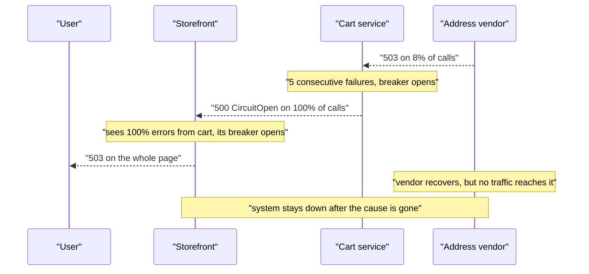
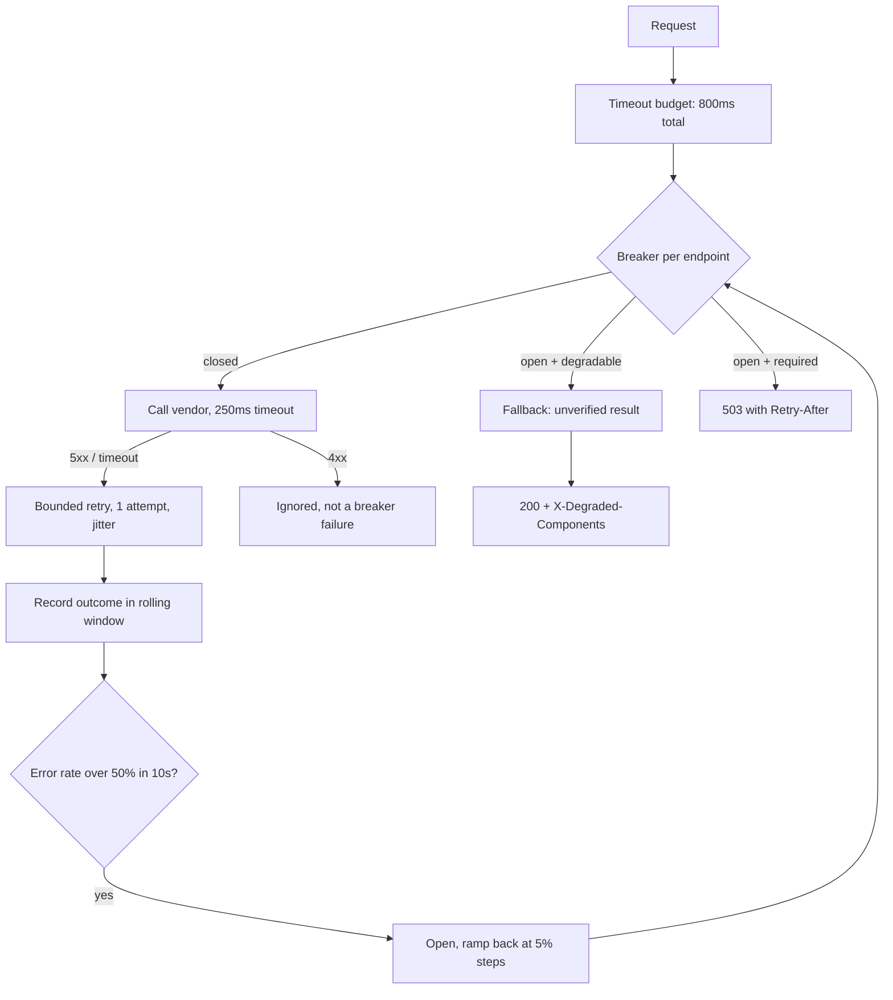

> **Scenario** — The address-validation vendor starts returning 503 for 8% of calls. Checkout's circuit breaker opens after 5 consecutive failures and short-circuits *everything* — including the 92% that would have succeeded. Within four minutes the cart service's breaker opens too, then the storefront's. A partial vendor degradation has become a full site outage.

## Why it matters

- A circuit breaker is a load-shedding device, not an error handler. Configured badly it converts a 8% dependency failure into a 100% feature failure, and then propagates that upward.
- Breakers compose multiplicatively. Three services each with a breaker that opens at a 20% error rate will cascade: service C opens, service B sees 100% errors from C and opens, service A sees 100% from B and opens.
- An open breaker with no fallback is indistinguishable from an outage to the user, but *looks* healthy on the dependency dashboard, because you stopped generating the failing calls.
- The recovery path is where most incidents actually extend. A breaker that slams fully closed after one successful probe sends the entire held-back load at a vendor that is still fragile.

## Symptoms

| Signal | What you observe |
|---|---|
| Error rate | Jumps from 8% to 100% for a feature, in one step, at the moment the breaker opens |
| Dependency metrics | Outbound request rate to the vendor drops to near zero — it looks recovered |
| Latency | Falls sharply; short-circuited calls return in under 1ms |
| Cascade timing | Successive services' breakers open 30-120s apart, tracing an upstream path |
| Recovery | Error rate oscillates: open, half-open, one success, closed, immediately open again |
| Vendor logs | A traffic spike exactly when your breaker closes, then failures again |
| Scope | An unrelated feature fails because it shares a breaker keyed by hostname |

## How it breaks

Two design errors combine.

**The breaker's scope is too wide.** Keying a breaker by hostname means one degraded endpoint trips calls to every endpoint on that host. Address validation failing takes down the vendor's health check, its geocoding, and its postcode lookup.

**Opening is a decision to fail, and nobody decided what failing means.** Without an explicit fallback, `CircuitOpenError` propagates as a 500. The caller's breaker counts that 500 as a failure of *your* service, and opens. This is the cascade: each layer faithfully reports "my dependency is broken" until the user-facing layer reports "everything is broken."



## Root causes

1. Breaker keyed by host or by service rather than by endpoint and criticality.
2. No fallback: opening the circuit throws instead of degrading.
3. Failure counted on *any* error, including 4xx client errors and validation failures that say nothing about dependency health.
4. Consecutive-failure thresholds instead of a rolling error *rate* with a minimum request volume.
5. Half-open state admitting one request and closing fully on a single success.
6. Breakers on non-critical dependencies allowed to fail the whole request.
7. Timeouts longer than the caller's budget, so the caller times out before the breaker ever sees a failure.

## How to solve it

### 1. Scope the breaker per endpoint and classify the dependency

```ts
type Criticality = 'required' | 'degradable'

type BreakerConfig = {
  key: string                    // "vendor:address:POST /v2/validate" — not just the host
  criticality: Criticality
  errorRateThreshold: number     // fraction, not consecutive failures
  minimumRequests: number        // never open on 3 requests out of 3
  windowMs: number
  halfOpenPermits: number
}

const ADDRESS_VALIDATE: BreakerConfig = {
  key: 'vendor:address:POST /v2/validate',
  criticality: 'degradable',     // checkout can proceed with an unvalidated address
  errorRateThreshold: 0.5,       // NOT 0.05 — 8% failing is not a reason to stop trying
  minimumRequests: 20,
  windowMs: 10_000,
  halfOpenPermits: 5,
}
```

The `errorRateThreshold: 0.5` is the single most important number here. A breaker exists to stop you hammering a dependency that is *mostly* down. At 8% failure the correct response is a bounded retry, not a circuit trip.

### 2. Make "open" mean degrade, never mean throw

```php
// Every degradable dependency must have a named fallback, enforced by the type system.
final class AddressValidationClient
{
    public function validate(Address $address): ValidationResult
    {
        return $this->breaker->call(
            operation: fn () => $this->http->post('/v2/validate', $address->toArray()),
            fallback: fn () => ValidationResult::unverified(
                address: $address,
                reason: 'validator_unavailable',
            ),
        );
    }
}
```

Downstream, `unverified` must be a real state the order pipeline handles: flag the order for asynchronous re-validation, do not block the purchase. If you cannot name the fallback, the dependency is `required` and it does not get a breaker — it gets a timeout and an honest error.

### 3. Count the right failures

```python
# Only server-side and transport failures indicate dependency health.
COUNTS_AS_FAILURE = {500, 502, 503, 504, 429}

def record(response: Response | None, exc: Exception | None) -> Outcome:
    if isinstance(exc, (ConnectTimeout, ReadTimeout, ConnectionError)):
        return Outcome.FAILURE
    if exc is not None:
        return Outcome.FAILURE
    if response.status_code in COUNTS_AS_FAILURE:
        return Outcome.FAILURE
    if 400 <= response.status_code < 500:
        # A malformed request is our bug, not their outage. Never trips the breaker.
        return Outcome.IGNORED
    return Outcome.SUCCESS
```

Counting 422s as failures means a bad deploy on *your* side opens a breaker against a perfectly healthy vendor.

### 4. Recover gradually, not in one step

```ts
// Half-open should ramp, so a fragile vendor is not hit with the full held-back load.
class RampingBreaker {
  private admitFraction = 0

  onHalfOpen() {
    this.admitFraction = 0.05        // 5% of traffic probes the dependency
  }

  onProbeResult(ok: boolean) {
    // Multiplicative decrease, additive increase — slow to trust, fast to give up.
    this.admitFraction = ok
      ? Math.min(1, this.admitFraction + 0.05)
      : Math.max(0, this.admitFraction / 2)
    if (this.admitFraction >= 1) this.close()
    if (this.admitFraction === 0) this.open()
  }
}
```

At 5% admission increasing every 10 seconds, a fully open breaker takes about 200 seconds to return to full traffic. That is a feature: it gives the vendor room to recover.

### 5. Stop the cascade by not propagating `CircuitOpen` as a 5xx

An open breaker on a degradable dependency must never turn into a 500 for the caller. Return `200` with a partial result and a header the caller can act on:

```
HTTP/1.1 200 OK
X-Degraded-Components: address-validation
Cache-Control: no-store
```

The caller's breaker sees a success, stays closed, and the cascade stops at the first layer that has a fallback.

## Target design



## Tradeoffs

| Option | Pros | Cons | Choose when |
|---|---|---|---|
| No breaker, timeout only | Simple; never fails a call that could succeed | Threads/connections pile up on a slow dependency | Fast, in-VPC dependencies with tight timeouts |
| Consecutive-failure breaker | Trivial to implement | Trips on transient blips; meaningless at low volume | Prototypes only |
| Rolling error-rate breaker | Reflects real dependency health | Needs a minimum request volume to be meaningful | Any dependency above ~20 req/10s |
| Breaker + typed fallback | Contains failure at one layer; no cascade | Someone must define correct degraded behaviour | Every degradable dependency |
| Bulkhead (bounded concurrency) | Caps blast radius without ever failing fast | Adds queueing latency instead of errors | Shared thread or connection pools |
| Adaptive concurrency limit | Self-tuning, no thresholds to pick | Harder to reason about during an incident | High-volume internal service meshes |

## Verification checklist

- [ ] Every breaker key includes the endpoint, not just the host.
- [ ] Every `degradable` dependency has a named fallback with a test that exercises it.
- [ ] 4xx responses provably do not count toward the breaker's failure rate.
- [ ] `minimumRequests` is set so a breaker cannot open on fewer than 20 observations.
- [ ] A fault-injection test at 10% dependency errors leaves the breaker closed and the feature working.
- [ ] A fault-injection test at 100% dependency errors opens the breaker and returns the fallback, not a 500.
- [ ] Breaker state transitions are emitted as events and visible on the same dashboard as dependency error rate.
- [ ] Recovery from fully-open to fully-closed takes more than 60 seconds, verified in a drill.
- [ ] Per-call timeout is smaller than the caller's remaining budget at every hop.

## Anti-patterns

- One breaker per hostname, so an unrelated endpoint's degradation takes down a healthy one.
- Opening at a 5% error rate — you have built a system that gives up faster than the dependency fails.
- Throwing `CircuitOpenError` up the stack, which is exactly how a local degradation becomes a global outage.
- Closing the breaker fully on the first successful probe, sending 100% of held-back traffic at a half-recovered vendor.
- Retrying *through* an open breaker in an outer wrapper, which reintroduces the load the breaker was supposed to remove.
- Adding a breaker to a dependency you cannot degrade without, and calling the resulting 503 "graceful".

## Related

- [Retry storm prevention](/systems/reliability-edge-cases/retry-storm-prevention)
- [Timeout budget propagation](/systems/api-integration/timeout-budget-propagation)
- [Retry with jitter strategy](/systems/api-integration/retry-with-jitter-strategy)
- [Third-party outage degradation](/systems/api-integration/third-party-outage-degradation)
- [SLO error budget burn rates](/systems/observability-sli/slo-error-budget-burn)
