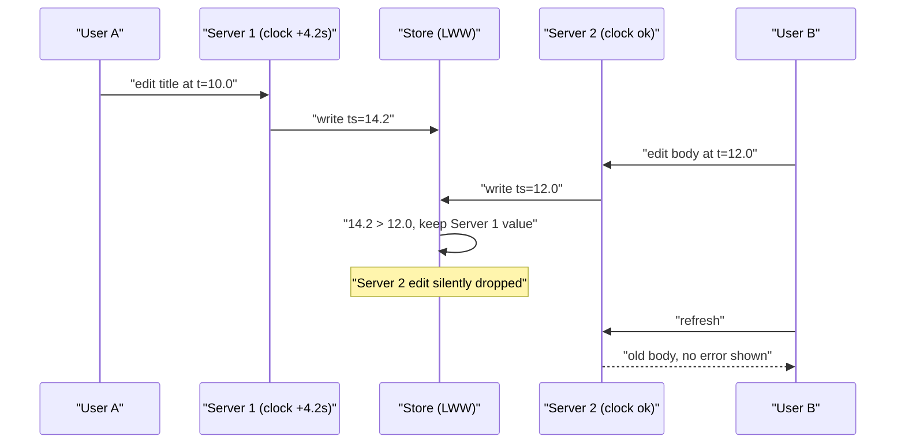
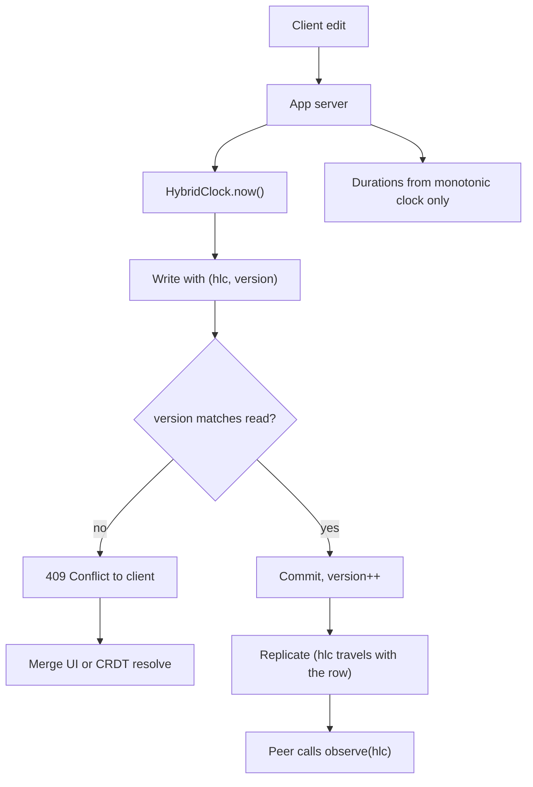

> **Scenario** — একটি collaborative document editor লেখা app server-এর `updated_at = NOW()` দিয়ে edit রাখে আর last-write-wins দিয়ে conflict মেটায়। ব্যর্থ NTP sync-এর পর একটি server-এর clock ৪.২ সেকেন্ড এগিয়ে। এক ঘণ্টা ধরে বাকি তিন server-এর প্রতিটি edit "পুরনো" বলে চুপচাপ বাদ পড়ে।

## Why it matters

- Wall clock দিয়ে last-write-wins মানে যার clock সবচেয়ে দ্রুত সে প্রতিটি conflict জেতে। Data loss নীরব: error নেই, log line নেই, metric নেই।
- NTP monotonicity-র guarantee দেয় না। `step` correction `CLOCK_REALTIME` পিছিয়ে দেয়, ফলে `end - start` ঋণাত্মক হতে পারে আর wall time থেকে হিসাব করা timeout প্রায় অসীম হয়ে যায়।
- Leap second আর VM live migration দুটোই discontinuity তৈরি করে। AWS ও GCP leap second ঘণ্টাজুড়ে smear করে; stock `ntpd` চালানো bare-metal host পুরো এক সেকেন্ড step করতে পারে।
- Clock থেকে আসা ordering bug সবচেয়ে কঠিন শ্রেণি, কারণ কোন host কোন request নিল তার উপর নির্ভর করে, আর তদন্তের সময় skew সাধারণত চলে গেছে।

## Symptoms

| Signal | What you observe |
|---|---|
| Edit হারিয়ে যাওয়া | User save করে, পরিবর্তন দেখে, refresh করে পুরনো value ফিরে পায় |
| `node_timex_offset_seconds` | কিছু host-এ শূন্য নয়, প্রায়ই ৪০-এর মধ্যে একটি খারাপ host |
| ঋণাত্মক duration | latency histogram-এ শূন্যের নিচে entry, বা log-এ `duration_ms = -3800` |
| Timestamp inversion | child row-এর `created_at` parent-এর `created_at`-এর আগে |
| Cache TTL anomaly | entry তৎক্ষণাৎ expire, বা TTL-এর অনেক পরেও টিকে আছে |
| JWT failure | `token used before issued` / `nbf` reject, retry-তে ঠিক হয়ে যায় |
| `node_timex_sync_status` | অন্য সব health check পাস করা host-এ 0 (unsynchronised) |

## How it breaks

প্রতিটি মেশিনে দুটি clock আছে, আর ভুলটা বাছাই করাই পুরো bug। `CLOCK_REALTIME` (`Date.now()`, `time.time()`, `NOW()`) civil time মাপে এবং *adjusted* — সামনে বা পিছনে লাফাতে পারে। `CLOCK_MONOTONIC` (`performance.now()`, `time.monotonic()`, `clock_gettime`) শুধু সামনে যায়, কিন্তু মেশিনের বাইরে তার কোনো অর্থ নেই।

Failure-টা একটি সরল সত্য থেকে আসে: দুই মেশিনের `CLOCK_REALTIME` তুলনা করে আপনি happens-before সম্পর্ক পাবেন না। ভালো NTP থাকলেও datacenter-এ offset সাধারণত ±১-১০ms, ইন্টারনেট জুড়ে ±১০০ms। sync ভাঙলে সেকেন্ডে যায়। বাস্তবে ৫০ms ব্যবধানের দুই write উল্টো ক্রমের timestamp বহন করতে পারে, আর last-write-wins নতুনটিকে চিরতরে ফেলে দেবে।



## Root causes

1. ভিন্ন host-এ তৈরি `CLOCK_REALTIME` timestamp দিয়ে conflict resolution।
2. Timeout, rate-limit window ও lease expiry monotonic source-এর বদলে wall-clock delta থেকে হিসাব।
3. NTP-তে একটিই upstream আর `step` alert নেই, তাই একটি খারাপ host ঘণ্টার পর ঘণ্টা অলক্ষ্যে থাকে।
4. Fleet-এ ভিন্ন time source: কিছু host local `ntpd`-তে, কিছু cloud provider clock-এ `chrony` দিয়ে, কিছু public `pool.ntp.org`-এ।
5. একই column-এ application-generated আর database-generated timestamp মেশানো।
6. write-এর সাথে causal metadata (version vector, logical clock) রাখা হয়নি, তাই recovery-র ক্রম পুনর্গঠনের কিছু নেই।

## How to solve it

### 1. Wall clock দিয়ে conflict মেটাবেন না — logical clock ব্যবহার করুন

Hybrid logical clock (HLC) মানুষের পড়ার জন্য physical অংশ রাখে, আর logical counter wall clock ভুল হলেও monotonicity ও causality নিশ্চিত করে।

```ts
type Hlc = { physicalMs: number; counter: number; nodeId: string }

const compare = (a: Hlc, b: Hlc) =>
  a.physicalMs - b.physicalMs || a.counter - b.counter || a.nodeId.localeCompare(b.nodeId)

export class HybridClock {
  private last: Hlc

  constructor(private nodeId: string) {
    this.last = { physicalMs: Date.now(), counter: 0, nodeId }
  }

  /** Called when generating a local event. */
  now(): Hlc {
    const wall = Date.now()
    this.last =
      wall > this.last.physicalMs
        ? { physicalMs: wall, counter: 0, nodeId: this.nodeId }
        : { ...this.last, counter: this.last.counter + 1 }
    return this.last
  }

  /** Called on every inbound message carrying a remote timestamp. */
  observe(remote: Hlc): Hlc {
    const wall = Date.now()
    const maxPhysical = Math.max(wall, this.last.physicalMs, remote.physicalMs)
    const counter =
      maxPhysical === this.last.physicalMs && maxPhysical === remote.physicalMs
        ? Math.max(this.last.counter, remote.counter) + 1
        : maxPhysical === this.last.physicalMs
          ? this.last.counter + 1
          : maxPhysical === remote.physicalMs
            ? remote.counter + 1
            : 0
    this.last = { physicalMs: maxPhysical, counter, nodeId: this.nodeId }
    return this.last
  }
}

export const isNewer = (candidate: Hlc, current: Hlc) => compare(candidate, current) > 0
```

`observe` স্থানীয় clock-কে দেখা সবকিছুর উপরে ঠেলে দেয়, তাই skewed host-এও causality টেকে: reply কখনো তার কারণ message-এর আগে দেখাতে পারে না।

### 2. প্রতিটি duration-এ monotonic clock ব্যবহার করুন

```python
import time

# Wrong: NTP step during the request makes elapsed negative or huge.
start = time.time()
do_work()
elapsed = time.time() - start

# Right: CLOCK_MONOTONIC never steps.
start = time.monotonic()
do_work()
elapsed = time.monotonic() - start

# For deadlines that cross a process boundary, send a duration, not an absolute time.
deadline_budget_ms = 800  # the callee starts its own monotonic timer
```

### 3. Ordering timestamp এক জায়গা থেকে তৈরি করুন

Ordering-এ physical time লাগলে সেটা একটি authority — database — থেকে নিন, যাতে সব তুলনা একটি clock ভাগ করে।

```sql
-- Server clocks never touch the ordering column.
ALTER TABLE documents
  ALTER COLUMN updated_at SET DEFAULT clock_timestamp(),
  ADD COLUMN version bigint NOT NULL DEFAULT 0;

-- Optimistic concurrency: reject stale writes instead of silently losing them.
UPDATE documents
   SET body = $1, version = version + 1, updated_at = clock_timestamp()
 WHERE id = $2 AND version = $3
RETURNING version;
-- Zero rows returned means the caller's read was stale: surface a conflict to the user.
```

Conflict ফেরানো last-write-wins-এর চেয়ে সর্বদা ভালো: user-কে merge দেখানো যায়, কাজ হারাতে হয় না।

### 4. Time infrastructure ঠিক করুন ও monitor করুন

```conf
# /etc/chrony/chrony.conf — cloud instances should use the hypervisor clock source.
server 169.254.169.123 prefer iburst minpoll 4 maxpoll 4   # AWS Time Sync Service
pool time.cloudflare.com iburst maxsources 4               # independent backup
makestep 1.0 3        # allow big steps only during the first 3 updates after boot
maxslewrate 100       # afterwards slew, never step, to keep monotonic-ish behaviour
rtcsync
logdir /var/log/chrony
log measurements statistics tracking
```

```promql
# Alert on any host drifting more than 50ms, and on loss of sync.
max by (instance) (abs(node_timex_offset_seconds)) > 0.05
min by (instance) (node_timex_sync_status) == 0
```

Skew alert সস্তা, আর একটি খারাপ host এক ঘণ্টার user edit খাওয়ার আগেই ধরা পড়ে।

### 5. Data-র সাথে causality রাখুন

Row-এ HLC (বা version vector) রাখুন। পরে conflict ধরা পড়লে ঘটনার পরে wall clock থেকে অনুমান না করে ক্রম পুনর্গঠন ও replay করা যায়।

## Target design



## Tradeoffs

| Option | Pros | Cons | Choose when |
|---|---|---|---|
| Wall-clock LWW | তুচ্ছ, বাড়তি state নেই | skew-এর অনুপাতে নীরব data loss | সত্যিই ফেলে দেওয়ার মতো data (metric, view count) |
| Hybrid logical clock | causal ordering, পড়ার যোগ্য, ১২-১৬ byte | প্রতিটি write path-এ বহন ও merge করতে হয় | multi-writer replication, offline sync |
| Version vector | শুধু ক্রম নয়, প্রকৃত concurrency ধরে | writer সংখ্যার সাথে বাড়ে | ছোট, সীমিত writer set |
| Single-authority timestamp | এক clock, সহজ তুলনা | এক node দিয়ে serialise; offline write নেই | single-region primary database |
| Tightly synced clock (TrueTime) | externally consistent ordering | GPS/atomic hardware বা managed service লাগে | আপনি কিনছেন, বানাচ্ছেন না |
| CRDT | conflict ছাড়াই merge | বড় payload, দুর্বল invariant | text/set/counter collaboration |

## Verification checklist

- [ ] প্রতিটি host-এ `chronyc tracking`-এ offset ১০ms-এর নিচে আর `Leap status: Normal`।
- [ ] `abs(node_timex_offset_seconds) > 0.05` ও `node_timex_sync_status == 0`-এর alert আছে।
- [ ] `grep -r 'Date.now()\|time.time()'` timeout, lease বা ordering code path-এ কিছু পায় না।
- [ ] test VM-এ এক node-এ `+5s` skew দিলে (`date -s`) lost write নয়, conflict response আসে।
- [ ] শেষ ৩০ দিনে latency histogram-এ কোনো ঋণাত্মক bucket নেই।
- [ ] Conflict rate metric হিসেবে emit হয়, তাই নীরব loss দৃশ্যমান সংখ্যা হয়ে যায়।
- [ ] প্রতিটি replicated row তার HLC বা version vector বহন করে, আসল row দেখে যাচাই করা।

## Anti-patterns

- Timestamp তুলনায় কয়েক সেকেন্ডের "grace period" যোগ করা — ছোট skew লুকায়, বড় skew-এ কিছুই করে না।
- একটি upstream-এ NTP চালিয়ে alert ছাড়া রেখে correctness-এর জন্য সেই timestamp-এ ভরসা করা।
- একই ordering column-এ application ও database-generated timestamp মেশানো।
- Rate limit enforce করতে `Date.now()` delta ব্যবহার, তারপর NTP step-এর সময় পার হওয়া burst debug করা।
- log-এর ঋণাত্মক duration-কে metrics library-র bug ভাবা।
- Managed cloud clock-কে নির্ভুল ধরা; সেটা *ভালো* (সাধারণত sub-millisecond), নির্ভুল নয়, আর একটি ভুল-কনফিগার host-ই LWW ভাঙে।

## Related

- [Distributed locks that are actually correct](/systems/distributed-systems/distributed-locks-correctness)
- [Raft in practice: what the paper leaves out](/systems/distributed-systems/consensus-raft-in-practice)
- [Designing UX for eventual consistency](/systems/distributed-systems/eventual-consistency-user-experience)
