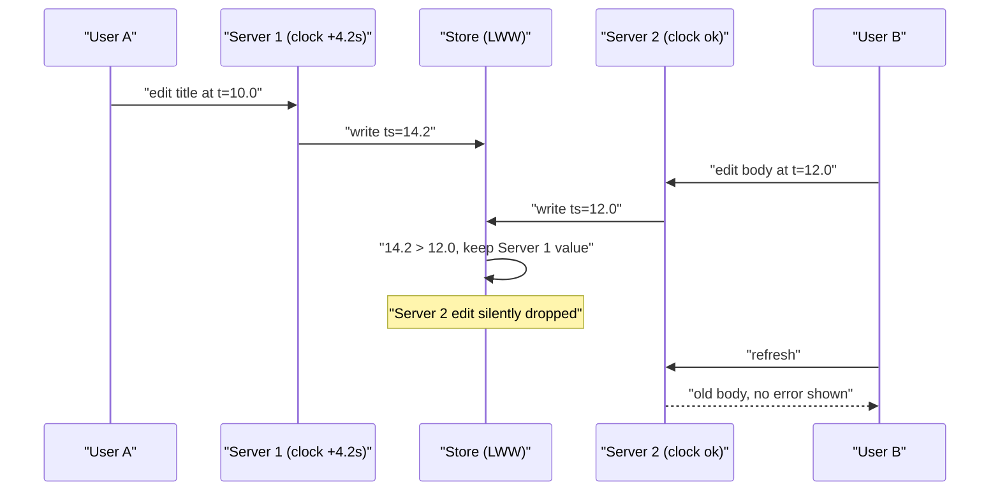
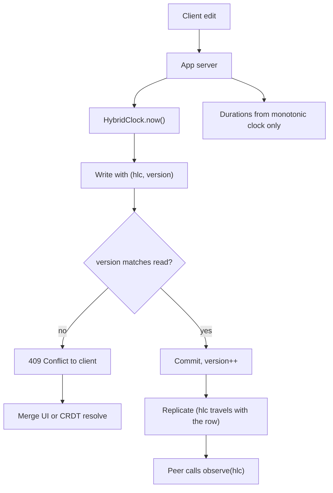

> **Scenario** - A collaborative document editor stores edits with `updated_at = NOW()` from the writing app server and resolves conflicts by last-write-wins. One server's clock is 4.2 seconds ahead after a failed NTP sync. For an hour, every edit from the other three servers is silently discarded as "older".

## Why it matters

- Last-write-wins with wall clocks means the node with the fastest clock wins every conflict. Data loss is silent: no error, no log line, no metric.
- NTP does not guarantee monotonicity. A `step` correction moves `CLOCK_REALTIME` backwards, so `end - start` can be negative and a timeout computed from wall time can be effectively infinite.
- Leap seconds and VM live migration both produce discontinuities. AWS and GCP smear leap seconds over hours; a bare-metal host with stock `ntpd` may step a full second.
- Ordering bugs from clocks are the hardest class to reproduce because they depend on which host handled which request, and skew is usually gone by the time you investigate.

## Symptoms

| Signal | What you observe |
|---|---|
| Edits disappearing | User saves, sees the change, refreshes, and gets the old value back |
| `node_timex_offset_seconds` | Non-zero on a subset of hosts, often one bad host out of 40 |
| Negative durations | Latency histograms with entries below zero, or `duration_ms = -3800` in logs |
| Timestamp inversion | Child rows with `created_at` earlier than their parent's `created_at` |
| Cache TTL anomalies | Entries expiring instantly or living far past their TTL |
| JWT failures | `token used before issued` / `nbf` rejections that clear on retry |
| `node_timex_sync_status` | 0 (unsynchronised) on hosts that pass all other health checks |

## How it breaks

There are two independent clocks on every machine and using the wrong one is the whole bug. `CLOCK_REALTIME` (`Date.now()`, `time.time()`, `NOW()`) tracks civil time and is *adjusted* - it can jump forward or backwards. `CLOCK_MONOTONIC` (`performance.now()`, `time.monotonic()`, `clock_gettime`) only moves forward but has no meaning across machines.

The failure follows from a simple fact: you cannot compare `CLOCK_REALTIME` values from two machines and get a happens-before relationship. Even with good NTP, offset is typically ±1-10ms in a datacenter and ±100ms across the internet. With a broken sync it can be seconds. Two writes 50ms apart in real time can carry timestamps in the wrong order, and last-write-wins will discard the newer one forever.



## Root causes

1. Conflict resolution keyed on `CLOCK_REALTIME` timestamps generated on different hosts.
2. Timeouts, rate-limit windows, and lease expiry computed from wall-clock deltas instead of a monotonic source.
3. NTP configured with a single upstream and no `step` alerting, so one bad host goes unnoticed for hours.
4. Different time sources across the fleet: some hosts on a local `ntpd`, some on `chrony` against the cloud provider's clock, some on `pool.ntp.org` across the public internet.
5. Application-generated timestamps mixed with database-generated ones in the same column.
6. No causal metadata (version vector, logical clock) recorded alongside the write, so recovery has nothing to reconstruct order from.

## How to solve it

### 1. Never resolve conflicts with wall clocks - use a logical clock

A hybrid logical clock (HLC) keeps a physical component for human readability and a logical counter that guarantees monotonicity and causality even when the wall clock is wrong.

```ts
type Hlc = { physicalMs: number; counter: number; nodeId: string }

const compare = (a: Hlc, b: Hlc) =>
  a.physicalMs - b.physicalMs || a.counter - b.counter || a.nodeId.localeCompare(b.nodeId)

export class HybridClock {
  private last: Hlc

  constructor(private nodeId: string) {
    this.last = { physicalMs: Date.now(), counter: 0, nodeId }
  }

  /** Called when generating a local event. */
  now(): Hlc {
    const wall = Date.now()
    this.last =
      wall > this.last.physicalMs
        ? { physicalMs: wall, counter: 0, nodeId: this.nodeId }
        : { ...this.last, counter: this.last.counter + 1 }
    return this.last
  }

  /** Called on every inbound message carrying a remote timestamp. */
  observe(remote: Hlc): Hlc {
    const wall = Date.now()
    const maxPhysical = Math.max(wall, this.last.physicalMs, remote.physicalMs)
    const counter =
      maxPhysical === this.last.physicalMs && maxPhysical === remote.physicalMs
        ? Math.max(this.last.counter, remote.counter) + 1
        : maxPhysical === this.last.physicalMs
          ? this.last.counter + 1
          : maxPhysical === remote.physicalMs
            ? remote.counter + 1
            : 0
    this.last = { physicalMs: maxPhysical, counter, nodeId: this.nodeId }
    return this.last
  }
}

export const isNewer = (candidate: Hlc, current: Hlc) => compare(candidate, current) > 0
```

Because `observe` advances the local clock past anything it has seen, causality survives a skewed host: a reply can never appear to precede the message that caused it.

### 2. Use the monotonic clock for every duration

```python
import time

# Wrong: NTP step during the request makes elapsed negative or huge.
start = time.time()
do_work()
elapsed = time.time() - start

# Right: CLOCK_MONOTONIC never steps.
start = time.monotonic()
do_work()
elapsed = time.monotonic() - start

# For deadlines that cross a process boundary, send a duration, not an absolute time.
deadline_budget_ms = 800  # the callee starts its own monotonic timer
```

### 3. Generate ordering timestamps in one place

If you must use physical time for ordering, take it from a single authority - the database - so all comparisons share one clock.

```sql
-- Server clocks never touch the ordering column.
ALTER TABLE documents
  ALTER COLUMN updated_at SET DEFAULT clock_timestamp(),
  ADD COLUMN version bigint NOT NULL DEFAULT 0;

-- Optimistic concurrency: reject stale writes instead of silently losing them.
UPDATE documents
   SET body = $1, version = version + 1, updated_at = clock_timestamp()
 WHERE id = $2 AND version = $3
RETURNING version;
-- Zero rows returned means the caller's read was stale: surface a conflict to the user.
```

Returning a conflict is strictly better than last-write-wins: the user can be shown a merge instead of losing work.

### 4. Fix and monitor the time infrastructure

```conf
# /etc/chrony/chrony.conf - cloud instances should use the hypervisor clock source.
server 169.254.169.123 prefer iburst minpoll 4 maxpoll 4   # AWS Time Sync Service
pool time.cloudflare.com iburst maxsources 4               # independent backup
makestep 1.0 3        # allow big steps only during the first 3 updates after boot
maxslewrate 100       # afterwards slew, never step, to keep monotonic-ish behaviour
rtcsync
logdir /var/log/chrony
log measurements statistics tracking
```

```promql
# Alert on any host drifting more than 50ms, and on loss of sync.
max by (instance) (abs(node_timex_offset_seconds)) > 0.05
min by (instance) (node_timex_sync_status) == 0
```

Skew alerting is cheap and catches the single bad host before it eats an hour of user edits.

### 5. Record causality alongside the data

Store the HLC (or a version vector) in the row. When a conflict is detected later, you can reconstruct order and replay, instead of guessing from wall clocks after the fact.

## Target design



## Tradeoffs

| Option | Pros | Cons | Choose when |
|---|---|---|---|
| Wall-clock LWW | Trivial, no extra state | Silent data loss proportional to skew | Truly disposable data (metrics, view counts) |
| Hybrid logical clock | Causal ordering, human-readable, 12-16 bytes | Every write path must carry and merge it | Multi-writer replication, offline sync |
| Version vector | Detects true concurrency, not just order | Grows with the number of writers | Small, bounded writer set |
| Single-authority timestamps | One clock, simple comparisons | Serialises through one node; no offline writes | Single-region primary database |
| Tightly synced clocks (Spanner/TrueTime) | Externally consistent ordering | Needs GPS/atomic hardware or a managed service | You are buying it, not building it |
| CRDTs | Merges without conflicts | Larger payloads, weaker invariants | Text/set/counter collaboration |

## Verification checklist

- [ ] `chronyc tracking` on every host shows offset under 10ms and `Leap status: Normal`.
- [ ] Alerts exist for `abs(node_timex_offset_seconds) > 0.05` and `node_timex_sync_status == 0`.
- [ ] `grep -r 'Date.now()\|time.time()'` finds no hits in timeout, lease, or ordering code paths.
- [ ] Injecting `+5s` skew on one node (`date -s` in a test VM) produces conflict responses, not lost writes.
- [ ] Latency histograms have no negative buckets over the last 30 days.
- [ ] Conflict rate is emitted as a metric, so silent loss becomes a visible number.
- [ ] Every replicated row carries its HLC or version vector, verified by inspecting a real row.

## Anti-patterns

- Adding a "grace period" of a few seconds to timestamp comparisons - this hides small skew and does nothing for large skew.
- Running NTP against a single upstream with no alerting, then trusting the timestamps for correctness.
- Mixing application-generated and database-generated timestamps in the same ordering column.
- Using `Date.now()` deltas to enforce rate limits, then debugging a burst that got through during an NTP step.
- Treating a negative duration in the logs as a bug in the metrics library.
- Assuming a managed cloud clock is exact; it is *good* (sub-millisecond typical), not exact, and one misconfigured host still breaks LWW.

## Related

- [Distributed locks that are actually correct](/systems/distributed-systems/distributed-locks-correctness)
- [Raft in practice: what the paper leaves out](/systems/distributed-systems/consensus-raft-in-practice)
- [Designing UX for eventual consistency](/systems/distributed-systems/eventual-consistency-user-experience)
