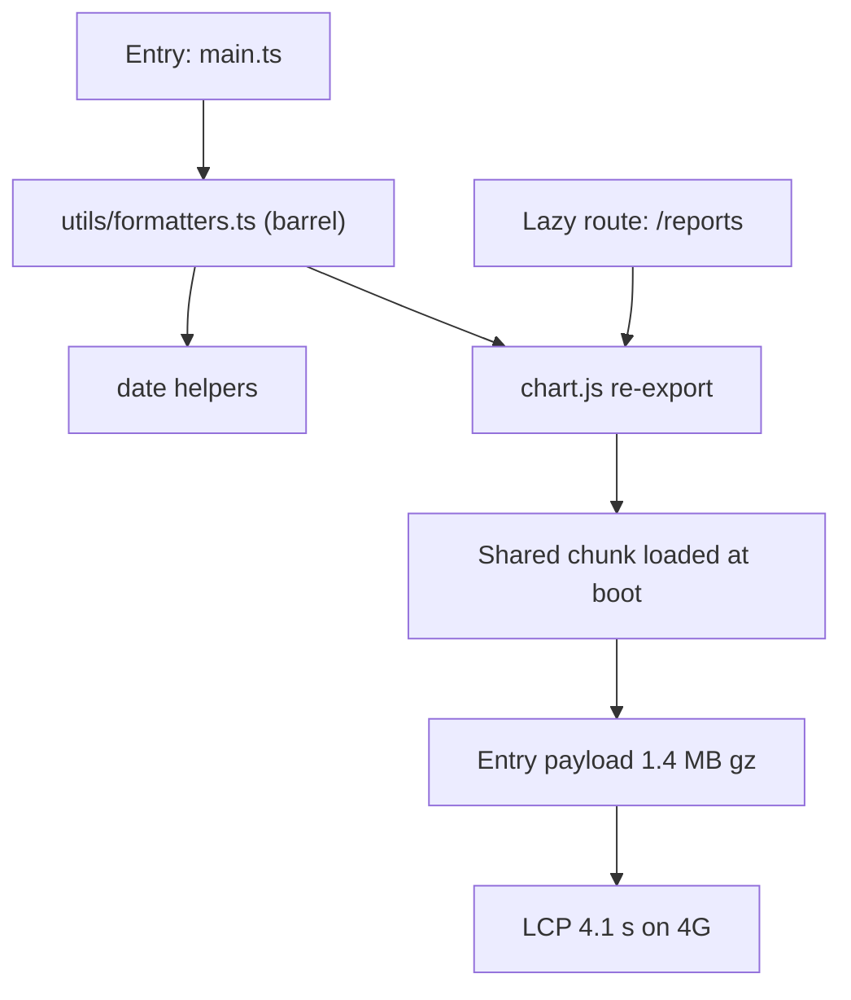
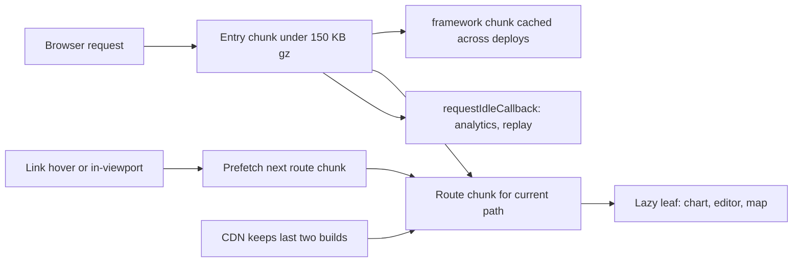

> **Scenario** — Vue router-এর প্রতিটি route `() => import(...)`, তবু initial bundle ১.৪ MB gzipped আর mid-tier Android-এ 4G-তে LCP ৪.১ সেকেন্ড। Report route-এর charting library entry chunk-এ ঢুকে গেছে, কারণ একটা shared `formatters.ts` সেটা re-export করে।

## Why it matters

- Lazy route বিনামূল্যে নয়: entry ও lazy route দুই জায়গা থেকে import হওয়া shared module common chunk-এ উঠে আসে এবং সাথে সাথেই load হয়। Split কেবল কাগজে থাকে।
- Request waterfall byte-এর চেয়েও দামি। Entry chunk, তারপর route chunk, তারপর ভিতরের dynamic component — তিনটা serial round trip মানে mobile-এ প্রায় ৩০০–৬০০ ms খাঁটি latency।
- LCP ২.৫ সেকেন্ডের নিচে ও INP ২০০ ms-এর নিচে — এগুলোই field threshold যা user ও search ranking দেখে। Mid-tier ফোনে ১.৪ MB entry chunk শুধু parse ও compile-এই ৫০০–৯০০ ms খায়।
- Over-splitting উল্টো failure: ৩ KB করে ২০০টা chunk HTTP overhead বাড়ায় আর compression নষ্ট করে।

## Symptoms

| Signal | What you observe |
| --- | --- |
| বড় entry chunk | lazy route থাকা সত্ত্বেও `dist/assets/index-*.js` ৩০০ KB gz-এর বেশি |
| Chunk waterfall | first paint-এর আগে Network panel-এ তিনটা serial JS request |
| Duplicate dependency | চারটা route chunk-এ `date-fns` বা `lodash` |
| ধীর route transition | cold cache-এ nav link ক্লিকের পর ৮০০ ms ফাঁকা |
| CLS spike | lazy component render হলে layout লাফায় |
| Deploy-এর পর chunk 404 | পুরোনো tab-এ "Failed to fetch dynamically imported module" |

## How it breaks

Rollup route graph নয়, module graph বানায়। `src/utils/formatters.ts` যদি `chart.js` re-export করে আর entry শুধু একটা date helper-এর জন্য `formatters` import করে, তাহলে `chart.js` এখন entry থেকে reachable এবং first paint-এ load হওয়া chunk-এ যায়। Barrel file (সবকিছু re-export করা `index.ts`) এটা প্রায় নিশ্চিত করে, কারণ একটা symbol import করলেই পুরো barrel-এর graph টেনে আনে।



## Root causes

1. Barrel file অসম্পর্কিত ভারী module-কে entry graph-এ টানে।
2. শুধু route-level split — editor, chart বা map-এর মতো ভারী leaf component split হয় না।
3. App যত ভাষা সাপোর্ট করে সব locale data ও polyfill eagerly import হয়।
4. `manualChunks` strategy নেই, তাই vendor code হয় এক বিশাল chunk নয়তো ছড়ানো duplicate।
5. Lazy component জায়গা সংরক্ষণ ছাড়াই render হয়, তাই আসার সময় CLS spike।
6. Deploy-এর পর পুরোনো client stale chunk hash ধরে রাখে এবং import fail করে।

## How to solve it

### 1. কিছু বদলানোর আগে আসল খরচ মাপুন

```bash
npx vite build -- --mode production
npx vite-bundle-visualizer   # or rollup-plugin-visualizer
```

Gzipped size দিয়ে sort করে দেখুন entry chunk-এ এমন কী আছে যা কেবল একটা route-এর দরকার।

### 2. Hot path থেকে barrel সরান

Leaf module সরাসরি import করুন:

```ts
// before — pulls the whole barrel graph
import { formatCurrency } from '@/utils'
// after
import { formatCurrency } from '@/utils/currency'
```

Lint rule দিয়ে enforce করুন যাতে barrel ফিরে না আসে।

### 3. শুধু route নয়, ভারী leaf-ও split করুন

```ts
// ReportView.vue
const ChartPanel = defineAsyncComponent({
  loader: () => import('./ChartPanel.vue'),
  delay: 150,
  timeout: 10_000,
  loadingComponent: ChartSkeleton,
})
```

`ChartSkeleton`-কে চূড়ান্ত উচ্চতা সংরক্ষণ করতে হবে (`min-height: 320px`), যাতে CLS ০.১-এর নিচে থাকে।

### 4. Rollup-কে স্পষ্ট chunk plan দিন

```ts
// vite.config.ts
export default defineConfig({
  build: {
    rollupOptions: {
      output: {
        manualChunks(id) {
          if (!id.includes('node_modules')) return
          if (id.includes('vue') || id.includes('pinia')) return 'framework'
          if (id.includes('chart.js') || id.includes('d3')) return 'charts'
          if (id.includes('quasar')) return 'ui'
          return 'vendor'
        },
      },
    },
    chunkSizeWarningLimit: 250,
  },
})
```

Framework code কমই বদলায়, তাই deploy-এর পরেও cached থাকে।

### 5. সব নয়, সম্ভাব্য পরের route prefetch করুন

```ts
// prefetch on hover or when the link enters the viewport
const io = new IntersectionObserver((entries) => {
  for (const e of entries) {
    if (!e.isIntersecting) continue
    const to = (e.target as HTMLAnchorElement).dataset.route
    if (to === '/reports') void import('@/views/ReportView.vue')
    io.unobserve(e.target)
  }
}, { rootMargin: '200px' })
```

Data saver মানুন: `navigator.connection?.saveData` true বা `effectiveType` `2g` হলে prefetch বাদ দিন।

### 6. Deploy-এর পর stale chunk সামলান

```ts
router.onError((err) => {
  if (/Failed to fetch dynamically imported module/.test(err.message)) {
    window.location.reload()
  }
})
```

CDN-এ অন্তত আগের দুই build-এর asset রাখুন যাতে খোলা tab deploy টিকে যায়।

### 7. Non-critical কাজ পিছিয়ে দিন

Analytics, session replay ও chat widget `load`-এর পর `requestIdleCallback`-এ চালান। অন্যথায় দ্রুত page-এও INP ২০০ ms ছাড়ানোর সবচেয়ে সাধারণ কারণ এগুলোই।

## Target design



## Tradeoffs

| Option | Pros | Cons | Choose when |
| --- | --- | --- | --- |
| শুধু route-level split | সহজ, একটাই নিয়ম | ভারী leaf তবু route আটকায় | সমান ওজনের route-এর ছোট app |
| Route + leaf split | সবচেয়ে ছোট critical path | বেশি skeleton ও loading state | chart বা editor-সহ dashboard |
| আগ্রাসী prefetch | তাৎক্ষণিক navigation অনুভূতি | mobile data-তে অপচয় | desktop-নির্ভর internal tool |
| একক vendor chunk | সেরা compression ratio | এক dependency bump-এ cache নষ্ট | কম ঘন deploy |

## Verification checklist

- [ ] `dist` entry chunk ১৫০ KB gzipped-এর নিচে; CI-তে assert করুন।
- [ ] Bundle visualizer-এ entry chunk-এ chart, editor বা map library নেই।
- [ ] First contentful paint-এর আগে Network panel-এ সর্বোচ্চ দুইটা serial JS request।
- [ ] Moto G-শ্রেণির throttle profile ও 4G-তে lab LCP ২.৫ সেকেন্ডের নিচে।
- [ ] Skeleton-এর উপর lazy component বসলে CLS ০.১-এর নিচে।
- [ ] `saveData` চালু থাকলে কোনো prefetch request যায় না।
- [ ] Tab খোলা রেখে deploy করুন; navigate করলে chunk load error আসে না।

## Anti-patterns

- প্রতিটি component `defineAsyncComponent`-এ মুড়ে সেটাকে optimisation বলা।
- `utils`, `components`, `stores`-এর root-এ barrel `index.ts` রাখা।
- প্রতিটি route chunk-এ `<link rel="preload">`, যা LCP image-এর সাথে bandwidth-এর জন্য লড়ে।
- এক tenant-এর বাংলা তারিখের জন্য `date-fns`-এর সব locale import করা।
- Dev server থেকে bundle size বিচার করা, যেখানে কিছুই minify বা tree-shake হয় না।

## Related

- [Frontend performance budgets that hold](/systems/frontend-architecture/frontend-performance-budgets)
- [Choosing a rendering strategy](/systems/frontend-architecture/rendering-strategy-selection)
- [Micro-packaging decoupled frontend modules](/systems/frontend-architecture/micro-packaging-modules)
