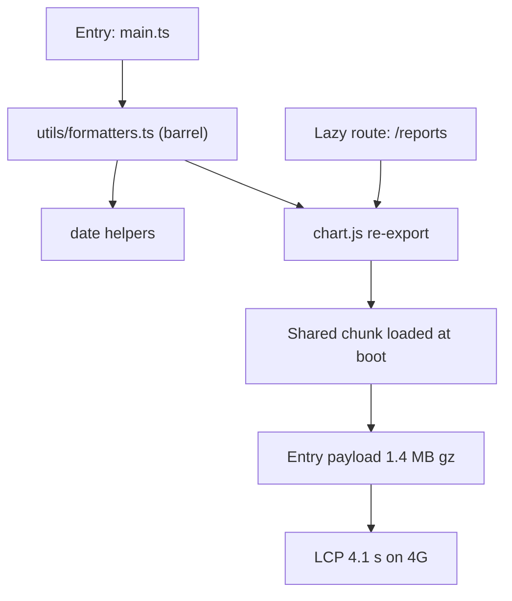
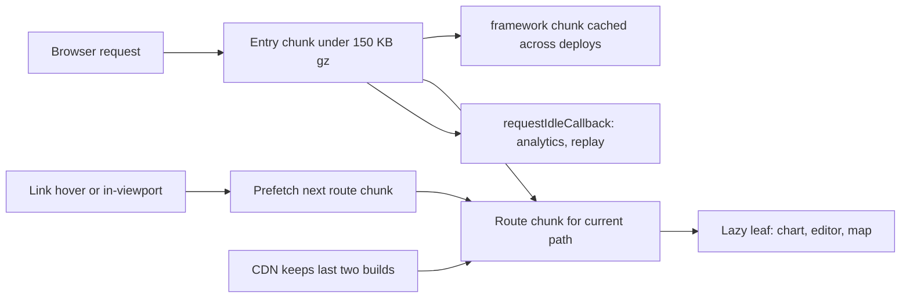

> **Scenario** - Every route in the Vue router is `() => import(...)`, yet the initial bundle is 1.4 MB gzipped and LCP on a mid-tier Android over 4G sits at 4.1 s. The report route's charting library ended up in the entry chunk because a shared `formatters.ts` re-exports it.

## Why it matters

- Lazy routes are not free: a shared module imported by both the entry and a lazy route gets hoisted into a common chunk that loads immediately. The split exists on paper only.
- Request waterfalls cost more than bytes. Entry chunk, then route chunk, then a dynamic component inside it, is three serial round trips - roughly 300–600 ms of pure latency on mobile.
- LCP under 2.5 s and INP under 200 ms are the field thresholds users and search ranking care about. A 1.4 MB entry chunk costs 500–900 ms of parse and compile alone on a mid-tier phone.
- Over-splitting is the opposite failure: 200 chunks of 3 KB each add HTTP overhead and defeat compression.

## Symptoms

| Signal | What you observe |
| --- | --- |
| Large entry chunk | `dist/assets/index-*.js` over 300 KB gzipped despite lazy routes |
| Chunk waterfall | Network panel shows three serial JS requests before first paint |
| Duplicate deps | `date-fns` or `lodash` appears in four route chunks |
| Slow route transition | 800 ms blank gap after clicking a nav link on a cold cache |
| CLS spike | Layout jumps when the lazy component finally renders |
| Chunk 404 after deploy | Users on an old tab get "Failed to fetch dynamically imported module" |

## How it breaks

Rollup builds a module graph, not a route graph. If `src/utils/formatters.ts` re-exports from `chart.js` and the entry imports `formatters` for a date helper, `chart.js` is now reachable from the entry and lands in a chunk that loads on first paint. Barrel files (`index.ts` re-exporting everything) make this near-certain, because importing one symbol pulls the whole barrel's graph.



## Root causes

1. Barrel files pull unrelated heavy modules into the entry graph.
2. Route-level splitting only - no split for heavy leaf components like editors, charts, or maps.
3. Eagerly imported polyfills and locale data for every language the app supports.
4. No `manualChunks` strategy, so vendor code is either one giant chunk or scattered duplicates.
5. Lazy components render without reserved space, so CLS spikes on arrival.
6. Old clients hold stale chunk hashes after a deploy and fail to import.

## How to solve it

### 1. Find the real cost before changing anything

```bash
npx vite build -- --mode production
npx vite-bundle-visualizer   # or rollup-plugin-visualizer
```

Sort by gzipped size and look for anything in the entry chunk that only one route needs.

### 2. Kill barrels on the hot path

Import the leaf module directly:

```ts
// before - pulls the whole barrel graph
import { formatCurrency } from '@/utils'
// after
import { formatCurrency } from '@/utils/currency'
```

Enforce it with a lint rule so the barrel does not creep back.

### 3. Split heavy leaves, not just routes

```ts
// ReportView.vue
const ChartPanel = defineAsyncComponent({
  loader: () => import('./ChartPanel.vue'),
  delay: 150,
  timeout: 10_000,
  loadingComponent: ChartSkeleton,
})
```

`ChartSkeleton` must reserve the final height (`min-height: 320px`) so CLS stays under 0.1.

### 4. Give Rollup an explicit chunk plan

```ts
// vite.config.ts
export default defineConfig({
  build: {
    rollupOptions: {
      output: {
        manualChunks(id) {
          if (!id.includes('node_modules')) return
          if (id.includes('vue') || id.includes('pinia')) return 'framework'
          if (id.includes('chart.js') || id.includes('d3')) return 'charts'
          if (id.includes('quasar')) return 'ui'
          return 'vendor'
        },
      },
    },
    chunkSizeWarningLimit: 250,
  },
})
```

Framework code changes rarely, so it stays cached across deploys.

### 5. Prefetch the next likely route, not everything

```ts
// prefetch on hover or when the link enters the viewport
const io = new IntersectionObserver((entries) => {
  for (const e of entries) {
    if (!e.isIntersecting) continue
    const to = (e.target as HTMLAnchorElement).dataset.route
    if (to === '/reports') void import('@/views/ReportView.vue')
    io.unobserve(e.target)
  }
}, { rootMargin: '200px' })
```

Respect data saver: skip prefetch when `navigator.connection?.saveData` is true or `effectiveType` is `2g`.

### 6. Handle stale chunks after deploy

```ts
router.onError((err) => {
  if (/Failed to fetch dynamically imported module/.test(err.message)) {
    window.location.reload()
  }
})
```

Keep at least two previous builds' assets on the CDN so open tabs survive a deploy.

### 7. Defer non-critical work

Load analytics, session replay, and chat widgets after `load` with `requestIdleCallback`. They are the most common reason INP exceeds 200 ms on otherwise fast pages.

## Target design



## Tradeoffs

| Option | Pros | Cons | Choose when |
| --- | --- | --- | --- |
| Route-level splitting only | Simple, one rule to follow | Heavy leaves still block routes | Small apps with even route weight |
| Route plus leaf splitting | Smallest critical path | More skeletons and loading states | Dashboards with charts or editors |
| Aggressive prefetch | Instant navigation feel | Wasted bytes on mobile data | Desktop-heavy internal tools |
| Single vendor chunk | Best compression ratio | One dependency bump busts the cache | Infrequent deploys |

## Verification checklist

- [ ] `dist` entry chunk is under 150 KB gzipped; assert it in CI.
- [ ] Bundle visualizer shows no chart, editor, or map library in the entry chunk.
- [ ] Network panel shows at most two serial JS requests before first contentful paint.
- [ ] Lab LCP under 2.5 s on a Moto G-class throttle profile with 4G.
- [ ] CLS under 0.1 when a lazy component swaps in over its skeleton.
- [ ] With `saveData` enabled, no prefetch requests are issued.
- [ ] Deploy while a tab is open; navigating does not show a chunk load error.

## Anti-patterns

- Wrapping every component in `defineAsyncComponent` and calling it optimisation.
- Barrel `index.ts` files at the root of `utils`, `components`, and `stores`.
- `<link rel="preload">` on every route chunk, which competes with the LCP image for bandwidth.
- Importing all `date-fns` locales so one tenant can see Bengali dates.
- Judging bundle size from the dev server, where nothing is minified or tree-shaken.

## Related

- [Frontend performance budgets that hold](/systems/frontend-architecture/frontend-performance-budgets)
- [Choosing a rendering strategy](/systems/frontend-architecture/rendering-strategy-selection)
- [Micro-packaging decoupled frontend modules](/systems/frontend-architecture/micro-packaging-modules)
