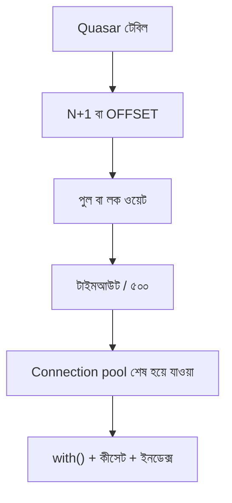

> **পাঠ 16 · শুরুর ধাপ** - database ১২% CPU-তে, অথচ প্রতিটি request connection-এর অপেক্ষায় timeout করছে। pool-এর হিসাব, transaction hold time, queue কোথায় রাখবেন।

## কেন এটা জরুরি

- Eloquent এক লাইন দেখায়, Quasar টেবিল রিলেশন আঁকলেই চল্লিশটা কোয়েরি হয়ে যায়।
- WHERE আর ORDER BY-এর সাথে না মিললে ইনডেক্স সাজসজ্জা। EXPLAIN ANALYZE-ই সাক্ষী।
- সফট ডিলেট থাকলেও লাইভ সারিতে ইউনিক না থাকলে “ডিলিট” ইমেইল আবার ব্যবহার হয়ে সংঘাত করে।
- এই পাঠটা ঠিক **Connection pool শেষ হয়ে যাওয়া** নিয়ে। ট্যাগ: connection-pool, pgbouncer, saturation, timeouts।

## কী দেখে বুঝবেন সমস্যা আছে

| সংকেত | যা দেখা যায় |
| --- | --- |
| N+1 | টুলবার স্পিনার ৪ সেকেন্ড; লগে ১ + n টিকিট কোয়েরি |
| পুল খালি | অন্য পডে ইডল কানেকশন, এই FPM MySQL-এর অপেক্ষায় |
| পেজিনেশন মিথ্যা | OFFSET ২০০০০০ ইউজারের ধৈর্যের চেয়ে লম্বা |
| ভুত ইউনিক | সফট-ডিলিট ইমেইল আবার রেজিস্টারে ইউনিক ইনডেক্সে ৫০০ |

## কীভাবে ভাঙে



ভাঙে প্রযুক্তির নামে নয়, চুক্তির অভাবে। Vue/Quasar স্ক্রিন আর Laravel রাইট যদি উল্টো উত্তর ধরে, প্রোডাকশন সেই রেসটা খুঁজে বের করে। এই টপিকের চুক্তিটা হলো: database ১২% CPU-তে, অথচ প্রতিটি request connection-এর অপেক্ষায় timeout করছে। pool-এর হিসাব, transaction hold time, queue কোথায় রাখবেন।

## মূল কারণ

1. with() বা জয়েন নেই, সিরিয়ালাইজার লুপে লেজি-লোড করে।
2. কানেকশন পুল লোকাল Docker-এর মাপ, প্রোডাকশন ওয়ার্কার × সার্ভিস নয়।
3. হট লিস্টে OFFSET, কীসেট পেজিনেশন নয়।
4. deleted_at IS NULL ধরে ইমেইলের পার্শিয়াল ইউনিক ইনডেক্স নেই।

## কীভাবে সমাধান করবেন

### ১. ইনভেরিয়েন্ট এক বাক্যে লিখুন

database ১২% CPU-তে, অথচ প্রতিটি request connection-এর অপেক্ষায় timeout করছে। pool-এর হিসাব, transaction hold time, queue কোথায় রাখবেন। এই বাক্য পিআর, Pinia অ্যাকশন, আর Laravel ক্লাসে রাখুন।

### ২. কোডে কিনারা আটকে দিন

```ts
// stores/ticket.ts — ask for the page you show, not the world
export async function loadPage(cursor: string | null) {
  const { data } = await api.get('/api/tickets', { params: { cursor, limit: 50 } })
  return data as { items: Ticket[]; next: string | null }
}
```

```php
Ticket::query()
    ->with(['assignee:id,name', 'tags:id,name'])
    ->when($cursor, fn ($q) => $q->where('id', '<', $cursor))
    ->orderByDesc('id')
    ->limit(50)
    ->get();
```

### ৩. যে চার্ট সত্যি দেখবেন, সেটাই রাখুন

রিকোয়েস্টপ্রতি কোয়েরি সংখ্যা, লিস্ট এন্ডপয়েন্টের p99, আর পুল ওয়েট টাইম। **Connection pool শেষ হয়ে যাওয়া**-এর রিগ্রেশন এই চার্টে না ধরা পড়লে পাঠ শেষ হয়নি।

## কাজের উদাহরণ

টিকিট ইনডেক্স Vue `v-for`-এ কমেন্ট লোড করছিল। Laravel লগে ১ + ৫০ কোয়েরি। `with()` আর কীসেট পেজিনেশনে পেজ ৪.২ সেকেন্ড থেকে ৮০ মিলিসেকেন্ডে নামে।

এই টপিকে নিজের শেষ ইনসিডেন্টের লক্ষণ টেবিলে মিলিয়ে নিন, তারপর ডায়াগ্রাম ধরে এগোন যতক্ষণ না উপরের গার্ড আগুন ধরত।

## শিপ করার আগে

- [ ] **Connection pool শেষ হয়ে যাওয়া**-এর ইনভেরিয়েন্ট এক বাক্যে লেখা।
- [ ] খালি, ডুপ্লিকেট, টাইমআউট বা পারমিশন পাথের টেস্ট বা রিহার্সাল আছে।
- [ ] এক ডিপ্লয়ের মধ্যে রিগ্রেশন ধরার লগ বা চার্ট আছে।
- [ ] আত্মীয় পাঠ এখনও মিলছে: n-plus-one-query-elimination, transaction-isolation-anomalies, hot-partition-mitigation।

## যা করবেন না

- অনন্ত রিট্রাই বা এররকে সাকসেস হিসেবে ক্যাশ করা ব্লগ স্নিপেট কপি করবেন না।
- Laravel সারির সত্য Pinia-কে বলে দেবেন না।
- ঘন মনে হলে আগের নম্বরের পাঠ আগে শেষ করুন। পথটা ইচ্ছা করেই শুরু → মাঝারি → উন্নত।
