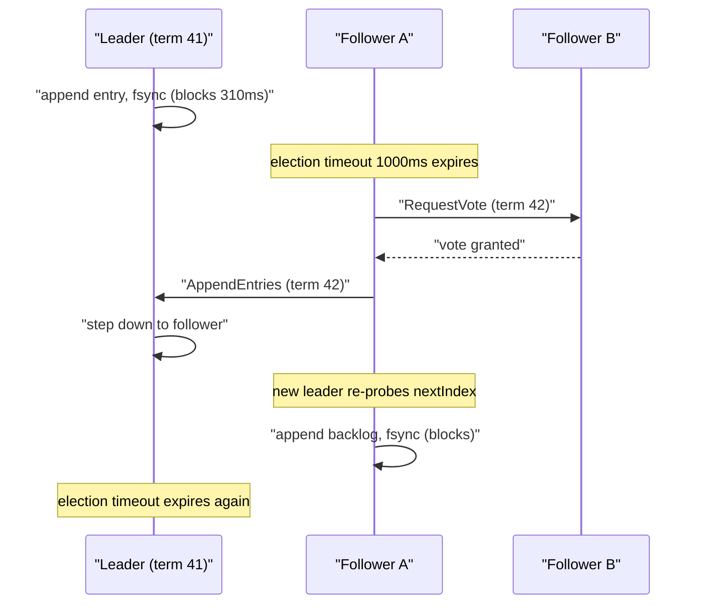
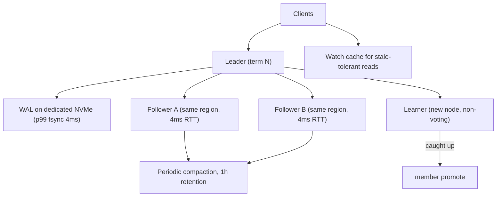

> **Scenario** - Kubernetes-এর পেছনের তিন-node etcd cluster প্রতি ৪০ সেকেন্ডে `leader changed` log করছে। API server write-এ timeout করছে, controller reconcile থামিয়েছে, আর flap-এর মাঝে `etcdctl endpoint health` তিন member-কেই healthy বলছে।

## Why it matters

- etcd, Consul, CockroachDB, TiKV আর বেশিরভাগ Kafka KRaft deployment-এর control plane হলো Raft। এটা degrade করলে উপরের কিছুই এগোতে পারে না - deploy, service discovery, lease সব একসাথে আটকে যায়।
- প্রতিটি write majority node-এর `fsync`-এ সীমাবদ্ধ। যে disk-এর p99 fsync ৮০ms, সেটা প্রতি key-তে সেকেন্ডে প্রায় ১২টি sequential commit-এ cluster আটকে দেয় - যত core যোগ করুন।
- paper-এর safety guarantee ঠিক থাকে; operational failure mode থাকে যেখানে paper ইচ্ছাকৃতভাবে খোলা রেখেছে - snapshot, log compaction, membership change, timeout tuning।
- যে cluster ক্রমাগত নতুন leader নির্বাচন করে, health check-এ তার availability ১০০%, user-এর কাছে ০%।

## Symptoms

| Signal | What you observe |
|---|---|
| `etcd_server_leader_changes_seen_total` | সপ্তাহজুড়ে সমান না থেকে প্রতি ৩০-৬০s-এ বাড়ে |
| `etcd_disk_wal_fsync_duration_seconds` p99 | ৫০ms-এর উপরে; NVMe-তে সুস্থ মান ১০ms-এর নিচে |
| `etcd_network_peer_round_trip_time_seconds` | member-দের মধ্যে p99 ১০০ms-এর উপরে |
| Raft term | ক্রমাগত বাড়ছে; এক মাস চলা cluster-এ term ৪০,০০০+ |
| Client errors | write-এ `etcdserver: request timed out`, `context deadline exceeded`; read ঠিক আছে |
| DB size | `etcd_mvcc_db_total_size_in_bytes` ২GB default quota-র কাছে, compaction চলছে না |
| Follower logs | `lost leader`, `failed to send out heartbeat on time`, `took too long to execute` |

## How it breaks

Election timeout একটি বাজি: সুস্থ leader এর মধ্যেই heartbeat পাঠাতে পারবে। etcd-র default ১০০ms heartbeat interval আর ১,০০০ms election timeout - LAN-এর জন্য মাপা। তিনটি জিনিস এই বাজি ভাঙে।

প্রথমত, **fsync latency leader-এর নিজের append আটকে দেয়।** Raft leader quorum-এ গণনার আগে entry স্থানীয়ভাবে persist করতে বাধ্য। kubelet-এর log-এর সাথে শেয়ার করা EBS gp2 volume-এ p99 fsync ৩০০ms হতে পারে। leader heartbeat মিস করে network খারাপ বলে নয়, syscall-এ আটকে থাকার কারণে।

দ্বিতীয়ত, **snapshot transfer heartbeat path-কে starve করে।** Follower leader-এর compacted log-এর পিছনে পড়ে গেলে leader পুরো snapshot পাঠাতে বাধ্য - busy Kubernetes cluster-এ ৮০০MB object। সেই transfer একই peer connection ব্যবহার করলে আর bandwidth limit না থাকলে *অন্য* follower-এর heartbeat তার পেছনে queue হয়।

তৃতীয়ত, **flapping নিজেকেই জোরদার করে।** প্রতিটি election অন্তত এক election timeout unavailability খরচ করে, তারপর নতুন leader-এর প্রতি follower-এর জন্য cold `nextIndex` থাকে আর log আবার probe করে। write backlog থাকলে নতুন leader সাথে সাথেই পিছিয়ে পড়ে, heartbeat মিস করে, পরের election হারায়।



## Root causes

1. Raft WAL application log, container image বা অন্য database-এর সাথে disk শেয়ার করে, তাই fsync p99 unbounded।
2. member ভিন্ন availability zone বা region-এ থাকলেও election ও heartbeat timeout LAN default-এ রেখে দেওয়া।
3. log compaction ও snapshot tune করা হয়নি, তাই `snapshot-count` বড় আর প্রতিটি snapshot transfer বিশাল।
4. snapshot transfer-এ bandwidth limit নেই, recovery traffic heartbeat-কে চাপা দেয়।
5. "reliability-র জন্য" cluster ৫ বা ৭ member করা, যা quorum size আর per-commit fsync fan-out বাড়ায়।
6. একবারে দুইটি node যোগ করে membership বদলানো, ফলে সাময়িকভাবে অপ্রাপ্য quorum।
7. auto-compaction ছাড়া DB quota শেষ, cluster read-only alarm state-এ।

## How to solve it

### 1. Raft log-কে নিজের দ্রুত disk দিন এবং প্রমাণ করুন

```bash
# Measure the fsync path the way etcd uses it: sequential 2.3KB appends with fdatasync.
fio --name=wal --rw=write --bs=2300 --size=64m --ioengine=sync \
    --fdatasync=1 --directory=/var/lib/etcd --output-format=json \
  | jq '.jobs[0].sync.lat_ns.percentile."99.000000" / 1e6'
# Target: < 10ms. Above 25ms, expect leader flapping under load.

# Also confirm the WAL is not on the same device as anything else.
lsblk -o NAME,MOUNTPOINT,MODEL | grep -E 'etcd|containerd'
```

p99 ২৫ms-এর উপরে হলে কোনো timeout tuning cluster বাঁচাবে না - অন্য কিছু ছোঁয়ার আগে WAL-কে আলাদা NVMe device-এ সরান (`--wal-dir=/mnt/etcd-wal`)।

### 2. Timeout মাপা RTT অনুযায়ী দিন, default অনুযায়ী নয়

Raft paper-এর নিয়ম `broadcastTime << electionTimeout << MTBF`, আর election timeout সাধারণত observed peer RTT-র প্রায় ১০x।

```yaml
# etcd static pod args for members spread across three AZs (measured p99 RTT ~4ms)
- --heartbeat-interval=100     # ms; must exceed p99 RTT
- --election-timeout=1000      # ms; 10x heartbeat, ~250x RTT
# For members across regions with p99 RTT of 60ms, use:
# - --heartbeat-interval=300
# - --election-timeout=3000
```

Election timeout বাড়ানো detection speed-এর বিনিময়ে stability কেনে: ৩,০০০ms timeout মানে সত্যিকারের leader crash-এর পর ৩ সেকেন্ড পর্যন্ত write unavailability। প্রতি ৪০ সেকেন্ডে flap করার তুলনায় এটাই সাধারণত সঠিক বিনিময়।

### 3. Snapshot-এর আকার ও transfer rate বাঁধুন

```yaml
- --snapshot-count=10000              # entries between snapshots (default 100000)
- --max-snapshots=5
- --max-request-bytes=1572864         # 1.5MB; reject giant objects early
- --quota-backend-bytes=8589934592    # 8GB, not the 2GB default
- --auto-compaction-mode=periodic
- --auto-compaction-retention=1h      # keep one hour of revisions
```

```bash
# Verify compaction and defrag actually reclaim space.
etcdctl endpoint status -w table            # note DB SIZE and DB SIZE IN USE
etcdctl compact "$(etcdctl endpoint status -w json | jq -r '.[0].Status.header.revision')"
etcdctl defrag --cluster                    # one member at a time in production
etcdctl alarm list && etcdctl alarm disarm  # clear NOSPACE after defrag
```

### 4. Membership একবারে একটি node বদলান

etcd-তে joint consensus single-member change হিসেবে বাস্তবায়িত। ৩-node cluster-এ এক ধাপে দুই member যোগ করলে quorum ২ থেকে ৩ হয়ে যায়, অথচ নতুন member-দের log খালি।

```bash
# Correct: add, wait for the member to catch up, then add the next.
etcdctl member add node4 --peer-urls=https://10.0.4.11:2380 --learner
# Learner replicates without voting. Promote only when it is caught up.
etcdctl endpoint status -w table   # confirm RAFT INDEX within a few hundred of leader
etcdctl member promote <member-id>
```

Learner mode মূল paper-এ না থাকা সবচেয়ে দরকারি operational feature - "নতুন member quorum নামিয়ে দেয়" failure পুরোপুরি সরিয়ে দেয়।

### 5. যেখানে নিরাপদ, consensus-এর দাম না দিয়ে read করুন

Raft-এ linearizable read-এর জন্য leadership নিশ্চিত করতে `ReadIndex` round trip লাগে। Serializable read সেটা এড়ায়, বিনিময়ে কয়েকশো millisecond stale হতে পারে।

```ts
// Watch-driven cache: pay for consensus once, then serve locally.
const watcher = client.watch().prefix('/services/').create()
watcher.on('put', (kv) => cache.set(kv.key.toString(), kv.value.toString()))

// Reads for service discovery tolerate ~200ms staleness.
export const lookup = (key: string) => cache.get(key)

// Lease renewal and lock acquisition must be linearizable.
export const acquire = (key: string) =>
  client.if(key, 'Create Revision', '==', 0).then(client.put(key).value(id)).commit()
```

## Target design



## Tradeoffs

| Option | Pros | Cons | Choose when |
|---|---|---|---|
| ৩ voting member | quorum ২, সবচেয়ে কম commit fan-out | মাত্র একটি failure সহ্য করে | control plane-এর default |
| ৫ voting member | দুই failure সহ্য, ভালো read spread | প্রতি commit ৩ node-এ fsync; write ধীর | বড় cluster যেখানে member হারানো নিয়মিত |
| ছোট election timeout (১s) | সত্যিকারের crash-এ দ্রুত failover | disk/network jitter-এ flap করে | একই rack, dedicated NVMe |
| বড় election timeout (৩-৫s) | jitter-এ স্থির | আসল crash-এর পর কয়েক সেকেন্ড write outage | AZ বা region জুড়ে member |
| Serializable read | consensus round trip নেই; follower দিয়ে scale | stale data ফেরাতে পারে | service discovery, lag সহনীয় config |
| Linearizable read | সর্বদা current | leader-এ ReadIndex round trip খরচ | lock, lease, uniqueness check |

## Verification checklist

- [ ] WAL directory-তে `fio --fdatasync=1` p99 ১০ms-এর নিচে, আসল production volume-এ মাপা।
- [ ] শেষ ৭ দিনে `etcd_server_leader_changes_seen_total` সমান।
- [ ] `etcd_disk_wal_fsync_duration_seconds` p99 আর `etcd_network_peer_round_trip_time_seconds` p99 দুটোতেই alert আছে।
- [ ] `etcdctl endpoint status`-এ DB size in use, DB size-এর ২০%-এর মধ্যে (compaction ও defrag কাজ করছে)।
- [ ] `kill -9` দিয়ে leader মারলে এক election timeout-এর মধ্যে write ফেরে, game day-তে যাচাই করা।
- [ ] Member যোগ করা হয় `--learner` দিয়ে, আর promotion raft index নৈকট্যে gated।
- [ ] কোনো alarm armed নয়: `etcdctl alarm list` খালি।

## Anti-patterns

- "availability বাড়াতে" ৭ member করা - প্রতিটি write ধীর আর প্রতিটি election কঠিন করে ফেলেছেন।
- fsync p99 ২০০ms থাকা অবস্থায় দ্রুত detection-এর জন্য election timeout কমানো।
- container image বা application log-এর একই disk-এ etcd চালানো।
- flapping-এর সময় member লুপে restart করা; প্রতিটি restart আরেকটি election ও log probe ডাকে।
- `quota-backend-bytes` ২GB default-এ রেখে দেওয়া, তারপর cluster read-only হলে জানা।
- একবারে দুই member যোগ করে ৯০ সেকেন্ড quorum হারানো নিয়ে অবাক হওয়া।

## Related

- [Leader election failure modes](/systems/distributed-systems/leader-election-failure-modes)
- [Tuning quorum reads and writes](/systems/distributed-systems/quorum-read-write-tuning)
- [Split brain detection and recovery](/systems/distributed-systems/split-brain-recovery)
