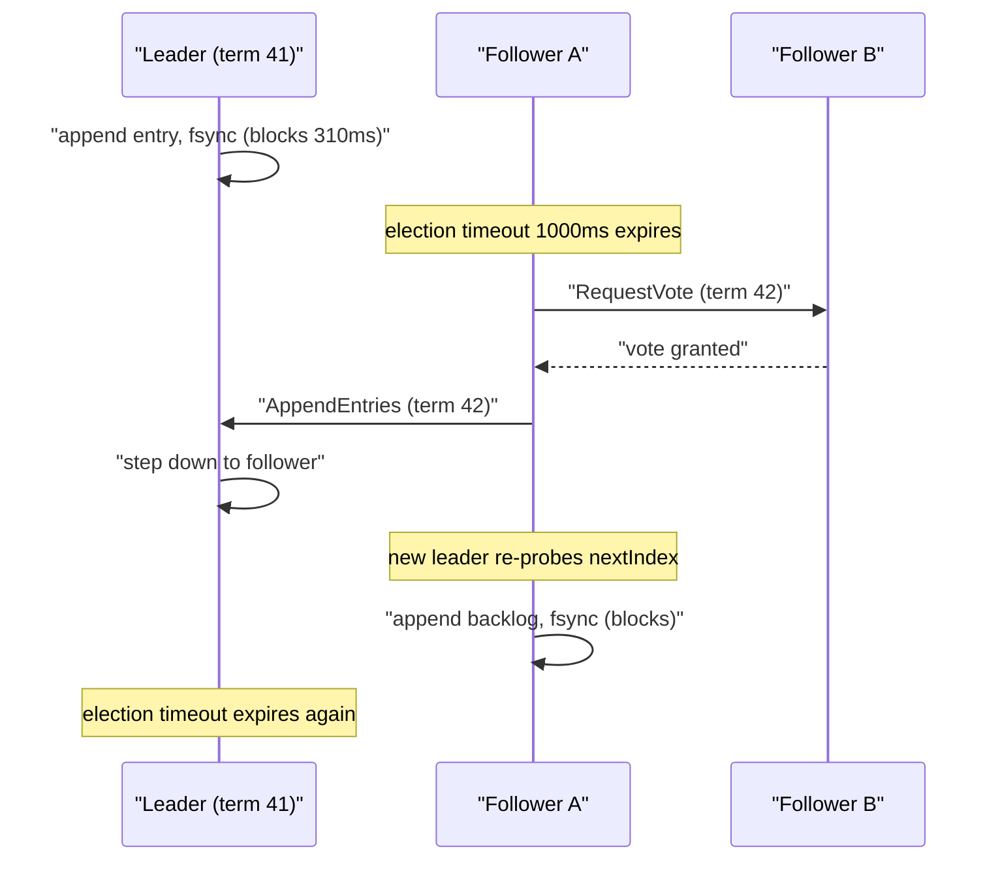
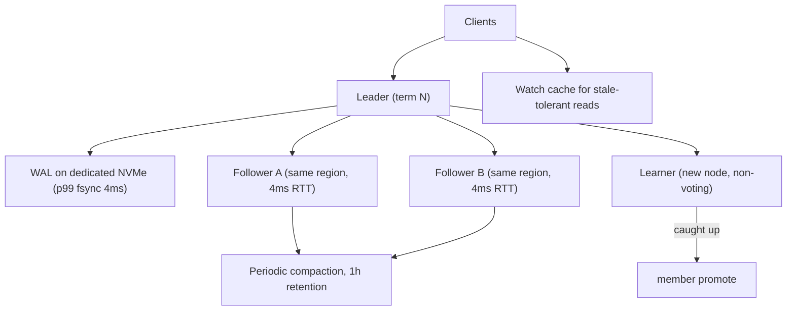

> **Scenario** — A three-node etcd cluster backing Kubernetes starts logging `leader changed` every 40 seconds. The API server times out on writes, controllers stop reconciling, and `etcdctl endpoint health` reports all three members healthy between the flaps.

## Why it matters

- Raft is the control plane for etcd, Consul, CockroachDB, TiKV, and most Kafka KRaft deployments. When it degrades, nothing above it can make progress — deploys, service discovery, and leases all stall at once.
- Every write is bounded by `fsync` on a majority of nodes. A disk whose p99 fsync is 80ms caps the cluster at roughly 12 sequential commits per second per key, no matter how many cores you add.
- The paper's safety guarantees hold; the operational failure modes live in the parts it deliberately leaves open — snapshotting, log compaction, membership change, and timeout tuning.
- A cluster that keeps electing new leaders has 100% availability by the health check and 0% availability to its users.

## Symptoms

| Signal | What you observe |
|---|---|
| `etcd_server_leader_changes_seen_total` | Increments every 30-60s instead of staying flat for weeks |
| `etcd_disk_wal_fsync_duration_seconds` p99 | Above 50ms; healthy is under 10ms on NVMe |
| `etcd_network_peer_round_trip_time_seconds` | p99 above 100ms between members |
| Raft term | Climbing steadily; term 40,000+ on a cluster that has been up a month |
| Client errors | `etcdserver: request timed out`, `context deadline exceeded` on writes, reads still fine |
| DB size | `etcd_mvcc_db_total_size_in_bytes` near the 2GB default quota, no compaction running |
| Follower logs | `lost leader`, `failed to send out heartbeat on time`, `took too long to execute` |

## How it breaks

The election timeout is a bet that a healthy leader can send a heartbeat within it. etcd defaults to a 100ms heartbeat interval and a 1,000ms election timeout — sized for a LAN. Three things break that bet.

First, **fsync latency blocks the leader's own append.** A Raft leader must persist an entry locally before counting it toward the quorum. On an EBS gp2 volume shared with the kubelet's logs, p99 fsync can reach 300ms. The leader misses heartbeats not because the network is bad but because it is stuck in a syscall.

Second, **snapshot transfer starves the heartbeat path.** When a follower falls behind the leader's compacted log, the leader must ship a full snapshot — 800MB of Kubernetes objects on a busy cluster. If that transfer shares the peer connection and there is no bandwidth limit, heartbeats to the *other* follower queue behind it.

Third, **flapping is self-reinforcing.** Each election costs at least one election timeout of unavailability, then the new leader has a cold `nextIndex` for each follower and re-probes the log. Under a write backlog, the new leader immediately falls behind, misses heartbeats, and loses the next election.



## Root causes

1. Raft WAL shares a disk with application logs, container images, or another database, so fsync p99 is unbounded.
2. Election and heartbeat timeouts left at LAN defaults while members sit in different availability zones or regions.
3. Log compaction and snapshotting not tuned, so `snapshot-count` is high and each snapshot transfer is huge.
4. No bandwidth limit on snapshot transfer, letting recovery traffic crowd out heartbeats.
5. Cluster grown to 5 or 7 members "for reliability", which increases quorum size and per-commit fsync fan-out.
6. Membership changed by adding two nodes at once instead of one at a time, briefly creating an unreachable quorum.
7. DB quota reached with no auto-compaction, putting the cluster into the read-only alarm state.

## How to solve it

### 1. Give the Raft log its own fast disk and prove it

```bash
# Measure the fsync path the way etcd uses it: sequential 2.3KB appends with fdatasync.
fio --name=wal --rw=write --bs=2300 --size=64m --ioengine=sync \
    --fdatasync=1 --directory=/var/lib/etcd --output-format=json \
  | jq '.jobs[0].sync.lat_ns.percentile."99.000000" / 1e6'
# Target: < 10ms. Above 25ms, expect leader flapping under load.

# Also confirm the WAL is not on the same device as anything else.
lsblk -o NAME,MOUNTPOINT,MODEL | grep -E 'etcd|containerd'
```

If p99 is above 25ms, no timeout tuning will save the cluster — move the WAL to a dedicated NVMe device (`--wal-dir=/mnt/etcd-wal`) before touching anything else.

### 2. Size the timeouts to measured RTT, not to defaults

The rule from the Raft paper is `broadcastTime << electionTimeout << MTBF`, with the election timeout at roughly 10x the observed peer RTT.

```yaml
# etcd static pod args for members spread across three AZs (measured p99 RTT ~4ms)
- --heartbeat-interval=100     # ms; must exceed p99 RTT
- --election-timeout=1000      # ms; 10x heartbeat, ~250x RTT
# For members across regions with p99 RTT of 60ms, use:
# - --heartbeat-interval=300
# - --election-timeout=3000
```

Raising the election timeout trades detection speed for stability: a 3,000ms timeout means up to 3 seconds of write unavailability after a real leader crash. That is usually the right trade against flapping every 40 seconds.

### 3. Bound snapshot size and transfer rate

```yaml
- --snapshot-count=10000              # entries between snapshots (default 100000)
- --max-snapshots=5
- --max-request-bytes=1572864         # 1.5MB; reject giant objects early
- --quota-backend-bytes=8589934592    # 8GB, not the 2GB default
- --auto-compaction-mode=periodic
- --auto-compaction-retention=1h      # keep one hour of revisions
```

```bash
# Verify compaction and defrag actually reclaim space.
etcdctl endpoint status -w table            # note DB SIZE and DB SIZE IN USE
etcdctl compact "$(etcdctl endpoint status -w json | jq -r '.[0].Status.header.revision')"
etcdctl defrag --cluster                    # one member at a time in production
etcdctl alarm list && etcdctl alarm disarm  # clear NOSPACE after defrag
```

### 4. Change membership one node at a time

Joint consensus in etcd is implemented as single-member changes. Adding two members to a 3-node cluster in one step moves quorum from 2 to 3 while the new members have empty logs.

```bash
# Correct: add, wait for the member to catch up, then add the next.
etcdctl member add node4 --peer-urls=https://10.0.4.11:2380 --learner
# Learner replicates without voting. Promote only when it is caught up.
etcdctl endpoint status -w table   # confirm RAFT INDEX within a few hundred of leader
etcdctl member promote <member-id>
```

Learner mode is the single most useful operational feature not in the original paper — it removes the "new member drags the quorum down" failure entirely.

### 5. Read without paying for consensus where it is safe

Linearizable reads in Raft require a `ReadIndex` round trip to confirm leadership. Serializable reads skip it and may be stale by a few hundred milliseconds.

```ts
// Watch-driven cache: pay for consensus once, then serve locally.
const watcher = client.watch().prefix('/services/').create()
watcher.on('put', (kv) => cache.set(kv.key.toString(), kv.value.toString()))

// Reads for service discovery tolerate ~200ms staleness.
export const lookup = (key: string) => cache.get(key)

// Lease renewal and lock acquisition must be linearizable.
export const acquire = (key: string) =>
  client.if(key, 'Create Revision', '==', 0).then(client.put(key).value(id)).commit()
```

## Target design



## Tradeoffs

| Option | Pros | Cons | Choose when |
|---|---|---|---|
| 3 voting members | Quorum of 2, lowest commit fan-out | Tolerates only one failure | Default for control planes |
| 5 voting members | Tolerates two failures, better read spread | Every commit fsyncs on 3 nodes; slower writes | Large clusters where member loss is routine |
| Short election timeout (1s) | Fast failover after a real crash | Flaps under disk or network jitter | Same-rack members with dedicated NVMe |
| Long election timeout (3-5s) | Stable under jitter | Seconds of write outage after a genuine crash | Members across AZs or regions |
| Serializable reads | No consensus round trip; scales with followers | May return stale data | Service discovery, config that tolerates lag |
| Linearizable reads | Always current | Costs a ReadIndex round trip to the leader | Locks, leases, uniqueness checks |

## Verification checklist

- [ ] `fio --fdatasync=1` p99 on the WAL directory is under 10ms, measured on the actual production volume.
- [ ] `etcd_server_leader_changes_seen_total` is flat over the last 7 days.
- [ ] `etcd_disk_wal_fsync_duration_seconds` p99 and `etcd_network_peer_round_trip_time_seconds` p99 are both alerted on.
- [ ] `etcdctl endpoint status` shows DB size in use within 20% of DB size (compaction and defrag are working).
- [ ] Killing the leader with `kill -9` restores writes within one election timeout, verified in a game day.
- [ ] Adding a member uses `--learner` and promotion is gated on raft index proximity.
- [ ] No alarm is armed: `etcdctl alarm list` is empty.

## Anti-patterns

- Growing to 7 members to "improve availability" — you have made every write slower and every election harder.
- Lowering the election timeout to detect failures faster while fsync p99 is 200ms.
- Running etcd on the same disk as container images or application logs.
- Restarting members in a loop during flapping; each restart forces another election and another log probe.
- Leaving `quota-backend-bytes` at the 2GB default and discovering it when the cluster goes read-only.
- Adding two members at once and wondering why the cluster lost quorum for 90 seconds.

## Related

- [Leader election failure modes](/systems/distributed-systems/leader-election-failure-modes)
- [Tuning quorum reads and writes](/systems/distributed-systems/quorum-read-write-tuning)
- [Split brain detection and recovery](/systems/distributed-systems/split-brain-recovery)
