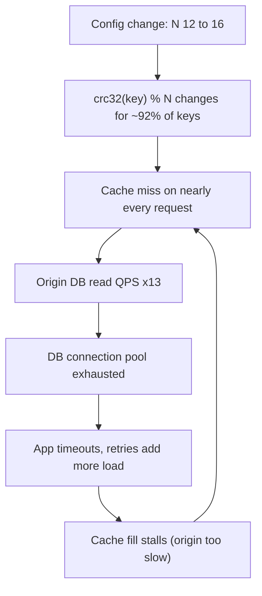
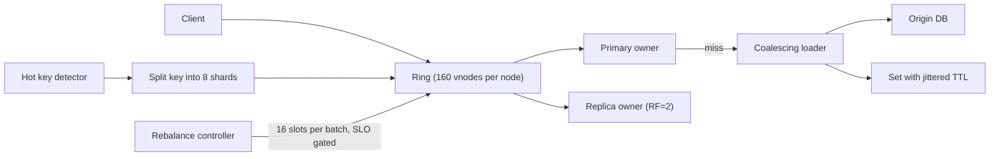

> **Scenario** - ১২-node Redis cache routing-এ `crc32(key) % 12` ব্যবহার করে। Traffic বাড়ায় একজন engineer চারটি node যোগ করেন, আর এক deploy-এ hit rate ৯৪% থেকে ৭%-এ নামে। পেছনের database স্বাভাবিকের ১৩x read load নেয় আর সাইট ৪০ মিনিট down থাকে।

## Why it matters

- Modulo hashing-এ `N`-node ring-এ একটি node যোগ করলে প্রায় `(N-1)/N` key remap হয় - N=12-এ ৯২%। প্রতিটি remap করা key একটি cache miss, আর প্রতিটি miss একটি অপরিকল্পিত database query।
- Consistent hashing সেটা প্রায় `1/N`-এ বাঁধে, তবে শুধু virtual node কনফিগার করা থাকলে; প্রতি node-এ একটি token হলে steady state-এও ৪০%+ load imbalance স্বাভাবিক।
- Rebalance বিনামূল্যে নয়। ২০০MB/s-এ ৪০০GB shard নতুন node-এ stream করতে ~৩৩ মিনিট বাড়তি disk ও network load লাগে - সেই cluster-এই, যেটা ইতিমধ্যে capacity সীমায় বলে scale করছেন।
- Hot key ring-কে পুরো উপেক্ষা করে: ring যত ভালোই balanced হোক, একটি celebrity key একটি node-এ hash হয়।

## Symptoms

| Signal | What you observe |
|---|---|
| Cache hit rate | topology change-এর সাথে সাথেই >৯০% থেকে এক অঙ্কে পতন |
| Origin load | database QPS `1/hit_rate` গুণ বাড়ে - ৯৪% hit rate পূর্ণ miss-এ ১৬x load |
| Per-node keyspace | `redis-cli --cluster info`-এ কিছু node-এ mean-এর ৩-৫x key |
| Per-node CPU | এক node ৯৫%-এ আটকে, বাকিরা ২০%-এ - hot key বা খারাপ token distribution |
| Rebalance duration | ঘণ্টার হিসাব; `MIGRATING`/`IMPORTING` slot আটকে, `CLUSTER COUNTKEYSINSLOT` নড়ে না |
| Client errors | `MOVED`/`ASK` redirect storm, বা migration window-এ timeout |
| Tail latency | rebalance-এ p99 দ্বিগুণ, কারণ migration foreground traffic-এর সাথে প্রতিযোগিতা করে |

## How it breaks

দুইটি failure, আর দল সাধারণত একই incident-এ দুটোরই মুখোমুখি হয়।

**Modulo cliff.** `hash(key) % N` প্রতিটি key-র জায়গা `N`-এর সাথে বেঁধে দেয়। `N` বদলান, প্রায় সব key সরে যায়। ক্রমশ অবনতি নেই: config নামার মুহূর্তেই পুরো cache যুক্তিগতভাবে ঠান্ডা। Database কোনো warm-up ছাড়াই পূর্ণ working-set read rate দেখে, যা সাধারণত provisioned মানের ১০-২০x।

**Ring imbalance ও hot key.** Consistent hashing node-গুলোকে ৩২-বিট বা ৬৪-বিট ring-এ বিন্দুতে বসায় আর প্রতিটি key ঘড়ির কাঁটার দিকে পরের node-কে দেয়। প্রতি node-এ একটি বিন্দু হলে বিন্দুর ফাঁকগুলো exponentially distributed - সবচেয়ে বড় ফাঁক সাধারণত mean-এর ৩-৪x, তাই এক node ৩-৪x key ধরে। Virtual node (প্রতি physical node-এ ১০০-২৫৬ token) standard deviation কয়েক শতাংশে নামায়। কিন্তু নিখুঁত ring-ও ৪০% traffic পাওয়া একটি key-কে সাহায্য করতে পারে না; ring *key* বিতরণ করে, *request* নয়।



লুপটা লক্ষ্য করুন: cache গরম হতে পারে না, কারণ যে origin-এর উপর সে নির্ভর করে সেটাই miss-এ saturated।

## Root causes

1. placement-এ modulo hashing, তাই `N` প্রতিটি key-র অবস্থানে গেঁথে আছে।
2. virtual node ছাড়া consistent hashing, ফলে ব্যস্ততম ও শান্ততম node-এর মধ্যে ৩-৪x imbalance।
3. topology এক ধাপে বদলানো, তাই সব movement একসাথে ঘটে।
4. migration-এ rate limit নেই, rebalance traffic foreground request-এর একই disk ও NIC খায়।
5. miss-এ request coalescing নেই, তাই একই cold key-র ৫,০০০ concurrent request ৫,০০০ origin query বানায়।
6. hot key শনাক্ত বা split করা হয়নি, তাই শীর্ষ ০.০১% traffic-এর জন্য ring balance অপ্রাসঙ্গিক।
7. cache tier-এ replication factor ১, তাই node হারানো মানে data হারানো আর তার অংশের পূর্ণ miss।

## How to solve it

### 1. Modulo-র বদলে ring + virtual node

```ts
import { createHash } from 'node:crypto'

const hash64 = (s: string): bigint =>
  BigInt('0x' + createHash('sha1').update(s).digest('hex').slice(0, 16))

export class HashRing {
  /** Sorted token -> physical node. 160 vnodes keeps imbalance under ~5%. */
  private tokens: { token: bigint; node: string }[] = []

  constructor(nodes: string[], private vnodes = 160) {
    for (const node of nodes) this.addTokens(node)
    this.sort()
  }

  private addTokens(node: string) {
    for (let i = 0; i < this.vnodes; i++) {
      this.tokens.push({ token: hash64(`${node}#${i}`), node })
    }
  }

  private sort() {
    this.tokens.sort((a, b) => (a.token < b.token ? -1 : a.token > b.token ? 1 : 0))
  }

  /** Binary search for the first token >= hash(key), wrapping around. */
  get(key: string, replicas = 1): string[] {
    const h = hash64(key)
    let lo = 0
    let hi = this.tokens.length
    while (lo < hi) {
      const mid = (lo + hi) >> 1
      if (this.tokens[mid]!.token < h) lo = mid + 1
      else hi = mid
    }
    const out: string[] = []
    for (let i = 0; out.length < replicas && i < this.tokens.length; i++) {
      const node = this.tokens[(lo + i) % this.tokens.length]!.node
      if (!out.includes(node)) out.push(node)
    }
    return out
  }

  addNode(node: string) {
    this.addTokens(node)
    this.sort()
  }
}
```

১২-node ring-এ একটি node যোগ করলে এখন ৯২%-এর বদলে ~৭.৭% key সরে।

### 2. Slot ধীরে ধীরে সরান, rate limit দিয়ে

```bash
# Redis Cluster: move 16384 slots in small batches, not all at once.
TARGET=$(redis-cli -h new-node cluster myid)
for BATCH in $(seq 1 64); do
  redis-cli --cluster reshard 10.0.1.10:6379 \
    --cluster-from all --cluster-to "$TARGET" \
    --cluster-slots 16 --cluster-yes --cluster-pipeline 10
  # Watch the foreground SLO between batches; abort if p99 regresses.
  P99=$(redis-cli --latency-history -i 5 | tail -1 | awk '{print $4}')
  echo "batch $BATCH done, latency sample ${P99}ms"
  sleep 20
done
```

Cassandra/ScyllaDB-তে সমতুল্য knob হলো `nodetool setstreamthroughput 200` (MB/s) - NIC ক্ষমতার ৩০-৪০%-এ বাঁধুন যাতে foreground read তার latency budget রাখতে পারে।

### 3. Miss coalesce করুন, যাতে cold shard origin-এ stampede করতে না পারে

```ts
const inflight = new Map<string, Promise<string>>()

export async function getOrLoad(key: string, load: () => Promise<string>) {
  const cached = await redis.get(key)
  if (cached !== null) return cached

  // One origin query per key, regardless of concurrent callers.
  let pending = inflight.get(key)
  if (!pending) {
    pending = load()
      .then(async (value) => {
        // Jitter the TTL so this cohort does not expire together later.
        const ttl = 600 + Math.floor(Math.random() * 120)
        await redis.set(key, value, 'EX', ttl)
        return value
      })
      .finally(() => inflight.delete(key))
    inflight.set(key, pending)
  }
  return pending
}
```

Per-process coalescing আর সত্যিকারের দামি key-র জন্য ছোট distributed lock মিলে ১৩x origin spike-কে প্রায় ১.২x-এ নামায়।

### 4. Hot key শনাক্ত ও split করুন

```bash
# Sample the actual request distribution rather than guessing.
redis-cli --hotkeys                       # requires maxmemory-policy with LFU
redis-cli --bigkeys                       # size outliers, often the same keys
redis-cli info commandstats | sort -t= -k2 -rn | head
```

তারপর hot key-কে suffix দিয়ে shard করে যেকোনো একটি পড়ুন:

```ts
// A key taking 40% of traffic becomes 8 keys taking 5% each.
const shardOf = (key: string, fanout = 8) => `${key}:{s${Math.floor(Math.random() * fanout)}}`
// Writes fan out to all 8; reads pick one. Only valid for read-mostly, idempotent values.
```

### 5. Cutover-এর আগে গরম করুন

নতুন node যোগ করুন, throttled rate-এ replicate বা origin থেকে pre-fill করতে দিন, তারপরই traffic সরান। Cold node-এ cutover আর modulo change একই incident, শুধু ছোট আকারে।

## Target design



## Tradeoffs

| Option | Pros | Cons | Choose when |
|---|---|---|---|
| `hash % N` | তুচ্ছ, state নেই | যেকোনো topology change-এ প্রায় সব key remap | কখনো scale না করা fixed cluster |
| Consistent hashing + vnode | শুধু `1/N` key সরে; প্রায় সমান load | token table ও rebalance controller লাগে | যেকোনো বাড়া/node হারানো cluster |
| Rendezvous (HRW) hashing | token table নেই; সর্বনিম্ন disruption | cache না করলে lookup O(N) | ছোট N, config-driven placement |
| Jump consistent hash | ছোট, দ্রুত, memory নেই | যেকোনো node সরানো যায় না | append-only shard growth |
| Explicit slot map (Redis Cluster) | operator control, observable migration | ১৬৩৮৪ slot সামলাতে হয়; বাড়তি tooling | managed cache cluster |
| Hot-key splitting | single-node saturation সরায় | write fan-out; শুধু read-mostly data | একটি key node ক্ষমতার ~১০% ছাড়ায় |

## Verification checklist

- [ ] Offline-এ একটি node যোগ simulate করে দেখুন সরানো key-র অনুপাত `1/N`-এর ২x-এর মধ্যে।
- [ ] Steady state-এ per-node key count ও CPU mean-এর ১৫%-এর মধ্যে।
- [ ] `redis-cli --hotkeys` output review করা; কোনো একক key তার node-এর ops-এর ১০% ছাড়ায় না।
- [ ] Staging-এ rebalance rehearsal-এ foreground p99 ২০%-এর কম বাড়ে।
- [ ] Cache miss path coalesced - এক cold key-তে ৫,০০০ concurrent request-এর load test-এ একটি origin query হয়।
- [ ] TTL jittered; expiry histogram-এ গোল সংখ্যার spike নেই।
- [ ] Origin-এ steady-state নয়, সবচেয়ে খারাপ বাস্তবসম্মত miss rate-এর জন্য documented headroom আছে।

## Anti-patterns

- Peak traffic-এর সময় cache tier scale করা, কারণ তখনই সেটা ছোট মনে হয়।
- "library-র default তাই" বলে প্রতি node-এ একটি token রেখে imbalance-এর দোষ hash function-কে দেওয়া।
- Throttle ছাড়া `reshard` চালিয়ে পরে বোঝা migration IO আর read একই disk queue ভাগ করে।
- Hot key-কে hashing সমস্যা ভাবা; কোনো ring একক key ভাগ করতে পারে না।
- পুরো key cohort-এ একই TTL দেওয়া, যা পরে নিশ্চিত synchronised expiry storm ডাকে।
- Replication factor ১-এ cache চালিয়ে node হারানোকে "just a cache miss" বলা, যখন সেটা একবারে working set-এর 1/N।

## Related

- [Tuning quorum reads and writes](/systems/distributed-systems/quorum-read-write-tuning)
- [Thundering herd on recovery](/systems/distributed-systems/thundering-herd-on-recovery)
- [Gossip and membership protocols](/systems/distributed-systems/gossip-and-membership-protocols)
