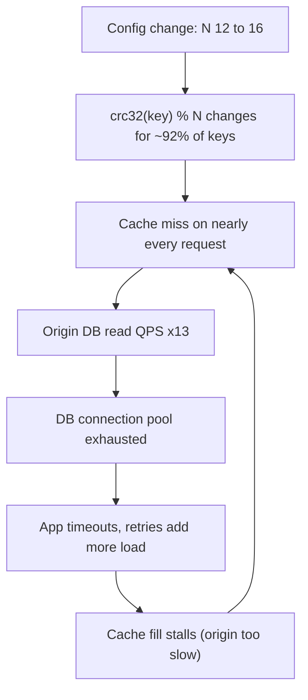
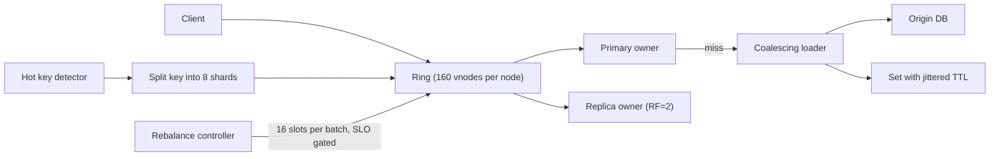

> **Scenario** — A 12-node Redis cache uses `crc32(key) % 12` for routing. Traffic grows, an engineer adds four nodes, and the hit rate drops from 94% to 7% in one deploy. The database behind it takes 13x its normal read load and the site is down for 40 minutes.

## Why it matters

- With modulo hashing, adding one node to an `N`-node ring remaps roughly `(N-1)/N` of all keys — 92% at N=12. Every remapped key is a cache miss, and every miss is a database query you did not plan for.
- Consistent hashing bounds that to about `1/N` of keys, but only if virtual nodes are configured; with one token per node, load imbalance of 40%+ is normal even at steady state.
- Rebalancing is not free. Streaming a 400GB shard to a new node at 200MB/s takes ~33 minutes of extra disk and network load on a cluster that is already at the capacity limit that made you scale.
- Hot keys ignore the ring completely: a single celebrity key hashes to one node regardless of how well the ring is balanced.

## Symptoms

| Signal | What you observe |
|---|---|
| Cache hit rate | Cliff from >90% to single digits immediately after a topology change |
| Origin load | Database QPS jumps by `1/hit_rate` — a 94% hit rate becomes 16x load on a full miss |
| Per-node keyspace | `redis-cli --cluster info` shows nodes with 3-5x the mean key count |
| Per-node CPU | One node pinned at 95% while peers sit at 20% — a hot key or a bad token distribution |
| Rebalance duration | Hours; `MIGRATING`/`IMPORTING` slots stuck, `CLUSTER COUNTKEYSINSLOT` barely moving |
| Client errors | `MOVED`/`ASK` redirect storms, or timeouts during the migration window |
| Tail latency | p99 doubles during rebalance because migration competes with foreground traffic |

## How it breaks

Two failures, and teams usually meet both in the same incident.

**The modulo cliff.** `hash(key) % N` ties every key's placement to `N`. Change `N` and almost every key moves. There is no gradual degradation: the entire cache is logically cold the instant the config lands. The database sees the full working-set read rate with no warm-up, which is typically 10-20x what it is provisioned for.

**Ring imbalance and hot keys.** Consistent hashing places nodes at points on a 32-bit or 64-bit ring and assigns each key to the next node clockwise. With one point per node, the gaps between points are exponentially distributed — the largest gap is commonly 3-4x the mean, so one node owns 3-4x the keys. Virtual nodes (100-256 tokens per physical node) reduce the standard deviation to a few percent. But even a perfect ring cannot help a single key receiving 40% of traffic; the ring distributes *keys*, not *requests*.



Note the loop: the cache cannot warm up because the origin it depends on is saturated by the misses.

## Root causes

1. Modulo hashing used for placement, so `N` is baked into every key's location.
2. Consistent hashing without virtual nodes, giving 3-4x imbalance between the busiest and quietest node.
3. Topology changed in one step instead of incrementally, so all movement happens at once.
4. No rate limit on migration, letting rebalance traffic consume the same disk and NIC as foreground requests.
5. No request coalescing on miss, so 5,000 concurrent requests for the same cold key produce 5,000 origin queries.
6. Hot keys not detected or split, so ring balance is irrelevant for the top 0.01% of traffic.
7. Replication factor of 1 in the cache tier, so a node loss is also a data loss and a full miss for its share.

## How to solve it

### 1. Replace modulo with a ring plus virtual nodes

```ts
import { createHash } from 'node:crypto'

const hash64 = (s: string): bigint =>
  BigInt('0x' + createHash('sha1').update(s).digest('hex').slice(0, 16))

export class HashRing {
  /** Sorted token -> physical node. 160 vnodes keeps imbalance under ~5%. */
  private tokens: { token: bigint; node: string }[] = []

  constructor(nodes: string[], private vnodes = 160) {
    for (const node of nodes) this.addTokens(node)
    this.sort()
  }

  private addTokens(node: string) {
    for (let i = 0; i < this.vnodes; i++) {
      this.tokens.push({ token: hash64(`${node}#${i}`), node })
    }
  }

  private sort() {
    this.tokens.sort((a, b) => (a.token < b.token ? -1 : a.token > b.token ? 1 : 0))
  }

  /** Binary search for the first token >= hash(key), wrapping around. */
  get(key: string, replicas = 1): string[] {
    const h = hash64(key)
    let lo = 0
    let hi = this.tokens.length
    while (lo < hi) {
      const mid = (lo + hi) >> 1
      if (this.tokens[mid]!.token < h) lo = mid + 1
      else hi = mid
    }
    const out: string[] = []
    for (let i = 0; out.length < replicas && i < this.tokens.length; i++) {
      const node = this.tokens[(lo + i) % this.tokens.length]!.node
      if (!out.includes(node)) out.push(node)
    }
    return out
  }

  addNode(node: string) {
    this.addTokens(node)
    this.sort()
  }
}
```

Adding one node to a 12-node ring now moves ~7.7% of keys instead of 92%.

### 2. Move slots incrementally with a rate limit

```bash
# Redis Cluster: move 16384 slots in small batches, not all at once.
TARGET=$(redis-cli -h new-node cluster myid)
for BATCH in $(seq 1 64); do
  redis-cli --cluster reshard 10.0.1.10:6379 \
    --cluster-from all --cluster-to "$TARGET" \
    --cluster-slots 16 --cluster-yes --cluster-pipeline 10
  # Watch the foreground SLO between batches; abort if p99 regresses.
  P99=$(redis-cli --latency-history -i 5 | tail -1 | awk '{print $4}')
  echo "batch $BATCH done, latency sample ${P99}ms"
  sleep 20
done
```

For Cassandra/ScyllaDB the equivalent knob is `nodetool setstreamthroughput 200` (MB/s) — cap it at 30-40% of NIC capacity so foreground reads keep their latency budget.

### 3. Coalesce misses so a cold shard cannot stampede the origin

```ts
const inflight = new Map<string, Promise<string>>()

export async function getOrLoad(key: string, load: () => Promise<string>) {
  const cached = await redis.get(key)
  if (cached !== null) return cached

  // One origin query per key, regardless of concurrent callers.
  let pending = inflight.get(key)
  if (!pending) {
    pending = load()
      .then(async (value) => {
        // Jitter the TTL so this cohort does not expire together later.
        const ttl = 600 + Math.floor(Math.random() * 120)
        await redis.set(key, value, 'EX', ttl)
        return value
      })
      .finally(() => inflight.delete(key))
    inflight.set(key, pending)
  }
  return pending
}
```

Per-process coalescing plus a short distributed lock for the truly expensive keys turns a 13x origin spike into roughly a 1.2x spike.

### 4. Detect and split hot keys

```bash
# Sample the actual request distribution rather than guessing.
redis-cli --hotkeys                       # requires maxmemory-policy with LFU
redis-cli --bigkeys                       # size outliers, often the same keys
redis-cli info commandstats | sort -t= -k2 -rn | head
```

Then shard the hot key by suffix and read a random replica:

```ts
// A key taking 40% of traffic becomes 8 keys taking 5% each.
const shardOf = (key: string, fanout = 8) => `${key}:{s${Math.floor(Math.random() * fanout)}}`
// Writes fan out to all 8; reads pick one. Only valid for read-mostly, idempotent values.
```

### 5. Warm before you cut over

Add the new node, let it replicate or pre-fill from the origin at a throttled rate, and only then move traffic. A cutover to a cold node is the same incident as a modulo change, just smaller.

## Target design



## Tradeoffs

| Option | Pros | Cons | Choose when |
|---|---|---|---|
| `hash % N` | Trivial, no state | Remaps ~all keys on any topology change | Fixed-size cluster that never scales |
| Consistent hashing + vnodes | Moves only `1/N` of keys; near-even load | Needs a token table and a rebalance controller | Any cluster that grows or loses nodes |
| Rendezvous (HRW) hashing | No token table; minimal disruption | O(N) per lookup unless cached | Small N, config-driven placement |
| Jump consistent hash | Tiny, fast, no memory | Cannot remove an arbitrary node | Append-only shard growth |
| Explicit slot map (Redis Cluster) | Operator control, observable migration | 16384 slots to manage; extra tooling | Managed cache clusters |
| Hot-key splitting | Removes single-node saturation | Fan-out writes; only for read-mostly data | A key exceeds ~10% of node capacity |

## Verification checklist

- [ ] Simulate adding one node offline and assert the fraction of moved keys is within 2x of `1/N`.
- [ ] Per-node key count and per-node CPU are within 15% of the mean at steady state.
- [ ] `redis-cli --hotkeys` output reviewed; no single key exceeds 10% of its node's ops.
- [ ] A rebalance rehearsal in staging shows foreground p99 rising by less than 20%.
- [ ] Cache miss path is coalesced — a load test with 5,000 concurrent requests for one cold key produces one origin query.
- [ ] TTLs are jittered; expiry histogram has no spikes at round intervals.
- [ ] Origin has documented headroom for the worst realistic miss rate, not the steady-state one.

## Anti-patterns

- Scaling the cache tier during peak traffic because that is when it looks undersized.
- Using one token per node "because the library defaults to it" and then blaming the hash function for imbalance.
- Running an unthrottled `reshard` and discovering that migration IO owns the same disk queue as reads.
- Treating a hot key as a hashing problem; no ring can split a single key.
- Setting a uniform TTL for a whole cohort of keys, guaranteeing a synchronised expiry storm later.
- Running the cache with replication factor 1 and calling node loss "just a cache miss" when it is 1/N of the working set at once.

## Related

- [Tuning quorum reads and writes](/systems/distributed-systems/quorum-read-write-tuning)
- [Thundering herd on recovery](/systems/distributed-systems/thundering-herd-on-recovery)
- [Gossip and membership protocols](/systems/distributed-systems/gossip-and-membership-protocols)
